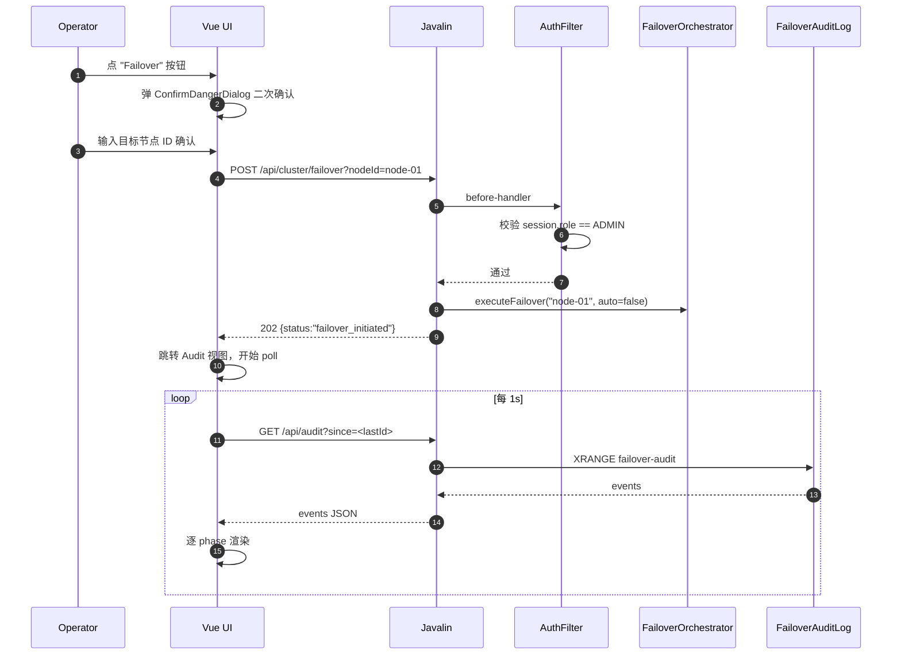

# Neo4j HA Agent — 管理 UI 方案设计

- 日期：2026-05-14
- 作者：fukai（与 nuclear-fusion designing-solution 协作）
- 状态：Approved（等待 building-production-feature 实施）
- 关联模块：`src/ha-agent`

---

## 1. 问题定义

**目标**：把当前仅能通过 `curl localhost:8080/cluster/*` + 看 Prometheus 指标的运维流程，搬到浏览器里，让操作员可视化集群拓扑、健康、同步延迟、审计流，并一键执行 failover / switchover / fullsync / backup 操作。

### 功能范围

**IN**

- 集群拓扑与节点角色 / 健康 / `serviceState` / 同步延迟实时面板
- Failover / Switchover / Fullsync / Backup prepare / Backup complete 操作
- 关键 Prometheus 指标的轻量内嵌图表（同步延迟、CDC poll 速率、failover 计数、stream 长度等）
- Failover 审计流回看
- 配置文件用户名 / 密码登录 + session 鉴权
- 与现有 `X-Admin-Token` Header 鉴权并存（向后兼容 curl 调用）

**OUT**

- 不做集群配置的在线修改（配置文件即权威，避免漂移）
- 不做完整用户管理（仅单 / 少量静态用户）
- 不做 CDC event-level 实时事件流可视化（使用现有 `rel-gap-diag.sh`）
- 不替代 Grafana（指标看板只覆盖 5–8 个 HA 核心指标）

### 非功能目标

| 维度 | 目标 |
|---|---|
| 可用性 | 与 ha-agent 进程同生命周期；C2 风险（Agent 单点）尚未解决 |
| 延迟 | 操作 API P95 < 500ms；面板自动刷新 2s |
| 安全 | UI 默认监听 8080；生产建议反代终止 TLS |
| 体积 | UI bundle ≤ 500KB gzip；ha-agent jar 增量 ≤ 1MB |
| 浏览器 | Chrome / Edge / Firefox 最近两个大版本 |

### 约束

- 不引入第二个进程（v2.0 才合并 failover-manager / client-router 进 ha-agent，不可反向拆）
- 不引入新中间件（不要 Postgres、不要会话存储；Redis 已在）
- 后端必须沿用 Javalin 6（`pom.xml:35` 已声明）
- 选不挑团队的栈（团队主栈 Java，前端经验未知）

### 成功标准

- 一线运维不再需要复制粘贴 curl 命令做 failover / fullsync
- 一次 failover 演练全程在 UI 完成、能从 UI 看到 10 phases 的审计回放
- 登录失败 5 次/分钟自动锁 IP 10 分钟

---

## 2. 参考实现（行业基准）

| # | 参考 | 借鉴点 | 不适用 |
|---|------|--------|--------|
| **R1** | **HAProxy `stats` admin UI**（项目已用，`config/haproxy/haproxy.cfg:62-67` 开 8404） | "单页 + 简洁表格 + 操作按钮 + 自动刷新" 运维 UI 形态；表格内直挂 enable/disable 操作 | 风格过旧；BasicAuth 不支持优雅 logout |
| **R2** | **Patroni REST API + `patronictl`**（Postgres HA 事实标准） | Cluster topology JSON 结构（`{members:[{name, role, state, lag}]}`）；操作端点命名（`/failover` `/switchover` `/reinit`）；审计事件字段约定 | Patroni dashboard 是独立项目；我们不能拆出独立服务 |
| **R3** | **Spring Boot Admin / Netdata** 的"嵌入式管理控制台"形态 | Vue + Element/AntD SPA + 后端静态资源托管的打包形态；用 JWT/Session 替代复杂 auth；指标用轻量库不引 Grafana | Spring Boot Admin 强依赖 Spring 生态；我们是裸 Javalin |

**辅助参考**

- Element Plus 官方 admin template — 验证 Vue 3 + EP 在 200–300KB gzip 范围
- micrometer-prometheus 端点已在（`HaAgent.java:296` 后 `/metrics`）— UI 直接消费

---

## 3. 实现架构

### 风格

**嵌入式 Modular Monolith**：UI 作为 `src/ha-agent` 的子包，前端构建产物以 Maven resource 形式打进同一个 jar。沿用 v2.0 "单进程管理整个集群" 的设计纪律（`docker-compose.yml:137` 注释）。

### 部署拓扑

```
┌──────────────────────────────────────────────────┐
│ ha-agent JVM (single process, 已存在)            │
│                                                   │
│  Javalin :8080                                    │
│   ├─ /              → static (ui/index.html)  ◀── 新增
│   ├─ /assets/*      → static (Vite 产物)      ◀── 新增
│   ├─ /api/login     → AuthController          ◀── 新增
│   ├─ /api/logout    → AuthController          ◀── 新增
│   ├─ /api/me        → AuthController          ◀── 新增
│   ├─ /api/cluster/* → 现有路由 + AuthFilter
│   ├─ /api/audit     → AuditController         ◀── 新增（读 Redis stream）
│   ├─ /api/metrics-summary → MetricsSummaryController ◀── 新增
│   ├─ /metrics       → 现有 Prometheus 端点（无 auth）
│   ├─ /health        → 现有
│   └─ /cluster/*     → 现有路径，保留 backward-compat
└──────────────────────────────────────────────────┘
                      ▲
                      │ HTTPS (生产由反代 / Nginx 终止)
                      │
                  浏览器 SPA
```

### 关键组件

| 组件 | 位置 | 职责 |
|---|---|---|
| `WebUiBundle` | `src/ha-agent/src/main/resources/static/` | Vite 构建产物 |
| `AdminHttpServer` 改造 | `agent/http/AdminHttpServer.java` | 挂 `staticFiles` + 重组 `/api/*` |
| `AuthController` | `agent/http/auth/AuthController.java` | 登录 / 登出 / `/api/me` |
| `SessionManager` | `agent/http/auth/SessionManager.java` | 内存 session 表 + TTL + 上限 |
| `AuthFilter` | `agent/http/auth/AuthFilter.java` | Javalin before-handler；双轨鉴权 |
| `UserStore` | `agent/http/auth/UserStore.java` | 读 yml `admin.ui.users[]`；bcrypt 校验 |
| `RateLimiter` | `agent/http/auth/RateLimiter.java` | IP 维度登录失败计数 + 锁定 |
| `AuditController` | `agent/http/AuditController.java` | XRANGE 读审计流 |
| `MetricsSummaryController` | `agent/http/MetricsSummaryController.java` | 聚合 Micrometer 关键指标成 JSON |
| `BcryptHashCli` | `agent/http/auth/BcryptHashCli.java` | 生成 bcrypt hash 的小工具 |

### 依赖图（无循环）

```
WebUiBundle (前端，独立构建)
        │ HTTP
        ▼
AdminHttpServer
  │
  ├── AuthFilter ──→ SessionManager ──→ UserStore ──→ HaConfig.admin.ui
  │              └─→ RateLimiter
  │
  ├── AuthController ──→ SessionManager + UserStore + RateLimiter + UiAuditLog
  ├── AuditController ──→ JedisPool (现有)
  └── MetricsSummaryController ──→ MetricsRegistry (现有)
```

### 技术选型

| 维度 | 选择 | 1 句理由 |
|---|---|---|
| 前端框架 | **Vue 3（Composition API）** | 对 Java 团队学习曲线友好；中文社区好；与后端栈无强耦合（借鉴 R3） |
| UI 组件库 | **Element Plus** | 表格 / 对话框 / 通知一站式；tree-shake 后 200–300KB |
| 前端构建 | **Vite** | npm run build → dist/ 直接喂 Javalin；冷构建 < 3s |
| 图表 | **ECharts**（按需引 line + gauge） | 5 个指标卡 + 2 张时间序列图够用；避免 Grafana 依赖 |
| HTTP 客户端 | **fetch + 自封 wrapper** | 不引 axios，省 14KB；401 自动跳登录 |
| 后端 HTTP | **复用 Javalin 6** | pom 已在；before-handler 直接挂鉴权 |
| 密码哈希 | **bcrypt**（`at.favre.lib:bcrypt`，单库 ~30KB） | jBCrypt 已停维护；favre 是主流替代 |
| Session 存储 | **JVM 内存 ConcurrentHashMap + TTL** | Agent 单实例；重启重登可接受 |
| 鉴权头兼容 | 保留 **`X-Admin-Token`** | curl / 脚本无需改 |

**为什么不用 Spring Security / Keycloak**：Agent 进程刻意保持轻量；目标用户数 ≤ 5；IdP 是大材小用。

---

## 4. 模块分层

**模型**：在 `ha-agent` 内部沿用 *按职责分目录* 的现有风格（与 `agent/health`、`agent/routing` 同级），不引入 Hexagonal / Clean Architecture。

### 新增目录

```
src/ha-agent/src/main/
├── java/com/neo4j/ha/agent/http/
│   ├── AdminHttpServer.java        (改造)
│   ├── AuthController.java         (新)
│   ├── AuditController.java        (新)
│   ├── MetricsSummaryController.java (新)
│   └── auth/
│       ├── AuthFilter.java         (新)
│       ├── SessionManager.java     (新)
│       ├── UserStore.java          (新)
│       ├── RateLimiter.java        (新)
│       ├── BcryptHashCli.java      (新)
│       └── UiAuditLog.java         (新；写 Redis stream)
└── resources/
    └── static/                     (新；Vite 产物 npm run build 后拷入)

ui/                                  (新；前端源码，独立目录，不混进 src/)
├── package.json
├── vite.config.ts
├── index.html
├── src/
│   ├── main.ts
│   ├── App.vue
│   ├── api/                        (fetch 封装 + 401 重定向)
│   ├── views/
│   │   ├── Login.vue
│   │   ├── Dashboard.vue           (拓扑 + 健康 + lag 卡)
│   │   ├── Operations.vue          (failover/switchover/fullsync/backup)
│   │   └── Audit.vue               (审计流分页)
│   ├── components/
│   │   ├── NodeCard.vue
│   │   ├── MetricSparkline.vue
│   │   └── ConfirmDangerDialog.vue
│   └── stores/
│       └── auth.ts                 (Pinia)
└── README.md
```

### 跨切面

| 关注点 | 实现 |
|---|---|
| 日志 | 前端 `console.error`；后端沿用 SLF4J / Logback JSON |
| 度量 | 新增 `ha_ui_*` Micrometer 指标 |
| 配置 | UserStore 直接读 `HaConfig.admin.ui` |
| Tracing | N/A（系统未启用 OTel） |

---

## 5. 核心流程

### Flow A — 用户登录

```
浏览器 → POST /api/login {username, password}
   ↓
AuthFilter（白名单：/api/login, /health, /metrics, /, /assets/**, /favicon.ico）
   ↓
RateLimiter.check(ip)              // 当前分钟失败 >= 5 → 423 Locked，锁 10 分钟
   ↓
UserStore.verify(user, pwd)        // bcrypt.compare
   ├─ 失败 → RateLimiter.recordFailure(ip) → 401（固定 200ms 延迟，time-equalize）
   └─ 成功 → SessionManager.create(user)
              → 返回 Set-Cookie: ha_session=<32B 随机>; HttpOnly; SameSite=Strict
              → 200 {username, role, expiresAt}
```

- **幂等性**：登录无副作用（除速率统计）；同一用户允许 3 个并发 session
- **失败模式**：UserStore 读不到配置 → 500 + 拒绝（fail closed）
- **延迟预算**：bcrypt cost=10 ≈ 80ms；总 P95 < 200ms

### Flow B — 执行 Failover（最高风险）



- **幂等性**：`FailoverOrchestrator` 已用 `failoverInFlight` AtomicBoolean 防重入（`HaAgent.java:177`），UI 重复点击安全
- **失败模式**：202 后 phase 失败 → UI 通过 audit 流看到 `failed` → 红色 toast
- **延迟预算**：API 立即返回 202；整 failover ~1–3s；audit 呈现 < 2s

### Flow C — 实时拓扑刷新（Dashboard）

```
Dashboard.vue onMounted
   ↓
轮询 GET /api/cluster/status  每 2s（与 ha-agent.yml:111 checkInterval 对齐）
   ↓
渲染：3 个 NodeCard + 4 个 MetricSparkline + 2 个大数字
   ↓
若 401 → router.push('/login')
```

**为什么轮询而非 SSE/WS**：数据节拍 2s；单管理员场景；省反代复杂度。SSE 留 `/api/events` 占位扩展。

### Flow D — 触发 Fullsync

```
选目标 standby → ConfirmDangerDialog（提示"清库重建"）
  ↓
POST /api/cluster/fullsync?nodeId=node-02
  ↓
UI 跳转 Audit，过滤 fullsync 相关
  ↓
进度估算 = (已 import / 总行) — 来自现有 HaMetrics
```

### Flow E — Backup Prepare → Complete

```
点 "Prepare Backup" → POST /api/cluster/backup/prepare?nodeId=node-02
  ↓
UI 显示倒计时（来自 ha-agent.yml backup.maxDuration: 2h）
  ↓
Operator 在目标机执行 neo4j-admin backup（UI 显示命令模板）
  ↓
点 "Complete" → POST /api/cluster/backup/complete
  ↓
若超时未点 Complete → BackupCoordinator 自动 resume（现有 M1 行为）
```

---

## 6. 协议与接口

### 对外协议

**REST + JSON**。新端点统一前缀 `/api/*`，与 backward-compat 路径 `/cluster/*` `/health` `/metrics` 区分。

### 错误信封

```json
{
  "error": "unauthorized",
  "message": "Session expired",
  "requestId": "<uuid>"
}
```

| HTTP | error | 触发 |
|---|---|---|
| 200/202 | — | 成功 |
| 400 | `bad_request` | 缺参 / 非法参数 |
| 401 | `unauthorized` | 无 session/token 或失效 |
| 403 | `forbidden` | 已登录但角色不足 |
| 409 | `conflict` | failover already in flight |
| 423 | `locked` | 登录 IP 暂时锁定 |
| 500 | `internal` | 未捕获异常 |

### 端点表

| Method | Path | 鉴权 | Body / Query | 返回 |
|---|---|---|---|---|
| POST | `/api/login` | 无（白名单） | `{username, password}` | `{username, role, expiresAt}` + Set-Cookie |
| POST | `/api/logout` | session | — | 204 |
| GET | `/api/me` | session | — | `{username, role, expiresAt}` |
| GET | `/api/cluster/status` | session 或 token | — | 现有结构 + `lastFailoverTime` |
| GET | `/api/cluster/nodes/{id}` | 同上 | — | 现有 |
| POST | `/api/cluster/failover` | session(admin) 或 token | `?nodeId=` | `{status, targetNode}` |
| POST | `/api/cluster/switchover` | 同上 | `?targetNodeId=` | 同上 |
| POST | `/api/cluster/fullsync` | 同上 | `?nodeId=` | 同上 |
| POST | `/api/cluster/backup/prepare` | 同上 | `?nodeId=` | `{prepareTime}` |
| POST | `/api/cluster/backup/complete` | 同上 | — | `{status}` |
| GET | `/api/cluster/backup/status` | session | — | 现有 |
| GET | `/api/audit` | session | `?since=<streamId>&limit=100` | `[{id, ts, type, nodeId, payload}]` |
| GET | `/api/metrics-summary` | session | — | `{syncLagMs, fencingToken, streamLen, cdcPollRate, failoverCount}` |

### 鉴权双轨（AuthFilter 优先级）

1. 静态资源白名单 (`/`, `/assets/**`, `/favicon.ico`)
2. 路径白名单 (`/health`, `/metrics`, `/api/login`)
3. Header `X-Admin-Token == HaConfig.admin.auth.token` → 放行（curl 兼容）
4. Cookie `ha_session` 命中 SessionManager + 未过期 → 放行
5. 其他 → 401

### 配置 schema 扩展（向后兼容）

```yaml
admin:
  port: 8080
  auth:
    type: "token"
    token: "${ADMIN_TOKEN}"           # 现有，保留
  # === 新增 ===
  ui:
    enabled: true
    users:
      - username: "admin"
        # bcrypt hash，cost=10。用 BcryptHashCli 生成。
        passwordHash: "$2a$10$..."
        role: "admin"
      - username: "viewer"
        passwordHash: "$2a$10$..."
        role: "viewer"                # 只读，禁止 POST
    session:
      ttl: "8h"
      maxPerUser: 3
    rateLimit:
      maxFailuresPerMinute: 5
      lockDuration: "10m"
```

### 版本演进

`/api/*` 内自带版本路径，未来破坏性升级用 `/api/v2/*`。Cookie 名 `ha_session` 保留 `_v2` 升级空间。

---

## 7. 数据处理与存储

| 数据 | 介质 | 一致性 | 持久化 | 生命周期 |
|---|---|---|---|---|
| Session token | JVM 内存 ConcurrentHashMap | 强（单实例） | 否 | TTL 8h，定时清扫 |
| 登录失败计数 | JVM 内存（Caffeine 或 CHM） | 强（单实例） | 否 | 滑动窗口 1m |
| User table | YAML 配置（启动加载） | 强 | 由 config volume 保证 | 与配置同 |
| Audit 事件 | **Redis Stream `neo4j:ha:ui-audit`**（新） | 由 Redis 保证 | 是 | StreamMaintenanceTask 管理 |
| 指标 | Micrometer 内存 + Prometheus | 最终 | 否 | scrape |

**Why session 不落 Redis**：Agent 单实例，用户 ≤ 5，重启重登可接受。一旦 C2（Agent HA）实现，再切 Redis-backed session（SessionManager 已留接口）。

### 内存模型

```java
record User(String username, String passwordHash, Role role) {}
enum Role { ADMIN, VIEWER }
record Session(String token, String username, Role role, long expiresAtMs) {}
record AuditEvent(String streamId, long ts, String type, String nodeId,
                  String newPrimary, String error, long durationMs) {}
```

### RPO/RTO

继承 ha-agent 进程；UI 不是独立故障域。

---

## 8. 权限控制

### 身份

- **Admin** — UI 登录 / token；可写
- **Viewer** — UI 登录；只读
- **External Script** — Header `X-Admin-Token`；等同 Admin（向后兼容）

### RBAC 矩阵

| 端点 / 操作 | Admin | Viewer | Token |
|---|---|---|---|
| GET `/api/cluster/*` | ✅ | ✅ | ✅ |
| GET `/api/audit` | ✅ | ✅ | ✅ |
| GET `/api/metrics-summary` | ✅ | ✅ | ✅ |
| POST `/api/cluster/failover` | ✅ | 🚫 | ✅ |
| POST `/api/cluster/switchover` | ✅ | 🚫 | ✅ |
| POST `/api/cluster/fullsync` | ✅ | 🚫 | ✅ |
| POST `/api/cluster/backup/*` | ✅ | 🚫 | ✅ |

Viewer 触发写 → 403 + 前端按钮置灰。

### 密钥 / 凭证管理

- `ADMIN_TOKEN`：环境变量，部署者负责轮换
- `passwordHash`：bcrypt cost=10；`BcryptHashCli` 工具生成：
  ```
  java -cp ha-agent.jar com.neo4j.ha.agent.http.auth.BcryptHashCli '<plain>'
  ```
- 紧急冻结：`admin.ui.enabled: false` 重启即关 UI（token 通道不受影响）

### 多租户

N/A — Agent 管理单一集群。

---

## 9. 安全监控与审计

### Audit log

写入新 Redis stream `neo4j:ha:ui-audit`（与现有 `failover-audit` 并列）。

| 事件 | 字段 |
|---|---|
| `login.success` | ts, username, ip, userAgent |
| `login.failure` | ts, username(claimed), ip, reason |
| `login.locked` | ts, ip, untilTs |
| `logout` | ts, username |
| `op.failover` / `op.switchover` / `op.fullsync` / `op.backup.*` | ts, actor, ip, params, requestId |

留存：StreamMaintenanceTask 接管，trim 策略 MAXLEN 100k。

### 监控指标（新增）

```
ha_ui_login_total{result="success|failure|locked"}
ha_ui_session_active                              (gauge)
ha_ui_api_requests_total{path, method, status}
ha_ui_api_duration_seconds{path}                  (timer)
```

### 告警建议

| 指标 | 阈值 | 含义 |
|---|---|---|
| `ha_ui_login_total{result="failure"}` 速率 | > 10/min | 暴力破解 |
| `ha_ui_login_total{result="locked"}` 速率 | > 1/min | 持续撞库 |
| `ha_ui_api_duration_seconds{path=/api/cluster/status}` P95 | > 1s | Agent 慢 |

### 威胁建模（STRIDE）

| 类别 | 威胁 | 缓解 |
|---|---|---|
| **S**poofing | 伪造 cookie | 32B 加密随机 token；HttpOnly + SameSite=Strict + Secure（生产） |
| **T**ampering | 修改请求体绕过 RBAC | 鉴权信息只从 session/token 取，**不从请求体读 username/role** |
| **R**epudiation | "不是我做的 failover" | 所有写操作落 `ui-audit`，含 actor + ip + requestId |
| **I**nformation disclosure | passwordHash 泄漏 → 离线爆破 | bcrypt cost=10；`/api/me` 不回 hash；日志 redact password |
| **D**enial of service | 暴力登录 | IP 维度 RateLimiter（5/min → 10min 锁） |
| **E**levation of privilege | Viewer 提权 Admin | 角色硬绑定 Session，不可变；每个写端点 before-handler 重校验 |

### 不在威胁模型内（明确）

- TLS 终止由部署侧反代负责
- CSRF：默认 SameSite=Strict + 自定义 `X-Requested-With: ha-ui` header 校验
- XSS：Vue 默认转义；CSP `default-src 'self'`

### 不做的事

- 不做 2FA / OIDC SSO（v1 范围外；预留 OIDC 集成点）
- 不做 IP 白名单（依赖部署侧 firewall）

---

## 10. 风险控制

### 滥用 / 防爆破

- 登录 5 次/IP/分钟失败 → 10 分钟硬锁（IP 维度，避免锁定用户名导致永久 DOS）
- 登录端点 1 req/s/IP 速率限制
- 失败响应统一 401 + 固定 200ms 延迟（time-equalize，防用户名枚举）

### 韧性

- 静态资源加载失败 → 浏览器自动重试；不影响 Agent 主流程
- AuthFilter 异常 → fail closed + 日志 ERROR
- Redis 不可达 → audit 写降级为 SLF4J ERROR；UI Audit 显示 "Redis unavailable" 但不阻塞登录
- Session 表内存膨胀 → CHM + 定时 evict + 硬上限 10k，满则 LRU 淘汰

### 优雅降级

1. Redis 挂 → UI 仍可登录、查 cluster status、做 failover（audit 写失败仅日志）
2. ClusterStateManager 异常 → Dashboard 空状态 + 错误提示；操作页禁用
3. 静态资源缺失 → `/` 返回 404；token 通道仍可用

### 爆炸半径

UI bug 最坏影响：8080 端口。**不会影响 CDC poll / sync apply / fencing token** — 这些组件与 Javalin 路由解耦（独立线程池）。

### Kill switch

- `admin.ui.enabled: false` + 重启 → 关闭 UI 登录，token 通道无影响
- 删除 `admin.ui.users` → 视为 UI 不可用

### 演练 / 灰度 / 回滚

- 灰度：v1 与 ha-agent 主版本绑定，新 jar 滚动重启
- 回滚：`admin.ui.enabled: false` 重启 → 立即退回纯 token 模式
- Feature flag：`admin.ui.enabled` 即灰度开关
- 月度演练：操作员通过 UI 触发一次 switchover；验证 audit 流呈现完整 phases

---

## 11. 待定问题

| # | 问题 | 推荐默认 |
|---|---|---|
| Q1 | 是否支持 OIDC/LDAP？ | 暂不做 |
| Q2 | Session sliding renewal？ | 是 — 剩余 < 2h 自动延到 8h |
| Q3 | UI Audit 是否包含 CDC delete event 级别？ | 否 — 仅 control-plane |
| Q4 | 多语言？ | 暂只中文；预留 vue-i18n |
| Q5 | 内嵌 Grafana panel 链接？ | 在 Dashboard 角落留 "Open in Grafana"（URL 配 yml） |
| Q6 | 生产 TLS？ | 反代终止；Agent 绑内网 |

---

## 12. 备选方案对比

### D1 — 前端框架

| 选项 | 优势 | 劣势 | 评分 |
|---|---|---|---|
| **Vue 3 + Element Plus** ⭐ | 中文社区好；EP 表格直用；bundle 适中 | 需 Node toolchain | **首选** |
| HTMX + Mustache SSR | 零前端构建；HTML 由 Java 直出 | 实时面板要 SSE；图表难做；体验差 | 次选 |
| React + Ant Design | 组件最全；类型化最好 | bundle 大 50%；Java 团队上手成本高 | 弃 |
| Vanilla + Alpine.js | 最轻 | 表格 / 对话框全手写；维护成本反高 | 弃 |

### D2 — 鉴权机制

| 选项 | 优势 | 劣势 | 评分 |
|---|---|---|---|
| **Cookie + JVM Session + bcrypt** ⭐ | 浏览器友好；无外部依赖；与 token 共存 | 重启 session 失效（可接受） | **首选** |
| JWT 无状态 | 无 session 表 | 撤销难；XSS 风险；优势对单实例无意义 | 弃 |
| Basic Auth | 最简 | 浏览器原生弹窗丑；无优雅 logout；无失败计数 | 弃 |

### D3 — UI 与 Agent 进程关系

| 选项 | 优势 | 劣势 | 评分 |
|---|---|---|---|
| **嵌入 ha-agent jar，共用 :8080** ⭐ | 零新进程 / 端口 | jar 大 ~1MB | **首选** |
| 独立 ui jar + :8081 | admin API 保持 stateless | 多一进程；部署复杂；浪费 | 弃 |

### D4 — 实时数据传输

| 选项 | 优势 | 劣势 | 评分 |
|---|---|---|---|
| **2s 轮询** ⭐ | 实现简单 | 浪费 ~30 req/min | **首选** |
| SSE `/api/events` | 真实时 | 需事件总线改造；穿反代要配置 | 留扩展位 |
| WebSocket | 双向 | 大材小用 | 弃 |

---

## 实施路线（移交 building-production-feature）

| 阶段 | 工作量 | 内容 |
|---|---|---|
| **M0 → M1** | ~3 天 | 后端骨架：AuthFilter / SessionManager / UserStore / RateLimiter / AuthController；AdminHttpServer 重组 `/api/*`；配置 schema 扩展；BcryptHashCli；单测 + 现有路径回归 |
| **M2 → M3** | ~5 天 | 前端 MVP：Vite + Vue 3 + EP + Pinia 骨架；Login + Dashboard；Maven antrun 拷 dist 到 `resources/static/` |
| **M4** | ~3 天 | Operations + Audit 视图；ConfirmDangerDialog；Audit 分页自动续读 |
| **M5** | ~2 天 | 集成测试（testcontainers + Playwright 走一次 failover）；部署文档 |

**总计**：约 **2 周一人**。

---

## 验收

- 用户审阅本方案并确认 → 切换 `building-production-feature` 启动 M1
- M1 完成后内部 review → 继续 M2
- M5 完成后跑 1 次完整演练（含 failover + fullsync + backup 全 UI 操作）

---

## 关键决策汇总（用户已认可）

1. ✅ 前端：**Vue 3 + Element Plus + Vite**
2. ✅ 集成：**嵌入 ha-agent jar，共用 8080**
3. ✅ 鉴权：**Cookie + 内存 Session + bcrypt + 现有 X-Admin-Token 双轨**
4. ✅ 配置：在 `admin.ui.users[]` 下用 bcrypt hash 形式存
5. ✅ 审计：新建 `neo4j:ha:ui-audit` Redis stream
6. ✅ 布局重设计：三栏（240px 暗色侧栏 + flex 主区 + 400px 状态总览）—— 2026-05-15
7. ✅ 数据一致性视图：Phase 1 数量统计 + Phase 2 差异明细 —— 2026-05-15（v1.2 新增；详见 §13）

---

## 13. 扩展功能：数据一致性视图（Data Consistency, v1.2）

> 增量需求于 2026-05-15 加入。HA 系统的最大隐患是"看起来在跑、其实主备数据已经漂移"——比如 standby 短暂宕机重启后 PEL 重放有遗漏、APOC afterAsync 漏了关系（参考代码注释里的 BUG-074 / BUG-079 / BUG-080）。本节加一个**轻量、按需触发**的对比能力，作为现有 `Full Sync` 之外的"外科手术式"补位。

### 13.1 目标与范围

**IN（v1.2 范围）**

- **Phase 1 数量统计**：每节点的 `count(n)` / `count(r)` / 按 label 分组计数
- **Phase 2 差异明细**：列出**具体哪些 `_elementId`** 在 primary 有 / standby 没有，反之亦然；属性级 hash 不一致也列出
- 比对作用域：`recent`（按 `_updated_at` 取 N 条）/ `label=Foo` / `random`（抽样）
- 一次最多比对 100–10000 条（默认 1000）
- 全部为**只读**，不触发任何修复

**OUT（v1.2 不做）**

- Phase 3 单点修复（pull from primary / delete on standby / overwrite props）—— 留为 v1.3 候选，先看 Phase 2 上线后真实场景再决定
- 全图对比（数据量 > 1M 节点的场景必须走 `Full Sync`，不在本视图内）
- 关系起止点联动校验（v1.2 只看 `_elementId` 集合差，不验拓扑）

### 13.2 三阶段路线图

| Phase | 目标 | 形态 | 风险 | 工作量 |
|---|---|---|---|---|
| 1 | 数量级一致性 | 一组数字 + label 分组表 | 零（只读） | ~1.5h |
| 2 | 条目级一致性 | "缺失 / 多余 / 属性异" 三张表 | 低（只读但 query 较重） | ~4h |
| 3 | 单点修复（Future） | 修复按钮 + dry-run + 二次确认 | 高（跨节点写） | ~8h |

**v1.2 只做 1+2。Phase 3 上线条件**：Phase 2 实际运行 1–2 周后，如果观察到"单点 50 条以下的差异频繁出现且 Full Sync 代价偏大"，才启动 Phase 3。

### 13.3 Phase 1：数量统计 API + UI

#### API

```
GET /api/cluster/data-stats
```

返回：

```json
{
  "ts": 1715731200000,
  "primary": "node-01",
  "nodes": [
    {
      "id": "node-01", "role": "PRIMARY",
      "nodeCount": 12345, "relCount": 56789,
      "byLabel": {"Person": 100, "Company": 20},
      "queryDurationMs": 145
    },
    { "id": "node-02", "role": "STANDBY", "nodeCount": 12345, ... },
    { "id": "node-03", "role": "STANDBY", "nodeCount": 12344, ... }
  ],
  "diff": {
    "nodeCount": { "max": 12345, "min": 12344, "drift": 1 },
    "relCount":  { "max": 56789, "min": 56789, "drift": 0 }
  }
}
```

后端实现：
- 在 `ClusterStateManager.getAllNodes()` 获取所有节点 Driver
- 对每个节点并发跑：
  - `MATCH (n) RETURN count(n) AS c`
  - `MATCH ()-[r]->() RETURN count(r) AS c`
  - `MATCH (n) UNWIND labels(n) AS l RETURN l, count(*) AS c`
- 超时 10s（避免慢节点拖累整个请求）；超时节点标记 `nodeCount: null`

#### UI

新增左侧菜单项「数据一致性」（图标 `DataLine` / `Histogram`），新建 `/consistency` 视图：

```
┌─ 数据一致性 ─────────────────────────────────────────┐
│ [刷新] 上次扫描: 14:23:08 · drift: nodes 1 / rels 0   │
├──────────────────────────────────────────────────────┤
│ 概览                                                  │
│              node-01      node-02      node-03        │
│              (PRIMARY)    (STANDBY)    (STANDBY)      │
│  节点数      12,345 ●     12,345 ●     12,344 ⚠     │
│  关系数      56,789 ●     56,789 ●     56,789 ●      │
│                                                       │
│  按 Label                                             │
│  Person      100          100          99   ⚠ -1     │
│  Company     20           20           20             │
│                                                       │
│ ⚠ node-03 缺失 1 个 Person 节点  [详细对比 →]        │
└───────────────────────────────────────────────────────┘
```

"详细对比"按钮跳转到 Phase 2 视图（同页签换 tab）。

### 13.4 Phase 2：差异明细 API + UI

#### API

```
GET /api/cluster/data-diff?scope=recent&limit=1000&type=both&nodeId=node-03
```

参数：

| 参数 | 类型 | 默认 | 说明 |
|---|---|---|---|
| `scope` | `recent` / `label=<L>` / `random` | `recent` | 选哪些条目对比 |
| `limit` | int 100–10000 | 1000 | 比对范围上限 |
| `type` | `node` / `rel` / `both` | `both` | 比节点、关系，或都比 |
| `nodeId` | string，可空 | 全部 standby | 指定单个 standby（性能优化） |

返回：

```json
{
  "scope": "recent",
  "limit": 1000,
  "type": "both",
  "primary": "node-01",
  "primaryCount": 1000,
  "diff": {
    "node-02": { "missing": [], "extra": [], "propDiff": [], "matched": 1000 },
    "node-03": {
      "missing": [
        {
          "elementId": "4:abc:1234",
          "kind": "node",
          "labels": ["Person"],
          "primaryProps": { "name": "Alice", "_updated_at": 1715731190000 }
        }
      ],
      "extra": [
        { "elementId": "4:abc:9999", "kind": "node", "labels": ["Ghost"] }
      ],
      "propDiff": [
        {
          "elementId": "4:abc:5678",
          "kind": "node",
          "labels": ["Person"],
          "primaryHash": "a3f5...",
          "standbyHash": "b2e7...",
          "delta": { "age": { "primary": 30, "standby": 29 } }
        }
      ],
      "matched": 997
    }
  }
}
```

后端实现要点：

1. **取 N 个 `_elementId` 候选集**（从 primary）：
   ```cypher
   MATCH (n) WHERE n._elementId IS NOT NULL
   RETURN n._elementId AS eid, labels(n) AS ls, properties(n) AS p
   ORDER BY n._updated_at DESC LIMIT $limit
   ```
2. **在每个 standby 上 batch MATCH** 同一批 `_elementId`：
   ```cypher
   UNWIND $eids AS eid
   OPTIONAL MATCH (n) WHERE n._elementId = eid
   RETURN eid, labels(n) AS ls, properties(n) AS p
   ```
3. **三路 diff**：
   - `missing` = primary 有 + standby 返回 null
   - `propDiff` = 两边都有 + canonical-JSON 的 SHA-256 不等
   - `matched` = hash 等
4. **`extra`（standby 幻影）单独扫**：
   ```cypher
   MATCH (n) WHERE n._elementId IS NOT NULL
   AND NOT n._elementId IN $primaryEids
   ORDER BY n._updated_at DESC LIMIT $limit / 10
   RETURN ...
   ```
   注意只能在 limit/10 范围内扫（避免全图扫描）；如果发现满 limit/10，提示用户"幻影可能过多，建议 Full Sync"
5. **超时与限流**：单次请求总耗时 cap 30s；同一 nodeId 60s 内只能扫一次

属性 hash 计算：

```java
// canonical JSON：sorted keys, no null fields, ISO-8601 dates
String canonical = JsonCanonicalizer.canonicalize(props);
String hash = HashUtil.sha256Hex(canonical);
```

#### UI

延续 Phase 1 视图，新增「明细对比」tab：

```
┌─ 数据一致性 / 明细对比 ──────────────────────────────┐
│ 扫描参数：[最近 ▾][1000 条▾][节点+关系▾][node-03 ▾]  │
│           [开始扫描]    用时 1.2s · 比对 1000 条      │
├──────────────────────────────────────────────────────┤
│ node-03 vs node-01:  缺失 3  多余 1  属性异 2  匹配 994
│                                                       │
│ ▾ 缺失（Primary 有 · Standby 没有）        [展开/收起]│
│ ┌──────────┬───────────┬─────────────────┐           │
│ │ Kind     │ Labels    │ ElementId       │           │
│ ├──────────┼───────────┼─────────────────┤           │
│ │ node     │ Person    │ 4:abc:1234 ›    │ → 详情     │
│ │ node     │ Person    │ 4:abc:1235 ›    │           │
│ │ node     │ Company   │ 4:abc:1236 ›    │           │
│ └──────────┴───────────┴─────────────────┘           │
│                                                       │
│ ▾ 多余（Standby 幻影）                                │
│ ...                                                   │
│                                                       │
│ ▾ 属性异（两侧 _elementId 一致，但 props hash 不等）  │
│ ...                                                   │
│                                                       │
│ 点击单行 [›] 弹出详情面板：                           │
│   ┌─ 4:abc:1234 详情 ────────────────┐               │
│   │ Primary props:                    │               │
│   │  { name: "Alice", age: 30, ... }  │               │
│   │ Standby props:                    │               │
│   │  (not present)                    │               │
│   │                                   │               │
│   │ 建议操作: [触发 Full Sync 至 node-03]            │
│   └───────────────────────────────────┘               │
└───────────────────────────────────────────────────────┘
```

详情面板**不提供"修复"按钮**（Phase 3 才有），只显示数据 + 建议走 Full Sync。

### 13.5 Phase 3：单点修复（Future / v1.3 候选）

仅记录设计意图，不实施。

#### API（设计签名）

```
POST /api/cluster/data-repair
Body:
{
  "nodeId": "node-03",
  "actions": [
    { "kind": "pull_from_primary", "elementId": "4:abc:1234" },
    { "kind": "delete_on_standby", "elementId": "4:abc:9999" },
    { "kind": "overwrite_props",   "elementId": "4:abc:5678" }
  ],
  "dryRun": true
}
```

#### 必须的安全护栏

1. 修复前 `syncApplier.pause()` 该节点的消费，修复后 `resume()` + 触发 PEL recovery
2. 第一次调用必须 `dryRun=true`，返回"将执行的 cypher 列表"；用户在 UI 二次确认后才能 `dryRun=false`
3. 单次 `actions.size > 50` 直接拒绝，提示走 Full Sync
4. 每条 action 落 `ui-audit` 审计流（含 actor / dry-run / elementId / requestId）
5. 操作期间该 standby 在 HAProxy 上自动 set 为 maint（不让外部读到中间态）

#### 启动 Phase 3 的触发条件

- Phase 2 上线后跑 1–2 周
- 出现"差异稳定在 ≤ 50 条但反复出现"的真实场景（说明 Full Sync 是大炮打蚊子）
- 团队对 Phase 2 的差异检测结果有信心（false-positive 率 < 5%）

### 13.6 风险边界决策表

| 差异规模 | 推荐手段 | 来源 |
|---|---|---|
| 完全一致 | — | Phase 1 显示绿色，无需动作 |
| 数量 drift ≤ 50 条 | Phase 3 单点修复（v1.3） | 否则走 Full Sync |
| 数量 drift 50–1000 条 | **Full Sync 该 standby** | 当前 `Operations` 页已有按钮 |
| 数量 drift > 1000 条 | **强制 Full Sync**；UI 阻止单点修复 | 单点修复是大炮打蚊子 |
| 属性 hash 不等占多数 | **Full Sync** | 单条 overwrite 工作量等同于全量重建 |

UI 应在 Phase 2 列出差异时**自动提示**对应的推荐手段，让操作员不必每次判断。

### 13.7 与现有 `Full Sync` 的边界

| 维度 | Full Sync | Phase 3 单点修复（v1.3） |
|---|---|---|
| 数据量 | 全表 | 单条到几十条 |
| 中断时间 | 整个 standby 离线（清库 → 重导） | 修复瞬间 |
| 修复后状态 | 与 primary 完全一致 | 仅修复指定条目 |
| 适用场景 | 大量数据漂移 / 节点新加入 / PEL 长时间断流 | 收尾（最后几条没复制过去） |
| 风险 | 中（清库不可逆） | 高（直接改 standby） |

**判断规则一句话**：差异 > 1% 数据量 → Full Sync；否则单点修复（v1.3 上线后）。

### 13.8 新增端点与新增前端文件清单

#### 新增 API（共 2 个 v1.2，1 个预留）

| Method | Path | 鉴权 | Phase |
|---|---|---|---|
| GET | `/api/cluster/data-stats` | session/token | 1 |
| GET | `/api/cluster/data-diff` | session/token | 2 |
| POST | `/api/cluster/data-repair` | session(admin)/token | 3（v1.3 候选） |

#### 新增 Java 文件

```
src/ha-agent/src/main/java/com/neo4j/ha/agent/http/
├── DataStatsController.java       (新，~90 行)
└── DataDiffController.java        (新，~180 行)
src/ha-agent/src/main/java/com/neo4j/ha/agent/consistency/
├── EntityCounter.java             (新，节点级 cypher 执行 + 超时控制)
├── DiffEngine.java                (新，三路 diff 核心算法)
└── PropertyHasher.java            (新，canonical JSON + SHA-256)
```

#### 新增前端文件

```
ui/src/views/
└── Consistency.vue                (新，含两个 tab：概览 / 明细)
ui/src/components/
├── ConsistencyOverview.vue        (新，数量级对比表)
└── ConsistencyDiffTable.vue       (新，三路差异表格 + 详情面板)
```

修改：

- `ui/src/router.js` 加 `/consistency` 路由
- `ui/src/App.vue` 侧边栏加菜单项「数据一致性」
- `ui/src/api/http.js` 加 `api.dataStats()` / `api.dataDiff(opts)`
- `src/ha-agent/.../AdminHttpServer.java` 注册新端点 + 写操作审计

### 13.9 配套指标（接入 Prometheus）

```
ha_consistency_scan_total{phase="stats|diff"}              Counter
ha_consistency_scan_duration_seconds{phase}                Timer
ha_consistency_drift_node_count{primary, standby}          Gauge   # 数量级 drift
ha_consistency_drift_entity_total{primary, standby, kind}  Gauge   # 条目级 drift (missing+extra+propDiff)
```

告警建议：

| 指标 | 阈值 | 含义 |
|---|---|---|
| `ha_consistency_drift_node_count` | > 0 持续 > 5 min | 节点级数据漂移 |
| `ha_consistency_drift_entity_total` | > 100 | 显著漂移，建议 Full Sync |
| `ha_consistency_scan_duration_seconds` P95 | > 10s | 数据规模过大，需要优化扫描策略 |

---

## 14. 已知 BUG 追踪（持续更新）

数据一致性视图最大的价值是**暴露问题**——它本身不修数据，但能让 fullsync 等兜底手段被快速触发。下表追踪本视图上线后发现并已修复的 bug：

| 编号 | 标题 | 严重度 | 修复日期 | 设计文档 |
|---|---|---|---|---|
| **BUG-084** | Full Sync Consumer 提前退出，standby 丢失 80–90% 关系 | Critical | 2026-05-15 | [`2026-05-15-bug084-fullsync-consumer-premature-exit.md`](./2026-05-15-bug084-fullsync-consumer-premature-exit.md) §1–§11 |
| **BUG-085** | BUG-084 修复后仍丢失关系，原因是 `totalBatches` 在多次 fullsync 间复用语义；改用 SENTINEL 终结符 + snapshotTs 过滤 | Critical | 2026-05-15 | [`2026-05-15-bug084-fullsync-consumer-premature-exit.md`](./2026-05-15-bug084-fullsync-consumer-premature-exit.md) §12 |
| **BUG-086** | Fullsync REL 导入极慢（13–15s / 1000 行 batch），双 bug：label-less MATCH + 每条 rel 独立事务；改 UNWIND 批量 + label-aware MATCH | Major | 2026-05-15 | [`2026-05-15-bug084-fullsync-consumer-premature-exit.md`](./2026-05-15-bug084-fullsync-consumer-premature-exit.md) §13 |

新发现的同类 bug（关系级 / 协议级 / 状态机级）请补到本表并新建 `YYYY-MM-DD-bug<NNN>-<slug>.md` 详细文档。
