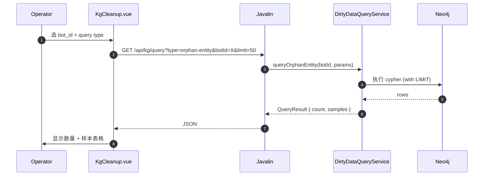
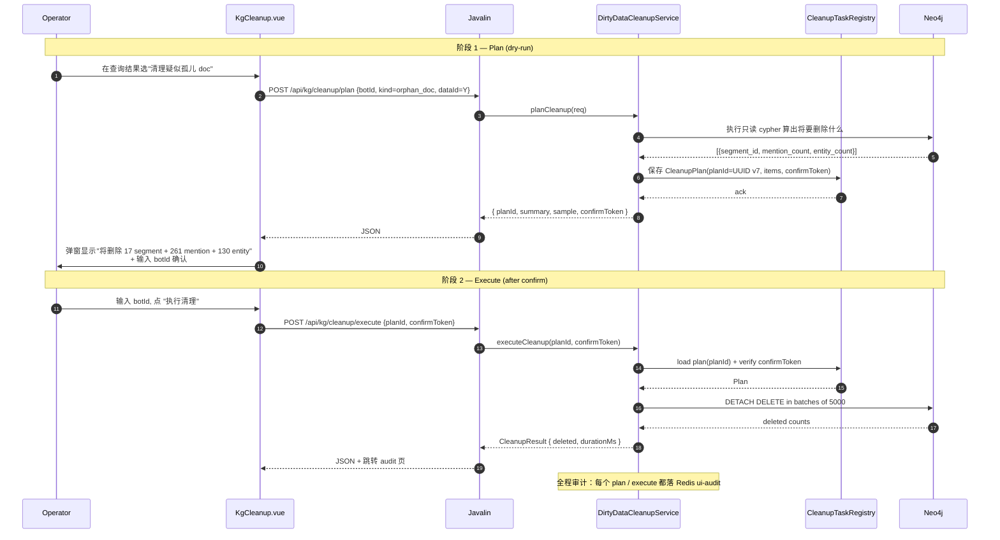

# KG 脏数据查询与清理方案设计

- 日期：2026-05-18
- 作者：fukai（与 nuclear-fusion designing-solution 协作）
- 状态：Draft（待用户确认）
- 范围：在 `ha-agent` 模块内新增脏数据查询 + 清理功能；要求**可独立使用**（无 HA 部署时也能工作），与 HA UI 共用同一页面
- 参考需求：`docs/nuclear-fusion/requirements/kg_dirty_data_query_requirements.md`
- 关联 KG 数据模型：`../../sdk/oversea-chatbot-sdk/docs/knowledge_graph_design.md` §四

---

## 1. Problem Statement

**目标**：oversea-chatbot 的 KG 数据存在 Neo4j 里，历史上出现多种脏数据（孤儿节点、半完成删除、字段漏写、跨边不一致），目前依赖运维手写 cypher / python 脚本排查。提供 HA 平台标准化的查询入口 + **清理动作**，让 RD/运维自助定位并修复脏数据，无需直接动生产 Neo4j。

### 范围（IN）

- 需求文档 §1–§5 所有**只读查询**（规模 / 孤儿 / 字段缺失 / 跨边一致性 / 详查钻取）
- 基于查询结果的**清理删除动作**（用户新增要求）：删除指定的孤儿节点 / 残留边 / 半完成数据
- 标准化 REST API + UI 操作 + 审计落盘
- **可独立部署**：未部署 HA 集群时，agent 单独连 Neo4j 仍能用此功能

### 范围（OUT）

- 跨系统对账（需求 §6，依赖 ES）—— v2 候选
- 自动定时清理（cron 类）—— v2 候选
- 修改 / 修复脏数据（如 reconcile group_id）—— 只删除，不修改
- 多 bot 批量操作 —— 一次操作单 bot

### 非功能目标

| 维度 | 目标 |
|---|---|
| 独立性 | 完全无 HA 时单进程跑通；通过 yml 配 Neo4j 直连 |
| 查询性能 | 单查询 P95 < 5s（小 bot），≤ 60s（大 bot，带 LIMIT） |
| 删除安全 | 必须先 dry-run，操作员二次确认后才真实执行；每次操作落审计 |
| 数据规模 | 单 bot 节点数 ≤ 1M 关系数 ≤ 5M 时所有查询有限内可完成 |

### 约束识别（按 reviewing-design `Constraint Compliance` 维度，**必须先列清楚**）

#### 上游 — Neo4j-HA 集群（部署在 HA 模式时）

| 约束 | 本设计如何遵守 |
|---|---|
| **写操作必须经 primary**（不能直接写 standby）| 删除操作通过 `ClusterStateManager.getPrimaryDriver()` 拿 driver，绝不连 standby |
| **删除走 CDC 链路同步**：primary 上的 DETACH DELETE 会被 APOC trigger 捕获 → 写到 `_CDCDeleteEvent` 中转节点 → CDC Collector publish → standby 同步 | 不需要额外动作，自动生效 |
| **不绕开 fencing token**：删除事件必须带当前 fencing token | 通过现有 driver + cypher 链路自动满足 |
| **不破坏 `_elementId` 唯一性** | 删除不涉及创建 / 修改 elementId，零风险 |
| **不影响 fullsync 进行中的状态机** | 在 BackupCoordinator state == IDLE 时才允许执行清理，避免 prepare 期间 sync 暂停导致 delete event 堆积 |

#### 上游 — KG 数据模型（来自 oversea-chatbot-sdk）

| 约束 | 本设计如何遵守 |
|---|---|
| **bot_id 强制过滤**（防跨 bot 数据污染） | 所有查询 / 删除 cypher 必须以 `WHERE bot_id = $botId` 起头；API 层强制校验 `bot_id` 必填 |
| **MERGE 唯一键**：Entity (`bot_id, name, entity_type`)；Segment (`bot_id, segment_id`)；MENTIONED_IN (`segment_id, data_id`)；RELATES_TO (`triple_id, bot_id`) | 删除操作前必须按完整 MERGE 键定位，避免误删 |
| **is_active 软删标记** | 默认查询包含 `is_active=false` 的（因为是脏数据来源）；清理时**真硬删 DETACH DELETE**，不止 set is_active=false |
| **派生边不可手动删** (`BELONGS_TO` / `Community` 由 community-pipeline 维护) | 清理不删除派生边，让 community-pipeline 重算 |

#### Neo4j 自身

| 约束 | 本设计如何遵守 |
|---|---|
| **DELETE 必须 DETACH**（否则关系约束报错） | 所有删除 cypher 用 `DETACH DELETE` |
| **大事务 OOM**：单 tx 删 > 万级 entity 会 GC 长时间 | 分批：每批 ≤ 5000 实体，多 tx 提交 |
| **APOC trigger 异步队列**：删除事件入 trigger 队列，繁忙时积压 | 大批清理后必须 flush 等待（参照 BUG-061 设计） |

#### 安全 / 合规

| 约束 | 本设计如何遵守 |
|---|---|
| **删除操作必须可审计** | 每次删除落 `ui-audit` stream + 写本地结构化日志 |
| **RBAC**：viewer 不能删，admin 才能 | 复用现有 `AuthFilter.requireWriter` |
| **二次确认**：UI 必须显式输入 `bot_id` 确认 | 沿用 `ConfirmDangerDialog` 模式 |

### 成功标准

- 用户实测案例（需求 §9 提到的 2026-05-15 案例）能在 UI 上完整复现：
  - `bot_id=6a02d4967e7b712529eb2ade` 上查到 1 个疑似孤儿 doc → 一键预览 17 segment + 261 mention + 130 entity → 二次确认 → 清理完成
- 无 HA 部署的环境：单机 docker run 一个 ha-agent 容器，配置 Neo4j 直连即能用

---

## 2. Reference Landscape

| # | 参考 | 借鉴点 | 不适用 |
|---|---|---|---|
| **R1** | **需求文档自带的 `scripts/_scan_dirty_kg.py`**（纯 cypher + aiohttp） | §1/2/3/4.1/4.3/6.1 所有 cypher 模板可直接复用 | 它是 ad-hoc 脚本无 UI / 无审计 / 无清理 |
| **R2** | **Patroni + pg_repack**（Postgres HA 的脏数据 / 膨胀清理工具链） | 把"诊断"和"动作"分两步、必须 dry-run、可审计的模式 | Patroni 自身不做行级清理，与我们的"DETACH DELETE 单节点"颗粒度不同 |
| **R3** | **MongoDB Compass** 的 "Dirty Find" + "Bulk Delete" 工作流 | UI 上"先查询 → 看结果 → 选中要删的 → 确认 → 执行"的交互范式 | Compass 直连 MongoDB，没有 audit 流；本设计要写 Redis ui-audit |
| **R4** | **HA Agent 现有 `/cluster/backup/prepare` / `complete` 双阶段 + ConfirmDangerDialog** | 内部成熟的"危险操作"协议：二次确认 + 审计 + dry-run，借此扩展 KG 清理 | — |

---

## 3. Implementation Architecture

### 风格

**HA Agent 内嵌子模块**（Modular Monolith 的一个新顶层包），与 HealthChecker / FailoverOrchestrator / BackupCoordinator 同级。

### 部署拓扑

```
┌──────────────────────────────────────────────────────────────────┐
│ ha-agent JVM (single process)                                     │
│                                                                    │
│ ┌─ 现有：HealthChecker / FailoverOrchestrator / BackupCoordinator┐│
│ │            ClusterStateManager / SyncApplier / ...             ││
│ └────────────────────────────────────────────────────────────────┘│
│                                                                    │
│ ┌─ 新增：kg-cleanup 模块 ──────────────────────────────────────┐ │
│ │                                                                ││
│ │  KgConnectionFactory ──→ 选 driver                            ││
│ │   ├─ HA 部署时：复用 ClusterStateManager.getPrimaryDriver()   ││
│ │   └─ 独立部署时：用 kg.neo4j.uri 直接 build 一个 driver       ││
│ │                                                                ││
│ │  DirtyDataQueryService                                        ││
│ │   ├─ §1 规模查询    │ KgQueryRegistry 维护所有 cypher          ││
│ │   ├─ §2 孤儿检测    │                                          ││
│ │   ├─ §3 字段完整性  │                                          ││
│ │   ├─ §4 跨边一致性  │                                          ││
│ │   └─ §5 详查        │                                          ││
│ │                                                                ││
│ │  DirtyDataCleanupService                                      ││
│ │   ├─ planCleanup(query, params) → CleanupPlan (dry-run)       ││
│ │   ├─ executeCleanup(plan, confirmToken)                       ││
│ │   └─ getCleanupStatus(taskId)                                 ││
│ │                                                                ││
│ │  KgAuditLog → 写 Redis ui-audit / 本地文件双写               ││
│ │                                                                ││
│ └────────────────────────────────────────────────────────────────┘│
│                                                                    │
│ ┌─ 现有 Javalin :8080 ──────────────────────────────────────────┐ │
│ │   /api/kg/...  ← 新增端点（详见 §6）                          ││
│ │   /api/cluster/...                                            ││
│ │   /                ← 共用 Vue SPA                              ││
│ └────────────────────────────────────────────────────────────────┘│
└──────────────────────────────────────────────────────────────────┘
```

### 独立部署模式（无 HA）

```
config/agent/ha-agent.yml:
  cluster:
    nodes: []          # ← 空，禁用 HA
  # HA 相关功能（HealthChecker / FailoverOrchestrator / SyncApplier）
  # 在启动时检测 cluster.nodes 为空 → 跳过启动
  
  kg:
    enabled: true
    neo4j:
      uri: "bolt://your-neo4j:7687"
      username: "neo4j"
      password: "${NEO4J_PASSWORD}"
      database: "neo4j"
    cleanup:
      enabled: true
      maxBatchSize: 5000
      requireDryRunFirst: true
```

`HaAgent.main` 启动逻辑分两段：

```java
if (config.cluster() != null && !config.cluster().nodes().isEmpty()) {
    // 启动 HA 全套（HealthChecker / Failover / Sync / CDC）
}
if (config.kg() != null && config.kg().enabled()) {
    // 启动 KG cleanup 子系统（无依赖 HA）
}
```

### 关键组件

| 组件 | 责任 |
|---|---|
| `KgConfig` | 新 yml 配置 record；含 `neo4j` 连接 + `cleanup` 安全参数 |
| `KgConnectionFactory` | 暴露 `getDriver()`：HA 在时取 primary，否则从 yml 建独立 driver |
| `DirtyDataQueryService` | 执行所有只读查询；内部用 `KgQueryRegistry` 管理 cypher 模板 |
| `KgQueryRegistry` | 集中存所有 cypher 模板（来自 R1 参考脚本），便于版本化 |
| `DirtyDataCleanupService` | 两阶段：plan + execute；任务化 + 限速分批 |
| `CleanupTaskRegistry` | 内存 + Redis 双写的清理任务状态（plan_id → 完整 plan，TTL 1h） |
| `KgAuditLog` | 复用 / 扩展现有 `UiAuditLog`，可降级到本地 logback |
| `KgController` | Javalin handler 暴露 `/api/kg/**` |

### 技术选型

| 维度 | 选择 | 一句理由 |
|---|---|---|
| Cypher 执行 | 现有 `org.neo4j.driver.Driver` | 与 HA 主路径一致，无新依赖 |
| 任务状态存储 | 内存 ConcurrentHashMap + Redis HSET（可选） | HA 模式下 Redis 已有；无 HA 时仅内存（重启清空，可接受） |
| dry-run 唯一标识 | UUID v7（项目已有 `IdGenerator.uuidV7`） | 时间有序，便于 trace |
| 二次确认机制 | 操作员在 execute 时附带从 plan 拿到的 `confirmToken` | confirmToken = sha256(plan_id + bot_id)，防误绑 |
| 大批量分批 | 单 cypher 加 `LIMIT 5000` + 多 tx 提交 | 与 ChangeApplier BUG-081 修复一致 |

---

## 4. Module Layering

### 新增目录

```
src/ha-agent/src/main/java/com/neo4j/ha/agent/kg/
├── KgConfig.java                     (record, 在 HaConfig.java 内或独立)
├── KgConnectionFactory.java          (取 driver — HA 复用 / 独立 build)
├── query/
│   ├── DirtyDataQueryService.java    (入口，按 §1-§5 分类调 cypher)
│   ├── KgQueryRegistry.java          (所有 cypher 模板，集中)
│   ├── QueryRequest.java             (参数 record: botId, groupId, limit, ...)
│   └── QueryResult.java              (统一返回 record: type, count, samples)
├── cleanup/
│   ├── DirtyDataCleanupService.java  (plan + execute 双阶段)
│   ├── CleanupPlan.java              (record: planId, botId, target, items, confirmToken)
│   ├── CleanupTaskRegistry.java      (内存 + Redis HSET)
│   ├── CleanupResult.java            (record: deletedCount, durationMs, sample)
│   └── KgDeleteTemplates.java        (所有 DETACH DELETE cypher 模板)
├── audit/
│   └── KgAuditLog.java               (复用 UiAuditLog 或独立)
└── http/
    └── KgController.java             (Javalin endpoints)

src/ha-agent/src/main/resources/static/ui/
└── views/KgCleanup.vue               (与 HA 共用 SPA 框架)
```

### 跨切面

| 关注点 | 实现 |
|---|---|
| 日志 | SLF4J，结构化 JSON（与 ha-agent 主路径一致） |
| 度量 | 新增 Micrometer 指标 `kg_query_total{type}` / `kg_cleanup_planned_total` / `kg_cleanup_executed_total{kind}` / `kg_cleanup_duration_seconds` |
| 鉴权 | 复用 `AuthFilter` —— session(admin) 或 X-Admin-Token |
| 配置 | 在 `HaConfig` 增加 `KgConfig kg` 字段 |
| Audit | 复用 `UiAuditLog`，新增 `op.kg.query` / `op.kg.cleanup.plan` / `op.kg.cleanup.execute` 事件类型 |

---

## 5. Flows

### Flow A — 只读查询（§1–§5 的所有查询）



**幂等性**：查询完全幂等（只读 cypher）。
**失败模式**：Neo4j 连接失败 → 503；超时 → 504；bot_id 缺失 → 400。
**性能预算**：单查询 ≤ 5s P95；超时 cap 30s。

### Flow B — 清理（两阶段：plan + execute）



**关键不变式**：
1. `executeCleanup` 必须先 `loadPlan(planId)` + 验证 `confirmToken` —— 阻止 plan 旁路
2. `confirmToken` 与 `planId` 严格绑定（一次性，使用后失效）
3. 分批 5000 一个 tx，提交后 sleep 100ms 防 trigger 队列爆
4. 任何 batch 失败 → 立即中止 + 上报已删除数量
5. 删除事件由 APOC trigger + CDC 自动同步到 standby（HA 模式下）

### Flow C — 独立部署初始化

```
启动 HaAgent.main →
  if (config.cluster.nodes 为空) skip HA 全套
  if (config.kg.enabled) initialize KgConnectionFactory
    → 用 yml 直连 Neo4j build Driver
  启动 AdminHttpServer with KgController only
  UI 显示只有"KG 脏数据清理"菜单（其他 HA 相关菜单隐藏或显示"未配置"）
```

---

## 6. Protocols

### 对外协议

REST + JSON，沿用 ha-agent 现有风格（鉴权、错误信封一致）。

### 错误信封

复用现有：
```json
{
  "error": "bad_request" | "unauthorized" | "forbidden" | "not_found" |
           "plan_expired" | "confirm_token_invalid" | "neo4j_unavailable" |
           "internal",
  "message": "...",
  "requestId": "<uuid>"
}
```

### 端点表

| Method | Path | 鉴权 | 输入 | 输出 |
|---|---|---|---|---|
| GET | `/api/kg/health` | session/token | — | `{ neo4jReachable, latencyMs }` |
| GET | `/api/kg/query` | session/token | `?type=<...>&botId=&...` | `{ type, count, samples, durationMs }` |
| GET | `/api/kg/query/types` | session/token | — | 所有支持的 query type 列表 |
| POST | `/api/kg/cleanup/plan` | session(admin)/token | `{ botId, kind, params }` | `{ planId, summary, sample, confirmToken, expiresAt }` |
| POST | `/api/kg/cleanup/execute` | session(admin)/token | `{ planId, confirmToken }` | `{ deleted, durationMs, batches }` |
| GET | `/api/kg/cleanup/plans` | session/token | — | 最近 N 个 plan（已 / 未执行） |
| GET | `/api/kg/cleanup/plans/{id}` | session/token | — | 单个 plan 详情 + 状态 |
| GET | `/api/kg/audit` | session/token | `?since=&limit=` | 仅 kg 相关 audit 事件（也可走 `/api/audit` 统一拉） |

### `query type` 枚举（按需求文档分类）

```
scale-overview        — §1.1 单 bot 全局规模
distribution-relates  — §1.2 RELATES_TO 按 group_id 分布
distribution-segment  — §1.3 Segment 按 data_id 分布
distribution-entity   — §1.4 Entity 按 group_id 分布

orphan-entity-full    — §2.1 完全无边
orphan-entity-business— §2.2 无业务边
orphan-segment        — §2.3 无入边
orphan-relates        — §2.4 Segmentless RELATES_TO

field-missing-mention — §3.1 MENTIONED_IN 字段缺失
field-missing-segment — §3.2 Segment 字段缺失
field-missing-relates — §3.3 RELATES_TO 字段缺失
field-missing-entity  — §3.4 Entity 字段缺失

doc-orphan            — §4.1 ★疑似孤儿 doc
doc-reverse-orphan    — §4.2 反向半完成
entity-group-stuck    — §4.3 Entity.group_id 卡死
entity-duplicate-type — §4.4 同名 Entity 多 entity_type
bot-isolation-leak    — §4.5 bot 隔离破洞

detail-by-data-id     — §5.1 按 data_id 详查
detail-by-entity      — §5.2 按 entity 详查
detail-by-segment     — §5.3 按 segment 详查
```

### `cleanup kind` 枚举（删除动作类型）

```
delete-orphan-doc         — 删某 data_id 下所有 segment + mention + entity 链
delete-orphan-entity      — 删一组指定 entity (by elementId 列表)
delete-orphan-segment     — 删一组指定 segment (by segment_id 列表)
delete-segmentless-rel    — 删指定 RELATES_TO 边
```

**v1 范围**：只实现 `delete-orphan-doc`（覆盖需求 §9 实战场景）。其他 cleanup kind 用 501 Not Implemented 占位，v2 补。

### 配置 schema 扩展

```yaml
# config/agent/ha-agent.yml
admin:
  ui:
    enabled: true
    users: [...]
  # ... existing ...

# 新增顶层：
kg:
  enabled: true                          # 总开关；为 false 时所有 /api/kg/* 返 503
  
  # Neo4j 连接（HA 模式下可省略，复用 cluster primary）
  neo4j:
    uri: "bolt://neo4j-primary:7687"     # standalone 模式必填
    username: "neo4j"
    password: "${NEO4J_PASSWORD}"
    database: "neo4j"
    maxConnectionPoolSize: 20
    connectionTimeout: "10s"
  
  # 复用 HA cluster driver（HA 部署时优先）
  useClusterDriver: true                 # true = 优先用 HA primary，false = 仅用上面的 neo4j 配置
  
  cleanup:
    enabled: true                        # 清理总开关；为 false 时仅查询，不允许删
    maxBatchSize: 5000                   # 单 tx 最大删除数
    interBatchDelayMs: 100               # batch 间隔（防 APOC trigger 队列爆）
    planTtl: "1h"                        # plan 在 registry 中的保留时长
    maxPlansInRegistry: 100              # 最多保留多少 plan 在 Redis HSET
    requireBotIdConfirm: true            # execute 时必须输入 botId 二次确认
  
  rateLimit:
    queryPerMinute: 60                   # 单 user 单 minute 最大查询次数
    cleanupPerHour: 10                   # 单 user 单 hour 最大执行次数
```

---

## 7. Data Handling & Storage

### Cypher 实现（参考脚本提供，集中在 `KgQueryRegistry`）

每条 cypher 满足项目约束：

| 约束 | 体现 |
|---|---|
| **bot_id 强制过滤** | 所有 cypher 第一行 `MATCH ... WHERE n.bot_id = $botId` |
| **LIMIT 上限** | 所有列表查询都带 `LIMIT $limit`（默认 50，cap 5000） |
| **只读账号专用** | 查询用 `:read` 路由（HA 模式自动），独立模式也是 readonly 事务 `session.executeRead` |

### 删除 cypher 示例（`delete-orphan-doc` for §4.1）

```cypher
// Phase 1: plan（只读，dry-run）
MATCH (s:aiagent_Segment {bot_id: $botId, data_id: $dataId})
OPTIONAL MATCH (e:aiagent_Entity)-[m:aiagent_MENTIONED_IN]->(s)
RETURN
  collect(DISTINCT elementId(s)) AS segmentElemIds,
  collect(DISTINCT elementId(e)) AS entityElemIds,
  count(DISTINCT m) AS mentionCount
LIMIT 1

// Phase 2: execute（写）— 分批
// Batch a: 删 Mention 边（DETACH delete segment 时自动删，但显式 batch 更可控）
MATCH (s:aiagent_Segment) WHERE elementId(s) IN $segmentBatch
DETACH DELETE s

// Batch b: 删孤儿 Entity（仅那些没有其他 segment 引用的）
MATCH (e:aiagent_Entity) WHERE elementId(e) IN $entityBatch
  AND NOT (e)-[:aiagent_MENTIONED_IN]->()       // 复查没有其他文档
  AND NOT (e)-[:aiagent_RELATES_TO]-()          // 也没有关系
DETACH DELETE e
```

**关键**：Phase 2 的"删孤儿 entity"再次复查没有其他引用，防止 plan 阶段后又有人加了新 mention 导致误删。

### 存储

| 数据 | 介质 | 一致性 | 持久化 | TTL |
|---|---|---|---|---|
| CleanupPlan | 内存 CHM + Redis HSET `neo4j:ha:kg-cleanup-plans` | 单实例强 | Redis 持久（HA 模式） | 1h |
| Audit | Redis stream `neo4j:ha:ui-audit`（复用） | 强 | 是 | StreamMaintenanceTask 管 |
| 指标 | Micrometer 内存 | 最终 | Prometheus scrape | — |

### 数据流：清理事件如何流到 HA 集群

```
KG cleanup execute (在 primary 上)
  ↓ DETACH DELETE
APOC Trigger 捕获删除事件
  ↓ 生成 _CDCDeleteEvent transit nodes
CDC Collector poll
  ↓ publish 到 neo4j:cdc:neo4j:changes
SyncApplier 在每个 standby 消费
  ↓ DETACH DELETE 镜像应用
所有 standby 数据一致
```

这条路径**完全复用 HA 现有 CDC 链路**，KG cleanup 不需要额外做任何事。

---

## 8. Access Control

### 身份

| 角色 | KG 查询 | KG 清理 |
|---|---|---|
| Admin | ✅ | ✅ |
| Viewer | ✅ | 🚫 |
| Token (X-Admin-Token) | ✅ | ✅（脚本化清理用） |

### bot 隔离

所有 KG 操作必须以 `bot_id` 为强制过滤前提。**虽然当前 v1 没有"用户只能操作自己的 bot"的策略**（团队规模小），但代码层 `bot_id` 必填校验保证不会无意识跨 bot 操作。

v2 可能加 user → bot 列表映射（基于 yml 配置或外部 IAM），暂列为 §11 待定。

### Plan / Execute 的 token 链

```
plan 阶段：
  生成 planId = uuid_v7
  生成 confirmToken = sha256(planId + bot_id + secret)
  存 plan + token 到 Registry，TTL 1h
  返回 { planId, confirmToken } 给 UI

execute 阶段：
  接 { planId, confirmToken }
  从 Registry 取 plan
  验证 confirmToken == sha256(planId + plan.bot_id + secret)
  ✓ → 继续；✗ → 401
  执行后立即把 plan 标记 EXECUTED（避免重放）
```

`secret` 来自启动时随机生成的进程内 secret，Agent 重启失效（plan 也跟着失效，符合 1h TTL 的语义）。

---

## 9. Security Monitoring & Audit

### 审计事件（写 `neo4j:ha:ui-audit` Redis stream）

```
op.kg.query                ts, actor, ip, type, botId, durationMs
op.kg.cleanup.plan         ts, actor, ip, planId, botId, kind, params, summary
op.kg.cleanup.execute      ts, actor, ip, planId, deletedSegments, deletedEntities,
                            deletedMentions, durationMs, requestId
op.kg.cleanup.failed       ts, actor, planId, batchesCompleted, error
```

每条事件都可从 UI 审计页查到，与现有 backup / failover 审计统一展示。

### 监控指标

```
kg_query_total{type, status}            Counter
kg_query_duration_seconds{type}         Timer
kg_cleanup_planned_total{kind}          Counter
kg_cleanup_executed_total{kind, status} Counter
kg_cleanup_deleted_entities_total{kind} Counter
kg_cleanup_duration_seconds{kind}       Timer
kg_neo4j_connection_active              Gauge
```

### 告警建议

| 指标 | 阈值 | 含义 |
|---|---|---|
| `kg_query_duration_seconds P99` | > 30s | 查询过慢，可能 bot 太大或 cypher 退化 |
| `kg_cleanup_executed_total{status="failed"}` 速率 | > 1/h | 清理失败需调查 |
| `kg_cleanup_deleted_entities_total` 1h | > 10000 | 大批量删除，操作审计需复查 |

### 威胁模型（STRIDE）

| 类别 | 威胁 | 缓解 |
|---|---|---|
| **S**poofing | 伪造 confirmToken 直接 execute | sha256(planId + botId + 进程 secret)；plan 一次性使用 |
| **T**ampering | 修改 plan 内容（add 更多 entity） | plan 完整存储，execute 时按 plan 内容删；plan 不可由 API 修改 |
| **R**epudiation | "不是我执行的清理" | 每个 execute 落 audit（actor + ip + requestId + 删除数量） |
| **I**nformation disclosure | 跨 bot 查到敏感数据 | bot_id 强制过滤 |
| **D**enial of service | 反复全量扫描搞垮 Neo4j | `kg.rateLimit.queryPerMinute` + cypher LIMIT |
| **E**levation of privilege | Viewer 角色清理数据 | `AuthFilter.requireWriter()` |

---

## 10. Risk Controls

### 数据风险

| 风险 | 缓解 |
|---|---|
| **误删活数据** | 强制 dry-run + 二次确认 + bot_id 必填 + execute 时再次复查关系存在性 |
| **跨 bot 污染** | 所有 cypher 强制 bot_id 过滤；§4.5 bot 隔离破洞作为查询而非自动修复（人工评估） |
| **关联实体连带删除** | `DETACH DELETE` 仅对 Segment / Entity 节点，关系自动跟着删；不递归到上游关联 |
| **HA 同步失败** | 走 HA 的 CDC 链路，与正常写入完全一致；如果同步坏 fullsync 兜底 |
| **大批量 OOM** | 分批 5000 + tx 间 sleep 100ms；超 1M 拒绝单次执行 |
| **trigger 队列爆** | 参考 BUG-061 的 afterAsync drain；清理后等 5s |

### 操作风险

| 风险 | 缓解 |
|---|---|
| Plan 后另一个用户同时也 plan + execute 互相冲突 | Plan 是 read-only 不冲突；execute 时按 planId 锁单 plan，并发 execute 拒绝 |
| Plan 过期后 execute | TTL 1h；过期返 404 + 提示重新 plan |
| 在 HA failover 期间清理 | Cleanup execute 前检查 `cluster.primary` driver 可用；不可用 → 503 retry-after |
| 清理过程中 HA 触发 failover | 已删除部分保留，剩余批次回失败信号；操作员评估后重新 plan |
| Backup 进行中清理 | `BackupCoordinator.getState() != IDLE` 时拒绝 cleanup execute |

### 优雅降级

1. Neo4j 不可达 → `/api/kg/health` 返 503，UI 提示"无法连接 Neo4j"
2. Redis 不可达（plan registry 写失败）→ 降级到内存模式（Agent 重启 plan 丢失，可接受）
3. 配置缺失 (`kg.enabled=false`) → 所有 `/api/kg/*` 返 503 `Service Unavailable`

### 灰度 / 回滚

- v1 上线策略：`kg.enabled` 默认 `false`，需要显式打开
- 上线观察期：先开 `query`，`cleanup.enabled: false`；运行 1-2 周确认查询正确性，再开 cleanup
- 回滚：`kg.enabled: false` + Agent 重启 → 完全关闭，token 通道不受影响

---

## 11. Open Questions

| # | 问题 | 推荐默认 |
|---|---|---|
| Q1 | 是否要做 user → bot 列表映射的 IAM？ | v1 不做，v2 候选 |
| Q2 | 跨系统对账（§6）何时做？ | v2，需要 ES 客户端 |
| Q3 | 定时自动清理（cron 类）？ | v3，先观察手动清理频率 |
| Q4 | Plan 超过 5000 entity 时怎么办？ | v1 拒绝（提示 batch 自己拆），v2 支持 multi-plan 自动拆 |
| Q5 | UI 的"详查钻取"显示样式 | 表格 + 详情侧抽屉（参照 Audit 详情对话框） |
| Q6 | Cleanup execute 的进度展示是同步阻塞响应还是异步任务化？ | v1 同步（5000 内 / 30s 内）；v2 改成任务化 + polling |

---

## 12. Alternatives Considered

### D1 — KG cleanup 嵌入 ha-agent vs 独立微服务

| 选项 | 优势 | 劣势 |
|---|---|---|
| **A. 嵌入 ha-agent** ⭐ | 复用鉴权 / 审计 / UI / 配置体系；零新进程；零新端口 | jar 略增加；与 HA 耦合 |
| B. 独立微服务 | 完全解耦 | 多一个进程 / 鉴权 / UI 部署；与"共用同一个 UI"要求矛盾 |

用户明确要求"共用同一个 UI" → **首选 A**。独立部署能力通过 yml 配置实现（`cluster.nodes: []` 跳过 HA 启动）。

### D2 — 删除策略：硬删 vs 软删（is_active=false）

| 选项 | 优势 | 劣势 |
|---|---|---|
| **A. 硬删（DETACH DELETE）** ⭐ | 真正释放存储；避免 "is_active=false 的脏数据"累积成更脏的脏数据 | 不可撤销 |
| B. 软删（SET is_active=false） | 可撤销 | 不释放存储；脏数据本身定义就是 `is_active=false` 的，软删毫无意义 |
| C. 软删先 + 一段时间后硬删 | 提供 grace period | 状态机复杂；TTL 调度 |

需求文档明示"脏数据"包含 is_active=false 的项 → 这本身就是要被清理的目标。**首选 A**。

### D3 — Plan / Execute token 机制 vs 直接接受参数

| 选项 | 优势 | 劣势 |
|---|---|---|
| **A. Plan + ConfirmToken 双阶段** ⭐ | 显式 dry-run；二次确认；plan 内容固化避免 TOCTOU | 多一次往返 |
| B. 单次 POST 携带完整 params | 简单 | 没有 dry-run 步骤，没有二次确认锚点 |

清理是不可逆危险操作 → **必须 A**。

### D4 — Neo4j 连接：直连 yml 配 vs 复用 HA driver

| 选项 | 优势 | 劣势 |
|---|---|---|
| **C. HA 在时复用，独立时直连 yml** ⭐ | 双模式兼容 | 实现稍复杂 |
| A. 总是用 yml | 简单 | 在 HA 部署里多一个 driver 浪费 |
| B. 总是用 HA cluster | 简单 | 不能独立部署 |

用户明确要求"可独立使用" → **首选 C**。

---

## 13. 实施路线（移交 building-production-feature）

| 阶段 | 工作量 | 内容 |
|---|---|---|
| **M0** | ~2h | 配置 schema 扩展（KgConfig）+ KgConnectionFactory（双模式）+ Agent 启动顺序调整 |
| **M1** | ~4h | DirtyDataQueryService + KgQueryRegistry + 7-8 个核心查询 cypher（§1 + §2 + §4.1）+ KgController GET 端点 |
| **M2** | ~4h | DirtyDataCleanupService plan + execute（仅 `delete-orphan-doc`）+ CleanupTaskRegistry + audit 集成 |
| **M3** | ~5h | UI：KgCleanup.vue 视图 + 查询表单 + 结果表 + 清理详情对话框 + 二次确认 |
| **M4** | ~2h | Prometheus 指标 + 速率限制 + 一组关键单测 |
| **M5** | ~3h | 文档（运维 runbook）+ 集成测试 + 灰度上线 |

总计：**约 20 小时（一人 3 天）**。

---

## 14. 关键决策汇总（待用户确认）

1. ⏳ 嵌入 ha-agent + 共用 UI（D1-A）
2. ⏳ 硬删 DETACH DELETE（D2-A）
3. ⏳ Plan + ConfirmToken 双阶段（D3-A）
4. ⏳ 双模式连接（HA 复用 + 独立 yml）（D4-C）
5. ⏳ v1 范围：所有查询 + 仅 `delete-orphan-doc` 清理；其他清理动作 v2
6. ⏳ Plan 同步执行（不超过 5000 entity）；任务化 v2
7. ⏳ Bot 隔离：bot_id 强制必填，无 user→bot IAM（v2 候选）

用户**确认决策点后**，将切换到 `building-production-feature` 进入 M0–M5 实施。
