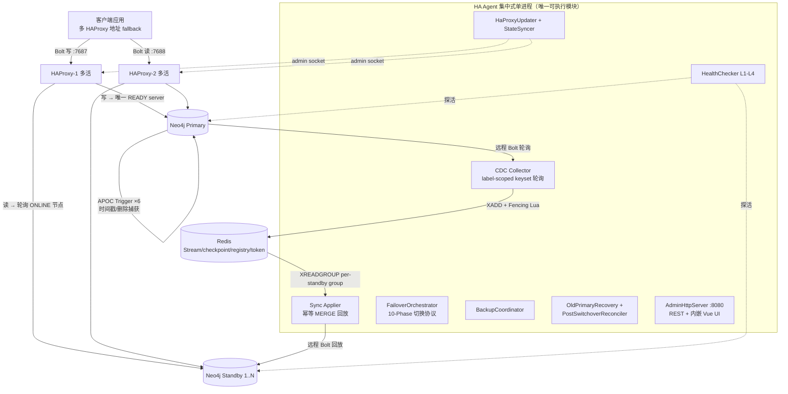
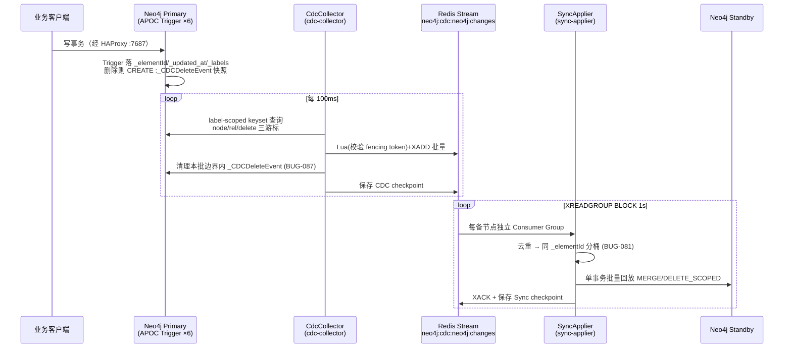

# docs 目录功能设计梳理与确认 — 项目分析报告

> 日期: 2026-07-15
> 模式: Nuclear Fusion — analyzing-codebase（范围聚焦 docs 目录）
> 范围: `docs/` 全部 20 篇文档（约 1.73 万行）+ 与 `src/`、`scripts/`、`ui/` 的交叉核验
> 覆盖度: 需求 / 架构 / 4 篇模块设计 / 2 篇废弃模块设计 / 5 篇专项方案 / 4 篇运维手册 / 测试策略 / 2 篇分析报告 **全文已读**；`reviews/` 下 10 篇历史评审报告仅抽读 1 篇（2026-04-10 设计评审），其余未读（历史评审对"当前功能设计"非权威来源）。代码核验为抽样验证（Trigger 安装、备份端点与脚本、BackupCoordinator、fullsync 参数、UI 视图），未逐行审读全部源码。

---

## 1. 一句话结论

docs 目录完整地定义了一套 **Neo4j Community Edition 外挂式主备高可用系统** 的功能设计：以 APOC Trigger + Cypher keyset 轮询实现 CDC，经 Redis Stream 传输，在备节点幂等回放；由集中式单进程 HA Agent 统一负责健康检查、10-Phase 强一致主备切换、HAProxy 多活路由、备份协调、旧主恢复，并扩展出管理 UI（含数据一致性视图）与 KG 脏数据清理平台。**功能设计是可确认的、自洽的**——权威口径 = 总体架构文档 + ha-agent-design（含 §15 BUG 修订史）+ ha-client-contract；但部分文档存在**滞后于代码与相互矛盾**的段落（详见 §8），使用时需按本报告 §7 的权威度评定取舍。

---

## 2. 文档清单与权威度评定

| 文档 | 行数 | 定位 | 权威度评定 |
|---|---|---|---|
| `nuclear-fusion/requirements/2026-04-10-neo4j-ha-requirements.md` | 163 | 需求解析（RPO/RTO、模块清单、约束） | ✅ 有效；RTO 口径已被后续实测修订（见 §5.4） |
| `nuclear-fusion/design/2026-04-10-neo4j-ha-architecture.md` | 1752 | 总体架构 v2.2 | ✅ **权威**；但 §4.3 Trigger 设计已过时（3 个 Trigger 的写法，实际为 6 个，见 §8-3） |
| `nuclear-fusion/design/modules/ha-agent-design.md` | 6888 | HA Agent 详设 + §15 BUG-001~083 修订史 | ✅ **最权威**（约 80% 篇幅是 BUG 修订，多数实质性改写了设计） |
| `nuclear-fusion/design/modules/cdc-collector-design.md` | 318 | CDC 详设 | ✅ 基本有效；未收录 `NakedRelationshipHealer`（BUG-062）与三游标拆分（BUG-057） |
| `nuclear-fusion/design/modules/sync-applier-design.md` | 263 | Sync Applier 详设 | ✅ 基本有效；REL 模板已被 BUG-078/079/082 改写，以 ha-agent-design §15 为准 |
| `nuclear-fusion/design/modules/common-design.md` | 252 | 共享库详设 | ✅ 有效 |
| `nuclear-fusion/design/modules/failover-manager-design.md` | 215 | v1.x 独立进程设计 | ⚠️ **已废弃**（文档自身标注 DEPRECATED since v2.0） |
| `nuclear-fusion/design/modules/client-router-design.md` | 83 | v1.x 独立进程设计 | ⚠️ **已废弃**（同上） |
| `nuclear-fusion/operations/ha-client-contract.md` | 1085 | 客户端契约 single source of truth | ✅ **权威**（保留属性 5 个 / Trigger 6 个的口径与代码一致，已验证） |
| `nuclear-fusion/operations/ha-agent-cluster-operations.md` | 1681 | 集群运维手册 | ✅ 主体有效；§2.1 Trigger/保留属性口径滞后（见 §8-3/4） |
| `nuclear-fusion/operations/backup-recovery-runbook.md` | 355 | 备份恢复手册 v2 | ⚠️ **与现行脚本冲突**：声称 `neo4j-admin backup` 为 Enterprise Only 而改用停容器冷备，但 `scripts/backup/backup-standby.sh:4,162-164` 实际就是 `neo4j-admin database backup` 在线备份（与运维手册 §7 一致）；其 §11 TODO 也已过时（见 §8-1/5） |
| `nuclear-fusion/operations/java-build-packaging-guide.md` | 911 | 构建/打包/部署指南 | ✅ 有效（含 UI 构建 v1.1+、插件离线化） |
| `nuclear-fusion/testing/integration-test-strategy.md` | 267 | 集成/E2E 测试策略 | ⚠️ **大部分未落地**：`test/unit`、`test/integration`、`test/failover-simulation` 目录仅 .gitkeep；现有 29 个单测在各模块 `src/test` 下；IT-53/54 端点名（`backup/start|stop`）与代码不符（实际 `prepare|complete`，`AdminHttpServer.java:248,256`） |
| `design/2026-04-17-cdc-delete-event-orphan-sweep.md` | 167 | BUG-067 方案 | ✅ 已实施（启动 sweep 保留于 BUG-087 修复中） |
| `design/2026-05-14-ha-agent-ui-solution.md` | 986 | 管理 UI + v1.2 一致性视图方案 | ✅ 设计有效；状态标注"Approved 待实施"**已滞后**——`ui/src/views/{Dashboard,Consistency,Audit,Operations,Login}.vue`、`agent/http/auth/**`、`agent/consistency/**` 均已存在 |
| `design/2026-05-15-bug084-fullsync-consumer-premature-exit.md` | 491 | BUG-084/085/086 连环修复 | ✅ 三项均标注已实施；遗留单测/观测待办 ⏳ |
| `design/2026-05-18-kg-dirty-data-cleanup-solution.md` | 702 | KG 脏数据查询+清理方案 | ⏳ **Draft，7 项关键决策全部待用户确认**，未实施（src 中无 `kg` 包） |
| `design/2026-06-17-bug087-cdc-delete-batch-overflow-loss.md` | 84 | BUG-087 修复 | ✅ 已修复（对应最新提交 `6d87d5a`） |
| `nuclear-fusion/requirements/kg_dirty_data_query_requirements.md` | 186 | KG 脏数据查询需求 | ✅ 有效（是上面 Draft 方案的输入） |
| `nuclear-fusion/analysis/2026-05-12-standby-segment-stub-analysis.md` | 111 | Standby stub 漂移分析 | ⚠️ **待办未闭环**：stub healer / failover 前置校验等建议全部未勾选 |
| `nuclear-fusion/analysis/2026-04-10-neo4j-ha-design-review.md` | 304 | 初版设计分析 | 历史文档；其 Critical 项（C1 `_elementId` 未落属性、C2 索引不带标签）均已在现行设计中修复 |
| `nuclear-fusion/reviews/**`（10 篇 + baseline JSON） | — | 历史评审 | 未逐篇阅读；对当前功能设计非权威 |

---

## 3. 系统功能设计确认（权威口径汇总）

### 3.1 定位与指标

- **问题**：Neo4j Community Edition 无集群/无原生 HA；企业版 Causal Clustering 许可成本不可接受（requirements §1.1）。
- **方案**：外挂旁路同步层——主备异步复制 + 自动 Failover + 读写分离（architecture §1.1）。
- **指标**：同步延迟正常 <100ms / 峰值 <1s；RPO <1s；可用性 99.9%；1 主 N 备（N≤5）（requirements §2.3/§4）。
- **RTO 修订**：需求写 <30s；架构 §12.1 给出 ~13s 时间线；**实测权威口径**为 `T_failover_P99 ≈ 18s`（v1.0.0-baseline 实测 17.4s），客户端写重试总预算 ~30s（ha-client-contract §6.2）。三个口径不矛盾但粒度不同，对外承诺建议采用契约文档的 18s + 30s 重试预算。

### 3.2 总体架构



（对应 architecture §1.2；模块依赖：`ha-agent → cdc-collector / sync-applier → common`，architecture §3.2）

### 3.3 模块地图（docs ↔ src 已核验一致）

| 模块 | 职责 | 设计文档 | 代码核验 |
|---|---|---|---|
| `ha-agent` | 集群唯一管理进程：生命周期、健康检查、Failover/Switchover、路由、备份、恢复、HTTP/UI | ha-agent-design | ✅ 42 个类，包结构与文档 §2 一致；另含文档演进新增的 `http/auth`、`consistency`、`recovery`、`maintenance` |
| `cdc-collector` | 远程轮询主节点变更 → ChangeEvent → XADD | cdc-collector-design | ✅ 一致；另含 `heal/NakedRelationshipHealer`（BUG-062，模块文档未收录） |
| `sync-applier` | 消费 Stream → 备节点幂等回放；全量同步接收 | sync-applier-design | ✅ 一致 |
| `common` | 模型 / Redis / Neo4j 客户端 / 配置 / 指标 / 序列化 | common-design | ✅ 一致（多出 `EventMetadata`） |
| ~~failover-manager~~ / ~~client-router~~ | v1.x 独立进程 | 两篇 DEPRECATED 文档 | ✅ src 中已不存在，与 v2.0 合并说明一致 |
| `ui/` | Vue3 + Element Plus 管理界面 | ha-agent-ui-solution | ✅ 5 视图 + 一致性组件已存在 |

### 3.4 核心机制清单（当前有效设计）

1. **CDC 捕获**：所有节点/关系由 6 个 APOC Trigger 维护系统属性（节点 `cdc-timestamp-created/assigned/removed`，`phase:'before'`；关系 `cdc-rel-timestamp`，`phase:'afterAsync'`；删除 `cdc-capture-node-deletes` / `cdc-capture-rel-deletes`）。CDC 按 **label-scoped keyset pagination**（`(_updated_at, _elementId)` 复合游标，BUG-045）轮询，node/rel/delete **三套独立游标**（BUG-057）。删除经 `_CDCDeleteEvent` 中转节点捕获，捕获/游标/清理三者统一 keyset 边界（BUG-087），primary 启动时无条件 sweep 残留（BUG-067）。（已验证 `ApocTriggerInstaller.java:606-612` 恰好安装 6 个 Trigger 并 drop 旧版单一 `cdc-timestamp`。）
2. **保留命名空间**（ha-client-contract §3，客户端强约束）：5 个属性 `_elementId/_updated_at/_created_at/_type/_labels`、3 个标签 `_CDCDeleteEvent/_TriggerReadinessProbe/_TestPing`、关系型 `_PROBE_REL`、每 label 的 `uniq_elementid_<Label>` UNIQUE 约束（BUG-083）。
3. **传输**：Redis Stream `neo4j:cdc:neo4j:changes`（每备节点独立 Consumer Group 全量回放）+ `fullsync` 流；Fencing Token 由发布端 Lua 原子校验（消费端 filter 已改 passthrough，BUG-037）；`StreamMaintenanceTask` consumer-aware `XTRIM MINID`（Redis ≥6.2 硬性要求）；Redis 不可用时 `PublishBuffer` 本地缓冲 ~1GB。
4. **回放**：`MERGE (n:Label {_elementId})` + `SET n = $props` 幂等；REL 模板经 BUG-078/079/081/082 演进为"端点 MERGE 建 stub + stale 绑定端点匹配 + REL_DELETE_SCOPED 四元组 + 同 `_elementId` 分桶串行"。
5. **健康检查**：L1 TCP / L2 Bolt / L3 Cypher / L4 写测试，状态机 HEALTHY→SUSPECT→UNHEALTHY→DOWN；BUG-068/075 补齐 L1/L2 直升 DOWN 的路径（对主备节点均生效）。
6. **切换协议**：§6.9 十阶段强一致协议（BUG-044 确立，BUG-047/048/049/056/061/080 持续修订），核心是 **Write-Block Invariant**——写阻断到写放开之间 HAProxy 写后端无任何 READY server，保证每条成功写必被 CDC 捕获；Phase 2.5 `InflightTxDrainWaiter`、Phase 2.6 afterAsync 排空、`PostSwitchoverReconciler` 反向补齐旧主搁浅写。
7. **服务状态**：`OFFLINE/SYNCING/ONLINE` 与健康状态正交；lag 口径 = 主 CDC checkpoint `lastTs` − 备 Sync checkpoint `lastEventTs`（BUG-016/023），SYNCING→ONLINE 要求 lag < 2s 且稳定 10s；只有 ONLINE 节点接读流量、可作 Failover 候选。
8. **全量同步**：Coordinator 分节点/关系两阶段导出到 fullsync 流；消费端以 **SENTINEL 终结批（batchIndex=-1）+ snapshotTs 过滤旧残留** 判定完成（BUG-085），REL 导入 label-aware UNWIND 批量（BUG-086）；自动 fullsync 有 per-node 1h 熔断（BUG-039）。
9. **备份**：`BackupCoordinator.prepare` 原子暂停 SyncApplier + 抑制 HealthChecker + 暂停 StateSyncer + HAProxy 读后端 maint（已验证 `BackupCoordinator.java:107-119` 全部实现）；实际备份走 `neo4j-admin database backup` 在线备份（`scripts/backup/backup-standby.sh`）；`maxDuration` 2h 安全阀。
10. **管理面**：REST（`/cluster/status|failover|switchover|fullsync|backup/*`，写操作 Token 鉴权）+ 内嵌 Vue UI（Cookie session 与 `X-Admin-Token` 双轨鉴权、bcrypt 用户、RateLimiter、`neo4j:ha:ui-audit` 审计流）+ v1.2 数据一致性视图（EntityCounter/DiffEngine/PropertyHasher，三路 diff，只读不修复）。
11. **灾备红线**：Redis 承载全部控制面权威状态（node-registry 最关键），必须 AOF+RDB；Redis 数据丢失后严禁直接重启 Agent，须按三信号（Trigger 安装 > `_CDCDeleteEvent` 残留 > 最大 `_updated_at`）人工判定最后 master（architecture §12.5、ops §9）。

---

## 4. 关键功能流程

### 4.1 稳态增量同步链路



### 4.2 十阶段 Switchover / Failover（§6.9 权威协议）

```mermaid
sequenceDiagram
    participant FO as FailoverOrchestrator
    participant HP as HAProxy(全部实例)
    participant OLD as 旧主
    participant NEW as 新主
    participant R as Redis

    Note over FO: P1 确认等待(仅Failover, 5s)
    FO->>HP: P2 blockWrites: 写后端全 maint + shutdown sessions
    FO->>OLD: P2.5 InflightTxDrainWaiter 等在途事务(200ms~3s)
    FO->>OLD: P2.6 排空 afterAsync Trigger 队列
    FO->>FO: P3 停 CDC(含最终排空 poll) + 停 SyncApplier + drainPending
    FO->>R: P4 Fencing Token++
    FO->>NEW: P5 装 Trigger(含 readiness probe) + 索引 + copyCdcCheckpoint
    FO->>FO: P6 CDC switchTarget(NEW)
    FO->>R: P7 更新 registry/角色 ← 不可回退分水岭
    FO->>FO: P8 SyncApplier.start(剩余 standby)
    FO->>OLD: P9 卸载 Trigger + 清 _CDCDeleteEvent (best-effort)
    FO->>HP: P10 unblockWrites: NEW 置 ready(写恢复瞬间)
    Note over FO: 异常: P3-P9 失败→StateSyncer 10s 内恢复 OLD;<br/>P10 失败→StateSyncer 补发 ready
```

Write-Block Invariant：P2→P10 之间写后端无 READY server ⇒ 切换窗口不可能有成功写 ⇒ 零静默丢数据；窗口内失败请求由**客户端**按契约重试（退避 500ms→16s、总预算 ~30s、强制 jitter）。

### 4.3 全量同步（BUG-084/085/086 修订后形态）

```mermaid
sequenceDiagram
    participant FSC as FullSyncCoordinator<br/>(cdc-collector)
    participant R as Redis fullsync stream
    participant FC as FullSyncConsumer/Receiver<br/>(sync-applier)
    participant S as Standby

    FSC->>R: FULL_SYNC_START(snapshotTs)
    FC->>S: PREPARING: serviceState→SYNCING,<br/>HAProxy 读后端摘除, 分批清库
    loop Node 批次 → Rel 批次(带端点 labels)
        FSC->>R: FullSyncBatch
        R->>FC: 消费; timestamp < snapshotTs 的旧残留 ACK 但丢弃 (BUG-085)
        FC->>S: BulkImporter label-aware UNWIND 批量导入 (BUG-086)
    end
    FSC->>R: SENTINEL 批(batchIndex=-1) + FULL_SYNC_END
    R->>FC: 见 SENTINEL 立即结束(不依赖计数器)
    FC->>S: CATCHING_UP: 从快照位点增量追赶
    FC->>FC: lag<2s 稳定 10s → ONLINE, 重新加入读后端
```

其余重要流程（文档中均有完整设计，此处一句话索引）：旧主恢复 8 步降级（ha-agent-design §12）；备份 prepare/complete 协调（§13 + runbook）；Redis 数据丢失重建（ops §9）；UI 登录/操作审计（ui-solution §5）。

---

## 5. 技术选型（docs 自带论证的确认与补充评述）

需求文档 §1.2 已给出核心选型对比，此处确认其 4 项承重选型并按现行设计补充（描述性，不评分）：

| 维度 | 当前选型 | 替代 A | 替代 B | 评述（锚定本项目负载） |
|---|---|---|---|---|
| 消息通道 | **Redis Stream**（复用平台实例） | Kafka | NATS/JetStream | 图变更频率远低于 48万msg/s 上限，亚毫秒延迟直接服务 RPO<1s；代价是"有限持久化"——由此衍生出 MAXLEN/consumer-aware TRIM/PublishBuffer/checkpoint 失效→fullsync 整条兜底链（BUG-038/039/040），以及"Redis=控制面权威状态"这一最重运维红线（§12.5）。Kafka 可消除持久化焦虑但引入 ZK/KRaft 运维与 12.5ms 级延迟。切换成本：高 |
| 变更捕获 | **APOC Trigger + Cypher keyset 轮询** | 事务日志解析 | Neo4j 内核插件 | 社区版无原生 CDC 下的现实解；代价是 §15 中 D 组（BUG-052~066）整整一个战役——`phase:'before'` 对已删实体的读安全性、afterAsync 丢任务(~0.5%)、四层转义等内核陷阱，最终以"create trigger 预 stamp + `$removedXxx` context map"收敛。tx-log 方案无需业务属性但格式内部不公开、版本脆弱。切换成本：高 |
| 客户端路由 | **HAProxy 多活 + admin socket 运行时切换** | 应用层 SDK | DNS/VIP | TCP 层转发对 Bolt 透明、多活无状态、Runtime API 免 reload；代价是 Agent 必须闭环管理其状态（StateSyncer 补偿、BUG-020/026/032/034/035/036/049/069 一组）。SDK 方案免代理跳数但侵入所有客户端。切换成本：中 |
| 控制面形态 | **集中式单进程 HA Agent**（v2.0） | Sidecar per-node + 独立 failover-manager（v1.x 原设计） | Raft 类自协调 | 单进程消灭跨进程 control stream 协调，10-Phase 协议才可能以进程内方法调用实现；代价是 Agent 自身单点（下线期间无法 Failover，靠 Docker restart + Redis 状态恢复缓解，§12.3）。v1.x 形态已被明确废弃。切换成本：n/a（已完成迁移） |

推断动机：团队已有 Redis 基础设施、追求最小运维面、单写图库负载不高——四项选型互相咬合（集中式 Agent 依赖 Redis 做权威状态，轮询 CDC 依赖 Trigger 落系统属性，HAProxy 依赖 Agent 推路由）。

---

## 6. 功能设计演进史（读懂 docs 的关键脉络）

设计不是一次成型，§15 的 83 个 BUG 中相当多实质改写了功能设计。按主题：

| 主题 | 演进 | 关键 BUG |
|---|---|---|
| APOC Trigger | 1 个 `cdc-timestamp` → 拆 3（节点 created/assigned/removed）→ +1 关系 afterAsync → 共 6 个；delete trigger 铁律"只信 `elementId()` + `$removedXxx` + 预 stamp 属性" | 055/059/063/064/065/066 |
| CDC 游标 | 单游标 → node/rel/delete 三套独立 keyset 游标 → 删除路径捕获/清理/游标统一边界 | 057/087 |
| 切换协议 | 8-Phase → shutdown sessions → 顺序对调 → write-block 10-Phase → in-flight tx 排空 → afterAsync 排空 → 反向 reconcile | 042/043/044/047/048/056/061/080 |
| Fencing | 消费端过滤丢合法事件 → 消费端 passthrough，只保留发布端 Lua 校验 | 037 |
| 回放模板 | 裸 MERGE → 带标签 → 端点 MERGE stub → stale 绑定端点 + DELETE_SCOPED → 同 id 分桶 + UNIQUE 约束 | 028/078/079/081/082/083 |
| 健康检查 | L1/L2 无法升级 DOWN（Failover 触发不了）→ 补直升路径且不限主节点 | 068/075 |
| 备节点自愈 | 短暂离线 PEL 永不回放 → schedulePendingRecovery + 每轮 drain | 074/075 |
| 全量同步 | 计数器判完成 → SENTINEL 终结符 + snapshotTs 过滤 + label-aware 批量导入 | 084/085/086 |
| 保留属性 | 2 个（`_updated_at/_elementId`）→ 5 个（+`_created_at/_type/_labels`） | 066/083（契约 §3.1） |

**结论**：任何早期文档段落若与 ha-agent-design §15 或 ha-client-contract 冲突，以后二者为准。

---

## 7. docs ↔ 代码一致性核验结果（本次抽样验证）

| 核验点 | 文档口径 | 代码/脚本实况 | 结论 |
|---|---|---|---|
| Trigger 数量与名称 | 契约=6，ops/测试=3 | `ApocTriggerInstaller.java:606-612` 安装 6 个并 drop 旧 `cdc-timestamp` | **契约正确**，ops §2.1 / 测试策略 IT-40 滞后 |
| 备份 API 端点 | ops/runbook=`prepare|complete`，测试策略=`start|stop` | `AdminHttpServer.java:248,256` 为 `prepare|complete`（`/api/` 前缀双份） | 测试策略滞后 |
| 备份实现方式 | ops=`neo4j-admin backup` 在线；runbook v2=停容器冷备（称 neo4j-admin 是 Enterprise Only） | `scripts/backup/backup-standby.sh:4,162-175` 用 `neo4j-admin database backup` + tar | **现行=ops 口径**；runbook 与脚本冲突，其"Enterprise Only"前提待证实（见开放问题 Q1） |
| BackupCoordinator 协调范围 | runbook §11 TODO 称 v1 只 pause SyncApplier，"必须实施" | `BackupCoordinator.java:107-119` 已实现全部 4 项协调 | runbook TODO 已过时 |
| fullsync 参数名 | ops 内 `nodeId` 与 `targetNodeId` 混用 | `AdminHttpServer.java:172` fullsync 用 `nodeId`；switchover 才用 `targetNodeId`（:161） | 以代码为准：fullsync=`nodeId` |
| UI 实施状态 | ui-solution 标注"Approved 待实施" | `ui/src/views/` 5 视图 + `http/auth`、`consistency` 包 + 单测均存在 | 文档状态标注滞后，功能已落地 |
| 模块/包结构 | 4 模块 + 废弃 2 | src 与文档一致；废弃目录已删除 | ✅ 一致 |
| BUG-087 | 文档标"已修复" | 最新提交 `6d87d5a fix(cdc): BUG-087` | ✅ 一致 |

---

## 8. 文档间不一致清单（使用 docs 时需注意）

按影响排序（1-5 已在 §7 给出代码裁决）：

1. **备份方案根本冲突**（High）：`backup-recovery-runbook.md §2` 与 `ha-agent-cluster-operations.md §7/§8` 对同一集群给出互斥备份机制；现行脚本站在 ops 一边。需要确认 Neo4j 实际发行版并废弃/重写其中一篇（runbook 声称 CE 不能用 `neo4j-admin database backup`，若属实则现行脚本在 CE 上会失败）。
2. **runbook §11 TODO 过时**（Medium）：给读者"备份协调未实现"的错误印象。
3. **Trigger 数量 3 vs 6**（Medium）：ops §2.1、integration-test IT-40、architecture §4.3 均停留在 3 Trigger 时代；architecture §4.3.1 的单一 `cdc-timestamp` Cypher 全文已废（被 BUG-063 拆分取代）。
4. **保留属性 2 vs 5**（Medium）：ops §2.1 表格只列 2 个，同文档注释与契约 §3.1 都是 5 个。
5. **备份端点名 / fullsync 参数名**（Low）：测试策略与 ops 个别段落滞后。
6. **端口口径**（Low）：8080/9090（3 节点 test-compose）vs 18888/19999（deploy-test）vs HAProxy 7687/17687——属多环境并存，但文档未在一处统一说明，易误操作。
7. **syncLag 阈值**（Low）：ops 内 5000ms 与 2000ms 并存；设计权威值为 2000ms（ha-agent-design §3.1）。
8. **数据目录路径**（Low）：`/opt/neo4j-node2/data` vs `/opt/neo4j-2/data` vs named volume，三种写法散落。
9. **Neo4j 版本标注**（Low）：2026.2.3 与 `neo4j:5.26-community` 并存（构建指南 §11、ops 扩容示例）。
10. **指标命名**（Low）：architecture §9.1 用 `neo4j_ha_*` 前缀，测试策略 §7 用 `ha_*` 前缀，未核验代码实名（HaMetrics）。
11. **消费组命名**（Info）：architecture §5.3 示意 `sync-standby-0N`，配置样例 §10.1 为 `sync-applier`，ha-agent-design 口径是"consumer name = nodeId"。

---

## 9. 风险与未闭环事项（源自 docs 自身记录）

| 级别 | 事项 | 出处与建议 |
|---|---|---|
| High | **备份文档二选一未裁决**（§8-1）：若线上按 runbook 冷备而脚本按在线备份，演练与实操会脱节 | 确认发行版后重写败方文档 |
| High | **集成/E2E 测试策略未落地**：`test/**` 三目录为空，策略文档中 IT-01~56、E2E-01~03 无对应实现；当前质量保障实际依赖 29 个单测 + `ha-smoke-test.sh` + chaos 手工演练 | 是"设计已确认、验证体系缺位"的最大缺口 |
| Medium | **standby stub 漂移未闭环**：BUG-079 负面残留（endpoint stub 永久缺属性），分析报告建议的 stub healer / failover 前置校验（`missingUpdatedAt=0`）全部未实施 | `2026-05-12-standby-segment-stub-analysis.md §7` |
| Medium | **KG 脏数据清理停在 Draft**：7 项关键决策待确认，src 无 `kg` 包；需求文档 P0 项无承接实现 | `2026-05-18-kg-dirty-data-cleanup-solution.md §14` |
| Medium | **BUG-084 遗留待办**：FullSyncConsumerTest 单测、smoke test count diff、fullsync 审计流上报均标 ⏳ | bug084 文档 §8/§10 |
| Low | **BUG-083 遗留议题**：`_elementId` 长远改名 `_haNodeId`（UUID 化，与 `elementId()` 彻底解耦）未决 | ha-agent-design §15 BUG-083 |
| Low | 文档状态标注滞后（UI"待实施"、runbook TODO 等），新读者易误判现状 | 见 §7 |

## 10. 设计强项（值得保护，重构时勿破坏）

1. **Write-Block Invariant 十阶段切换协议**——把"零静默丢数据"化为一条可验证的不变量，且为每个 Phase 定义了异常恢复路径（ha-agent-design §6.9）。
2. **BUG 修订史即设计文档**——§15 每条含根因、修复、教训与回溯矩阵，是行业少见的高质量演进记录；`docs/design/` 专项方案与其交叉引用形成完整证据链。
3. **客户端契约文档化**——ha-client-contract 把保留命名空间、GDS/关系写入约束、重试语义（含退避序列与不可叠加规则）明确为分级契约，并被运维手册镜像引用。
4. **Redis 数据丢失的"三信号判主"程序**——把最危险的运维场景（静默数据回滚）转化为可执行判定流程 + 诊断脚本（architecture §12.5.5、`detect-last-master.sh`）。
5. **删除捕获的层层设防**——Trigger 自排除防递归（BUG-001）、启动 sweep（BUG-067）、keyset 对称清理（BUG-087）三层互补，且旧机制在新修复中被显式保留。

## 11. 开放问题（需项目所有者回答）

1. 生产 Neo4j 到底是 Community 还是允许 `neo4j-admin database backup` 的版本？——决定 §8-1 两篇备份文档谁存谁废（runbook 声称该命令 Enterprise Only，但现行脚本在用它）。
2. 集成测试策略（Testcontainers 分层 CI）是否仍是目标？若是，缺口计划何时补？
3. KG 脏数据清理方案（Draft）7 项决策是否确认推进？其"可独立部署"模式是否仍是需求？
4. standby stub healer 是否立项？（分析报告建议交 building-production-feature）
5. `_elementId` → `_haNodeId` UUID 化是否列入路线图？（影响客户端契约与全部索引/约束）

## 12. 建议下一步（含 hand-off 目标）

1. **裁决并修复备份文档冲突**（High）→ 确认 Q1 后用 `quick-coding` 重写败方文档（纯文档改动）。
2. **文档口径批量对齐**（Medium）→ `quick-coding`：ops §2.1（Trigger 6 个、保留属性 5 个）、integration-test IT-40/53/54、architecture §4.3 加"已被 BUG-063 取代"指引、runbook §11 删除过时 TODO、UI 方案状态改"已实施"。
3. **补集成测试**（High，工程量大）→ `building-production-feature`：按测试策略文档落地 Testcontainers 分层，至少先覆盖 10-Phase 切换与 fullsync SENTINEL 两条主干。
4. **stub healer**（Medium）→ `designing-solution` 出方案后实施（分析报告已给方向：post-apply 校验 `_elementId IS NOT NULL AND _updated_at IS NULL`）。
5. **KG 清理方案推进**（Medium）→ 用户确认 §14 决策后切 `building-production-feature`（文档自带 M0-M5 计划，约 20h）。
6. **BUG-084 遗留单测**（Low）→ `quick-coding`。
