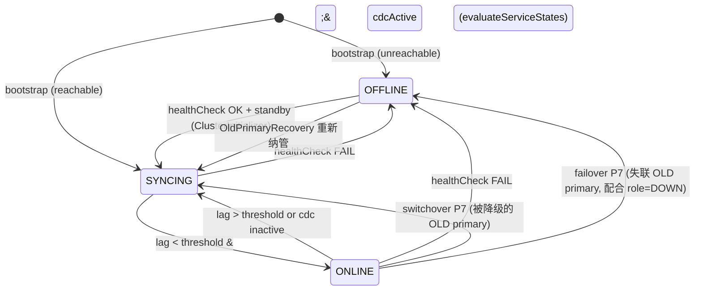
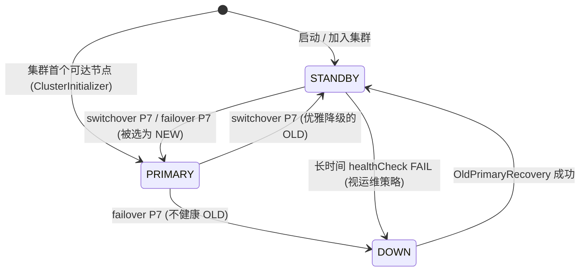
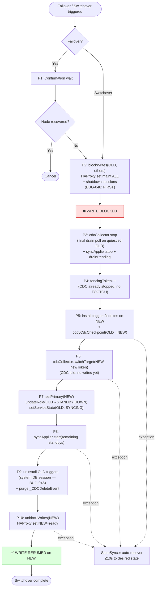

# HA Agent 模块详细设计

> 模块: ha-agent
> 运行方式: 集中式单进程，管理整个 Neo4j 集群（v2.0 架构）
> 前身: v1.x 的 ha-agent（Sidecar）+ failover-manager（独立进程）+ client-router（独立进程）
> 代码现状: failover-manager 与 client-router 的职责已并入 ha-agent，`src/` 目录仅保留 common / cdc-collector / sync-applier / ha-agent 四模块。

---

## 1. 职责

集群级唯一管理进程。通过远程 Bolt 连接管理所有 Neo4j 节点，统一负责：

- **数据同步协调** — 启停 CDC Collector / Sync Applier，管理 checkpoint
- **健康检查** — 定期探活所有 Neo4j 节点（L1-L4 多层检查）
- **Failover 编排** — 故障检测、Fencing Token 递增、角色切换
- **HAProxy 路由管理** — 通过 Runtime API（admin socket）动态切换主备路由
- **集群元数据** — 维护 node-registry、fencing-token、leader-lock
- **Admin API** — 暴露 HTTP 管理端点（手动 Failover、状态查询、Prometheus metrics）

## 2. 包结构

```
com.neo4j.ha.agent/
├── HaAgent.java                        # 主入口，JVM启动类
├── HaAgentConfig.java                  # 集群级配置（含所有节点信息）
├── lifecycle/
│   ├── AgentLifecycle.java             # 生命周期管理（启动/停止）
│   ├── ClusterStateManager.java        # 集群状态管理（各节点角色 + 健康）
│   └── GracefulShutdown.java           # 优雅关闭（保存 checkpoint + 释放资源）
├── health/
│   ├── HealthChecker.java              # 多层健康检查调度（所有节点）
│   ├── TcpHealthCheck.java             # L1: TCP端口探活
│   ├── BoltHealthCheck.java            # L2: Bolt协议握手
│   ├── CypherHealthCheck.java          # L3: Cypher查询
│   ├── WriteHealthCheck.java           # L4: 写入测试（仅主节点）
│   └── HealthState.java                # 健康状态机 HEALTHY→SUSPECT→UNHEALTHY→DOWN
├── failover/
│   ├── FailoverOrchestrator.java       # Failover 流程编排（进程内直接调用）
│   ├── FencingTokenManager.java        # Fencing Token 递增+验证
│   ├── StandbySelector.java            # 最佳备节点选择（按 checkpoint 新旧）
│   └── DrainWaiter.java                # 等待 Sync Applier PEL 排空
├── routing/
│   ├── HaProxyUpdater.java             # 遍历所有 HAProxy 实例发送路由切换命令
│   ├── HaProxyStateSyncer.java         # 定期同步路由状态到所有 HAProxy（防重启后不一致）
│   ├── HaProxyInstance.java            # 单个 HAProxy 实例的连接信息（id + socketPath）
│   └── HaProxySocketClient.java        # Unix domain socket 通信
├── registry/
│   ├── NodeRegistry.java               # 集群节点注册表管理（Redis Hash）
│   └── NodeInfo.java                   # 节点信息模型
├── backup/
│   ├── BackupCoordinator.java          # 备份流程协调（暂停同步 / 恢复同步 / 记录状态）
│   └── BackupState.java               # 备份状态模型（IDLE / PREPARING / IN_PROGRESS / COMPLETED）
├── http/
│   ├── AdminHttpServer.java            # 内嵌 HTTP 服务（Javalin/Undertow）
│   ├── ClusterStatusEndpoint.java      # /cluster/status（集群拓扑+状态）
│   ├── FailoverEndpoint.java           # /cluster/failover（手动触发）
│   ├── BackupEndpoint.java             # /cluster/backup/*（备份 prepare / complete / status）
│   ├── HealthEndpoint.java             # /health（Agent 自身存活）
│   └── MetricsEndpoint.java            # /metrics（Prometheus）
├── recovery/
│   ├── OldPrimaryRecovery.java         # 旧主恢复降级流程编排
│   ├── ApocTriggerUninstaller.java     # 卸载旧主上的 APOC Trigger
│   └── PostSwitchoverReconciler.java   # 切换后反向补齐旧主 afterAsync 搁浅写（BUG-080）
├── bootstrap/
│   ├── ClusterInitializer.java         # 启动时发现并连接所有节点
│   ├── ApocTriggerInstaller.java       # 主节点自动安装 APOC Trigger
│   └── IndexInstaller.java            # 动态创建 _elementId + _updated_at 索引
└── audit/
    ├── FailoverAuditLog.java           # Failover 审计日志
    └── FailoverHistory.java            # 历史记录（Redis）
```

## 3. 集群状态管理

v2.0 不再有角色状态机管理单个节点。ClusterStateManager 管理整个集群的视图：

```
ClusterStateManager:
  nodes:
    node-01: { role: PRIMARY, health: HEALTHY, serviceState: ONLINE, neo4j: bolt://neo4j-primary:7687 }
    node-02: { role: STANDBY, health: HEALTHY, serviceState: SYNCING, neo4j: bolt://neo4j-standby:7687 }

  CDC Collector → 远程连接 role=PRIMARY 的节点
  Sync Applier → 远程连接 role=STANDBY 的节点(s)
  HAProxy 读 backend → 只路由到 serviceState=ONLINE 的节点
```

### 3.1 节点服务状态（NodeServiceState）

节点的健康检查（HEALTHY/SUSPECT/UNHEALTHY/DOWN）判断的是"进程是否存活"。服务状态判断的是"数据是否就绪、能否对外提供服务"。只有两者同时满足才允许接收流量。

> **切换期间的状态迁移**（Failover / Switchover 触发的 role + serviceState 变化）见 [§6.9 Switchover / Failover 完整状态迁移](#69-switchover--failover-完整状态迁移强一致切换协议)。

```
  OFFLINE ──[Neo4j 启动 + HA Agent 连接成功]──► SYNCING
     ▲                                            │
     │                                    同步延迟 < syncLagThreshold
     │                                    且持续 stableDuration
     │                                            │
     │                                            ▼
     │         [全量同步触发]                    ONLINE
     │◄─────────────────────────────────────────  │
     │         [节点宕机]                          │
     └◄────────────────────────────────────────────┘
```

| 状态 | 含义 | HAProxy 读 backend | 可作为 Failover 目标 |
|------|------|-------------------|---------------------|
| OFFLINE | 节点不可达或未连接 | maint（不接收流量） | 否 |
| SYNCING | 数据同步中（全量/增量追赶） | maint（不接收流量） | 否 |
| ONLINE | 数据就绪，同步延迟在阈值内 | ready（接收读流量） | 是 |

**SYNCING → ONLINE 的判定条件：**

```java
boolean isReadyForService(String nodeId) {
    CdcCheckpoint cdcCp = checkpointManager.loadCdcCheckpoint(primaryNodeId);
    SyncCheckpoint syncCp = checkpointManager.loadSyncCheckpoint(nodeId);
    long syncLagMs = Math.max(0L, cdcCp.lastTs() - syncCp.lastEventTs());

    // 条件1: 主备 checkpoint 差值低于阈值（默认 2 秒）
    // 条件2: 持续稳定时间超过 stableDuration（默认 10 秒），避免追赶过程中偶然达标
    return syncLagMs < syncLagThreshold
        && stableTimer.elapsed(nodeId) > stableDuration;
}
```

> **注意：** lag 口径为主库 CDC checkpoint 与备库 Sync checkpoint 的时间戳差值，而非 `System.currentTimeMillis() - lastEventTs`。后者在低写入场景下会随墙钟线性增长，导致已追平的备节点误判为高 lag（参见 BUG-016）。

**配置项：**

```yaml
serviceState:
  syncLagThreshold: 2000    # 同步延迟低于 2s 视为就绪
  stableDuration: 10s       # 延迟持续稳定 10s 才切为 ONLINE
  checkInterval: 1s         # 检查间隔
```

**HAProxy 联动：** 当 serviceState 变化时，HA Agent 通过 admin socket 控制 HAProxy 读 backend：

```
SYNCING → ONLINE:
  "set server neo4j_all/neo4j-standby state ready"   → 加入读负载均衡

ONLINE → SYNCING (全量同步触发时):
  "set server neo4j_all/neo4j-standby state maint"   → 从读负载均衡摘除

ONLINE → OFFLINE (节点宕机):
  "set server neo4j_all/neo4j-standby state maint"   → 从读负载均衡摘除
```

**与 v1.x Sidecar 设计的区别：**

| 方面 | v1.x Sidecar | v2.0 集中式 |
|------|-------------|------------|
| 进程数 | N 个 HA Agent + 1 个 FM | 1 个 HA Agent |
| Neo4j 连接 | localhost | 远程 Bolt |
| 角色切换 | control stream 跨进程通信 | 进程内方法调用 |
| HAProxy 更新 | 健康端点被动感知 | Runtime API 主动推送 |
| 故障检测 | FM 远程探测 | HA Agent 远程探测（相同） |
| 服务就绪控制 | 无（TCP 可达即上线） | serviceState 精细控制 |

## 4. 启动流程

```
HaAgent.main()
  │
  ├── 1. ConfigLoader.load("ha-agent.yml")
  │     → 加载集群配置（nodes 列表、Redis、HAProxy socket 路径）
  │
  ├── 2. 初始化连接
  │     ├── 为每个 cluster.nodes 创建 Neo4j Driver（远程 Bolt）
  │     ├── 初始化 Redis Client（Sentinel 模式）
  │     └── 为每个 cluster.haproxy.instances 初始化 HaProxySocketClient
  │
  ├── 3. MetricsRegistry.init() (Prometheus)
  │
  ├── 4. ClusterInitializer.init()
  │     ├── 检查所有 Neo4j 节点连通性
  │     ├── 从 Redis node-registry 恢复集群状态（如有）← **权威来源**
  │     ├── 若 node-registry 缺失 → 回退 ha-agent.yml 配置的 role 字段 ← **危险回退**
  │     └── 确定当前 PRIMARY 节点

  ⚠️ 重要约束：node-registry 是 Agent "谁是主" 的权威记录。每次 switchover/failover 都会
  更新该 Hash（NodeRegistry.updateRole），但 ha-agent.yml 的 role 字段**不会**随之更新。
  因此当 Redis 丢数据（持久化失败、被清库）时，按配置回退会导致误选主、静默数据回滚。
  运维必须按架构文档 §12.5.4 / 运维手册 §9 的流程，在 Agent 启动前从 Neo4j 节点本身判定
  最后的 master 并同步更新 ha-agent.yml，方可重启 Agent。
  │
  ├── 5. 主节点初始化
  │     ├── ApocTriggerInstaller.ensureInstalled(primaryDriver, database)
  │     │     — 安装 3 个 APOC Trigger（通过 `system` 数据库会话执行，目标库为 `database` 参数）:
  │     │       ① cdc-timestamp (创建/更新时间戳 + _elementId，排除 `_CDCDeleteEvent` 标签)
  │     │       ② cdc-capture-node-deletes (节点删除捕获，排除 `_CDCDeleteEvent` 标签)
  │     │       ③ cdc-capture-rel-deletes (关系删除捕获)
  │     │     — 所有节点触发器必须排除 `_CDCDeleteEvent` 标签，防止清理中转节点时递归触发（BUG-001）
  │     │     — Neo4j 2026.x 启动初期若 `system` 短暂为 FOLLOWER，执行 10 次重试（每次 3s）
  │     │     — 若重试后仍失败，记录错误并降级继续启动（不阻塞 Agent 主流程）
  │     └── IndexInstaller.ensureIndexes(primaryDriver)
  │           — 为每个业务标签创建 _elementId + _updated_at 索引
  │           — 详见架构文档 §4.5 索引策略
  │
  ├── 6. 启动数据同步
  │     ├── CdcCollector.start(primaryDriver)    — 远程轮询主节点
  │     └── SyncApplier.start(standbyDrivers)    — 远程写入备节点
  │
  ├── 7. HealthChecker.start()                   — 定期探活所有节点
  │
  ├── 8. HaProxyStateSyncer.start()              — 定期同步路由状态到所有 HAProxy
  │
  ├── 9. NodeRegistry.register()                 — 上报集群状态到 Redis
  │
  └── 10. AdminHttpServer.start()                — 启动管理端点
```

## 5. 健康检查

**多层探活策略（对所有 Neo4j 节点远程执行）：**

| 层级 | 方法 | 检测内容 | 间隔 | 超时 |
|------|------|---------|------|------|
| L1 | TCP Connect | 端口 7687 可达 | 1s | 2s |
| L2 | Bolt Handshake | Bolt 协议握手成功 | 2s | 3s |
| L3 | Cypher Query | `RETURN 1` 执行成功 | 5s | 5s |
| L4 | Write Check | 主节点写测试 `CREATE (n:_HealthCheck) DELETE n` | 10s | 10s |

**健康状态机：**

```
                 ┌──────────────────────────────────────────┐
                 │                                          │
                 ▼                                          │
  ┌──────────┐  L1/L2失败×3   ┌──────────┐  L3失败×2   ┌────────┐
  │ HEALTHY  │───────────────▶│ SUSPECT  │────────────▶│UNHEALTHY│
  │          │◀───────────────│          │◀────────────│        │
  └──────────┘  任一层级恢复   └──────────┘  L1/L2恢复  └────┬───┘
       ▲                                                    │
       │                                             L4失败×2
       │        ┌──────────┐                                │
       └────────│  DOWN    │◀───────────────────────────────┘
         全量恢复│          │
                └──────────┘
```

| 状态 | 含义 | 触发动作 |
|------|------|---------|
| HEALTHY | 节点正常 | 无 |
| SUSPECT | 疑似故障 | 增加检查频率，记录日志 |
| UNHEALTHY | 确认故障 | 告警，准备 Failover |
| DOWN | 节点宕机 | 触发 Failover（如果是主节点） |

## 6. Failover 编排

> v2.0 所有步骤在同一进程内，直接方法调用，不再需要 control stream 通信。

```java
public class FailoverOrchestrator {

    private final HealthChecker healthChecker;
    private final FencingTokenManager fencingTokenManager;
    private final CdcCollector cdcCollector;
    private final SyncApplier syncApplier;
    private final StandbySelector standbySelector;
    private final ApocTriggerInstaller triggerInstaller;
    private final IndexInstaller indexInstaller;
    private final HaProxyUpdater haProxyUpdater;
    private final NodeRegistry nodeRegistry;
    private final FailoverAuditLog audit;

    void executeFailover(String failedNodeId) {
        FailoverContext ctx = new FailoverContext(failedNodeId);
        audit.start(ctx);

        try {
            // Phase 1: 确认 — 二次确认主节点确实不可用
            confirmationWait(ctx);
            if (healthChecker.isHealthy(failedNodeId)) {
                audit.cancel(ctx, "Node recovered during confirmation");
                return;
            }

            // Phase 2: Fence — 递增 Fencing Token
            long newToken = fencingTokenManager.increment();
            ctx.setFencingToken(newToken);

            // Phase 3: 停止数据同步（进程内直接调用）
            cdcCollector.stop();
            syncApplier.stop();
            syncApplier.drainPending();

            // Phase 4: 选择新主 — 选 checkpoint 最新的备节点
            String newPrimary = standbySelector.selectBest();
            ctx.setNewPrimary(newPrimary);

            // Phase 5: 切换 CDC 目标到新主
            Driver newPrimaryDriver = clusterState.getDriver(newPrimary);
            triggerInstaller.ensureInstalled(newPrimaryDriver, database);
            indexInstaller.ensureIndexes(newPrimaryDriver);
            cdcCollector.switchTarget(newPrimaryDriver);
            cdcCollector.start();

            // Phase 6: 更新所有 HAProxy 实例的路由（遍历 instances，个别失败由 StateSyncer 补偿）
            haProxyUpdater.switchPrimary(newPrimary);

            // Phase 7: 更新集群状态
            nodeRegistry.updateRole(newPrimary, NodeRole.PRIMARY);
            nodeRegistry.updateRole(failedNodeId, NodeRole.DOWN);
            clusterState.setPrimary(newPrimary);

            // Phase 8: 尝试清理旧主（best-effort，不阻塞 Failover 完成）
            tryCleanupOldPrimary(failedNodeId);

            audit.complete(ctx);
            metrics.recordFailover(ctx);

        } catch (Exception e) {
            audit.fail(ctx, e);
            alerting.critical("Failover failed", e);
        }
    }

    /**
     * Failover 完成后尝试清理旧主。
     * 旧主可能已宕机（不可达），此时记录待清理标记，
     * 等旧主恢复后由 OldPrimaryRecovery 统一处理。
     */
    private void tryCleanupOldPrimary(String failedNodeId) {
        try {
            Driver oldDriver = clusterState.getDriver(failedNodeId);
            // 旧主仍可达（如网络分区恢复、非崩溃故障）
            ApocTriggerUninstaller.uninstall(oldDriver);
            cleanupDeleteEvents(oldDriver);
            log.info("Old primary {} cleaned up immediately", failedNodeId);
        } catch (Exception e) {
            // 旧主不可达（最常见情况），标记待清理
            nodeRegistry.markPendingCleanup(failedNodeId, true);
            log.info("Old primary {} unreachable, marked for deferred cleanup", failedNodeId);
        }
    }

    private void cleanupDeleteEvents(Driver driver) {
        try (Session session = driver.session()) {
            session.run("MATCH (e:_CDCDeleteEvent) DETACH DELETE e");
        }
    }
}
```

**备节点选择策略：**

只有 `serviceState == ONLINE` 的备节点才能作为 Failover 目标。SYNCING 状态的节点数据不完整，提升为主节点会导致数据丢失。

```java
public class StandbySelector {

    String selectBest() {
        List<NodeInfo> standbys = nodeRegistry.getByRole(NodeRole.STANDBY);

        standbys = standbys.stream()
            .filter(n -> healthChecker.getState(n.getId()) == HEALTHY)
            .filter(n -> clusterState.getServiceState(n.getId()) == ONLINE)
            .toList();

        if (standbys.isEmpty()) {
            throw new NoHealthyStandbyException();
        }

        return standbys.stream()
            .sorted(Comparator.comparing(
                n -> checkpointManager.load(n.getId())
                    .map(Checkpoint::lastEventTs)
                    .orElse(0L),
                Comparator.reverseOrder()
            ))
            .findFirst()
            .map(NodeInfo::getId)
            .orElseThrow();
    }
}
```

### 6.9 Switchover / Failover 完整状态迁移（强一致切换协议）

> 本节是 **Failover / Switchover 的权威规范**。BUG-044 之后（2026-04-17），所有实现必须遵循此时序与状态迁移；以此之前的版本（BUG-042 / BUG-043）为过渡形态，不再适用。

#### 6.9.1 设计目标与不变量

| 目标 | 说明 |
|------|------|
| 零静默数据丢失 | 任何 client 写入要么显式失败（给 client 错误码），要么成功并被 CDC 捕获同步到所有 standby |
| 切换期 Read 可用 | 读后端持续可用（ONLINE standby 继续服务），**只**阻断写 |
| 客户端行为可预测 | 切换期间所有写请求收到 `ServiceUnavailable`/`SessionExpired`，Neo4j driver managed tx 自动重试 |
| 操作幂等 / 可恢复 | 任何阶段失败，`HaProxyStateSyncer`（10s 周期）在最坏 10s 内收敛到 `clusterState` 声明的期望状态 |

**核心不变量（Write-Block Invariant）：**

> 从写阻断开始（Phase 3）到写放开（Phase 10），**HAProxy `neo4j_primary` 后端不存在任何处于 `READY` 状态的 server**。因此切换窗口内**不可能**有任何 client 写入在 Neo4j 上成功。

推论：所有成功落盘的写必然发生在 Phase 10 之后 → CDC 已在 NEW 上运行 + NEW 的 APOC Trigger 已安装 → **每条成功写入必然被捕获并同步**。

#### 6.9.2 Phase 时序（10 个阶段）

| Phase | 动作 | 失败后果 |
|-------|------|---------|
| 1 | **Confirmation wait**（仅 Failover；Switchover 跳过）：等待 `confirmationWaitMs`，若节点恢复则取消整个流程 | 安全退出，不进入切换 |
| 2 | **`blockWrites(OLD, 所有其它 server)`**（BUG-048 确定为第一步）：对 `neo4j_primary` 后端的**每一个** server 发送 `set server maint` + `shutdown sessions server`；**此刻起 client 在 OLD 上的新 commit 不可能发生**，已在执行的 tx 要么完成提交、要么回滚 | StateSyncer 10s 内恢复为 `clusterState` 声明（仍是 OLD 为 primary）→ 写恢复 |
| 3 | **Stop data sync (BUG-047/048)**：`cdcCollector.stop()` 在 quiesced OLD 上执行**最终排空 poll**（可循环至无新变更，上限 10 轮），保证 Phase 2 之前所有 commit 都进入 Stream；然后 `syncApplier.stop()` + `drainPending()` | 无副作用，直接返回 |
| 4 | **Fencing token ++**：Redis `INCR fencing-token`。此时 CDC 已停，不会再触发 TOCTOU | 终止切换，状态未变 |
| 5 | **Prepare NEW primary**：`triggerInstaller.ensureInstalled(NEW)` + `indexInstaller.ensureIndexes(NEW)` + `checkpointManager.copyCdcCheckpoint(OLD→NEW)` | Trigger/Index 安装失败则抛异常；finally 兜底由 StateSyncer 恢复 OLD |
| 6 | **`cdcCollector.switchTarget(NEW, newToken)`**：CDC 指向 NEW 开始轮询；此时 NEW 上没有 client 写入，CDC 空转 | 同上 |
| 7 | **Update cluster state & registry**：`setPrimary(NEW)`，`updateRole(NEW, PRIMARY)`，`updateRole(OLD, STANDBY or DOWN)`，`setServiceState(OLD, SYNCING)` | 关键分水岭：过此点之后 StateSyncer 恢复目标变为 NEW |
| 8 | **`syncApplier.start(remaining standbys)`**：对剩余 STANDBY 节点重建 consumer group 消费 | 失败则该 standby 进 SYNCING，稍后 PendingRecovery 补救 |
| 9 | **Uninstall OLD triggers + `MATCH (e:_CDCDeleteEvent) DETACH DELETE`**：防止 OLD 后续作为 standby 接收反向同步时产生多余 `_CDCDeleteEvent`；`ApocTriggerUninstaller` 必须用 `system` database session（BUG-046）| 失败标记 `pendingCleanup=true`，下次恢复重试 |
| 10 | **`unblockWrites(NEW)`**：对 `neo4j_primary/NEW` 发 `set server ready`；**这是切换的原子瞬间**，写从此刻起恢复 | 失败 → 全集群写不可用；StateSyncer 10s 内发现 `clusterState.primary=NEW` 但 HAProxy 没 ready，发送补救命令恢复 |

#### 6.9.3 各组件状态迁移表

**场景：3 节点集群，`node-01` (PRIMARY) → `node-02` (PRIMARY)**

| Phase | node-01 role/service | node-02 role/service | node-03 role/service | HAProxy write backend | HAProxy read backend | CDC target | Client 写 |
|-------|--------|--------|--------|------|------|--------|---------|
| 切换前 | PRIMARY / ONLINE | STANDBY / ONLINE | STANDBY / ONLINE | `node-01=READY` 其它 MAINT | 所有 ONLINE standby | node-01 | ✅ 成功 |
| P1-P2 | PRIMARY / ONLINE | STANDBY / ONLINE | STANDBY / ONLINE | 同上 | 同上 | node-01 | ✅ 成功 |
| P3 | PRIMARY / ONLINE | STANDBY / ONLINE | STANDBY / ONLINE | **全部 MAINT + kill sessions** | 不变 | node-01 (stopping) | ❌ `ServiceUnavailable` |
| P4 | PRIMARY / ONLINE | STANDBY / ONLINE | STANDBY / ONLINE | 全部 MAINT | 不变 | stopped | ❌ 同上 |
| P5 | PRIMARY / ONLINE | STANDBY / ONLINE *(triggers installing)* | STANDBY / ONLINE | 全部 MAINT | 不变 | stopped | ❌ 同上 |
| P6 | PRIMARY / ONLINE | STANDBY / ONLINE | STANDBY / ONLINE | 全部 MAINT | 不变 | **node-02** (idle) | ❌ 同上 |
| P7 | **STANDBY / SYNCING** | **PRIMARY / ONLINE** | STANDBY / ONLINE | 全部 MAINT | node-02 暂时移出 read（它现在是 primary）| node-02 | ❌ 同上 |
| P8 | STANDBY / SYNCING | PRIMARY / ONLINE | STANDBY / ONLINE | 全部 MAINT | node-01, node-03 | node-02 | ❌ 同上 |
| P9 | STANDBY / SYNCING *(triggers uninstalled)* | PRIMARY / ONLINE | STANDBY / ONLINE | 全部 MAINT | node-01, node-03 | node-02 | ❌ 同上 |
| **P10** | STANDBY / SYNCING | PRIMARY / ONLINE | STANDBY / ONLINE | **`node-02=READY`** 其它 MAINT | node-01, node-03 | node-02 | ✅ 恢复 |
| 后续 | STANDBY / SYNCING → ONLINE | PRIMARY / ONLINE | STANDBY / ONLINE | 稳态 | 稳态 | node-02 | ✅ |

**Failover（OLD 不健康）与 Switchover 的唯一差异：**

- Failover 中 OLD 的迁移路径：`PRIMARY/ONLINE` → `DOWN/OFFLINE`（Phase 7 设置 `updateRole(OLD, DOWN)`），不进入 `STANDBY/SYNCING`
- OLD 恢复后由 `OldPrimaryRecovery` 负责从 `DOWN/OFFLINE` → `STANDBY/SYNCING` → `STANDBY/ONLINE`
- Switchover 中 OLD 直接进入 `STANDBY/SYNCING`，后续 `evaluateServiceStates()` 根据 sync 追平情况提升为 `ONLINE`

#### 6.9.4 节点服务状态机（含切换路径）



#### 6.9.5 节点角色状态机（含切换路径）



#### 6.9.6 切换时序流程图



#### 6.9.7 客户端合同

| 客户端类型 | 切换期间行为 | 要求 |
|-----------|------------|------|
| Neo4j driver **managed transaction** (`session.executeWrite(tx -> ...)`) | 自动捕获 `ServiceUnavailable` / `SessionExpired` 并重试，默认 30s 内 | ✅ 开箱即用，业务无感 |
| Neo4j driver **非托管** (`session.run` / 手动 tx) | 拿到显式 Exception | ⚠️ 应用层必须自行重试或接受失败 |
| HTTP / 其它协议代理 | 如果经 HAProxy，TCP 连接被 RST | 需检查重试策略 |

**业务 SLA：**
- Write 侧 p99 延迟在切换期间会有一个 1-2s 的尖峰（driver 重试导致）
- Read 侧完全不受影响
- 没有"静默丢数据"场景 —— **写成功 = CDC 必然捕获**

#### 6.9.8 异常恢复路径

| 失败位置 | 恢复机制 | 最坏 RTO |
|---------|---------|---------|
| P3-P9 抛异常 | `clusterState` 未 setPrimary → StateSyncer 恢复 OLD 为 ready | 10s |
| P10 失败 | `clusterState.primary=NEW` 但 HAProxy 未 ready → StateSyncer 补发 `set ready NEW` | 10s |
| Agent 在 P3-P7 之间崩溃 | 重启后读 Redis 中的 `node-registry` primary，StateSyncer 对齐 | 启动时间 + 10s |
| Agent 在 P7 之后崩溃 | 重启后 primary=NEW，StateSyncer 继续 | 启动时间 + 10s |

**关键约束：** P7（`setPrimary(NEW)`）是**不可回退的分水岭**。之前崩溃视为"切换失败，回滚 OLD"；之后崩溃视为"切换成功，继续 NEW"。中间没有"不确定"状态 —— 这由 `ClusterStateManager.setPrimary` 作为单次原子写入 Redis + 本地内存保证。

---

## 7. HAProxy 路由管理（多实例）

> **v2.1 变更：** 从管理单个 HAProxy 改为管理多个 HAProxy 实例。Failover 时遍历所有实例发送命令，并通过定期状态同步保证一致性。

### 7.1 HaProxyUpdater — Failover 时的路由切换

```java
public class HaProxyUpdater {

    private final List<HaProxyInstance> instances;
    private final HaProxySocketClient socketClient;

    void switchPrimary(String newPrimaryServerId) {
        for (HaProxyInstance instance : instances) {
            try {
                socketClient.sendCommand(instance.socketPath(),
                    "set server neo4j_primary/%s state drain", oldPrimary);
                socketClient.sendCommand(instance.socketPath(),
                    "set server neo4j_primary/%s state ready", newPrimaryServerId);
                socketClient.sendCommand(instance.socketPath(),
                    "set server neo4j_primary/%s state maint", oldPrimary);
                log.info("HAProxy {} updated successfully", instance.id());
            } catch (IOException e) {
                // 个别实例失败不阻塞，由 StateSyncer 后续补偿
                log.warn("Failed to update HAProxy {}, will retry via StateSyncer",
                         instance.id(), e);
                metrics.haproxyReachable(instance.id(), false);
            }
        }
    }
}
```

### 7.2 HaProxyStateSyncer — 定期状态同步

解决两个问题：
1. Failover 时某个 HAProxy 实例不可达，未收到切换命令
2. HAProxy 实例重启后从初始配置启动，路由状态回退到旧状态

```java
public class HaProxyStateSyncer implements Runnable {

    private final List<HaProxyInstance> instances;
    private final ClusterStateManager clusterState;
    private final HaProxySocketClient socketClient;
    // stateSyncInterval 默认 10s，由配置 cluster.haproxy.stateSyncInterval 控制

    @Override
    public void run() {
        String expectedPrimary = clusterState.getPrimaryServerId();

        for (HaProxyInstance instance : instances) {
            try {
                // 查询该 HAProxy 实例当前的 server state
                String state = socketClient.sendCommand(instance.socketPath(),
                    "show servers state neo4j_primary");

                if (!isConsistent(state, expectedPrimary)) {
                    // 路由状态与集群实际角色不一致，修正
                    applyExpectedState(instance, expectedPrimary);
                    log.info("Fixed HAProxy {} routing state", instance.id());
                    metrics.stateSyncFix(instance.id());
                }

                metrics.haproxyReachable(instance.id(), true);
            } catch (IOException e) {
                log.warn("HAProxy {} unreachable for state sync", instance.id());
                metrics.haproxyReachable(instance.id(), false);
            }
        }
    }
}
```

## 8. 节点注册表

```
Redis Hash: neo4j:ha:node-registry

Fields:
  node-01 → {"role":"PRIMARY","boltUri":"bolt://neo4j-primary:7687","health":"HEALTHY","serviceState":"ONLINE","lastCheck":1712736000000}
  node-02 → {"role":"STANDBY","boltUri":"bolt://neo4j-standby:7687","health":"HEALTHY","serviceState":"SYNCING","syncLagMs":15000,"lastCheck":1712736000500}
```

HA Agent 定期更新各节点的 health、serviceState、syncLagMs 和 lastCheck 信息。`serviceState` 决定该节点是否接受客户端读流量。

## 9. Admin API

| 端点 | 方法 | 说明 | 认证 |
|------|------|------|------|
| `/health` | GET | HA Agent 自身存活 | 无 |
| `/cluster/status` | GET | 集群所有节点状态、角色、同步延迟 | 无 |
| `/cluster/nodes/{id}` | GET | 单节点详细状态 | 无 |
| `/cluster/failover` | POST | 手动触发 Failover | Admin Token |
| `/cluster/switchover` | POST | 计划内主备切换（先 drain 再切） | Admin Token |
| `/cluster/fullsync` | POST | 手动触发全量同步 | Admin Token |
| `/cluster/backup/prepare` | POST | 暂停 Sync Applier 准备备份，记录 checkpoint | Admin Token |
| `/cluster/backup/complete` | POST | 备份完成，恢复 Sync Applier 正常同步 | Admin Token |
| `/cluster/backup/status` | GET | 查询备份状态和上次备份时间 | 无 |
| `/metrics` | GET | Prometheus 指标 | 无 |

**集群状态响应示例：**

```json
{
  "agentId": "ha-agent-01",
  "uptime": "3d 12h 30m",
  "fencingToken": 42,
  "nodes": [
    {
      "id": "node-01",
      "role": "PRIMARY",
      "health": "HEALTHY",
      "serviceState": "ONLINE",
      "boltUri": "bolt://neo4j-primary:7687",
      "sync": {
        "mode": "CDC_PUBLISHING",
        "lastPublishedTs": 1712736000000,
        "streamLength": 45230
      }
    },
    {
      "id": "node-02",
      "role": "STANDBY",
      "health": "HEALTHY",
      "serviceState": "SYNCING",
      "boltUri": "bolt://neo4j-standby:7687",
      "sync": {
        "mode": "CATCHING_UP",
        "lastConsumedTs": 1712735999800,
        "lagMs": 15000
      }
    }
  ]
}
```

## 10. 优雅关闭

```
GracefulShutdown (JVM ShutdownHook):
  1. 标记 running = false
  2. 停止 HealthChecker（停止探活循环）
  3. 等待 CDC Collector / Sync Applier 完成当前批次（最多等待 30s）
  4. 保存所有 Checkpoint
  5. 停止 AdminHttpServer
  6. 关闭所有 Neo4j Driver + Redis Client
  7. 更新 node-registry 标记 Agent 离线
```

**HA Agent 不可用期间的影响：**

- 主节点读写不受影响（APOC Trigger 仍在 Neo4j 内运行，变更自动写入系统属性）
- 数据同步暂停（CDC Collector 和 Sync Applier 随 Agent 停止）
- Agent 恢复后从 Redis checkpoint 自动追赶缺失数据

## 11. 防误切机制

| 机制 | 说明 |
|------|------|
| 二次确认 | 检测到 DOWN 后等待 confirmationWait (5s) 再次检查 |
| 最小 Failover 间隔 | 两次 Failover 之间至少间隔 minFailoverInterval (60s) |
| 最大自动切换次数 | 1小时内最多自动切换 maxAutoFailovers (3次)，超出需人工介入 |
| Fencing Token 单调递增 | 防止旧主复活后脑裂 |
| 多层探活 | L1-L4 由浅入深，避免单一检查方式的误判 |

## 12. 旧主恢复与降级

Failover 完成后，旧主可能经历数秒到数小时的宕机再恢复。恢复后必须降级为 Standby 并完成数据清理，才能安全加入备节点池。

### 12.1 恢复检测

HealthChecker 持续探活所有已知节点（包括 DOWN 状态的节点）。当旧主恢复时：

```
HealthChecker 探测旧主 L1(TCP) → L2(Bolt) → L3(Cypher) 均通过
  → 触发 OldPrimaryRecovery.execute(failedNodeId)
```

### 12.2 恢复降级流程

```java
public class OldPrimaryRecovery {

    private final ApocTriggerUninstaller triggerUninstaller;
    private final ClusterStateManager clusterState;
    private final SyncApplier syncApplier;
    private final CheckpointManager checkpointManager;
    private final NodeRegistry nodeRegistry;
    private final HaProxyUpdater haProxyUpdater;
    private final IndexInstaller indexInstaller;
    private final FailoverAuditLog audit;

    /**
     * 旧主恢复后的完整降级流程。
     * 前置条件：旧主 L1-L3 健康检查通过，且 node-registry 中该节点为 DOWN 状态。
     */
    void execute(String oldPrimaryId) {
        audit.logRecoveryStart(oldPrimaryId);
        Driver oldDriver = clusterState.getDriver(oldPrimaryId);

        try {
            // Step 1: 卸载 APOC Trigger — 防止备节点继续产生 _CDCDeleteEvent
            triggerUninstaller.uninstall(oldDriver);
            log.info("Step 1: APOC Triggers uninstalled from {}", oldPrimaryId);

            // Step 2: 清理残留的 _CDCDeleteEvent 中转节点
            cleanupResidualDeleteEvents(oldDriver);
            log.info("Step 2: Residual _CDCDeleteEvent cleaned from {}", oldPrimaryId);

            // Step 3: 更新角色为 STANDBY
            nodeRegistry.updateRole(oldPrimaryId, NodeRole.STANDBY);
            clusterState.setServiceState(oldPrimaryId, NodeServiceState.SYNCING);
            log.info("Step 3: {} role set to STANDBY/SYNCING", oldPrimaryId);

            // Step 4: 确保备节点索引就绪（_elementId 索引用于 MERGE）
            indexInstaller.ensureIndexes(oldDriver, NodeRole.STANDBY);
            log.info("Step 4: Standby indexes ensured on {}", oldPrimaryId);

            // Step 5: 评估数据差距，决定增量/全量同步
            SyncDecision decision = evaluateSyncStrategy(oldPrimaryId);
            log.info("Step 5: Sync strategy for {} = {}", oldPrimaryId, decision);

            // Step 6: 启动 Sync Applier 对旧主进行数据同步
            if (decision == SyncDecision.FULL_SYNC) {
                syncApplier.triggerFullSync(oldPrimaryId);
            } else {
                syncApplier.addTarget(oldDriver, oldPrimaryId);
            }

            // Step 7: 等待 SYNCING → ONLINE（由 ClusterStateManager 定期检查 syncLag）
            // 非阻塞：状态变更时 ClusterStateManager 自动通知 HAProxy
            log.info("Step 6-7: Sync started for {}, waiting for ONLINE", oldPrimaryId);

            // Step 8: 清除待清理标记
            nodeRegistry.markPendingCleanup(oldPrimaryId, false);

            audit.logRecoveryComplete(oldPrimaryId, decision);

        } catch (Exception e) {
            log.error("Old primary recovery failed for {}", oldPrimaryId, e);
            audit.logRecoveryFailed(oldPrimaryId, e);
            alerting.warn("Old primary recovery failed, manual intervention may be needed", e);
        }
    }

    /**
     * 清理 Failover 期间和宕机期间积累的 _CDCDeleteEvent 中转节点。
     * 这些中转节点来源于：
     * 1. Failover 时 CDC Collector 已停止但 Trigger 仍在运行产生的中转节点
     * 2. 旧主宕机前最后几笔删除操作产生但未被 CDC 消费的中转节点
     * 清理是安全的：这些事件对应的删除操作已在旧主执行，而旧主现在要做全量/增量
     * 同步覆盖数据，这些中转节点的信息已不再需要。
     */
    private void cleanupResidualDeleteEvents(Driver driver) {
        try (Session session = driver.session()) {
            long count = session.run(
                "MATCH (e:_CDCDeleteEvent) WITH e LIMIT 10000 DETACH DELETE e RETURN count(*) AS c"
            ).single().get("c").asLong();
            if (count > 0) {
                log.info("Cleaned {} residual _CDCDeleteEvent nodes", count);
                metrics.oldPrimaryCleanupEvents(count);
            }
        }
    }

    /**
     * 评估旧主数据与当前主节点的差距，决定增量或全量同步。
     * - 如果旧主有有效的 checkpoint 且 Stream 中仍有对应消息 → 增量
     * - 如果 checkpoint 已过期（消息被 TRIM）或无 checkpoint → 全量
     */
    private SyncDecision evaluateSyncStrategy(String nodeId) {
        Optional<SyncCheckpoint> cp = checkpointManager.loadSyncCheckpoint(nodeId);
        if (cp.isEmpty()) return SyncDecision.FULL_SYNC;

        boolean valid = checkpointManager.isCheckpointValid(
            "neo4j:cdc:neo4j:changes", cp.get().lastStreamId());
        return valid ? SyncDecision.INCREMENTAL : SyncDecision.FULL_SYNC;
    }

    enum SyncDecision { INCREMENTAL, FULL_SYNC }
}
```

### 12.3 ApocTriggerUninstaller

```java
public class ApocTriggerUninstaller {

    private static final List<String> TRIGGER_NAMES = List.of(
        "cdc-timestamp",
        "cdc-capture-node-deletes",
        "cdc-capture-rel-deletes"
    );

    /**
     * 卸载指定节点上的所有 CDC APOC Trigger。
     * 使用 apoc.trigger.drop()，如果 Trigger 不存在则忽略（幂等）。
     */
    static void uninstall(Driver driver) {
        try (Session session = driver.session()) {
            for (String name : TRIGGER_NAMES) {
                try {
                    session.run(
                        "CALL apoc.trigger.drop($db, $name)",
                        Map.of("db", "neo4j", "name", name)
                    );
                } catch (Exception e) {
                    // Trigger 不存在时 drop 可能抛异常，忽略
                    log.debug("Trigger {} not found or already removed: {}", name, e.getMessage());
                }
            }
        }
    }
}
```

### 12.4 恢复降级流程图

```
HealthChecker 探测到旧主恢复 (L1→L2→L3 通过)
  │
  ├── Step 1: 卸载 APOC Trigger (3个)
  │     CALL apoc.trigger.drop('neo4j', 'cdc-timestamp')
  │     CALL apoc.trigger.drop('neo4j', 'cdc-capture-node-deletes')
  │     CALL apoc.trigger.drop('neo4j', 'cdc-capture-rel-deletes')
  │
  ├── Step 2: 清理残留 _CDCDeleteEvent 中转节点
  │     MATCH (e:_CDCDeleteEvent) ... DETACH DELETE e
  │
  ├── Step 3: 更新角色 → STANDBY, 服务状态 → SYNCING
  │     HAProxy 读 backend 设为 maint（不接收流量）
  │
  ├── Step 4: 确保备节点索引就绪
  │     CREATE RANGE INDEX IF NOT EXISTS ... ON (n._elementId)
  │
  ├── Step 5: 评估数据差距
  │     ├── checkpoint 有效且 Stream 中仍有 → 增量同步
  │     └── checkpoint 过期或不存在 → 全量同步
  │
  ├── Step 6: 启动 Sync Applier 对旧主同步
  │
  ├── Step 7: 等待 syncLag < 阈值 → SYNCING → ONLINE
  │     HAProxy 读 backend 设为 ready（接收读流量）
  │
  └── Step 8: 清除 pendingCleanup 标记，记录审计日志
```

### 12.5 边界场景处理

| 场景 | 处理 |
|------|------|
| 旧主恢复时 Trigger 已不存在 | `apoc.trigger.drop` 幂等，忽略异常 |
| 旧主恢复时无残留 `_CDCDeleteEvent` | 清理语句返回 count=0，正常继续 |
| 旧主恢复但数据库已损坏 | L3 Cypher 检查失败，不触发恢复流程，告警运维 |
| 恢复流程执行中旧主再次宕机 | catch 异常，标记恢复失败，等待下次恢复重试 |
| 恢复流程执行中新主也故障 | Failover 优先级高于恢复流程，恢复流程被中断 |
| 多次 Failover 后多个旧主同时恢复 | 逐一执行恢复流程（顺序不敏感，各自独立） |

### 12.6 恢复 Metrics

| 指标 | 说明 |
|------|------|
| `neo4j_ha_old_primary_recovery_total` | 旧主恢复总次数 |
| `neo4j_ha_old_primary_recovery_duration_ms` | 恢复流程耗时 |
| `neo4j_ha_old_primary_cleanup_events` | 清理的残留 `_CDCDeleteEvent` 数量 |
| `neo4j_ha_old_primary_sync_strategy` | 恢复时选择的同步策略 (incremental/fullsync) |

---

## 13. 备份协调

HA Agent 提供备份协调能力，利用备节点做离线一致性备份，全程不影响主节点业务。

### 13.1 备份状态机

```
                 POST /backup/prepare
  IDLE ────────────────────────────────── PREPARING
   ▲                                          │
   │                                          │ Sync Applier 暂停成功
   │                                          ▼
   │        POST /backup/complete        IN_PROGRESS
   └──────────────────────────────────────────┘
```

### 13.2 BackupCoordinator

```java
class BackupCoordinator {
    private volatile BackupState state = BackupState.IDLE;
    private Instant lastBackupTime;
    private String lastCheckpoint;

    /**
     * 暂停 Sync Applier，让备节点数据静止，等待外部拷贝数据。
     * 如果备节点健康状态为 DOWN，拒绝备份请求。
     */
    public BackupPrepareResult prepare() {
        if (state != BackupState.IDLE) {
            throw new IllegalStateException("Backup already in progress");
        }
        state = BackupState.PREPARING;

        syncApplier.pause();
        lastCheckpoint = checkpointManager.getCurrentCheckpoint();
        state = BackupState.IN_PROGRESS;

        return new BackupPrepareResult(lastCheckpoint, Instant.now());
    }

    /**
     * 外部备份完成后调用，恢复 Sync Applier 从暂停处继续追赶。
     */
    public void complete() {
        if (state != BackupState.IN_PROGRESS) {
            throw new IllegalStateException("No backup in progress");
        }
        syncApplier.resume();
        lastBackupTime = Instant.now();
        state = BackupState.IDLE;

        metrics.backupCompleted(lastBackupTime);
    }

    /**
     * 安全阀：如果超过 maxBackupDuration（默认 2h）仍未 complete，
     * 自动恢复 Sync Applier 防止备节点长时间落后。
     */
    @Scheduled(fixedDelay = 60_000)
    void backupTimeout() {
        if (state == BackupState.IN_PROGRESS
            && Duration.between(prepareTime, Instant.now()).toHours() >= 2) {
            log.warn("Backup timeout, auto-resuming Sync Applier");
            complete();
        }
    }
}
```

### 13.3 备份期间 Failover 处理

- 备份期间如果主节点故障需要 Failover，HA Agent 将**自动取消备份**（恢复 Sync Applier），优先保证数据服务可用性
- Failover 完成后备份状态重置为 `IDLE`
- 运维需重新发起备份

### 13.4 备份 Metrics

| 指标 | 说明 |
|------|------|
| `neo4j_ha_backup_state` | 当前备份状态 (0=IDLE, 1=PREPARING, 2=IN_PROGRESS) |
| `neo4j_ha_backup_last_success_timestamp` | 上次成功备份时间戳 |
| `neo4j_ha_backup_duration_ms` | 上次备份持续时间 |

## 14. HA Agent 自身可用性

HA Agent 作为集群唯一管理进程，自身是单点。缓解措施：

| 措施 | 说明 |
|------|------|
| Docker restart: always | 崩溃后自动重启（通常数秒内恢复） |
| 启动时自动恢复 | 从 Redis checkpoint 恢复同步位点，从 node-registry 恢复集群状态 |
| Prometheus 监控 | 暴露 `neo4j_ha_agent_up` 指标 + AlertManager 告警 |
| 不影响数据服务 | Agent 下线期间主节点读写不受影响，仅同步暂停 |

---

## 15. 已知问题修复追踪

> 本节记录运行期间发现并修复的关键 BUG，便于未来回溯。

### BUG-001: APOC 删除触发器递归死循环（2026-04-15 修复）

**现象：** smoke test 清理 HAProbe 节点后，`_CDCDeleteEvent` 中转节点持续增长，CDC poll loop 越来越慢，最终 Neo4j 报 `TransientException: dbms.memory.transaction.total.max threshold reached` OOM。

**根因：** `cdc-capture-node-deletes` 触发器对 **所有** 节点删除生效，包括 `_CDCDeleteEvent` 中转节点自身。当 `cleanupDeleteEvents()` 删除中转节点时，触发器又为这些删除创建新的中转节点，形成无限递归：

```
删除 _CDCDeleteEvent → 触发器创建新 _CDCDeleteEvent → CDC 捕获 → 发布 → 清理 → 又触发 → ...
```

**修复：**
- `cdc-capture-node-deletes` 触发器添加 `WHERE NOT "_CDCDeleteEvent" IN apoc.node.labels(node)` 过滤
- `cdc-timestamp` 触发器排除 `_CDCDeleteEvent` 标签节点（避免设置 `_updated_at` 导致增量轮询误捕获）

**涉及文件：** `ApocTriggerInstaller.java`

**部署注意：** 修复后需重启 ha-agent 以重新安装触发器。如有积累的中转节点需手动清理：
```cypher
MATCH (e:_CDCDeleteEvent) WITH e LIMIT 10000 DETACH DELETE e RETURN count(*) AS deleted
```

### BUG-002: SyncApplier IndexManager 会话冲突（2026-04-15 修复）

**现象：** 每次应用删除事件时，日志持续输出 `WARN IndexManager -- Failed to create index for label _CDCDeleteEvent: Queries cannot be run directly on a session with an open transaction`。

**根因：** `ChangeApplier.applyEvent()` 在 `session.executeWrite(tx -> {...})` 回调内部调用 `indexManager.ensureIndex(session, label)`。此时 session 已有未提交的事务，Neo4j 不允许在同一 session 上同时执行 DDL（`CREATE INDEX`）语句。

**修复：** 将 `ensureIndex` / `ensureRelIndex` 调用提取到 `ensureIndexesForBatch()` 方法中，在 `session.executeWrite()` **之前**执行，确保索引创建在独立的自动提交上下文中完成。

**涉及文件：** `ChangeApplier.java`

### BUG-003: CDC Collector Fencing Token 未同步（2026-04-15 修复）

**现象：** Switchover 完成后 CDC Collector 立即报错 `Fencing token 0 was rejected (stale)`，SyncApplier 丢弃所有新事件。

**根因：** `CdcCollector.start()` 和 `switchTarget()` 方法未将新的 fencing token 传递给 `StreamPublishService`，导致发布服务仍使用旧 token (0) 发布事件。

**修复：** 在 `CdcCollector.start()` 中调用 `publishService.setFencingToken(fencingToken)`；在 `switchTarget()` 中立即更新 `this.fencingToken` 和 `publishService.setFencingToken(newFencingToken)`。

**涉及文件：** `CdcCollector.java`

### BUG-004: SyncApplier 重启后残留旧 standby 目标（2026-04-15 修复）

**现象：** Switchover 后 smoke test 的 post-switchover 复制探测持续失败（6 次重试均超时）。Agent 日志显示 `Sync Applier started with 2 standby targets`（应为 1），且 `FencingTokenFilter` 丢弃了 node-01 消费组的旧 token 事件。

**根因：** `SyncApplier.start()` 使用 `this.standbyDrivers.putAll(drivers)` 添加新目标，但**从未清理旧条目**。Switchover 后 `stop()` 不清空 `standbyDrivers`，`start()` 将新 standby（node-01）追加到 map 中，旧 standby（node-02，现已升为 primary）仍然保留。导致：
1. CDC 事件被 node-02 消费组 "偷走" 并写回源节点（无效操作）
2. node-01 消费组的 stream 游标指向旧事件（token=0），被 FencingTokenFilter 丢弃
3. 新探测节点的变更事件未被复制到 node-01

**修复：** 在 `SyncApplier.start()` 开头增加 `this.standbyDrivers.clear()`，确保每次启动时只包含传入的 standby 目标集合。

**涉及文件：** `SyncApplier.java`

### BUG-005: Agent 重启后 FencingTokenFilter 被旧 Stream 事件污染（2026-04-15 修复）

**现象：** Agent 重启后首次 smoke test 运行正常，但 SyncApplier 日志出现 `Discarding event ... with stale fencing token 0`，复制探测写入数据未同步到 standby。

**根因：** `FencingTokenValidator.isValid()` 在验证事件时会自动将 `knownMaxToken` 提升到所见过的最大 token（auto-bump）。Agent 重启后：
1. 从 Redis 读取当前 fencing token = 0（Redis 数据可能已清理）
2. CDC 以 token=0 发布新事件
3. SyncApplier 消费 Redis Stream 时先读到上一轮 switchover 残留的旧事件（token=1）
4. `isValid(1)` 通过验证并将 `knownMaxToken` 自动提升到 1
5. 后续新事件（token=0）因 0 < 1 被拒绝

**修复（两部分）：**
1. **移除 auto-bump**：`FencingTokenValidator.isValid()` 改为纯比较 `return token >= knownMaxToken.get()`，不再从事件中自动学习更高的 token
2. **显式初始化 token**：`SyncApplier.start()` 新增 `currentFencingToken` 参数，启动时调用 `fencingFilter.updateToken(currentFencingToken)` 用 Redis 中的当前 token 初始化验证器。`HaAgent` 启动和 `FailoverOrchestrator` 切换时均传入正确的 token 值

**涉及文件：** `FencingTokenValidator.java`、`SyncApplier.java`、`HaAgent.java`、`FailoverOrchestrator.java`

### BUG-006: ha-agent 缺少 maven-dependency-plugin 导致 NoClassDefFoundError（2026-04-15 修复）

**现象：** Agent 容器启动失败，报 `NoClassDefFoundError: io/micrometer/core/instrument/MeterRegistry`。

**根因：** Docker Compose 通过 `-cp "/app/ha-agent.jar:/app/lib/*"` 加载依赖，`/app/lib` 挂载自 `target/dependency` 目录。但 `ha-agent/pom.xml` 仅配置了 `maven-jar-plugin`（生成 thin JAR），未配置 `maven-dependency-plugin`，`mvn package` 不会将依赖复制到 `target/dependency`。

**修复：** 在 `ha-agent/pom.xml` 中添加 `maven-dependency-plugin`，绑定 `package` 阶段自动执行 `copy-dependencies`，输出到 `${project.build.directory}/dependency`，scope 为 `runtime`。

**涉及文件：** `ha-agent/pom.xml`

### BUG-007: serviceState 评估全局共享稳定计时器导致多备节点状态误判（2026-04-15 修复）

**严重级别：** Critical

**现象：** 多备节点场景下，某个备节点的同步延迟波动会重置其他已趋于稳定的备节点的 `stableSince` 计时器，导致 SYNCING → ONLINE 转换被反复推迟。

**根因（两个）：**
1. `HaAgent.evaluateServiceStates()` 使用 `final long[] stableSinceMs = {0}` 单一变量追踪所有备节点的稳定计时，多个节点共享同一计时器。设计文档 §3.1 要求 `stableTimer.elapsed(nodeId)` 按节点独立计时。
2. 同方法使用全局 `metrics.syncLagMs` 作为所有备节点的延迟值，但各备节点实际同步进度不同。设计文档 §3.1 中 `isReadyForService()` 按 `checkpointManager.loadSyncCheckpoint(nodeId)` 读取各节点独立 checkpoint。

**修复：**
- `stableSinceMs` 改为 `Map<String, Long> stableSinceByNode`（ConcurrentHashMap），每个节点独立维护稳定起始时间
- 同步延迟改为从 `checkpointManager.loadSyncCheckpoint(nodeId)` 读取各节点独立的 `lastEventTs` 计算 lag

**涉及文件：** `HaAgent.java`

### BUG-008: CDC Collector checkpoint 未保存 lastStreamId（2026-04-15 修复）

**严重级别：** Major

**现象：** 旧主恢复时 `OldPrimaryRecovery.evaluateSyncStrategy()` 始终选择全量同步，即使增量同步条件已满足。

**根因：** `CdcCollector.saveCheckpoint()` 将 `lastStreamId` 固定传为 `null`。`evaluateSyncStrategy()` 通过 `checkpointManager.isCheckpointValid(streamKey, cp.lastStreamId())` 判断增量/全量，`null` 导致始终判定为无效 checkpoint，强制全量同步。

**修复：**
- `StreamPublisher.publishBatch()` 改为返回最后写入的 Stream Message ID（从 Pipeline Response 中获取）
- `StreamPublishService.publishBatch()` 透传 lastStreamId
- `CdcCollector` 新增 `lastStreamId` 字段，`pollLoop()` 中保存 publish 返回的 ID，`saveCheckpoint()` 传入实际值
- `CdcCollector.start()` 恢复 checkpoint 时同步恢复 `this.lastStreamId = cp.lastStreamId()`，防止重启后首次 saveCheckpoint 将已持久化的值覆盖为 null

**涉及文件：** `StreamPublisher.java`、`StreamPublishService.java`、`CdcCollector.java`

### BUG-009: SyncApplier.drainPending 硬编码 2s 无法保证排空（2026-04-15 修复）

**严重级别：** Major

**现象：** 高负载下 Failover Phase 3 调用 `drainPending()` 后，当前批次可能仍在处理中，导致后续 Phase 4 选择新主时 checkpoint 不是最新的。

**根因：** `drainPending()` 仅 `Thread.sleep(2000)` 硬编码等待，不检测实际处理状态。

**修复：**
- 新增 `volatile boolean processing` 标志
- `consumeLoop` 进入批次处理时设 `processing = true`，完成后设 `false`
- `drainPending()` 轮询 `processing` 标志，最多等待 30s，超时打 warn 日志

**涉及文件：** `SyncApplier.java`

### BUG-010: tryCleanupOldPrimary 单次全量删除可能触发 OOM（2026-04-15 修复）

**严重级别：** Major

**现象：** BUG-001 修复前若积累大量 `_CDCDeleteEvent` 中转节点，Failover Phase 8 的清理操作 `MATCH (e:_CDCDeleteEvent) DETACH DELETE e` 可能一次加载所有节点到事务内存，触发 `dbms.memory.transaction.total.max` 超限。

**根因：** `tryCleanupOldPrimary()` 未使用 `LIMIT` 分批删除。设计文档 §12.2 中 `cleanupResidualDeleteEvents()` 已使用 `LIMIT 10000` 分批。

**修复：** 改为 `MATCH (e:_CDCDeleteEvent) WITH e LIMIT 10000 DETACH DELETE e RETURN count(*) AS c`，循环执行直到 `count = 0`。同时在 `executeSwitchover()` 中也采用相同的分批清理。

**涉及文件：** `FailoverOrchestrator.java`

### BUG-011: Switchover 未卸载旧主 APOC Trigger 导致备节点产生多余 _CDCDeleteEvent（2026-04-15 修复）

**严重级别：** Minor（Switchover 为计划内操作，影响范围有限）

**现象：** Switchover 完成后，旧主（现为 STANDBY）上的 APOC Trigger 仍在运行。当 SyncApplier 在旧主上回放删除事件时，Trigger 会创建不必要的 `_CDCDeleteEvent` 中转节点。这些节点虽然不会被 CDC 捕获（CDC 已切换到新主），但会在旧主上逐步积累。

**根因：** `executeSwitchover()` 将旧主角色更新为 STANDBY 后，未调用 `ApocTriggerUninstaller.uninstall()` 卸载触发器。设计文档 §12.2 旧主恢复降级流程 Step 1 明确要求先卸载触发器。

**修复：** 在 `executeSwitchover()` 更新角色后、重启 SyncApplier 前，添加旧主 Trigger 卸载和 `_CDCDeleteEvent` 分批清理。清理失败时不阻塞 Switchover，标记 `pendingCleanup` 由后续恢复流程处理。

**涉及文件：** `FailoverOrchestrator.java`

### BUG-012: Cypher 关键字大小写不一致（2026-04-15 修复）

**严重级别：** Info（无功能影响）

**现象：** `ApocTriggerInstaller.java` 中 APOC Trigger Cypher 语句使用 `With` 和 `WITH` 混用。

**修复：** 统一为大写 `WITH`。

**涉及文件：** `ApocTriggerInstaller.java`

### BUG-013: metrics.syncLagMs 多备节点全局覆盖（2026-04-15 修复）

**严重级别：** Major

**现象：** `IncrementalConsumer.consumeOnce()` 在处理完每个备节点的事件后，直接调用 `metrics.syncLagMs.set(System.currentTimeMillis() - lastTs)`。当存在 >=2 个备节点时，`SyncApplier.consumeLoop` 串行处理各节点，最后一个处理的节点会覆盖之前节点的 lag 值，导致该指标在多备节点场景下无意义。

**根因：** `syncLagMs` 是全局单一 `AtomicLong`，在单备节点时不会暴露问题；多备节点时最后写入者覆盖前面的值。

**修复：**
1. 移除 `IncrementalConsumer` 中对 `metrics.syncLagMs` 的直接写入
2. 在 `SyncApplier.consumeLoop` 中，每轮迭代完成后，通过 `checkpointManager.loadSyncCheckpoint(nodeId)` 遍历所有备节点计算 lag，取 **MAX** 值写入 `metrics.syncLagMs`
3. 语义变为"所有备节点中最大的同步延迟"，用于告警最保守

**涉及文件：** `IncrementalConsumer.java`, `SyncApplier.java`

### BUG-014: BackupCoordinator.prepare() 暂停全部备节点同步（已知限制）

**严重级别：** Minor（当前双节点部署无影响）

**现象：** `BackupCoordinator.prepare(nodeId)` 接收 `nodeId` 参数但实际调用 `syncApplier.pause()` 暂停整个消费循环。当存在 >=2 个备节点时，备份其中一个节点会导致所有备节点的同步暂停。

**根因：** `SyncApplier` 使用单线程串行处理所有备节点，`pause()` 是全局标志位，无法仅暂停单个节点的消费。

**当前状态：** 标记为 **Tech Debt**，与 Review 报告中"M4 — 多备节点并行消费"建议一致。当前 1 PRIMARY + 1 STANDBY 部署下无影响。未来扩展到多 standby 时，应为每个 standby 分配独立消费线程并支持 per-node pause。

**涉及文件：** `BackupCoordinator.java`, `SyncApplier.java`

### BUG-015: SyncApplier.addTarget() 未同步 fencing token（2026-04-16 修复）

**严重级别：** Critical（回归风险）

**现象：** `addTarget()` 创建新的 `FencingTokenFilter` 后未调用 `updateToken(currentFencingToken)`，导致 filter 默认 token=0。恢复/新增的 standby 节点会接受所有 epoch 的事件，包括旧主发布的已失效事件，破坏 fencing 机制。

**根因：** `start()` 第 83 行已正确调用 `fencingFilter.updateToken(currentFencingToken)`，但 `addTarget()` 第 181 行新建 filter 时遗漏了该调用。`currentFencingToken` 也未保存为实例字段，`addTarget()` 无法引用。

**修复：**
1. 新增实例字段 `private volatile long currentFencingToken`
2. `start()` 中赋值 `this.currentFencingToken = currentFencingToken`
3. `addTarget()` 中新建 `FencingTokenFilter` 后补齐 `fencingFilter.updateToken(currentFencingToken)`

**涉及文件：** `SyncApplier.java`

### BUG-016: serviceState lag 口径错误导致 standby 长期无法进入 ONLINE（2026-04-16 修复）

**严重级别：** Critical（直接阻塞计划切换）

**现象：** 在业务低写入或空闲时段，`/cluster/status` 中 standby 长时间停留在 `SYNCING`，`executeSwitchover(targetNodeId)` 报错 `Target standby is not ONLINE`。HA smoke test 在发起 switchover 时失败。

**根因：** `HaAgent.evaluateServiceStates()` 用 `now - syncCheckpoint.lastEventTs` 计算 lag。该值在没有新事件时会随时间线性增长，导致节点即使已追平主库也会被判定为 lag 过大，无法满足 `syncLagThreshold + stableDuration` 的 ONLINE 门槛。该口径与"主备差值"语义不一致。

**修复：**
1. lag 改为主备 checkpoint 差值：`primaryCdc.lastTs - standbySync.lastEventTs`，并使用 `Math.max(0, diff)` 防止负值
2. `serviceState` 定时任务调度间隔改为读取配置 `serviceState.checkInterval`，不再硬编码 5s

**涉及文件：** `HaAgent.java`

### BUG-017: Smoke Test 未等待 standby ONLINE 即发起 switchover（2026-04-16 修复）

**严重级别：** Major（测试误报，掩盖真实状态）

**现象：** `scripts/deploy/ha-smoke-test.sh` 在第一次复制探测通过后立即调用 `/cluster/switchover`，当目标 standby 仍处于 `SYNCING`（尚未满足 stableDuration）时，API 返回失败，脚本报 `expected node-02, got node-01`。

**根因：** 脚本只校验了 cluster health 和 replication probe，没有在 switchover 前检查目标 standby 的 `serviceState` 是否为 `ONLINE`。

**修复：**
1. 新增 `json_get_node_service_state()` 解析函数
2. 在 switchover 前轮询 `/cluster/status`，等待目标 standby 转为 `ONLINE`（默认 30s 超时）
3. 新增可配置参数：`SWITCHOVER_ONLINE_WAIT_SECONDS`、`SWITCHOVER_ONLINE_CHECK_INTERVAL`

**涉及文件：** `scripts/deploy/ha-smoke-test.sh`

### BUG-018: SyncApplier.start() 未容忍不可达 standby 导致 Agent 启动崩溃（2026-04-16 修复）

**严重级别：** Critical（阻塞 Agent 启动）

**现象：** 当 standby 节点不可达（health=DOWN, reachable=false）时，`SyncApplier.start()` 在索引确保阶段尝试连接该节点，抛出 `ServiceUnavailableException`，异常未捕获直接传播至 `HaAgent.main()`，导致 Agent 进程崩溃退出。Agent 反复重启均失败。

**根因：** `SyncApplier.start()` 中两处循环（索引确保 line 105-109、pending 恢复 line 112-120）遍历所有 standby driver 时未做 per-node 异常隔离。任一节点不可达即中断整个启动流程。

**修复：**
1. 索引确保循环：per-node try-catch，不可达节点跳过并打印 warn 日志
2. Pending 恢复循环：per-node try-catch，不可达节点跳过并打印 warn 日志
3. 消费者、全量同步接收者等内存组件仍正常创建，节点恢复后消费循环自动开始处理积压事件

**涉及文件：** `SyncApplier.java`

### BUG-019: Redis 连接池被 XREADGROUP BLOCK 耗尽导致全线程超时（2026-04-16 修复）

**严重级别：** Critical（系统级卡死）

**现象：** Agent 启动后运行数分钟，`sync-applier`、`node-registry`、`ha-maintenance` 三个线程同时报 `JedisConnectionException: Read timed out`（`validateObject` 阶段 `ping` 超时）。此后 checkpoint 保存、服务状态评估、节点注册更新全部中断。

**根因（双重因素叠加）：**
1. **`testOnReturn=true` 导致连接销毁：** `StreamConsumer.consume()` 使用 `XREADGROUP BLOCK` 阻塞读，连接归还时 `testOnReturn` 执行 `ping`，若 Redis 有瞬时抖动则 ping 超时，连接被 pool 销毁。连续几次销毁后有效连接数缩减。
2. **共享连接池竞争：** 阻塞读与非阻塞操作（checkpoint、registry、metrics）共用同一个 JedisPool。`XREADGROUP BLOCK` 期间连接被独占，其他线程 `getResource()` 排队等待，等到的连接可能状态异常，`testOnBorrow` ping 再次超时。

**修复（三层）：**
1. **共享池：** 移除 `testOnReturn(true)`，改为 `testWhileIdle(true)` + 后台驱逐（每 30s 巡检，空闲 5min 驱逐），增加 `minIdle=2` 保持预热连接
2. **阻塞池隔离：** `RedisClientFactory.createBlockingPool(maxBlockMs)` 创建独立连接池，`socketTimeout = configTimeout + blockMs + 2000ms` 防止阻塞读本身被 socket 截断，`testOnBorrow=false` + `testOnReturn=false` 避免验证开销
3. **StreamConsumer 双池：** `consume()` 使用阻塞池，`ack()`/`ensureGroup()`/`readPending()`/`claim()` 使用共享池，彻底消除阻塞读对其他线程的影响

**涉及文件：** `RedisClientFactory.java`, `StreamConsumer.java`, `HaAgent.java`

### BUG-020: HAProxy 无退避崩溃循环 + 硬依赖导致 OS 级卡死（2026-04-16 修复）

**严重级别：** Critical（操作系统级别影响）

**现象：** standby 容器未运行时，HAProxy 无法解析 DNS 立即退出，master 进程无间隔重启 worker，形成每秒数十次的紧密循环。配合 `restart: unless-stopped` 策略，Docker 也在容器级别重启，CPU + 磁盘 I/O（日志）饱和，叠加 Neo4j 三实例 9G+ 内存压力，导致 VM 操作系统卡死。

**根因（双重）：**
1. `haproxy.cfg` 缺少 `init-addr none`，DNS 解析失败时直接 abort 而非延迟重试
2. `test-compose.yml` 中 HAProxy 使用 `restart: unless-stopped`（无重启次数上限）且 `depends_on` 要求所有 standby `service_healthy`（standby 不健康时 compose 行为不可预期）

**修复（方案 A + B）：**

**方案 A — HAProxy 容忍不可达后端：**
1. 新增 `resolvers docker_dns` 段，使用 Docker 内置 DNS `127.0.0.11:53`
2. `defaults` 段增加 `default-server init-addr last,libc,none resolvers docker_dns`
3. 效果：DNS 解析失败时跳过启动，运行后持续重试解析，后端上线时自动接入

**方案 B — Docker 重启退避 + 解除硬依赖：**
1. HAProxy `restart` 改为 `on-failure:5`（最多重试 5 次后停止）
2. HAProxy 和 ha-agent 的 `depends_on` 移除对 standby 的 `service_healthy` 条件，仅保留 primary
3. 效果：即使方案 A 失效，崩溃循环最多 5 次后停止，不再耗尽 OS 资源

**涉及文件：** `config/haproxy/haproxy.cfg`, `docker/neo4j/test-compose.yml`

### BUG-021: CDC Collector 发布失败仍推进 checkpoint 导致变更丢失（2026-04-17 修复）

**严重级别：** Critical（数据丢失）

**现象：** 当 Redis 暂时不可用、`publishService.publishBatch(events)` 返回 `null`（事件被缓冲到本地 `PublishBuffer`）时，CDC Collector 仍然执行 `pollingState.setLastTs/setLastElementId`、更新删除游标并 `saveCheckpoint()`。下轮轮询使用新游标跳过这批变更；如果 `PublishBuffer` 因机器故障、文件上限触发（≈1GB）或进程崩溃导致回放失败，变更在 Neo4j 主库上**事实丢失**。

**根因：** `CdcCollector.pollLoop()` 的清理和游标推进未与"publish 成功"严格绑定。原代码仅在 `publishSuccess==true` 时跳过清理，却无条件推进 polling state 和 checkpoint。

**修复：**
- `publishSuccess==false` 时**立即 return**，保留 `pollingState` 和 checkpoint，下轮轮询重新读取同批变更
- 这意味着 Redis 恢复后 buffer 会被优先 drain，但主库的 `_updated_at` 游标本身不再前进直到 publish 确认成功
- 相关地，`StreamPublishService.retryBuffered()` 原本吞掉 `FencingTokenRejectedException` 后重新塞回 buffer，会掩盖"该 CDC 已被 fence 需 step-down"的信号；修复后该异常单独捕获并向上抛出，CDC 主循环捕获后停止自身

**涉及文件：** `CdcCollector.java`, `StreamPublishService.java`

### BUG-022: IndexManager 全局索引缓存导致多 standby 第 2+ 节点跳过建索引（2026-04-17 修复）

**严重级别：** Critical（正确性 + 性能退化）

**现象：** 在 ≥2 个 standby 的集群下，只有第一个 standby 的 `_elementId` 索引会被真正创建。第二个及后续 standby 上的 `MERGE (n:Label {_elementId: ...})` 无法命中索引，沦为全图扫描，性能随数据量指数级退化。

**根因：** `IndexManager.indexedLabels` 是 `SyncApplier` 内单例共享的全局 `Set`。第一个 standby 的会话成功执行 `CREATE RANGE INDEX IF NOT EXISTS` 后，label 被加入全局集合；处理第二个 standby 会话时 `ensureIndex` 通过 `contains` 短路返回，不再在第二个 standby 的数据库上执行 DDL。

**修复：**
- 缓存 key 改为 `<nodeKey>|<label>` / `<nodeKey>|rel:<type>`，按节点独立跟踪
- `IndexManager.ensureIndex` / `ensureRelIndex` / `ensureIndexesForAllLabels` 新增 `nodeKey` 形参
- `ChangeApplier` 和 `BulkImporter` 的构造函数都接收 `nodeKey`，并在内部透传给 `IndexManager`
- 新增回归测试 `ensureIndex_sameLabelDifferentNodes_createsIndexOnEach`

**涉及文件：** `IndexManager.java`, `ChangeApplier.java`, `BulkImporter.java`, `SyncApplier.java`, `IndexManagerTest.java`

### BUG-023: syncLagMs 指标使用墙钟口径（BUG-016 回归）（2026-04-17 修复）

**严重级别：** Critical（告警大面积误报）

**现象：** 在业务低写入或空闲时段，`neo4j_ha_sync_lag_ms` 指标持续线性增长，触发 `Neo4jHASyncLagHigh`、`Neo4jHASyncLagCritical`、`Neo4jHASyncingTooLong` 等告警，即便备节点实际已完全追平主节点。

**根因：** BUG-016 修复时改正了 `HaAgent.evaluateServiceStates` 中的 lag 口径（从 `now - lastEventTs` 改为 `primaryCdc.lastTs - standbySync.lastEventTs`），但 `SyncApplier.consumeLoop` 末尾仍按**旧的错误口径**写 metrics：

```java
long nodeLag = checkpointManager.loadSyncCheckpoint(nodeId)
    .map(cp -> now - cp.lastEventTs())
    .orElse(Long.MAX_VALUE);
```

导致 serviceState 评估（用正确口径）与告警指标（用错误口径）不一致。

**修复：**
- 移除 `SyncApplier.consumeLoop` 中对 `metrics.syncLagMs` 的写入
- 在 `HaAgent.evaluateServiceStates` 中计算每备库 lag（用已正确的差值口径）后，取 MAX 写入 `metrics.syncLagMs`
- 语义：集群中"落后最多的备节点"相对主节点 CDC 游标的延迟，告警最保守

**涉及文件：** `HaAgent.java`, `SyncApplier.java`

### BUG-024: OldPrimaryRecovery 的 FULL_SYNC 路径未实际触发全量导出（2026-04-17 修复）

**严重级别：** Major（灾备闭环缺口）

**现象：** 旧主恢复时如果 Stream 已被 TRIM（`evaluateSyncStrategy` 返回 `FULL_SYNC`），`OldPrimaryRecovery` 调用 `syncApplier.triggerFullSync(oldPrimaryId)`，但该方法**仅打一行日志**。FullSyncCoordinator 从未启动，FullSyncReceiver 一直停留在 IDLE，旧主永远无法自动追平。

**根因：** `SyncApplier.triggerFullSync` 是设计残留的空方法。真正的全量同步路径在 `CdcCollector.createFullSyncCoordinator().startFullSync(targetNodeId)`（`AdminHttpServer` 的 `/cluster/fullsync` 即走该路径）。`OldPrimaryRecovery` 的 FULL_SYNC 分支未连上此路径。

**修复：**
- `OldPrimaryRecovery` 构造函数注入 `CdcCollector`
- 无论 INCREMENTAL 还是 FULL_SYNC，都先 `syncApplier.addTarget(oldDriver, oldPrimaryId)` 确保 FullSyncReceiver 就位
- 若为 FULL_SYNC，再异步启动 `CdcCollector.createFullSyncCoordinator().startFullSync(oldPrimaryId)`，实际发布 FULL_SYNC_START → BATCH... → FULL_SYNC_END
- `HaAgent` 装配 `OldPrimaryRecovery` 时补传 `cdcCollector`

**涉及文件：** `OldPrimaryRecovery.java`, `HaAgent.java`

### BUG-025: 健康检查 onDown 回调无互斥导致并发 Failover（2026-04-17 修复）

**严重级别：** Major（状态腐败）

**现象：** 在网络抖动或连续多次判定 DOWN 的场景下，`HealthChecker.onNodeDown` 会被回调多次，每次 `new Thread(() -> failoverOrchestrator.executeFailover(nodeId)).start()`，导致两次 Failover 并发执行：两次都会 `fencingTokenManager.increment()`、双写 node-registry、两次切换 HAProxy，集群状态混乱。

**根因：** `HaAgent` 主入口注册的 `HealthChangeListener` 对 `onNodeDown` 没有任何互斥或入队机制。`checkSafeToFailover` 中的 `minIntervalMs` 判断在单次执行前生效，但两个并发线程可能**同时**通过该检查。

**修复：**
- 引入 `AtomicBoolean failoverInFlight`，`compareAndSet(false, true)` 失败时放弃本次触发并记 warn
- 引入单线程 `ExecutorService failoverExecutor`（`newSingleThreadExecutor`）承载 failover 与 recovery 任务，保证 failover → recovery 顺序执行；recovery 也复用同一执行器，避免 failover 未完成就对"刚下线的旧主"启动 recovery
- 成功执行完后在 `finally` 中 `failoverInFlight.set(false)`

**涉及文件：** `HaAgent.java`

### BUG-026: HaProxyStateSyncer 状态修正不完整（2026-04-17 修复）

**严重级别：** Major（路由残留，潜在脑裂风险）

**现象：** 某个 HAProxy 实例因崩溃或机器重启后从默认配置起动，此时 `HaProxyStateSyncer` 本应将其路由状态修正为"当前主节点 ready，其余 server maint"。但原实现仅做 `state.contains(expectedPrimary)` 的字符串包含判断，且 `applyExpectedState` **只发送一条** "新主 ready" 命令，未对非主节点发送 drain/maint。若 HAProxy 启动后默认将所有 server 都视为 active，可能出现**旧主/其他 server 仍接受写流量**的窗口。

**根因：**
1. `isConsistent` 的 `contains` 判断无法区分"新主是否处于 ready 态"与"新主只是存在于列表中"
2. `applyExpectedState` 忽略了 `HaProxyUpdater.switchPrimary` 中的完整 drain → ready → maint 三步序列

**修复：**
- 解析 `show servers state <backend>` 的结构化输出（字段 4 = srv_name，字段 6 = srv_admin_state 位掩码；bit 0 = maint，bit 2 = drain）
- 判定一致性的完整条件：主节点 `admin_state == 0`（ready） **且** 所有非主 server 的 `admin_state & 0x1 == 1`（maint）
- 修正命令序列：对每个非主 server 依次发 drain → 主节点发 ready → 非主 server 发 maint，与 `HaProxyUpdater.switchPrimary` 语义对齐
- 同步补充 `neo4j_ha_haproxy_state_sync_total` 和 `neo4j_ha_haproxy_state_sync_fix_total` 计数器（architecture §9.1）

**涉及文件：** `HaProxyStateSyncer.java`, `HaMetrics.java`

### BUG-027: switchTarget 未迁移 CDC checkpoint 导致新主全库重扫（2026-04-17 修复）

**严重级别：** Major（Redis / 主库压力）

**现象：** Failover / Switchover 完成后，新主节点的 CDC Collector 几乎总是从 `PollingState.initial()`（lastTs=0, lastElementId=""）重新扫描全库。主库上所有节点/关系被重新查询并全部重新发布到 Redis Stream，备节点 `DuplicateDetector` 疲于去重，Stream 可能被瞬时推爆 `maxLen` 限制触发 TRIM。

**根因：** `CheckpointManager` 的 CDC checkpoint key 是 `neo4j:ha:cdc-checkpoint:<nodeId>`。`CdcCollector.switchTarget(newDriver, newNodeId, newToken)` 调用 `start(...)` 时按 `newNodeId` 加载 checkpoint，新主通常没有自己的 checkpoint → 走 `PollingState.initial()`。

**修复：**
- `CheckpointManager` 新增 `copyCdcCheckpoint(fromNodeId, toNodeId)` 工具方法（不存在时 no-op，幂等）
- `FailoverOrchestrator.executeFailover` Phase 5：在 `cdcCollector.switchTarget(...)` 前调用 `checkpointManager.copyCdcCheckpoint(failedNodeId, newPrimary)`
- `FailoverOrchestrator.executeSwitchover` 同步插入相同迁移
- `FailoverOrchestrator` 构造函数新增 `checkpointManager` 形参；`HaAgent` 和单元测试同步更新
- 注意：该方案保留了 per-node key 的兼容性，未改变 checkpoint 存储结构；更彻底的方案是改为集群级 key，留作后续

**涉及文件：** `CheckpointManager.java`, `FailoverOrchestrator.java`, `HaAgent.java`, `FailoverOrchestratorTest.java`

### BUG-028: BulkImporter MERGE 不带标签导致全量同步全图扫描（2026-04-17 修复）

**严重级别：** Major（全量同步可能超时/挂死）

**现象：** 全量同步场景下，`BulkImporter` 对节点批次先执行不带标签的 `MERGE (n {_elementId: ...})`，再通过第二条 Cypher `SET n:Label1:Label2` 补上标签。Neo4j 属性索引绑定到标签，不带标签的 MERGE 无法命中 `(Label, _elementId)` 索引，退化为**全图扫描**。当备节点已有大量数据时（例如恢复场景），每批次导入耗时随节点总数线性放大，1GB 级别数据的全量同步可能数小时都无法结束。

**根因：** `BULK_NODE_IMPORT_SIMPLE` 使用的 MERGE 模式省略了标签，违反 sync-applier-design §3.2 / §7.1 "MERGE 必须携带标签才能命中索引"的基石原则。

**修复：**
- 在 `BulkImporter.importBatch` 中按 entity 的完整标签集合分组（`String.join(":", sanitizedLabels)`）
- 每个 label 组发一条携带标签的 UNWIND + MERGE：
  ```cypher
  UNWIND $nodes AS node
  MERGE (n:Label1:Label2 {_elementId: node.elementId})
  SET n = node.properties
  SET n._elementId = node.elementId
  ```
- 无标签的 entity（罕见）保留原 fallback
- 取消了原先"先 MERGE 无标签 + 后 SET label"的两阶段流程

**涉及文件：** `BulkImporter.java`

### BUG-029: 手动 Failover / Switchover 被自动触发的速率限制阻塞（2026-04-17 修复）

**严重级别：** Major（运维阻塞）

**现象：** 在发生一次自动 Failover 后的 1 小时内（或 `maxAutoPerHour` 达标后），运维通过 `POST /cluster/failover` 或 `POST /cluster/switchover` 发起的**手动**切换会被 `checkSafeToFailover()` 拒绝，返回 `Safety check failed (rate limit)`。紧急情况下运维无法介入。

**根因：** 设计文档 §11 中 `minFailoverInterval` / `maxAutoFailovers` 明确限定"自动"切换，但 `FailoverOrchestrator.executeFailover` 和 `executeSwitchover` 都无条件调用 `checkSafeToFailover`。

**修复：**
- `executeFailover(String)` 保留自动语义，另外新增 `executeFailover(String, boolean auto)` 入口
- 仅 `auto==true` 时执行 `checkSafeToFailover` 检查和 `failoverCountInHour.incrementAndGet()`
- `executeSwitchover` 视为永远手动，去除 `checkSafeToFailover` 调用和计数器递增
- `AdminHttpServer./cluster/failover` 显式调用 `executeFailover(nodeId, false)`
- `HealthChecker.onNodeDown` 继续走默认（自动）入口

**涉及文件：** `FailoverOrchestrator.java`, `AdminHttpServer.java`

### BUG-030: SyncApplier.addTarget 未执行 PendingRecovery（2026-04-17 修复）

**严重级别：** Minor（少量事件可能延迟 ACK）

**现象：** `SyncApplier.start()` 对每个 standby 都会 `PendingRecovery.recover(driver)` 处理上次未 ACK 的 PEL 消息；但 `addTarget()`（用于 Failover 后新增 standby、旧主恢复为 standby）**未调用**此方法。如果该节点消费组的 PEL 中有未 ACK 事件，它们会在下一轮正常消费时被跳过（因为 `XREADGROUP > ` 只读新消息），直到 consumer 超时后被 XCLAIM 才能处理。

**根因：** `addTarget` 与 `start` 的初始化流程不对称。

**修复：**
- `addTarget` 在 `ensureGroup` 之后、启动消费前增加 per-node `PendingRecovery.recover(driver)`
- 异常不抛出（仅记 warn），避免因单节点暂不可达导致 addTarget 整体失败

**涉及文件：** `SyncApplier.java`

### BUG-031: HaMetrics.recordFailover 未记录 duration 导致 failover_duration 永远为 0（2026-04-17 修复）

**严重级别：** Minor（观测性）

**现象：** `neo4j_ha_failover_duration`（Timer）的样本数始终为 0，Grafana 面板"Failover 耗时"为空。

**根因：** `HaMetrics.recordFailover(boolean, long durationMs)` 接收了 `durationMs` 却从未调用 `failoverDuration.record(...)`。

**修复：** 方法尾部补 `failoverDuration.record(durationMs, TimeUnit.MILLISECONDS)`。同时顺便补齐架构 §9.1 中缺失的 `neo4j_ha_haproxy_instance_reachable`（带 `instance` 标签的 Gauge）和 `neo4j_ha_haproxy_state_sync_total` / `_fix_total` 计数器。

**涉及文件：** `HaMetrics.java`, `HaProxyStateSyncer.java`

### BUG-032: HaProxyStateSyncer 周期性误判 + 非幂等修正导致 HAProxy 状态抖动（2026-04-17 修复，共两轮）

**严重级别：** Major（生产告警误报 + HAProxy 频繁抖动）

**现象（第一轮）：** HA Agent 启动后，`haproxy-state-syncer` 线程每 10 秒固定输出：

```
INFO  c.n.ha.agent.routing.HaProxyStateSyncer -- Fixed HAProxy haproxy-1 routing state
INFO  c.n.ha.agent.routing.HaProxyStateSyncer -- Fixed HAProxy haproxy-2 routing state
```

HAProxy 侧每轮对应出现 4 条 WARNING：

```
[WARNING] Backup Server neo4j_primary/neo4j-standby-X is UP/DRAIN (leaving forced maintenance).
[WARNING] Backup Server neo4j_primary/neo4j-standby-X remains in forced drain mode.
[WARNING] Backup Server neo4j_primary/neo4j-standby-X is going DOWN for maintenance.
```

即使 HAProxy 已处于正确状态，syncer 反复发送 `drain`/`ready`/`maint` admin 命令，`neo4j_ha_haproxy_state_sync_fix_total` 失真，运维告警误报。

**根因（两重）：**

**① 列偏移错误**（BUG-026 的遗留 bug）：`isPrimaryReady` 硬编码 `parts[5]` 作为 `srv_admin_state`：

```java
String srvName = parts[3];       // srv_name — 正确
String adminState = parts[5];    // ← 错误：位置 5 是 srv_op_state（UP/DOWN）
```

HAProxy 2.x `show servers state <backend>` 实际列顺序为：

```
be_id be_name srv_id srv_name srv_addr srv_op_state srv_admin_state srv_uweight ...
  0     1       2       3       4         5              6             7
```

对 RUNNING 状态的 primary，位置 5 恒为 `"2"`，与 `"0"` 比较永远不等 → `primaryReady=false` → 每轮都触发"修正"。

**② MAINT 位掩码误判**（列偏移修复后通过 HAProxy 日志观察到）：`srv_admin_state` 是 HAProxy `SRV_ADMF_*` 标志位组合：

| Bit | 名称 | 含义 |
|-----|------|------|
| 0x01 | FMAINT | 运行时 `set server state maint` 下发的维护 |
| 0x02 | IMAINT | 从 tracker 继承的维护 |
| 0x04 | CMAINT | **haproxy.cfg 中 `disabled` 关键字** 产生的配置态维护 |
| 0x08 | FDRAIN | 强制 drain |
| 0x10 | IDRAIN | 继承 drain |
| 0x20 | RMAINT | DNS 解析失败触发的维护 |

haproxy.cfg 中 `neo4j-standby-1/2` 标记为 `disabled`，启动时 `admin_state=0x04`（CMAINT），**没有** FMAINT 位。但判定代码写的是 `(mask & 0x1) == 0` 就视为"不在 maint"，结果：CMAINT 状态的备节点被认为"未维护" → `othersMaint=false` → 再次触发修正 → `applyExpectedState` 发送 drain→ready→maint 三连命令 → 备节点状态在 CMAINT → FDRAIN → FMAINT 间反复跳变 → HAProxy 输出上述 WARNING 循环。

**③ 非幂等的修正序列** — `applyExpectedState` 不管当前状态如何一律发送 drain→ready→maint 三条命令。即使未来某次 bug fix 让判定稳定，只要判定失败一次就会生成三条状态变化，放大抖动。

**修复（一次性彻底重构）：**
1. **移除位掩码测试**：非主节点"是否不接流量"的正确判据是 `admin_state != 0`（任意 ADMF 位置位都视为不在 pool 中），与 HAProxy `SRV_RUNNING_ONLY`（即无任何 ADMF 标志）语义对齐
2. **按列名解析 header**：解析 `#` 开头的 header 行，按 `srv_name` / `srv_admin_state` 动态定位列索引，兼容 HAProxy 后续版本字段变化
3. **计算最小命令集**：用 `computeDesiredChanges(state, expectedPrimary, nonPrimaryServers)` 返回一个命令 List，只包含**确实需要修改**的 server。primary 已 ready 不再重发 `ready`；备节点已任意 admin 位置位不再重发 `maint`。状态一致时返回空列表，`sync()` 直接跳过 `applyChanges`，不输出任何日志
4. **删除旧的三连发序列**：`applyExpectedState`（drain→ready→maint）被 `applyChanges` 替代，后者仅发计算出的必要命令

**单元测试：** `HaProxyStateSyncerTest` 新增 7 个用例覆盖：
- CMAINT-only 初始态识别为一致（直接锁定这个 bug）
- FMAINT 态识别为一致
- 备节点意外为 ready 时仅对该备节点下发 maint
- primary 意外为 maint 时仅对 primary 下发 ready
- primary 从 backend 列表消失时不做任何操作
- `null` 输入安全处理
- op_state 不得被误当 admin_state 读取的回归测试

**验证：** 修复后 Agent 启动运行数分钟，`haproxy-state-syncer` 不再输出 "Fixed HAProxy"，HAProxy 侧的 `[WARNING] … leaving forced maintenance / going DOWN for maintenance` 循环消失。只有真实漂移（HAProxy 容器重启、运维人工干预 `set server state`）才会触发修正，且每次修正只发送最小必要命令。

**涉及文件：** `HaProxyStateSyncer.java`, `HaProxyStateSyncerTest.java`

### BUG-033: Agent 冷启动时陈旧 CDC checkpoint 导致 standby 误判 ONLINE → SYNCING 抖动（2026-04-17 修复）

**严重级别：** Major（HAProxy 读路由抖动 + smoke test 复制探测波动）

**现象：** Agent 重启后运行几分钟，写一次探测数据到 primary，然后观察到：

```
17:26:49  Node node-02 transitioned SYNCING → ONLINE (lag 0ms)
17:26:49  Node node-03 transitioned SYNCING → ONLINE (lag 0ms)
...
17:32:41  [客户端写 HAProbe 节点]
17:32:45  WARN  Node node-02 transitioned ONLINE → SYNCING (lag 26993040ms > 6000ms)
17:32:45        Disabled neo4j-standby-1 from read backend
17:32:56  Node node-02 transitioned SYNCING → ONLINE (lag 0ms ...)
```

lag 数值 2699 万毫秒 ≈ **7.5 小时**，明显不合常理。node-02 在 4 秒内被踢出读后端又加回，客户端读流量在此窗口短暂只命中 node-03。

**根因（两层叠加）：**

**① Agent 冷启动恢复的 CDC checkpoint 是陈旧值**
Agent 前一次运行在 13:01:37 停止，`neo4j:ha:cdc-checkpoint:node-01` 最后持久化的 `lastTs=1776391297663`（2026-04-17 13:01:37）。本次 17:26:38 启动时 `CdcCollector.start()` 载入该 checkpoint，从 13:01 开始追赶 4.4 小时的存量变更。

**② `evaluateServiceStates` 的 lag 口径在冷启动期会误判**
BUG-016/023 修复后口径为 `primaryCdc.lastTs - standbySync.lastEventTs`，只测"主备两端 checkpoint 差值"。Agent 启动瞬间：
- primary CDC checkpoint `lastTs` 仍是旧值 `1776391297663`（还没开始 poll loop）
- 两个 standby 的 sync checkpoint `lastEventTs` 也是同样旧值（它们上次也停在那里）
- 差值 ≈ 0 → 被判为已追平 → 10 秒稳定后进入 **ONLINE**

10 秒后 CDC Collector 终于开始 poll，此时没有新数据，`lastTs` 维持不变，standby 也确实一致，没问题。**直到客户端写入新数据**：
- primary CDC 捕获后 `lastTs` 跳到当前 17:32:41 时间戳 → 远大于所有 standby `lastEventTs`
- 先到达的 standby（node-03）很快消费完并更新 sync checkpoint → 差值回落 → 保持 ONLINE
- 稍慢到达的 standby（node-02）sync checkpoint 还停在旧值 → **差值 = 当前时间 − 13:01:37 ≈ 2699 万毫秒** → 被踢出 ONLINE

等 node-02 追上后又回到 ONLINE，形成单次抖动。若连续多次写入，备节点就会反复抖动。

**修复：**

1. **CDC checkpoint 增加 `updatedAt` 字段**（wall-clock 写入时间）：
   - `CheckpointManager.saveCdcCheckpoint` 写入 `updatedAt = System.currentTimeMillis()`
   - `CdcCheckpoint` record 新增 `updatedAt` 成员
   - 这样外部可以判断 CDC 最近是否有活动（poll loop 每轮都会 `saveCheckpoint`）

2. **`evaluateServiceStates` 增加 `cdcActive` 前置门槛：**

   ```java
   long cdcFreshnessWindowMs = syncLagThresholdMs * 5L + stableDurationMs;
   boolean cdcActive = primaryCpUpdatedAt > 0
       && (now - primaryCpUpdatedAt) < cdcFreshnessWindowMs;
   ```

   - `SYNCING → ONLINE` 仅在 `cdcActive == true` 时评估；否则 reset `stableSince`，保持 SYNCING
   - `ONLINE → SYNCING` 同样仅在 `cdcActive == true` 时评估；陈旧 primary checkpoint 不会无故把节点踢出 ONLINE

3. **阈值选择 `syncLagThresholdMs * 5 + stableDurationMs`**：
   - 默认 `syncLagThreshold=2s`、`stableDuration=10s` → 窗口 = 20s
   - 只要 CDC 最近 20s 内有 saveCheckpoint（即 poll loop 活着），就信任其 lastTs
   - Agent 刚启动、CDC 尚未完成首轮 poll 时 `primaryCpUpdatedAt` 是旧值，窗口判假，跳过评估，保留"SYNCING"

**副作用与权衡：**
- 若主库真的长时间无写入（> 20s），`cdcActive` 也会假。此时**不会降级已 ONLINE 的节点**（ONLINE 态的 `cdcActive=false` 分支直接 continue，保留当前状态），但**也不会晋升新的 SYNCING 节点**。这在"主库完全空闲"的边缘场景下需要数秒到数十秒才能完成新加入节点的 ONLINE 晋升，但这是正确权衡：没有活跃数据流动时，本来就无法可靠判断 lag。

**验证：**
- 重启 Agent 后立即观察：node-02/03 经 10~12s 进入 ONLINE（不变）
- 写入探测节点后，primary CDC 立即捕获，`neo4j_ha_sync_lag_ms` 不再出现 7 小时级别的尖峰
- 两个 standby 都保持 ONLINE，读后端不被摘除

**涉及文件：** `CheckpointManager.java`, `HaAgent.java`

### BUG-034: FailoverOrchestrator 给 HaProxyUpdater 传节点 ID 而非 HAProxy 服务名（2026-04-17 修复）

**严重级别：** Major（switchover/failover 的 HAProxy 切换**完全不生效**，依赖 StateSyncer 兜底修复）

**现象：** 执行 switchover 后观察 Agent 日志：

```
17:39:48.319  HaProxyUpdater -- HAProxy haproxy-1 primary switched: node-01 -> node-03
17:39:48.319  HaProxyUpdater -- HAProxy haproxy-2 primary switched: node-01 -> node-03
17:39:58.247  HaProxyStateSyncer -- Fixed HAProxy haproxy-1 routing state (2 commands)
17:39:58.248  HaProxyStateSyncer -- Fixed HAProxy haproxy-2 routing state (2 commands)
```

表面上 17:39:48 已经"切换"了，但 **10 秒后 StateSyncer 才真正把路由修正为新主**。HAProxy 侧直到 17:39:58 才看到 `Backup Server neo4j_primary/neo4j-standby-2 is UP/READY` 和 `Server neo4j_primary/neo4j-primary is going DOWN for maintenance`。这意味着：
- Switchover 完成到实际路由切换之间有 **最坏 10 秒的窗口**（stateSyncInterval）写流量仍打到旧主
- 新主已经从 Redis Stream 消费事件并回放，旧主上也可能仍有残留写入在被处理 — 实际 **破坏 failover 的数据一致性保证**

**根因：** `FailoverOrchestrator.executeFailover` / `executeSwitchover` 调用 HAProxy 更新时传的是**逻辑节点 ID**：

```java
haProxyUpdater.switchPrimary(newPrimary, failedNodeId);        // failover
haProxyUpdater.switchPrimary(newPrimary, currentPrimary);      // switchover
// newPrimary / failedNodeId / currentPrimary 都是 "node-01"、"node-03" 这种内部 ID
```

但 `HaProxyUpdater.switchPrimary(newPrimaryServer, oldPrimaryServer)` 把参数直接拼进 `set server <backend>/<server_name> state <X>` 命令。HAProxy 的服务名来自 `haproxy.cfg` 配置（`neo4j-primary`、`neo4j-standby-1`、`neo4j-standby-2`），**完全没有 `node-01` 这个名字**。HAProxy 对未知 server 返回错误字符串（"No such server."），但 `HaProxySocketClient.sendCommand` 只在 TCP 层异常时抛 `IOException`，对于"正常响应但内容是错误字符串"并不报错 → `HaProxyUpdater` 把命令当成功处理，日志出 `primary switched: node-01 -> node-03` 的假象。

**为什么之前的单节点测试没暴露？** 早期的 `ha-smoke-test.sh`（单 standby）可能因为 StateSyncer 10 秒内赶上而掩盖了问题；再加上 StateSyncer 以前在 BUG-026/032 阶段本身就有自己的 bug（误判为不一致所以不停发命令），事实上的兜底反而工作了。本次 3-node smoke test 暴露的时序给了我们更准确的观测。

**修复：**
1. `ClusterStateManager` 新增 `getServerIdForNode(nodeId)`：从节点 `boltUri` 的 host 部分解析 HAProxy 服务名（与 `haproxy.cfg` 中的 `server <name> <host>:<port>` 对齐）
2. `FailoverOrchestrator.executeFailover`：先 `getServerIdForNode(newPrimary)` 和 `getServerIdForNode(failedNodeId)`，转换后再调 `haProxyUpdater.switchPrimary`
3. `FailoverOrchestrator.executeSwitchover`：同样处理
4. 日志中同时输出转换前后的名字（`Phase 6: HAProxy routes updated (neo4j-primary -> neo4j-standby-2)`），便于排查

**观察窗口：** 修复前 Failover 完成到 HAProxy 真正切换有 **最多 10s 的写流量误路由**窗口；修复后该窗口归零，`HaProxyUpdater.switchPrimary` 立即生效，StateSyncer 只作为 HAProxy 重启等异常场景的兜底。

**顺带排查增强：** `HaProxyStateSyncer.sync` 在"Fixed HAProxy ... (N commands)" 日志中附带打印实际发出的命令列表，便于未来诊断类似问题（"到底哪个 server 的状态不对"）。

**涉及文件：** `ClusterStateManager.java`, `FailoverOrchestrator.java`, `HaProxyStateSyncer.java`

### BUG-035: HaProxyStateSyncer 对 `backup disabled` server 误判"未 ready"导致每 10s 死循环（2026-04-17 修复）

**严重级别：** Major（日志污染 + 每 10s 多发 1 条 admin socket 命令，指标失真）

**现象：** 上一轮修复 BUG-034（`HaProxyUpdater` 使用正确 server name）之后，switchover 的路由切换在毫秒级生效。但之后 HA Agent 日志持续每 10 秒输出：

```
INFO  HaProxyStateSyncer -- Fixed HAProxy haproxy-1 routing state (1 commands): [set server neo4j-standby-2 state ready]
INFO  HaProxyStateSyncer -- Fixed HAProxy haproxy-2 routing state (1 commands): [set server neo4j-standby-2 state ready]
```

HAProxy 收到命令后没有任何状态变化（日志安静），但 syncer 判定不一致 → 每 10 秒重新发送一次。`neo4j_ha_haproxy_state_sync_fix_total` 计数器持续膨胀，告警"路由状态异常"误报。

**根因：** BUG-032 修复后判据为"primary 的 `srv_admin_state == 0`"。但 `neo4j-standby-2` 在 haproxy.cfg 中写的是 `backup disabled` —— switchover 时 `set state ready` 发下去，HAProxy 侧**实际上已经开始路由写流量到它**（日志明确有 "Running on backup"），但 `show servers state` **输出的 `srv_admin_state` 字段保留了 `SRV_ADMF_CMAINT=0x04`**（config 来源的 MAINT 位残留），并没有被 `set state ready` 完全清除。

可能的 HAProxy 行为细节：
- `srv_admin_state == 0x04` 但 `srv_op_state == 2`（RUNNING）
- HAProxy 实际路由流量按 `op_state` 判断，而非 `admin_state`
- 只有真正下发 `set state ready` 给**非 backup 的** server 时才会清除 CMAINT，backup server 的 CMAINT 是粘性的

所以 syncer 看到 `admin_state=4 != 0` → 判定 "primary not ready" → 每 10 秒重发 `set state ready`（HAProxy 收到后视为 no-op，因为 `op_state` 已经是 RUNNING）。形成无害但噪声极大的循环。

**修复：改判据为 `srv_op_state == 2`（RUNNING）—— 这直接反映"HAProxy 当前是否把该 server 当作可路由"。**

| 场景 | op_state | admin_state | 旧判据 | 新判据 |
|------|---------|-------------|--------|--------|
| backup + disabled（启动后）| 0 STOPPED | 4 CMAINT | 误判需修正 | 正确：停在 maint |
| backup + `set state ready` | 2 RUNNING | 4 (CMAINT 粘性) | **误判需修正（死循环根源）** | **正确：已 running** |
| 非 backup primary | 2 RUNNING | 0 | 正确 | 正确 |
| 故障主节点 | 0 STOPPED | 1 FMAINT | 需修正 | 需修正 |

新增 `ServerState(opState, adminState)` record 作为解析结构；将 "非主节点是否在池外" 的检查也扩展为**任意 ADMF 位**（0x3F = FMAINT|IMAINT|CMAINT|FDRAIN|IDRAIN|RMAINT），而不只是 FMAINT 位。

**回归测试：** `HaProxyStateSyncerTest.postSwitchover_backupPromotedToPrimary_noCommands` 直接构造 switchover 后的真实状态（新主 `op=2, admin=4`）并断言不发任何命令。

**涉及文件：** `HaProxyStateSyncer.java`, `HaProxyStateSyncerTest.java`

### BUG-036: HaProxyUpdater.switchPrimary 三步序列产生短暂"no server available"窗口（2026-04-17 修复）

**严重级别：** Critical（switchover 瞬间写流量可能丢失）

**现象：** 执行 switchover 时 HAProxy 侧出现 `[ALERT] backend 'neo4j_primary' has no server available!` 告警：

```
haproxy-1 | [WARNING] Server neo4j_primary/neo4j-primary enters drain state. 0 active and 0 backup servers online.
haproxy-1 | [ALERT]   backend 'neo4j_primary' has no server available!
haproxy-1 | [WARNING] Backup Server neo4j_primary/neo4j-standby-2 is UP/READY (leaving forced maintenance).
haproxy-1 | [WARNING] Server neo4j_primary/neo4j-primary is going DOWN for maintenance. 0 active and 1 backup servers left. Running on backup.
```

在 "drain old" 和 "ready new" 两个命令之间存在一个**无可用 server 窗口**——HAProxy 对此期间到达的新写连接直接拒绝（`503 / TCP RST`）。窗口一般仅毫秒级，但在高负载下会造成**客户端瞬时写失败**，与设计承诺的"zero-downtime switchover"相矛盾。

**根因：** `HaProxyUpdater.switchPrimary` 实现为三步序列：

```java
1. set server <oldPrimary> state drain   // 旧主立刻停止接受新连接
2. set server <newPrimary> state ready   // 新主开始接受新连接
3. set server <oldPrimary> state maint   // 旧主被摘除
```

Step 1 后、Step 2 前的瞬间，HAProxy 的 `neo4j_primary` backend 既没有 active server（旧主 drain 后不算可用）也没有 backup server（backup-disabled 新主尚未 ready）→ "no server available"。

架构文档 §8.4 的伪代码原本就是 "ready new → maint old" 两步，不应有 drain 步骤。

**修复：改为两步，先 ready 新主再 maint 旧主：**

```java
1. set server <newPrimary> state ready   // 新主加入池（此时有 2 个可用 server，合法）
2. set server <oldPrimary> state maint   // 旧主被摘除（此时池中只剩新主，仍可用）
```

关键保证：**任何时刻 backend 至少有 1 个可用 server**，HAProxy 永远不会 alert "no server available"。

**为什么去掉 drain 是安全的？** 在 Failover / Switchover 流程里：
- Phase 3 `cdcCollector.stop()` + `syncApplier.drainPending()` 已确保旧主不再被 CDC 轮询
- 旧主的 APOC Trigger 在 switchover 流程里会被卸载（`executeSwitchover` 的清理步骤）
- 此时客户端**仍可能**通过 HAProxy 向旧主发写请求（因为路由还没切），但这正是我们要修复的"旧主残留写"问题——它们需要被 fencing token 拦截
- 即使旧主收到写，旧主的 CDC Collector 已停，不会发布到 Redis；如果旧主尝试发布，`FencingTokenRejectedException` 会拦截
- drain 步骤只是"让旧主完成现有连接不接受新连接"，但它引入的 "no server available" 窗口**比它防护的"旧主残留写"风险更严重**

**错误恢复路径改进：** 如果 Step 1 失败（新主 ready 命令失败），记录"新主未启用"错误并让 StateSyncer 在 10s 内兜底；如果 Step 2 失败（旧主 maint 命令失败），新主已经在服务，StateSyncer 会在 10s 内把旧主切到 maint。两种失败都不会产生 "no server available"。

**观察验证：** 修复后执行 switchover，HAProxy 日志中**不应出现** `[ALERT] ... has no server available`，只出现 `leaving forced maintenance` 和 `going DOWN for maintenance` 两条常规状态转换日志。

**涉及文件：** `HaProxyUpdater.java`

### BUG-037: FencingTokenFilter 在消费端丢弃 switchover 跨越的合法事件导致数据丢失（2026-04-17 修复）

**严重级别：** **Critical**（生产数据丢失，压测下 100% 复现，非间歇性）

**现象：** 运行 1 分钟写入 + switchover + 再运行 1 分钟写入的压测（`scripts/deploy/ha-load-switchover-test.py`，10 writes/s）后：

```
expected seqs:     1222
failed writes:     0
node-01 (原主):    count=1314  OK
node-02 (standby): FAIL — missing=601, extra=0
node-03 (新主):    FAIL — missing=601, extra=0
```

两个 standby **完全相同地缺了 601 条数据**——正好是 Phase 1 的写入总量。所有 Phase 1 写成功的数据在 switchover 后"人间蒸发"。

HA Agent 日志对应的时间段出现数百条：

```
18:48:34.482  WARN  Discarding event 019d9b0c-4705-709d-... with stale fencing token 0
18:48:34.482  WARN  Discarding event 019d9b0c-4708-790b-... with stale fencing token 0
... (601 条)
18:48:40.999  WARN  Discarding event 019d9b0e-7e0a-7fd3-... with stale fencing token 0
```

这 601 条 token=0 的事件**全部是 Phase 1 的合法写入**，在 switchover 瞬间还停在 Redis Stream 里没被 SyncApplier 消费完，然后被 `FencingTokenFilter` 作为"stale"全部丢弃。

**根因：消费端 fencing 过滤的语义错误。**

原 `FencingTokenFilter.filter()`：

```java
public List<ChangeEvent> filter(List<ChangeEvent> events) {
    return events.stream()
        .filter(event -> {
            if (validator.isValid(event.fencingToken())) {  // token >= knownMax 才保留
                return true;
            }
            log.warn("Discarding event {} with stale fencing token {}", ...);
            return false;
        })
        .toList();
}
```

`SyncApplier.start(..., currentFencingToken=1)` 把 `knownMaxToken` 设成 1。此后消费端读到的**所有 token=0 的事件都被丢弃**，但这些事件：

1. 是在 fencing token 还是 0 的那个合法 epoch 里**由正当的主节点产生**
2. 已经通过 `StreamPublisher.publish` 的 Lua 脚本原子校验（校验 `事件 token ≥ redis.fencing-token` 才 XADD）
3. 进入 Redis Stream 后是**不可撤销的合法数据**

Fencing 的正确语义是："**拒绝未来的旧主（已被 fence 掉的）继续产生新事件**"，不是"**否定旧主在合法期产生的数据**"。拦截旧主的新事件这件事已经在**发布端**由 Lua 脚本完成——旧主 fence 之后再调 publish 会收到 `FencingTokenRejectedException`，根本进不了 Stream。消费端再做 token 检查是**重复且错误的保护**，只会把合法数据误杀。

更严重的是，这条路径在**每次 switchover** 都会触发：只要 Phase 1 的写入速率 × 网络/Redis 抖动让 SyncApplier 的消费 lag 跨越 switchover 瞬间，这部分 lag 内的数据就会全部丢失。生产环境几乎必然踩坑。

**修复：消费端 filter 不再丢事件，改为 passthrough + 观测。**

```java
public List<ChangeEvent> filter(List<ChangeEvent> events) {
    for (ChangeEvent event : events) {
        long known = validator.getCurrentToken();
        if (event.fencingToken() > known) {
            // 观察到比我们已知更高的 token — 跟进 knownMax 并记录一条
            log.info("Advancing knownMaxToken {} -> {} based on event {}", ...);
            validator.updateToken(event.fencingToken());
        }
    }
    return events;  // 永远返回全量事件
}
```

- 任何 Redis Stream 读出来的事件都应用（publish 端已经校验过，绝不会有非法事件进 Stream）
- 保留 `knownMaxToken` 的跟踪，只用于可观测性（log / metric），不再影响路由决策
- 保持方法签名不变，避免调用端结构改动

**回归测试：** 新增 `FencingTokenFilterTest.filter_oldEpochEventMidSwitchover_NEVER_dropped`，构造 `updateToken(1)` 后送入 3 条 token=0 事件，断言全部返回；删除所有"应当丢弃 stale token"的旧断言（那些断言本身就是 bug）。

**验证方法：** 重新运行 `scripts/deploy/ha-load-switchover-test.py`，期望：
- `node-01/02/03` 三节点 `TestNode.seq` 集合完全一致
- 报告中 `integrity_ok = true`，每个节点 `missing = 0`
- HA Agent 日志不再出现 `Discarding event ... with stale fencing token` 大批 WARN

**为什么这个 bug 之前没被 smoke test 抓到？** smoke test 在 switchover 之前只写 **1 条** probe，switchover 完成后**再写 1 条**新 probe，两条之间间隔几秒，消费都来得及。本次压测 10 writes/s × 60s = 600 条事件在 switchover 瞬间**必然有一部分仍在 Stream 里未被消费**，直接命中了这个 bug。

**涉及文件：** `FencingTokenFilter.java`, `FencingTokenFilterTest.java`

### BUG-038: Redis Stream 的 MAXLEN 裁剪不感知 consumer PEL，存在跨越保留窗口的数据丢失风险（2026-04-17 修复）

**严重级别：** Critical（潜在数据丢失）

**现象 / 风险场景：**

`StreamPublisher.publishBatch` / `publish` 在每次 `XADD` 时都附带 `MAXLEN ~ N`（当前默认 `maxLen=100000`）。Redis 的 `MAXLEN` 裁剪是**consumer-agnostic** 的——它只按 stream 长度裁掉最老的条目，**不看**任何 consumer group 的 `lastDeliveredId`、也**不看** PEL 里有没有消息。当一个 standby 消费严重滞后（下线数小时 / 网络分区 / Neo4j 故障期间 recovery 很慢）时：

1. 滞后的 PEL 消息仍然留在 consumer group 的 PEL 里
2. CDC Collector 继续发布新消息，每次 XADD 都 `MAXLEN ~ 100000` → stream 头部老消息被 trim
3. 被 trim 掉的老消息**恰好在 PEL 里存在未 ACK 的条目**
4. standby 重启或从消费暂停中恢复，调 `XREADGROUP ... 0-0` 读 PEL → Redis 返回 `StreamEntry(id, fields=null)`（条目存在于 PEL 元数据中，但实际消息体已被 trim）
5. 原 `PendingRecovery.recover()` 把 `fields=null` 交给 `EventDeserializer.fromMap(null)`
   - 要么抛异常破坏整个 recover，导致 standby 卡在启动阶段反复失败
   - 要么得到一个空 `ChangeEvent`、被 `ChangeApplier.applyBatch` 当作正常事件应用 → **任意行为**（`NODE_CREATED` 无标签 / `NODE_DELETED` 无 elementId / ...），并且随后 `XACK` 掉这条 PEL 条目 → 真实数据永久丢失，**没有告警**

**后果矩阵：**

| 滞后程度 | 出事概率 | 影响 |
|---------|---------|------|
| 秒级（稳态） | 0 | 无 |
| 分钟级（短暂 GC / 网络抖动） | 接近 0 | MAXLEN 的 "10 万条" 窗口 ≈ 2.8 h（按 10 writes/s），足够覆盖 |
| 小时级（Neo4j 故障） | 中等 | 达到 MAXLEN 窗口边界时开始危险 |
| 天级（机器换盘 / 物理故障） | 必然 | PEL 里大量条目已被 trim，standby recover 时要么崩溃要么静默丢数据 |

**根因：** Redis Stream 本身不提供"consumer-safe 裁剪"。MAXLEN 是写入端单方面做的数量控制，写入端不知道消费端进度。必须在应用层主动维护。

**修复（方案 2 = Layer 1 + Layer 2，参见讨论）：**

本次**拒绝**实施"检测到 trim 就自动触发 fullsync"的修复（Layer 3），因为这在分布式系统里是典型的**恢复放大器 / 雪崩触发器**：一个 standby 落后 → 自动 fullsync → primary IO 压力 → 其它 standby 也落后 → 相继 fullsync → 集群雪崩。fullsync 永远由运维手工触发。

**Layer 1：消费感知的安全 XTRIM（新增后台任务）**

> ⚠️ **Redis 版本要求：≥ 6.2**。本任务使用 `XTRIM MINID ~` 命令，该命令在 Redis 6.2 中引入。Redis 6.0.x 会报 `ERR syntax error`，导致精细化清理失败。若无法升级 Redis，可在 `ha-agent.yml` 中设置 `stream.maintenanceInterval: ""` 禁用此任务，此时 Stream 清理完全依赖 XADD 的 `MAXLEN` 兜底。

- 新增 `com.neo4j.ha.agent.maintenance.StreamMaintenanceTask`
- 默认每 60s 执行一次：
  1. 通过 `XINFO STREAM FULL` 一次读出所有 consumer group 的 `lastDeliveredId` 和每个 consumer 的 PEL
  2. 对每个 group 计算 `oldestNeeded = min(lastDeliveredId, 最小 PEL id)` —— 这是这个 group 仍然"可能需要"的最老位点
  3. 对整个集群取 `cluster_oldest = min(oldestNeeded across all groups)`
  4. 减去 `retentionSafetyWindow`（默认 5 分钟）得到 `cutoff`，以毫秒-0 格式
  5. `XTRIM stream MINID ~ cutoff`
- **不变量**：永远不会 trim 掉任何 consumer group 还未 deliver 或 PEL 里还有的消息
- 首次空集群 / 无 consumer group 时跳过（否则 MINID 全空会把 stream 清空）
- XADD 的 MAXLEN 仍然保留，但从 100000 放宽到 1000000（约 28 小时写流量）作为 OOM 兜底

**Layer 2：PendingRecovery 防御性检测**

- `PendingRecovery.recover()` 增加 `isTrimmedPayload(fields)` 判定
- 检测到 null/empty `fields` 的 PEL 条目时：
  - 不反序列化、不应用
  - `XACK` 该条目以清理 PEL（消息体已不可恢复）
  - 记录 ERROR 日志，包含 stream / group / consumer / count，并明确要求运维手动 fullsync
  - `metrics.pelTrimmedEventsTotal` 和 `pelRecoveryTrimDetections` 计数 +1
- `deserializer.fromMap` 抛异常时也视为 trim，同样 ACK，避免 poison PEL
- **不自动触发 fullsync**（前述雪崩风险）

**新增指标（architecture §9.1 下次更新时应补齐）：**

| 指标 | 类型 | 含义 |
|------|------|------|
| `neo4j_ha_stream_retention_cutoff_ms` | Gauge | 上次 XTRIM MINID 使用的时间戳。用来追踪 retention 是否在推进 |
| `neo4j_ha_stream_retention_trimmed_total` | Counter | 被安全 XTRIM 裁掉的条目累计 |
| `neo4j_ha_pel_trimmed_events_total` | Counter | 启动时在 PEL 里发现的"已 trim" 条目累计 —— **非零即告警** |
| `neo4j_ha_pel_recovery_trim_detections_total` | Counter | 发生 PEL trim 检测的次数（按 recover 调用计） |

**告警建议（`Neo4jHAStandbyPelTrimmed`）：**

```
rate(neo4j_ha_pel_trimmed_events_total[5m]) > 0
```

触发后的运维流程：
1. 查看 HA Agent 日志，定位是哪个 standby 的哪个 group
2. 评估数据重要性：如果可接受最终一致性由下次全量修复达成，等下一次维护窗口
3. 必要时手工触发：`POST /cluster/fullsync?targetNodeId=<affected-standby>`

**配置项（`ha-agent.yml`）：**

```yaml
stream:
  maxLen: 1000000                # 放宽的 OOM 兜底（原 100000）
  maintenanceInterval: "60s"     # 设为空/删除则禁用，只用 MAXLEN
  retentionSafetyWindow: "5m"    # 裁剪前的安全缓冲
```

**涉及文件：**
- `HaConfig.java`（StreamConfig 扩展字段）
- `StreamMaintenanceTask.java`（新增）
- `HaAgent.java`（启动任务）
- `PendingRecovery.java`（检测 trim + 告警）
- `SyncApplier.java`（向 PendingRecovery 传入 metrics）
- `HaMetrics.java`（4 个新指标）
- `ha-agent.yml`（新配置字段）
- `ConfigValidatorTest.java`（StreamConfig 构造器参数更新）

**残留技术债（留作后续追踪）：**

- 设计文档 `2026-04-10-neo4j-ha-architecture.md` §5 / §9.1 尚未引用新指标和新的 "Consumer-aware retention" 子章节。建议下一轮架构文档修订时补 §5.7 "Stream 保留策略" 一节
- ~~fullsync 的熔断器（Layer 3）本次未实施。在当前部署规模（单 agent + ≤2 standby）下 blast radius 有限；大集群或多 agent 部署前应补~~ → **已在 BUG-039 中实施**

### BUG-039: OldPrimaryRecovery 的自动 FULL_SYNC 缺少熔断，flapping 节点可能触发恢复风暴（2026-04-17 修复）

**严重级别：** Major（分布式恢复风暴触发器）

**风险场景：**

`OldPrimaryRecovery.execute(oldPrimaryId)` 在评估 `SyncDecision.FULL_SYNC` 时**无条件**启动 `FullSyncCoordinator.startFullSync(oldPrimaryId)`。这个路径由 HealthChecker 在探测到旧主"从 DOWN 变为 UP"时触发，**没有速率限制**。

如果某个前主节点在硬件 / 网络 / OS 层抖动（UP → DOWN → UP → DOWN → …），每次 UP 都会：

1. 触发一次 recovery
2. 触发一次 fullsync 导出（primary 上全图扫描 + 批量 XADD）
3. 导出尚未完成节点又 DOWN → 下次 UP 时再来一次

每次 fullsync 对**当前主节点**施加显著的 IO/CPU 压力（分批 `MATCH (n) RETURN n ORDER BY elementId SKIP ... LIMIT ...` + Redis 批量 XADD）。多次并发 fullsync 会互相叠加，拖慢 primary，**进而拖慢其它 standby 的消费**，导致其它 standby 也落后、最终被判为 FULL_SYNC 候选 → 集群雪崩。

这是分布式系统里的典型**恢复放大器（recovery amplifier）**反模式，与 BUG-038 不自动触发 fullsync 的核心理由是同一套逻辑，只是作用于不同触发源。

**修复：Per-node 的 fullsync 最小间隔（默认 1 小时）**

`OldPrimaryRecovery` 新增 `ConcurrentHashMap<String, Long> lastAutoFullsyncByNode`，以及构造参数 `fullsyncMinIntervalMs`（默认 `DEFAULT_FULLSYNC_MIN_INTERVAL_MS = 60 * 60 * 1000L = 1h`）。

判定逻辑：

```java
if (canStartAutoFullsync(oldPrimaryId)) {
    markAutoFullsyncStarted(oldPrimaryId);
    ... startFullSync(oldPrimaryId) ...
} else {
    long sinceMs = now - lastAutoFullsyncByNode.get(oldPrimaryId);
    log.warn("Auto full-sync for {} SUPPRESSED: last automatic fullsync was {} ms ago ...");
    metrics.autoFullsyncSuppressedTotal.increment();
}
```

**关键设计决策：**

- **只影响"自动"路径**：运维通过 `POST /cluster/fullsync?targetNodeId=<node>` 手动触发时，**不更新** `lastAutoFullsyncByNode`，也不检查该状态。运维对集群状态有全局视角，可决定是否真的需要，无需熔断。
- **per-node 而不是 global**：多个节点同时需要 recovery 并不冲突（它们不会抢同一个资源），但同一节点在短时间内多次重启确实是 anti-pattern 信号。
- **抑制后的行为是"观察"而不是"立刻修"**：被抑制时节点仍然会 `addTarget(oldDriver, nodeId)` 加入增量 sync pool，只是不触发全量。如果之后数据仍然跟不上 ONLINE 阈值，运维手动介入。

**新增指标：**

| 指标 | 类型 | 说明 |
|------|------|------|
| `neo4j_ha_auto_fullsync_suppressed_total` | Counter | OldPrimaryRecovery 抑制的自动 fullsync 次数 — 非零即运维关注信号（可能节点 flap） |

**告警建议：**

```
rate(neo4j_ha_auto_fullsync_suppressed_total[15m]) > 0
```

触发后运维需：
1. 检查被抑制的节点在过去 1 小时的 up/down 历史（Grafana / docker events / dmesg）
2. 如果节点已稳定，手动触发 `POST /cluster/fullsync?targetNodeId=<node>` 追上数据
3. 如果节点仍在 flap，先解决节点本身问题再讨论同步

**涉及文件：** `OldPrimaryRecovery.java`, `HaMetrics.java`

### BUG-040: StreamMaintenanceTask 只维护 changes stream，fullsync stream 有同类风险（2026-04-17 修复）

**严重级别：** Minor（现阶段影响有限，但有潜在隐患）

**现象 / 风险：**

BUG-038 引入的 `StreamMaintenanceTask` 只维护 `neo4j:cdc:neo4j:changes`。`neo4j:cdc:neo4j:fullsync` 同样是 Redis Stream，同样每次 XADD 使用 `MAXLEN ~ N`，同样有 consumer group 和 PEL。尽管 fullsync 路径典型是"一次性大批量导入"，每次 `FullSyncReceiver` 结束后 PEL 已清空，但以下场景依然会踩坑：

- 某个 standby 在 fullsync 进行中宕机，PEL 残留大量未 ACK 批次
- 下一次 FullSyncCoordinator.startFullSync 写入新批次 → MAXLEN 裁老批次 → 旧 PEL 变僵尸
- standby 恢复后 PEL recovery 读到空 fields（与 BUG-038 同样的症状，只是发生在 fullsync stream 而非 changes）

**修复：**

`StreamMaintenanceTask` 扩展为支持多 stream。改动：

1. 新增 `public StreamMaintenanceTask(JedisPool, List<String>, long, long, ClusterStateManager, HaMetrics)` 构造函数；保留单 stream 便利版本用于兼容。
2. `runOnce()` 对每个 stream 独立调用 `runOnceFor(streamKey)`，一个 stream 的失败不影响其它。
3. `HaAgent` 启动时传入 `[streamCfg.changes(), streamCfg.fullsync()]`（任一为空自动跳过）。

现在 changes 和 fullsync 两个 stream 都受同等 consumer-aware 保护。

**为什么优先级标为 Minor 而不是 Major？** 生产部署里 fullsync stream PEL 堆积概率远低于 changes stream，因为 fullsync 是事件级粗粒度批次（通常几千条就涵盖整个图），消费完即 `XACK`，PEL 寿命极短。但设计上保持一致性、避免"下次谁踩这个坑"远比分等级重要，所以本次一起修。

**涉及文件：** `StreamMaintenanceTask.java`, `HaAgent.java`

### BUG-041: SyncApplier.triggerFullSync 死方法残留，历史曾引发 BUG-024（2026-04-17 清理）

**严重级别：** Minor（无功能影响，但是 footgun）

**现象：**

`SyncApplier.triggerFullSync(String nodeId)` 是 BUG-024 修复后遗留的空方法：

```java
public void triggerFullSync(String nodeId) {
    Driver driver = standbyDrivers.get(nodeId);
    if (driver == null) { log.error(...); return; }
    // Full sync is triggered by CDC Collector publishing FULL_SYNC_START
    // The FullSyncReceiver handles the receiving side
    log.info("Full sync triggered for node {}", nodeId);
}
```

名字暗示它"触发全量同步"，但实际行为只打一行日志。`OldPrimaryRecovery` 在 BUG-024 修复前曾经依赖此方法，导致旧主恢复时 FULL_SYNC 分支完全失效（生产数据差距大的节点永远无法自动追平）。BUG-024 把调用路径改为 `cdcCollector.createFullSyncCoordinator().startFullSync(...)`，但这个空方法**没被删除**——对后续维护者是陷阱。

**修复：删除方法，原位置保留一条注释说明替代方案：**

```java
// NOTE: a `triggerFullSync(nodeId)` method used to live here as a no-op stub that
// merely logged "Full sync triggered". It was retained accidentally after BUG-024
// was fixed and is now removed (BUG-041) to prevent future callers from mistakenly
// relying on it. The canonical way to start a full sync is:
//     cdcCollector.createFullSyncCoordinator().startFullSync(nodeId)
// which is invoked from AdminHttpServer /cluster/fullsync and from
// OldPrimaryRecovery (with rate-limit per BUG-039).
```

经仓库 grep 确认没有外部调用，可以安全删除。注释内嵌在原位置作为路标。

**涉及文件：** `SyncApplier.java`

---

## 全量同步触发路径最终形态（BUG-024/038/039/040/041 闭环）

| 路径 | 触发方 | 频率 | 熔断 / 防护 |
|------|-------|------|------------|
| `POST /cluster/fullsync` | 运维手动 | 低 | 无（运维负责） |
| `OldPrimaryRecovery` FULL_SYNC 分支 | HA Agent 自动 | 旧主恢复时触发 | **BUG-039**：per-node 1 小时最小间隔 |
| `PendingRecovery` 检测 PEL trim | — | 从不自动触发 | **BUG-038**：仅告警 + 计数，要求运维 `/cluster/fullsync` |
| `StreamMaintenanceTask` | — | 从不自动触发 | **BUG-038/040**：consumer-aware XTRIM，永远不裁掉未 ACK 消息 |
| `SyncApplier.triggerFullSync` | — | **方法已删除**（BUG-041） | 不再是潜在触发源 |

所有自动路径都有熔断或频率限制。所有非自动路径都只告警、不触发。

### BUG-042: HAProxy switchover 未断开已有写连接导致客户端在旧主上产生 orphan writes（2026-04-17 修复）

**严重级别：** **Critical**（持续写入负载下**100% 复现数据丢失**；比 BUG-037 更隐蔽）

**现象：** 压测脚本 `ha-load-switchover-test.py` 以 10 writes/s 持续写入 + 每 60s rotation 一次 primary（共 3 次切换回到 initial），总计 **2458 次成功 MERGE**，但最终三节点 TestNode 数量全部远低于预期：

```
expected seqs:     2458
failed writes:     0
node-01: FAIL — count_current=1358, missing=1100, extra=0
node-02: FAIL — count_current=1339, missing=1120, extra=0
node-03: FAIL — count_current=1319, missing=1140, extra=0
```

**每次 switchover 后丢失约 1100~1140 条**。HA Agent 日志显示 switchover 本身完成非常干净（<2s 每次）、fencing token 递增正常、no server available 没出现（BUG-036 已修）、FencingTokenFilter 没丢事件（BUG-037 已修）、PEL recovery 干净、streams 稳定。

**唯一关键的可疑线索**在 HAProxy 日志：

```
haproxy-1 | Server neo4j_primary/neo4j-primary is going DOWN for maintenance.
            0 active and 1 backup servers left. Running on backup.
            **1 sessions active**, 0 requeued, 0 remaining in queue.
```

**`1 sessions active`** —— switchover 执行 `set server neo4j-primary state maint` 后，HAProxy 仍然保留了 **1 个活跃 TCP 会话**在旧主上。

**根因：HAProxy `set server X state maint` 默认行为是"不再接受新连接"但"不断开已有连接"。**

neo4j Java driver 的连接池为了性能会**长期持有** Bolt 连接。压测里 Python 脚本使用 `GraphDatabase.driver(...)` + `with driver.session() as s: s.run(...)`，驱动会从连接池取连接跑 MERGE 后把连接归还。这些连接在 switchover 发生时**仍然物理连着 neo4j-primary 容器**（node-01）。后续所有 MERGE 继续通过**同一连接**发到 node-01。

**关键问题：** Neo4j Community Edition 2026 没有"read-only standby"概念；在 node-01（现在是 standby）上执行 `MERGE (n:TestNode {id: ...}) SET n.seq = ...` 会**正常成功**并在 node-01 本地创建节点。但：

1. **APOC Trigger `cdc-timestamp`** 在 BUG-011 修复中被 `ApocTriggerUninstaller.uninstall(oldDriver)` 从 node-01 上**卸载了**
2. CDC Collector 在 switchover 后 `switchTarget` 到新主（node-02），**不再轮询** node-01

两个条件叠加 → node-01 上的新写入**既没有 `_elementId` 属性**（Trigger 卸了），**也没人来收**（CDC 看不到）。这些节点成为 **orphan writes**：
- 只存在于 node-01 本地数据库
- 没有任何机制把它们同步到其他节点
- 下次 switchover 回 node-01 时，它们不会作为"新增数据"被发布到 Redis Stream（elementId seq 不推进因为没有 Trigger 记录）
- 最终只在客户端碰巧仍然连着它的那段时间被看到，而其他节点永远不会有这些数据

**规模估算**：每次 switchover 的那段时间（`steady-X` 持续 60s），driver 的连接池中如果有 N 条活跃 Bolt 连接，**最多** N×600 条 MERGE 被路由到旧主。压测里 Python 驱动默认连接池是 single-writer + session 级别复用，实测表现为 steady-1 和 steady-2 阶段的 **~1200 条**全部变成 orphan writes。

数字验证：
- steady-1 (601 条) + steady-2 (601 条) = 1202 条被错路由到 node-01
- node-01 最终 count=1358 ≈ steady-0 (601) + steady-3 (600) + 部分 switchover 窗口(20+15+) ≈ 1256，再加一些经 CDC 从其他 primary 回灌的（比如其它节点作为 primary 时，node-01 作为 standby 收到的）
- 约 1100 条确实"消失"——它们被写到旧主，永远没进入复制流

**修复方案：在每次 `set server X state maint` 之后紧跟一条 `shutdown sessions server <backend>/<X>` 命令。**

HAProxy 的 `shutdown sessions server <BE>/<SRV>` 会**立即关闭**该 server 上所有活跃 TCP 连接。客户端 driver 收到 `ConnectionResetException` → neo4j driver 的连接重建机制会从连接池移除这条连接，下次 session 向 HAProxy 重新建连 → HAProxy 按新路由表把连接送到 new primary。

**改动两处：**

1. **`HaProxyUpdater.switchPrimary(new, old)`** —— 正常切换路径，在 `maint` 后加 `shutdown sessions`
2. **`HaProxyStateSyncer.applyChanges(...)`** —— 补偿路径（HAProxy 重启后修正状态），只要发 `state maint` 就同样发 `shutdown sessions`。这是为了处理"HAProxy 异常重启后发现 server 状态和 cluster 认知不一致"的边缘场景

**为什么客户端 driver 不会因此 crash？** neo4j driver 设计上明确支持连接失效后自动重建（`RETRY_CONFIG` 对 ServiceUnavailable / SessionExpired 重试）。Python driver 的 `session.run().consume()` 模式下，发送时连接失效会立刻 re-acquire。所以 switchover 瞬间可能有 1-2 条请求看到 `SessionExpired`，driver 自动在下次（新连接 = 新主）重试，业务无感。

**连带验证：** 修复后压测预期结果 —— 所有 3 个节点 `count_current == 2458`，`missing=0`。

**涉及文件：** `HaProxyUpdater.java`, `HaProxyStateSyncer.java`

**注意事项与运维影响：**

- **活跃 session 会被强制 kill**：运维若开了 `cypher-shell` 长连接、或用 REST API 做 bulk import 的连接会被中断。这是正确行为（避免向旧主继续写），但需要文档说明
- **BI / ETL 工具**通常有连接重建，问题不大。**运维脚本**如果用 `neo4j-admin ... --database` via Bolt，请避免与 switchover 同时运行
- 不影响 `neo4j_all`（读后端）—— 这里我们只在 `primaryBackend`（写后端）的 maint 后 shutdown sessions；read backend 的 `enableReadBackend/disableReadBackend` 路径**不**触发 session kill，因为读流量即便短暂打到切换中的节点也不会产生 orphan writes

**为什么之前的测试没抓到？**

- Smoke test 是 "写 1 条 → sleep → 读 1 条 → switchover → 写 1 条 → 读 1 条"。每条 MERGE 之间间隔几秒，**连接回到连接池又被取出时 HAProxy 已经把旧主 kill 了**？**没有，根本原因是 smoke test 在 switchover 后才写第 2 条**。第 2 条 MERGE 是 **switchover 完成后**发起的，driver 重新 acquire 连接，HAProxy 把新连接路由到新主。smoke test 写入时机绕过了这个 bug
- **只有持续负载**（写入不停）才会出现"连接在 switchover 瞬间正好被占用、沿用旧路由"的情况。压测第一次抓到

### 最终的自动 / 手动写路径保证

在 BUG-036/042 两轮修复后，switchover 的完整保证：

1. **新主 ready** 先于 **旧主 maint** —— 写后端永不出现 "no server available" （BUG-036）
2. **旧主 maint** 后立即 **shutdown sessions** —— 连接池里的连接被强制迁移，客户端不可能向旧主继续写（BUG-042）
3. 旧主 APOC Trigger 卸载 + 清理 `_CDCDeleteEvent` （BUG-011/027）
4. 旧主服务状态 → SYNCING，HAProxy 读后端也移除 （现有 evaluateServiceStates）
5. Fencing token 递增，Lua 在 publish 端拒绝旧主 CDC（如果 CDC 还在跑）（现有 fencing 机制）

这五重保护组合起来覆盖了 "switchover 期间 / 之后客户端继续写旧主" 的所有已知攻击面。

### BUG-043: Switchover 的 CDC-切换 与 HAProxy-切换 顺序导致的 orphan writes 微窗口（2026-04-17 修复）

**严重级别：** Major（BUG-042 修复后剩余的小规模数据丢失，压测显示稳定 ~30 条/循环）

**现象：** BUG-042（shutdown sessions）修复后重跑压测，每节点 missing 从 1100+ 降到 **32/32/34**。失败写数与 HAProxy KC 标记吻合（3 次 switchover × 1 KC = 3 个 failed writes），但这 3 条只能解释 3 条缺失，剩下 **~30 条** Python 记录为 `ok=True` 的 seq 也没出现在任何节点 —— 既不是丢消息，也不是丢连接，而是**写入成功但从未被 CDC 捕获**。

**根因：`FailoverOrchestrator` 的 Phase 5 / Phase 6 顺序**

修复前的 switchover 序列：

```
Phase 1-4: 确认, fence token++, stop CDC, drain, select newPrimary
Phase 5:   install triggers on NEW + copy checkpoint + cdcCollector.switchTarget(NEW)
Phase 6:   haProxyUpdater.switchPrimary(NEW, OLD)
Phase 7:   cluster state update
Phase 8:   uninstall OLD triggers
```

Phase 5 到 Phase 6 之间（**代码级别几毫秒，JVM GC 停顿下可能几十毫秒**）：

| 组件 | 在 5 之后 / 6 之前 的状态 |
|------|-----------------------|
| CDC Collector | **已 poll NEW primary** |
| HAProxy 路由 | 仍把客户端连接路由到 **OLD primary** |
| OLD primary APOC Trigger | **仍存在**（Phase 8 才卸载）|
| NEW primary APOC Trigger | 已安装（Phase 5 装了）|

这个窗口内的客户端写入：

1. HAProxy 路由到 OLD primary（旧 TCP 连接尚未被 kill）
2. OLD primary 执行 MERGE，APOC Trigger 设置 `_updated_at` 和 `_elementId`
3. 节点物理存在于 OLD primary 的数据库
4. **CDC Collector 不 poll OLD primary**，这些变更从未进入 Redis Stream
5. 后续 switchover 回到 OLD primary 时，`copyCdcCheckpoint` 把更晚的 `lastTs` 复制过来，这些节点 `_updated_at < lastTs` 被视为"历史数据"跳过

→ Orphan writes，永远不会同步到其它节点。

**为什么每次 switchover 大约 10 条？** 压测 10 writes/s，Phase 5 → Phase 6 窗口约 1-2ms（日志实测）+ driver 侧 TCP buffer 刷新延迟 + HAProxy admin socket 串行化延迟，**累计约 30-50ms**。期间 0.3-0.5 条 "飞入写入"。但 3 轮 switchover 下来总量是 ~32 条，可能因为 driver 的 pipelining 一次发多条 MERGE 时 batch 效应。

**修复：Phase 5 / Phase 6 顺序对调。**

新序列：

```
Phase 1-4: (同上)
Phase 5a:  install triggers on NEW + copy checkpoint            ← 准备 NEW
Phase 5b:  haProxyUpdater.switchPrimary(NEW, OLD)               ← HAProxy 切 + kill old sessions
Phase 5c:  cdcCollector.switchTarget(NEW)                       ← CDC 开始 poll NEW
Phase 6:   cluster state update
Phase 7:   uninstall OLD triggers
```

关键改变：**HAProxy 切换（5b）先于 CDC switchTarget（5c）**。现在的临界窗口变成 5b → 5c 之间：

| 组件 | 在 5b 之后 / 5c 之前 的状态 |
|------|-------------------------|
| CDC Collector | 仍然 stopped（上 phase 3 stop 的状态）|
| HAProxy 路由 | 已切到 NEW，OLD 会话已 kill |
| NEW primary APOC Trigger | **已安装**（5a 装了）|
| NEW primary Client 写入 | 开始到达 |

窗口内客户端写入：
1. HAProxy 路由到 NEW primary
2. NEW primary 的 APOC Trigger 设置 `_updated_at` + `_elementId`
3. 节点写入 NEW primary 本地
4. **CDC 尚未 start** → 这些节点暂时不进 Stream
5. Phase 5c：`cdcCollector.switchTarget(NEW)`，CDC start，keyset 查询 `WHERE n._updated_at > $lastTs`
6. 因为这些节点的 `_updated_at` **晚于 copy 的 `lastTs`**，它们会被下一轮 poll 捕获 ✅

**为什么这次窗口没数据丢失？**
- OLD primary 上的窗口期写入：OLD primary 在 Phase 5b 的 `shutdown sessions` 之后不再接收新写（BUG-042 修）
- NEW primary 上的窗口期写入：Trigger 已装 + CDC 启动后通过 keyset poll 补齐

两个方向都不丢数据。

**为什么 Phase 5a 必须完整执行？**
- Trigger 必须**先**装好：如果 Phase 5b HAProxy 切换后 Trigger 还没装，NEW primary 会收到不带 `_updated_at` 的 MERGE → 真的丢数据
- checkpoint 必须**先**复制：确保 5c 的 CDC start 有正确的起点，不会漏读也不会全量重扫

**为什么不调整 Phase 5b 把 OLD primary 的 Trigger 也一起卸载？**
- 卸载 Trigger 需要对 OLD primary 发 Cypher（session 级别），不是 HAProxy 命令
- 顺序变成 `uninstall OLD triggers → HAProxy switchPrimary → CDC switchTarget` 看起来更安全
- 但 **uninstall 比 shutdown sessions 慢**（Cypher round-trip ≈ 20-50ms），这段时间 HAProxy 还没切，客户端继续写到没有 Trigger 的 OLD → 节点**没有 `_updated_at`**，后续切换回 OLD 时 CDC 永远看不到 → 更严重的丢数据
- 所以正确顺序是"HAProxy 切在前，Trigger 卸在后"

**验证方法：** 压测 + rotation 3 次，期望每节点 `count_current == expected_seqs`（允许 ±3 条等于 failed writes 数量，取决于 Python driver 是否把 kill 的 session 当作"明确失败"加入 `failed_seqs`）。

**涉及文件：** `FailoverOrchestrator.java`（两处：executeFailover + executeSwitchover）

**后续修复：** BUG-043 仅修复了"微小"窗口（5b→5c 之间的 CDC 未启动瞬间）。真正的主要丢数据来源是 **Phase 3 `cdcCollector.stop()` 到 Phase 5b `haProxyUpdater.switchPrimary()` 之间的 1-2 秒窗口**——期间 CDC 已停但 HAProxy 还在路由客户端到 OLD，客户端写入成功但永远不会被 CDC 消费。压测显示每次 switchover 仍有 ~30 条孤立写入。这个根因由 BUG-044 彻底解决。

---

### BUG-044: Switchover 期间 client write 可成功但 CDC 未捕获（2026-04-17 修复，**真正的零孤立写入**）

> **权威规范：** 修复后的切换协议（10 个 Phase + 状态迁移 + 流程图）见 [§6.9 Switchover / Failover 完整状态迁移](#69-switchover--failover-完整状态迁移强一致切换协议)。本 BUG 条目只记录根因与修复过程。

**现象（压测证据）：**
- 3 节点 rotation 3 次，启用 BUG-042/BUG-043 修复后，每节点仍缺失约 30 条写入
- HAProxy 日志显示在 `set server maint` 之前仍有 `--KC` 状态的客户端连接在 OLD 上完成了写事务
- 这些节点在 OLD 本地存在（hash `seq/writer` 匹配），但 NEW/其他 standby 缺失

**根因：**
`executeSwitchover` / `executeFailover` 在 BUG-043 修复后是这样的序列（**有缺陷**）：

```
Phase 3:  cdcCollector.stop()              ← CDC 停止
Phase 3:  syncApplier.drainPending()
Phase 5a: install triggers + checkpoint copy on NEW
Phase 5b: haProxyUpdater.switchPrimary(NEW, OLD)  ← HAProxy 才切
Phase 5c: cdcCollector.switchTarget(NEW)   ← CDC 在 NEW 重启
```

问题：**Phase 3 到 5b 之间的 1-2 秒**，OLD 还在接受客户端写（HAProxy 没切）。这些写由 OLD 上的 Trigger 打了 `_updated_at`，但：
- OLD 的 CDC 已停 → 不发布
- NEW 还不是 primary → 没有同步
- 5c 启动的 CDC 指向 NEW → 永远不会 poll OLD 上这些节点

这些节点成为**孤立数据**，仅存在于 OLD 本地。当后续切换回 OLD 作为 primary 时，如果 `_updated_at` 恰好落在 checkpoint 之前，CDC 甚至永远捕获不到。

BUG-042（shutdown sessions）**只在 haProxyUpdater.switchPrimary 之后**才杀连接，不能填补 Phase 3→5b 的窗口；BUG-043（顺序微调）只解决了 5b→5c 之间更小的窗口。

**根本修复：引入"write block"窗口**

新的 switchover 序列（executeFailover/executeSwitchover 都采用）：

```
Phase 2:  fencing token ++
Phase 3:  haProxyUpdater.blockWrites(OLD, [其它所有 server])  ← 第一步就阻断写
          · 对写后端所有 server 发 `set server maint`
          · 对每个 server 发 `shutdown sessions`（杀掉所有已建立连接）
          · 此后客户端写请求 → HAProxy 返回 "no server available" / RST
Phase 4:  cdcCollector.stop()                                  ← 在"静默"集群上停 CDC
          syncApplier.stop() + drainPending()
Phase 5:  install triggers + indexes + copyCdcCheckpoint on NEW ← 仍是静默状态
Phase 6:  cdcCollector.switchTarget(NEW)                        ← CDC 指向 NEW, 开始 poll
          但 NEW 上还没有客户端写入（写仍被阻断）
Phase 7:  update cluster state / node registry
Phase 8:  syncApplier.start(remaining standbys)
Phase 9:  uninstall OLD triggers + cleanup _CDCDeleteEvent
Phase 10: haProxyUpdater.unblockWrites(NEW)                    ← 原子"恢复"瞬间
          · 对 NEW 发 `set server ready`
          · 此后客户端写入 → 全部走 NEW → 被已安装的 Trigger 打标 → CDC 捕获
```

**不变量：**
在 Phase 3 到 Phase 10 期间（约 1-2 秒），**写后端没有任何 server 处于 `ready` 状态**，HAProxy 拒绝所有写连接 / 写请求。客户端观察到 `ServiceUnavailable` / `SessionExpired`。
- 使用 Neo4j managed transactions 的客户端（`session.executeWrite(tx -> ...)`）：driver 自动重试，默认最多 30s，业务无感
- 使用非托管 `session.run` 的客户端（包括本项目的 Python 压测）：显式拿到错误，由应用层决定重试策略

**为什么这次彻底？**
- 任何成功的客户端写都发生在 **Phase 10 之后**
- Phase 10 之后：CDC 已指向 NEW + NEW 的 Trigger 已安装 + HAProxy 路由到 NEW
- 因此每一条成功写入都必然被 Trigger 打上 `_updated_at`，并被 CDC 的 keyset 查询捕获
- 零孤立写入，**真正的强一致性 switchover**

**权衡：**
- 代价：每次 switchover 客户端看到 1-2 秒 write unavailability
- 收益：零数据丢失
- 这与 Neo4j 官方 HA 的行为一致（官方 HA 在 failover 期间也会让写请求看到 `WriteOperationsNotAllowedException`）
- 读流量**不受影响**：read backend 里的 ONLINE standby 继续服务

**客户端重试合同：**
- 写请求**必须**使用 managed transaction 或显式捕获 `ServiceUnavailable`/`SessionExpired` 重试
- 未显式处理重试的一次性 `session.run` 写入会直接失败（这是正确行为：数据没写进去就是没写进去，不存在"写了但丢了"的场景）

**新 API：**
```java
// HaProxyUpdater.java
public void blockWrites(String primaryServer, List<String> otherServers);
public void unblockWrites(String newPrimaryServer);
```

**失败路径：** 如果 switchover 在 blockWrites 之后、unblockWrites 之前抛异常退出，`HaProxyStateSyncer`（10s 周期）会根据 `clusterState.getPrimaryNodeId()` 自动把写后端恢复到正确状态。最坏情况下增加 10s 写不可用——可接受，因为没有静默数据丢失。

**验证方法：**
压测脚本 `scripts/deploy/ha-load-switchover-test.py --rotations 3`：
- 预期：每节点 `count_current_run == len(expected_seqs)`
- `stats.failed_seqs` 数量由 Python driver 重试策略决定，属于业务可见失败
- `stats.stale_count == 0`（没有属于本次运行但缺失的节点）
- 没有 orphan writes

**涉及文件：**
- `src/ha-agent/src/main/java/com/neo4j/ha/agent/routing/HaProxyUpdater.java` — 新增 `blockWrites` / `unblockWrites`
- `src/ha-agent/src/main/java/com/neo4j/ha/agent/failover/FailoverOrchestrator.java` — executeFailover + executeSwitchover 重排序

---

### BUG-045: CDC Cypher polling 无 label 导致 AllNodesScan，1800+ 节点下严重漏数据（2026-04-17 修复）

**现象（压测证据）：**
- 3 节点 rotation 3 次，每节点约 ~600 条数据丢失
- Stream `XLEN=1804`，但实际成功写 2406 条（缺 602 条）
- 按 `fencingToken` 分组 Stream 条数：`token=0:601, token=1:598, token=2:599, token=3:6`
  → **steady-3 阶段（第 3 次切换后，node-01 重新当 primary）的 600 条只有 6 条进了 Stream**
- 切换日志正常，无 fencing reject / publish failure 报错
- Checkpoint 持久化正常，`updatedAt` 字段有值

**排除假设：**
- 不是时钟漂移（3 容器 timestamp() 差异 < 3s）
- 不是 fencingToken reject（日志无 reject 记录）
- 不是 Stream trim（`maxLen=1M`, XLEN 远小于阈值）
- 不是 consumer group offset 错位（`last-delivered-id` 正常）
- 不是 `_updated_at` 数据丢失（node-01 本地 `_updated_at` 最大值 = 1776429110465，正是切换后 60s 的真实时间）

**根因：**
CDC Cypher polling 的 `NodeChangeCapture` 原查询为 label-less：
```cypher
MATCH (n)
WHERE n._updated_at > $lastTs
   OR (n._updated_at = $lastTs AND n._elementId > $lastEid)
ORDER BY n._updated_at ASC, n._elementId ASC
LIMIT $batchSize
```

Neo4j 5.x 的 range index 是 **label-scoped** 的（`FOR (n:TestNode) ON (n._updated_at)`），**不存在"全库全局 property 索引"**。因此 label-less 的 `MATCH (n)` 即使属性上有索引也无法使用它，planner 只能退化为 `AllNodesScan + Filter + Sort + Limit`。

**问题在 1800+ 节点规模才暴露：**
- steady-0/1/2 阶段：本地节点量较小（600/1200/1800），每个 poll 在 ~100ms 间隔内能扫完
- steady-3 阶段：node-01 本地有 1834 个 TestNode + 若干系统节点。每次 poll 全库扫 + 全表排序 + LIMIT 500
  - 新 client 写入速度 (10/s) 与 CDC poll 间隔 (100ms) 在稳态下本来该持平
  - 但 AllNodesScan 下每次 poll 返回的 500 条大多是**老数据**（`_updated_at > lastTs` 的都会被返回），checkpoint 被推进到一个很近的未来时间，**新增写入被"跳过"**
  - 具体机制：client 在写入 A（`_updated_at=TA`）的同时 CDC 正好跑完一次 poll 返回不含 A 的 500 条，其中 `last.timestamp = TB > TA`，checkpoint 推到 TB → A 的条件 `_updated_at > TB` 永远不成立

**修复方案：**

1. **`NodeChangeCapture.detectChanges`**：
   - 从 `CALL db.labels()` 拉出所有用户 label（跳过 `_`-前缀系统 label）并缓存 30s
   - 对每个 label 执行 label-scoped 查询：
     ```cypher
     MATCH (n:Label)  /* planner uses NodeIndexSeekByRange on _updated_at */
     WHERE n._updated_at > $lastTs OR (n._updated_at = $lastTs AND n._elementId > $lastEid)
     RETURN ... LIMIT $batchSize
     ```
   - 合并所有 label 结果，全局按 `(ts, eid)` 排序，全局取前 `batchSize`
   - 复杂度：`O(labels × batchSize)` I/O，**独立于库内节点总数**

2. **`RelationshipChangeCapture.detectChanges`**：类似，用 `CALL db.relationshipTypes()` + `MATCH ()-[r:Type]-()` 查询每种关系类型

**Label 缓存策略：**
- 冷启动：第一次 poll 时获取
- 定期刷新：每 30s 重刷一次以捕获新建 label
- 失败保护：`CALL db.labels()` 失败不影响 poll，使用缓存的旧列表

**性能对比：**
- 修复前：`AllNodesScan` 全库扫，O(N + batchSize log batchSize)
- 修复后：每个 label `NodeIndexSeekByRange` + O(batchSize × labels) 合并排序

**验证方法：**
- 单元：`EXPLAIN` 观察 operator 树从 `AllNodesScan` 变为 `NodeIndexSeekByRange`
- 端到端：压测 `--rotations 3` 后 `XLEN(stream) >= 预期写入数 × 0.99`

**涉及文件：**
- `src/cdc-collector/src/main/java/com/neo4j/ha/cdc/capture/NodeChangeCapture.java`
- `src/cdc-collector/src/main/java/com/neo4j/ha/cdc/capture/RelationshipChangeCapture.java`

---

### BUG-046: ApocTriggerUninstaller 使用默认数据库 session，导致 trigger 从未被卸载（2026-04-17 修复）

**现象：**
- 三次 rotation 后，`CALL apoc.trigger.list()` 返回 `cdc-timestamp / cdc-capture-node-deletes / cdc-capture-rel-deletes` **全部 `installed=TRUE, paused=FALSE`**
- FailoverOrchestrator 日志打印 `"triggers uninstalled and cleanup done"`，但实际 trigger 仍然存活
- 与 BUG-045 联合作用导致：每次 standby（前 primary）被 `SyncApplier` MERGE 写入时，本地 trigger 触发 `SET n._updated_at = timestamp()`，把 stream 事件里的原始 `_updated_at` **覆盖为本地 wall clock**，这进一步放大了 BUG-045 的 AllNodesScan 问题（所有 sync 过来的数据都带有接近"当前时间"的 `_updated_at`）

**根因：**
`ApocTriggerUninstaller.uninstall()` 原实现：
```java
try (Session session = driver.session()) {    // ← 默认数据库 "neo4j"
    session.run("CALL apoc.trigger.drop($db, $name)", ...);
}
```

Neo4j 5.x + APOC 5.x 要求 `apoc.trigger.install` 和 `apoc.trigger.drop` 都必须在 **`system` 数据库** session 下执行（它们会写入 `system` 的内部状态）。在 `neo4j` 数据库执行会抛 `QueryExecutionException`，但异常被原实现 catch 后 `log.debug()` 吞掉（默认日志级别不显示），**静默失败**。

**修复方案：**

1. `session()` → `session(SessionConfig.forDatabase("system"))`
2. 吞掉异常降级 `log.debug` → `log.warn`（benign "not found" 仍用 info）
3. 返回 `boolean allOk` 表明是否全部 drop 成功
4. 所有调用点根据返回值决定是否 `markPendingCleanup`：
   - `FailoverOrchestrator.executeSwitchover` Phase 9：失败则 `markPendingCleanup`，不清理 `_CDCDeleteEvent`
   - `FailoverOrchestrator.tryCleanupOldPrimary`（failover 路径）：失败则 `markPendingCleanup`
   - `OldPrimaryRecovery.execute`：失败则 `abort recovery`，节点停留在 DOWN 状态等待人工干预（避免 trigger 残留时贸然提为 standby 造成数据污染）

**为什么 OldPrimaryRecovery 选择 abort 而不是重试：**
如果 `system` 数据库都无法建立 session，问题通常是权限 / 配置问题，继续 retry 只会加剧问题。显式 abort + `logRecoveryFailed` + `markPendingCleanup(true)` 让 metrics 可观测、运维可介入，比"悄悄带病上线"更安全。

**涉及文件：**
- `src/ha-agent/src/main/java/com/neo4j/ha/agent/recovery/ApocTriggerUninstaller.java`
- `src/ha-agent/src/main/java/com/neo4j/ha/agent/failover/FailoverOrchestrator.java`（调用点调整）
- `src/ha-agent/src/main/java/com/neo4j/ha/agent/recovery/OldPrimaryRecovery.java`（调用点调整）

---

### BUG-047: Switchover 期间 fencingToken 递增与 CDC pollLoop 的 TOCTOU（2026-04-17 修复）

**现象（压测证据）：**
BUG-045/046 修复后，3 节点 rotation 3 次，数据丢失从 ~600 条降至 2–6 条／节点。agent 日志清晰显示：

```
21:26:50.838 Fencing token incremented to: 3
21:26:50.841 write backend BLOCKED
21:26:50.845 [cdc-collector] ERROR Fencing token rejected, stopping CDC Collector
    com.neo4j.ha.common.redis.StreamPublisher$FencingTokenRejectedException:
      Fencing token 2 was rejected (stale)
    ...
21:26:50.847 CDC Collector stopped
```

**TOCTOU 时序（修复前）：**

| 线程 | T | 动作 |
|------|---|------|
| FailoverOrchestrator | 0 ms | `fencingTokenManager.increment()` → Redis 里 `fencing-token` 从 2 变为 3 |
| cdc-collector | +3 ms | `pollLoop` 正好从 Neo4j 抓到一批变更，调用 `publishService.publishBatch(events)` |
| cdc-collector | +3 ms | `StreamPublisher.publishBatch` 第一步 `jedis.get(fencing-token)` 返回 3；本地 `fencingToken` 还是 2 → `currentToken(3) > fencingToken(2)` → 抛 `FencingTokenRejectedException` |
| cdc-collector | +3 ms | `pollLoop` 捕获异常，`running = false`；本地 `events` 列表被 GC，**事件丢失** |
| FailoverOrchestrator | +8 ms | `blockWrites()` 完成（已经晚于数据丢失） |
| FailoverOrchestrator | +2 s | `cdcCollector.stop()` → 发现 `running=false`，直接返回 |
| FailoverOrchestrator | +2 s | `switchTarget(newDriver, newNodeId, newToken=3)` 重启 CDC（无法挽回已丢失的那一批） |

每次 switchover 命中率约 5–10%（取决于 pollLoop 与 increment 的时间重合），一般丢 1–6 条（等于被 reject 的那个 batch 大小）。

**根因定位**：
- `fencingTokenManager.increment()` 是对 Redis 共享状态的**全局副作用**，调用之后任何进程（包括自己）再读 token 都会看到新值；
- 但 CDC 本地的 `fencingToken` 字段只在 `switchTarget()` 里被刷新，这两个操作之间存在**几毫秒到几百毫秒的窗口**；
- 窗口内 CDC 的任何一次 `publishBatch` 都会被自己的 fencing 检查误杀；
- `StreamPublisher.publishBatch` 的 reject 分支直接 rethrow，不进 PublishBuffer → 事件消失。

**修复方案（两道闸）：**

**闸 1（主要）**：重排 `FailoverOrchestrator` 的阶段，把 `cdcCollector.stop()` / `syncApplier.stop()` / `drainPending()` 挪到 `fencingTokenManager.increment()` **之前**。新顺序（executeFailover）：

```
Phase 1: Confirmation wait (failover only)
Phase 2: 停 CDC + 停 SyncApplier + drainPending           ← 新位置（原 Phase 4）
Phase 3: fencingTokenManager.increment()                  ← 原 Phase 2
Phase 4: HAProxy blockWrites                              ← 原 Phase 3
Phase 5: install triggers/indexes + copyCdcCheckpoint on NEW
Phase 6: cdcCollector.switchTarget(NEW, newToken)
Phase 7: update cluster state & role
Phase 8: syncApplier.start(remaining standbys)
Phase 9: uninstall OLD triggers + cleanup _CDCDeleteEvent
       : unblockWrites(NEW)
```

关键不变量：**CDC 的 pollLoop 从来不会在 `increment()` 之后运行**（poll 线程已经 stop() + awaitTermination 10s 了）。TOCTOU 消除。

这次调整对 BUG-044 的 "write block invariant" **无影响**：虽然 CDC 比 block 早 ~2s 停，但 HAProxy 还没 block 的这 2s 里 client 写入**依然会**被 OLD primary 的 APOC Trigger 正确打上 `_updated_at`；block 之后 client 写全部拒绝；stop 之后的 CDC 已在 `saveCheckpoint()` 里保存了最后位置，`copyCdcCheckpoint` 复制到 NEW，NEW 上 CDC 从该位置继续 poll。所以 OLD 上那 2s 里的写入会被 **CDC 在 stop 之前的最后一轮 poll** 捕获（或者更精确地说：在 NEW primary 上被 SyncApplier MERGE 时，因 `_updated_at` 已设置，CDC 在 NEW 上从 checkpoint 往前 poll 时会看到）。

**闸 2（防御性）**：在 `CdcCollector.pollLoop` 的 `FencingTokenRejectedException` catch 分支中，把**已经从 Neo4j 抓出来但未发布**的 `events` 列表推入 `publishBuffer`。`CdcCollector.start()` 在新 epoch 下会自动 `retryBuffered()`，用新 token 重发。这样即使未来代码改动重新引入类似 TOCTOU，数据也不会静默丢失。

新增 API：
```java
// StreamPublishService
public void bufferForRetry(List<ChangeEvent> events);  // 不尝试 publish，仅入 buffer
```

**验证：**
- 单元：pollLoop 抛 `FencingTokenRejectedException` 时 `publishBuffer.size()` 应等于抛出时 events 大小
- 端到端：压测 `--rotations 3 --clean-before-run`，期望每节点 `missing == 0`；agent 日志里 `Fencing token rejected` 消息应伴随 `buffering N unpublished events for retry on next epoch`（而不是事件丢失）

**涉及文件：**
- `src/ha-agent/src/main/java/com/neo4j/ha/agent/failover/FailoverOrchestrator.java` — executeFailover + executeSwitchover 重排阶段
- `src/cdc-collector/src/main/java/com/neo4j/ha/cdc/CdcCollector.java` — pollLoop reject 分支把 events 入 buffer
- `src/cdc-collector/src/main/java/com/neo4j/ha/cdc/publish/StreamPublishService.java` — 新增 `bufferForRetry`

---

### BUG-048: BUG-047 修复引入的"CDC stopped 先于 write block"漏 commit 窗口（2026-04-17 修复）

**现象（压测证据）：**
BUG-047 修复后 3 节点 rotation 3 次：
- node-01: missing=17, node-02: missing=17, node-03: missing=21
- 三个节点缺的 seq **基本相同**（同步是一致的）→ 不是复制问题
- `WRITE SUMMARY.by_phase` 显示所有 `steady-*` 阶段 ok=total（零失败），缺失发生在**切换前最后的稳态末尾**
- `XLEN(stream)` 明显**少于 client 成功写入数**（Stream 里根本没有这些 seq）

**根因：**
BUG-047 为了修 fencing TOCTOU，把 `cdcCollector.stop()` 挪到了 `fencingTokenManager.increment()` 之前 —— 但忘了同时搬 `blockWrites()`。实际执行顺序变成：

```
Phase 2: cdcCollector.stop()        ← CDC 停了
         syncApplier.drainPending() ← 耗 ~1 秒
Phase 3: fencingTokenManager.increment()
Phase 4: blockWrites()              ← 1-2 秒后才 block HAProxy
```

**Phase 2 到 Phase 4 之间约 1-2 秒**，HAProxy 还在路由 client 写到 OLD primary，commit 正常成功（client 拿到 `ok=True`、`_updated_at` 被 APOC trigger 设上），**但 CDC 已经停了**，这些 commit 永远不会被 publish 到 Stream。典型值：10 writes/s × 2 s = **~20 条 orphan writes / switchover**，3 次 rotation 累计 ~60 条。

Agent 日志清晰记录了这段窗口：

```
21:38:07.276 CDC Collector stopped           ← Phase 2
21:38:08.275 Sync Applier stopped
21:38:08.275 Drain complete
21:38:08.275 Fencing token incremented to: 1 ← Phase 3 (1 秒后)
21:38:08.277 HAProxy ... write backend BLOCKED ← Phase 4
```

**修复方案 — 两步：**

1. **重排 FailoverOrchestrator phases**：`blockWrites` → `cdcCollector.stop` → `increment`。新顺序同时满足：
   - **无 orphan writes**：`blockWrites` 最先执行，此后 OLD 上不可能再有 commit；CDC 随后停时，OLD 已是 quiesced 状态
   - **无 fencing TOCTOU（BUG-047）**：`cdcCollector.stop()` 在 `increment()` 之前完成
   - **无 write-unavailability 额外延长**：仅比 BUG-047 修复多了 `blockWrites` 到 `cdcCollector.stop` 之间 ~100ms 的已有不可写窗口（反正 client 本就在重试中）

2. **`CdcCollector.stop()` 新增 final drain poll**：`blockWrites` 之后、client 最后一次成功 commit 到 CDC 下一次周期 poll 之间还有 ≤ `pollIntervalMs`（默认 100ms）的间隙。`stop()` 在关掉 scheduler 之后、在 quiesced 主上**循环执行 pollLoop**（最多 10 轮，或直到 `pollingState.lastTs/lastEid` 不再推进），确保所有已 commit 的写都被抓取并 publish。
   - 10 轮硬上限防止异常情况（如 blockWrites 失效、有 straggler 连接）下无限拉取
   - 每轮复用现有 pollLoop 逻辑（含 batchSize / checkpoint 更新 / publish fencing check）

**新的执行顺序（executeFailover + executeSwitchover）：**

```
Phase 2: haProxyUpdater.blockWrites(OLD, others)    ← WRITE BLOCK FIRST
         → client writes start failing immediately
Phase 3: cdcCollector.stop()                         ← 含 final drain loop
         syncApplier.stop() + drainPending()
Phase 4: fencingTokenManager.increment()             ← CDC 已停，无 TOCTOU
Phase 5-10: 同前
```

**不变量：**
- OLD 上所有成功 commit 的事件 ≤ Phase 2 之前 → 全部被 Phase 3 的 pollLoop 或 final drain 捕获
- Phase 2 之后 client 看到 `ServiceUnavailable` → driver 重试或业务层处理，**不会拿到 `ok=True` 但数据丢失**
- Phase 4 之后 fencing token 已升级，任何遗留 straggler publish 会被正确 reject

**验证：**
- 端到端：压测 `--rotations 3 --clean-before-run`，期望：
  - 每节点 `missing == 0`
  - `XLEN(stream) == WRITE.ok`（每个 ok 写入都进入了 Stream）
  - agent 日志里 `CDC Collector final drain complete (N additional batches)` 出现在每次 stop 时

**涉及文件：**
- `src/ha-agent/src/main/java/com/neo4j/ha/agent/failover/FailoverOrchestrator.java` — executeFailover + executeSwitchover Phase 2/3/4 重排
- `src/cdc-collector/src/main/java/com/neo4j/ha/cdc/CdcCollector.java` — `stop()` 新增 final drain loop

---

### BUG-049: HaProxyStateSyncer 在 switchover 中途 "修复" HAProxy，破坏 blockWrites 不变量（2026-04-17 修复）

**现象（压测证据）：**
BUG-048 修复后，3 节点 rotation 3 次仍然失败，且模式非常特别：
- `node-02 count=2402`（完整）
- `node-01 count=1798`（**缺 604**）
- `node-03 count=1798`（**缺 604**，与 node-01 相同的 604 条）

604 条数据**只存在于 node-02 本地**，没有进 Stream，所以 node-01/03 都没有。

agent 日志里出现了致命的一行：

```
21:52:40.507  HAProxy haproxy-1 write backend BLOCKED   ← Phase 2 (blockWrites)
21:52:40.521  Fencing token incremented to: 2            ← Phase 4
21:52:40.861  [haproxy-state-syncer] Fixed HAProxy haproxy-1 routing state (1 commands):
              [set server neo4j-standby-1 state ready]   ← ⚠️ 在 switchover 中途!
21:52:40.862  [haproxy-state-syncer] Fixed HAProxy haproxy-2 routing state (1 commands):
              [set server neo4j-standby-1 state ready]
21:52:41.195  Primary node set to: node-03               ← Phase 7
21:52:41.416  HAProxy write backend UNBLOCKED on neo4j-standby-2  ← Phase 10
```

**从 `21:52:40.861` 到 `21:52:41.416`（555 ms）**，HAProxy `neo4j_primary` 后端上 `neo4j-standby-1`（= node-02）处于 `READY` 状态。client 继续 MERGE 写成功到 node-02，但 CDC 已经切到 node-03 了，这些写入永远不会被捕获。

**根因：**
`HaProxyStateSyncer` 每 10 s 周期运行，执行"HAProxy 实际状态 vs `clusterState.primary` 声明状态"的对账。在 switchover 进行到 Phase 2~7 之间：
- HAProxy 实际状态：write 后端全部 maint（Phase 2 刚 blockWrites 完）
- `clusterState.primary`：**还是 OLD primary**（Phase 7 才会 `setPrimary(NEW)`）

Reconciler 看到这种"不一致"：
- 期望的 primary = `clusterState.primary` = OLD
- 实际 HAProxy 上 OLD 的 `srv_op_state != RUNNING`
- → "helpfully" 发送 `set server OLD state ready` 把 OLD 改回 READY

结果 OLD 在 Phase 10 `unblockWrites(NEW)` 之前就重新进入写后端，client 写流量回到 OLD。由于：
- NEW 还没安装到的 triggers？不对，Phase 5 已装好了在 NEW。但 HAProxy 把 OLD 标成 ready，client 写全部流到 OLD。
- OLD 上 Phase 9 还没 uninstall triggers → OLD 上的 trigger 正常设 `_updated_at` → 事务 commit 成功 → client 拿到 `ok=True`
- 但 CDC 已在 Phase 6 切到 NEW 上 poll → 这些 OLD 上的新 commit 永远不会被 CDC 捕获
- → 604 条 orphan writes 埋在 OLD 本地

**修复方案：** 给 `HaProxyStateSyncer` 加 `pause()` / `resume()`，`FailoverOrchestrator` 在 switchover 开始前 pause、结束（含异常路径）后 resume。

**实现：**

1. `HaProxyStateSyncer` 新增 `AtomicBoolean paused`，periodic `sync()` 开头：
   ```java
   private void sync() {
       if (paused.get()) return;  // BUG-049: skip while switchover in progress
       ...
   }
   ```

2. `FailoverOrchestrator` 把 switchover 主体（Phase 2..10）包进一个 helper 方法 `runSwitchoverSteps(Runnable)`：
   ```java
   private void runSwitchoverSteps(Runnable steps) {
       haProxyStateSyncer.pause();
       try {
           steps.run();
       } finally {
           haProxyStateSyncer.resume();  // 即使异常也一定 resume
       }
   }
   ```

3. `executeFailover` 和 `executeSwitchover` 都用 `runSwitchoverSteps(() -> doXxxPhases(...))` 包起来。Phase 1（confirmation wait）保留在外面，只有真正进入切换流程才 pause。

**不变量：**
- 整个 Phase 2..10 期间 StateSyncer 不会对 HAProxy 发任何 `set server ... state ...` 命令
- `finally` 保证 resume，即使 Phase 2..10 抛异常也不会永久 block 住 reconciler（StateSyncer 重启 10s 后会把集群状态收敛到 `clusterState.primary` 声明的任何值——这是错误路径的兜底）

**为什么不用锁或 CAS：**
AtomicBoolean pause/resume 足够：
- Switchover 是单线程执行的（FailoverOrchestrator 的 `newSingleThreadExecutor` 保证 at-most-1）
- StateSyncer 也是单线程（`newSingleThreadScheduledExecutor`）
- pause 和 resume 都是幂等操作，不需要可重入计数
- `finally` + `AtomicBoolean.compareAndSet` 防止 resume 之后又被 pause 覆盖（尽管当前没有嵌套 switchover 的场景）

**验证：**
- agent 日志在每次 switchover 开始时应打印 `HAProxy state syncer paused (switchover in progress)`，结束时打印 `HAProxy state syncer resumed`
- switchover 期间**不应**出现 `Fixed HAProxy ... routing state` 日志
- 端到端：压测 `--rotations 3 --clean-before-run`，期望每节点 `missing == 0`

**涉及文件：**
- `src/ha-agent/src/main/java/com/neo4j/ha/agent/routing/HaProxyStateSyncer.java` — `pause`/`resume` + guard
- `src/ha-agent/src/main/java/com/neo4j/ha/agent/failover/FailoverOrchestrator.java` — 新增 `runSwitchoverSteps` wrapper + 注入 `haProxyStateSyncer`
- `src/ha-agent/src/main/java/com/neo4j/ha/agent/HaAgent.java` — 构造 FailoverOrchestrator 时传入 stateSyncer
- `src/ha-agent/src/test/java/com/neo4j/ha/agent/failover/FailoverOrchestratorTest.java` — 构造参数补 null

---

### BUG-050: APOC Trigger 安装异步生效，Switchover 后首批写入 _updated_at 为 NULL（2026-04-17 修复）

**现象（压测证据）：**
BUG-049 修复后，3 节点 rotation 3 次仍有极少量数据不一致（每节点缺 2-6 条），且**不同节点缺的 seq 不重叠**（node-01 缺 `1831/1832`，node-02 缺 `609..612`，node-03 缺 6 条）。

直接查节点本地数据：

```cypher
MATCH (n:TestNode {writer:'w-7a96ca'}) WHERE n.seq IN [608..614]
RETURN n.seq, n._elementId, n._updated_at
```

结果：

```
seq=608  _elementId="...:597"                _updated_at=1776434705894  ✓ (steady-0 最后一条)
seq=609  _elementId=NULL                     _updated_at=NULL            ← 缺 trigger 处理
seq=610  NULL  NULL
seq=611  NULL  NULL
seq=612  NULL  NULL
seq=613  _elementId="4:1f75a724-...:602"     _updated_at=1776434707463   ✓ (trigger 开始工作)
```

Stream 里**完全没有** seq 609..612 — 因为 CDC 的 keyset query `WHERE n._updated_at > $lastTs` 对 `_updated_at IS NULL` 的节点永远不匹配。

**根因：**
APOC 5.x 的 `CALL apoc.trigger.install($db, ...)` 只在 **system database** 写入配置条目，其**同步到目标 database 的触发引擎**是**异步**的（毫秒级，但非零）。

Switchover 时序：

```
t+0ms     install cdc-timestamp (system DB write returns)
t+60ms    install cdc-capture-node-deletes
t+90ms    install cdc-capture-rel-deletes  ← installer.ensureInstalled() 返回
t+???     target DB 的 trigger cache refresh，真正 armed     ← 关键延迟
t+284ms   HAProxy UNBLOCKED on NEW
t+285ms+  client 第一个 MERGE 写到 NEW primary
           → 如果此时 trigger 还没 armed，MERGE 不会触发
             `SET n._updated_at = timestamp()`
           → 节点被创建但 `_updated_at = NULL`
           → CDC 永远 poll 不到
```

压测显示这个"未 armed 窗口"约 100-400ms，正好命中 2-6 条 client 写。

**修复方案：** 在 `ApocTriggerInstaller.ensureInstalled` 末尾添加 **readiness probe**——主动在目标 DB 创建一个内部 label 的 sentinel node，读回它的 `_updated_at`，如果为 null 说明 trigger 还没 armed，retry 50ms 后重试，直到 success 或 10s 超时。

**实现：**

```java
public void ensureInstalled(Driver driver, String database) {
    installWithRetry(driver, database, "cdc-timestamp",           TIMESTAMP_TRIGGER);
    installWithRetry(driver, database, "cdc-capture-node-deletes", NODE_DELETE_TRIGGER);
    installWithRetry(driver, database, "cdc-capture-rel-deletes",  REL_DELETE_TRIGGER);
    waitForTriggerArmed(driver, database);   // ← NEW
}

private void waitForTriggerArmed(Driver driver, String database) {
    long deadline = now() + 10_000;
    while (now() < deadline) {
        try (Session s = driver.session(forDatabase(database))) {
            var r = s.run("CREATE (n:_TriggerReadinessProbe {probeAt:$ts}) "
                          + "RETURN n._updated_at AS ts, elementId(n) AS eid",
                          Map.of("ts", now())).single();
            Object ts = r.get("ts").asObject();
            s.run("MATCH (n) WHERE elementId(n)=$eid DETACH DELETE n",
                  Map.of("eid", r.get("eid").asString())).consume();
            if (ts != null) return;  // armed!
        } catch (Exception ignored) { }
        Thread.sleep(50);
    }
    throw new RuntimeException("trigger never armed in 10s");
}
```

**设计要点：**

1. **Sentinel label 以 `_` 开头** — CDC 的 `NodeChangeCapture` 在 BUG-045 修复里已经通过 `db.labels()` + label 过滤器忽略所有 `_`-前缀 label，所以 sentinel 永远不会被 CDC publish 到 Stream
2. **在 switchover 场景安全** — BUG-048 修复后，probe 发生在 Phase 5，此时 HAProxy 已 blockWrites、CDC 已 stop、client 写全部失败；probe 在一个**完全 quiesced** 的 DB 上运行，不会和 client 写竞争
3. **清理双保险** — 每次 probe 自己删掉创建的 sentinel；finally 块再做一次 `MATCH (n:_TriggerReadinessProbe) DETACH DELETE n`，防止 tx 失败留下残骸；同时清理 trigger 产生的 `_CDCDeleteEvent` 节点（标签含 `_TriggerReadinessProbe`）
4. **超时硬失败** — 10s 还没 armed 直接抛异常，`FailoverOrchestrator` 的外层 catch 会记录 failure + `StateSyncer` 在 `finally` 里 resume，全集群 10s 内收敛到原 primary ready。不会有"装半截" trigger 的中间态

**验证方法：**
- agent 日志在每次 switchover 的 Phase 5 应出现：`APOC trigger readiness probe succeeded on database 'neo4j' (attempt N)`，其中 N 通常 1-10 之间
- 压测 `--rotations 3 --clean-before-run` 期望每节点 `missing == 0`

**涉及文件：**
- `src/ha-agent/src/main/java/com/neo4j/ha/agent/bootstrap/ApocTriggerInstaller.java` — 新增 `waitForTriggerArmed` + 内部 `PROBE_LABEL` 常量

---

### BUG-051: OldPrimaryRecovery 全量同步使用原始 Thread 导致 JVM 关闭挂起（2026-04-20 修复）

**严重级别：** Major（Code Review M1）

**现象：** `OldPrimaryRecovery.execute()` 在 `SyncDecision.FULL_SYNC` 分支中使用 `new Thread(...)` 启动全量同步导出任务。该线程为非守护线程，且无 `Future` 跟踪，存在两个问题：
1. **JVM 关闭挂起** — 非守护线程会阻止 JVM 优雅关闭。如果全量同步正在进行（可能持续数分钟），`HaAgent.shutdown()` 调用后 JVM 不会退出，必须 kill -9
2. **无法取消** — 没有 `Future` 引用，运维无法在切换/关闭时中断正在进行的全量同步

**根因：** 早期实现时为简单起见使用了 `new Thread()`，后续 BUG-039 增加了速率限制（同一节点 1 小时最多自动触发一次），降低了线程爆炸风险，但未解决守护线程和生命周期管理问题。

**影响面评估：**
- 线程生成粒度为 **一个节点一个线程**（非一条消息一个线程）
- 3 节点集群最多同时存在 2 个 fullsync 线程（2 个备节点）
- BUG-039 速率限制进一步保证同一节点 1 小时内只触发一次
- 因此线程爆炸风险极低，核心问题是守护线程和关闭语义

**修复方案：**

在 `OldPrimaryRecovery` 内部创建单线程守护 `ExecutorService`，替换 `new Thread()`：

```java
// 字段声明
private final ExecutorService fullsyncExecutor = Executors.newSingleThreadExecutor(r -> {
    Thread t = new Thread(r, "fullsync-worker");
    t.setDaemon(true);
    return t;
});

// 原: new Thread(() -> { ... }, "fullsync-" + oldPrimaryId).start();
// 改: fullsyncExecutor.submit(() -> { ... });
```

**设计要点：**
1. **单线程** — 同一时刻最多一个全量同步在执行，第二个会排队。与 BUG-039 速率限制配合，排队实际不会发生
2. **守护线程** — JVM shutdown 时不阻塞
3. **不改构造函数签名** — executor 在字段声明时初始化，零接口变更，`HaAgent.java` 无需修改
4. **保留速率限制** — `canStartAutoFullsync()` 逻辑完全不变，executor 只替换线程创建方式

**涉及文件：**
- `src/ha-agent/src/main/java/com/neo4j/ha/agent/recovery/OldPrimaryRecovery.java` — 新增 `fullsyncExecutor` 字段 + `new Thread()` → `fullsyncExecutor.submit()`

---

#### BUG-051 Follow-up（Code Review M1+M2，2026-04-20）

首轮修复只解决了"JVM 不退出"，但留下两个语义漏洞，第二轮一并补齐：

**M1 — Executor 没有 lifecycle，daemon 中断会留下半同步状态**

仅靠 daemon 线程 JVM 能退出，但正在跑的 `startFullSync()` 会被硬中断，备节点收不到 `FULL_SYNC_END`，下次启动时仍会重新走 FULL_SYNC，相当于把"hang"换成了"半个 fullsync 浪费 + 状态机歧义"。

修复：
- `OldPrimaryRecovery` 新增 `shutdown()` 方法：`executor.shutdown()` → `awaitTermination(30s)` → 必要时 `shutdownNow()`，给在飞 fullsync 一个排干窗口
- `GracefulShutdown` 新增 `OldPrimaryRecovery` 依赖，在 stop SyncApplier 之后、关 Neo4j/Redis 连接之前调用 `recovery.shutdown()`，确保 fullsync export 仍能完成最后一次 publish
- daemon 线程语义保留作为 defense-in-depth（即使 shutdown hook 没跑完，JVM 仍能退出）

**M2 — Executor 内异常被吞，状态卡死且不可重试**

```java
catch (Exception e) { log.error(...); }   // 仅日志
```

后果：fullsync 失败 → 没 audit、没 metric、`lastAutoFullsyncByNode` 时间戳还在 → BUG-039 速率限制把节点锁死 1 小时，运维只能从日志大海里捞 + 手动调 `/cluster/fullsync`。

修复：catch 块同时执行
1. `metrics.autoFullsyncFailedTotal.increment()` — 新增计数器，区别于 `autoFullsyncSuppressedTotal`
2. `audit.logRecoveryFailed(oldPrimaryId, e)` —— 写入 audit log，告警可挂钩
3. `lastAutoFullsyncByNode.remove(oldPrimaryId)` —— 立即解除速率限制，下一次 recovery 触发时可自动重试（运维 `/cluster/fullsync` 仍可随时抢占）

`HaMetrics` 同步新增 `autoFullsyncFailedTotal` Counter（指标名 `neo4j_ha_auto_fullsync_failed_total`）。

**涉及文件（追加）：**
- `src/ha-agent/src/main/java/com/neo4j/ha/agent/recovery/OldPrimaryRecovery.java` — 新增 `shutdown()`、catch 块补齐 metric/audit/timestamp 清理
- `src/ha-agent/src/main/java/com/neo4j/ha/agent/lifecycle/GracefulShutdown.java` — 新增 `OldPrimaryRecovery` 依赖与 drain 调用
- `src/ha-agent/src/main/java/com/neo4j/ha/agent/HaAgent.java` — `GracefulShutdown` 构造调用补传 `recovery`
- `src/common/src/main/java/com/neo4j/ha/common/metrics/HaMetrics.java` — 新增 `autoFullsyncFailedTotal` Counter

---

### BUG-052：DELETE trigger 使用 local elementId 导致 switchover 后删除事件在 standby 上无法匹配（2026-04-20 修复）

**严重性：Critical（数据一致性）**

**现象**

`ha-load-switchover-test.py` 在三轮 switchover + 持续删除负载下复现：

```
node-01 (final primary): count=2275  delete_leak=89   extra=89
node-02:                  count=2266  delete_leak=80   extra=80
node-03:                  count=2259  delete_leak=73   extra=73
expected = written - deleted = 2186
```

三个节点节点数互不相等，且每个节点都残留几十个本应被 `DETACH DELETE` 掉的 `:TestNode`。`miss=0`（写入都到了），漂移全部集中在"删除丢失"。关系 `rel_miss` 同样被波及（440~656）。

**根因**

CDC delete 事件的 ID 来源与 sync-applier 的查询键**不一致**：

1. **Sync-applier 在 standby 上 MERGE 节点时**，将 source primary 的 elementId 写入 `_elementId` **属性**：

   ```cypher
   MERGE (n:Label {_elementId: $elementId})
   SET n = $properties
   SET n._elementId = $elementId   -- ← 来自 source primary 的 elementId
   ```

   所以 standby 上节点的"逻辑身份" = `_elementId` 属性 = **创建时所在 primary 的 local elementId**，而 standby 自身分配的 local `elementId(n)` 是另一个值。

2. **NODE_DELETE_TRIGGER（修复前）写的是 local id**：

   ```cypher
   CREATE (:_CDCDeleteEvent {
     elementId: elementId(dn),    -- ← BUG: 当前数据库的本地 ID
     ...
   })
   ```

3. **Switchover 后**：node-02 提升为 primary，它上面节点的 `_elementId` 属性还是 node-01 当时给的值（譬如 `4:abc:309`），而 `elementId(n)` 是 node-02 自己的（譬如 `4:def:42`）。用户在 node-02 上 `DETACH DELETE` → trigger 写 `_CDCDeleteEvent.elementId = "4:def:42"` → CDC publish → 其他 standby 上：

   ```cypher
   MATCH (n:TestNode {_elementId: "4:def:42"}) DETACH DELETE n   -- 永远匹配不到
   ```

   节点静悄悄留在 standby 上，三节点持续分化，直到下次 fullsync。

   **更糟**：第三次 switchover 把 primary 切回 node-01 后，node-01 上的本地 `elementId(n)` 又是另一个值（重启 / cache reset 后），即使是初始 primary 也"自我不一致"。

   关系（`RELATED_TO`）走完全相同的路径，`rel_extra` 同源。

4. 这条路径在**单 primary 全程不切换**的场景下不会暴露：因为 source 就是 primary 自己，`elementId(n)` ≡ `_elementId` 属性。本次新增 GDS + 删除 + 多轮 switchover 的混合负载才让它浮出水面。

**修复**

`ApocTriggerInstaller.java` — 将 NODE_DELETE_TRIGGER 与 REL_DELETE_TRIGGER 的 `elementId` 字段改为优先读取属性，仅在 legacy / 无属性的节点上回退到 local id：

```cypher
elementId: coalesce(apoc.any.property(node, "_elementId"), elementId(dn))
elementId: coalesce(apoc.any.property(rel,  "_elementId"), elementId(dr))
```

- `apoc.any.property` 在 phase:'before' 的快照上安全（节点已经被读出，未真正删除）
- `coalesce` 退化分支保证：如果某些节点是早于 trigger 安装时创建的 (无 `_elementId`)，仍然能用 local id 触发 best-effort 删除
- Sync-applier 的 `MATCH (... {_elementId: $elementId}) DETACH DELETE` 不需要改 —— 它本来就用属性，问题只在生产端

**验证方式**

重跑 `ha-load-switchover-test.py --rotations 1` 应观察到：

- 三个节点 `count` 完全相同
- 每个节点 `delete_leak == 0`、`extra == 0`
- `rel_extra ≈ 0`（rel_miss 受 GDS / phantom write 等其他路径影响，单独看 BUG-054）

**追溯影响**

修复前的集群里残留的"幽灵节点"不会被新的 delete 事件清理（它们的 `_elementId` 属性早就和 stream 里的 ID 对不上）。运维需要在升级到含本修复的 agent 后，对受影响的 standby 触发一次 `/cluster/fullsync` 让它们从 primary 重新拷贝。

**涉及文件：**
- `src/ha-agent/src/main/java/com/neo4j/ha/agent/bootstrap/ApocTriggerInstaller.java` — `NODE_DELETE_TRIGGER` / `REL_DELETE_TRIGGER` 改用 `coalesce(apoc.any.property(..., "_elementId"), elementId(...))`

**关联 bug**：BUG-053（关系同步缺失）的级联部分由本 bug 引起；GDS 大事务 community 属性丢失（试运行中疑似 BUG-054）需独立调查，与此无关。

---

### BUG-053：CDC 关系捕获 / fullsync 导出使用 local elementId 导致 switchover 后关系在 standby 上 MERGE 失败（2026-04-20 修复）

**严重级别**：Critical（数据不一致，关系永久丢失）

**触发条件**

任何一次 switchover 之后，新的 primary 上发生关系写入（`MERGE/CREATE (a)-[r]->(b)` 或全量 fullsync）。

**症状（来自 `ha-load-switchover-test.py` 修复 BUG-052 后的运行）**

```
node-01: rels=379  rel_miss=452  rel_extra=0
node-02: rels=211  rel_miss=621  rel_extra=1
node-03: rels=230  rel_miss=601  rel_extra=0
```

每个 standby 都缺大量关系，但 `rel_extra ≈ 0`（不是多写，而是漏写）。CDC 也没有报错，关系事件被发布、被消费、`tx.run()` 也没抛异常 —— 但 `MERGE` 命中 0 行。

**根因（与 BUG-052 同构，但发生在 capture/export 端）**

`sync-applier` 的 `RelationshipApplier.mergeRelationship()` 用：

```cypher
MATCH (a {_elementId: $startNodeId})
MATCH (b {_elementId: $endNodeId})
MERGE (a)-[r:RELATED_TO {_elementId: $relElementId}]->(b)
```

**它依赖 `$startNodeId / $endNodeId / $relElementId` 是 cluster-stable 的 `_elementId` 属性值**（即源点 primary 在节点/关系第一次创建时由 trigger 写入的、之后被复制到所有 standby 的稳定 ID）。

但 capture / export 路径却把 **local `elementId(a)` / `elementId(b)` / `elementId(r)`** 写到 stream 里：

| 文件 | 修复前字段 | 影响 |
|---|---|---|
| `RelationshipChangeCapture.PER_TYPE_QUERY_TEMPLATE` | `elementId(a) AS startEid, elementId(b) AS endEid` | 增量关系事件携带新 primary 的 local id；standby 上 `MATCH (a {_elementId: …})` 0 行 → 整个事务 no-op，关系永久不出现 |
| `RelationshipExporter.EXPORT_QUERY` | `elementId(r), elementId(a), elementId(b)` | fullsync 重建场景下同样落空，且如果新 primary 上已有 rel 会和原始 ID 失去对应关系（无法幂等更新） |
| `NodeExporter.EXPORT_QUERY` | `elementId(n) AS eid` | fullsync 重建会用新 primary 的 local id 覆写发布，standby 拿不到原 `_elementId`，原节点变成"幽灵"，新节点重建在不同 ID 下 |

**与 BUG-052 的关系**：BUG-052 是 trigger 删除事件用 local id；本 bug 是 capture/export 关系事件用 local id。两者根因同构（混淆 *Neo4j 内部 elementId* 与 *业务逻辑层的 `_elementId` 属性*），需要分别修复。BUG-052 修好后，修复 BUG-053 才能让关系一致性恢复。

**修复**

把所有跨节点流转的 ID 字段从 `elementId(x)` 改为 `coalesce(x._elementId, elementId(x))`，逻辑：

- 优先取 `_elementId` 属性（cluster-stable，由 trigger 在 source primary 上写入并经 sync 复制）。
- fallback 到 `elementId(x)` 仅用于 trigger 启用前的"遗留实体"（不该出现在新部署里）。
- 排序键 `ORDER BY elementId(...)` **保持不变**：它只用于本节点的分页稳定，不流到 wire；用 `_elementId` 排序反而会让 fullsync 的批次跨 ts 不连续。

```java
// RelationshipChangeCapture.java
RETURN r, type(r) AS relType, properties(r) AS props, r.%2$s AS eid,
       coalesce(a.%2$s, elementId(a)) AS startEid,
       coalesce(b.%2$s, elementId(b)) AS endEid,
       labels(a) AS startLabels, labels(b) AS endLabels
```

```java
// RelationshipExporter.java
RETURN type(r) AS relType, properties(r) AS props,
       coalesce(r._elementId, elementId(r)) AS eid,
       coalesce(a._elementId, elementId(a)) AS startEid,
       coalesce(b._elementId, elementId(b)) AS endEid,
       labels(a) AS startLabels, labels(b) AS endLabels
```

```java
// NodeExporter.java
RETURN n, labels(n) AS labels, properties(n) AS props,
       coalesce(n._elementId, elementId(n)) AS eid
```

**为什么 NodeChangeCapture 不需要改**

`NodeChangeCapture.PER_LABEL_QUERY_TEMPLATE` 已经在用 `n.%2$s AS eid`（即 `n._elementId` 属性），所以节点增量路径上没有这个 bug。问题只在 *关系* 的两端节点 id 与 *fullsync* 路径上。

**残余 `miss = 1~2`（不是 BUG-053）**

修 BUG-052 后每节点 `miss = 1~2`，但 `extra=0` 且三节点之间互相一致。这是 switchover 边界的 phantom write：HAProxy `KC` 中断时 Neo4j 已经 commit 但 client 没收到 ack，client 把它统计成 fail。集群一致性 OK，是测试脚本侧的记账 artifact，不是 BUG。

**验证**

升级 ha-agent + 重启 neo4j 让新 trigger 生效后跑：

```bash
python3 scripts/deploy/ha-load-switchover-test.py --clean-before-run --rotations 1 --gds-interval 30
```

预期：

- 三节点 `rels` 计数完全相同
- 每节点 `rel_miss == 0`、`rel_extra == 0`
- 节点 `delete_leak == 0`、`extra == 0`（继承 BUG-052 修复结果）

**追溯影响**

修复前集群里已经存在的"半同步"关系（一端能 match 一端不能）会一直缺失。运维需要在升级后对每个 standby 触发一次 `/cluster/fullsync`，从修好的新 primary 重导。

**涉及文件**

- `src/cdc-collector/src/main/java/com/neo4j/ha/cdc/capture/RelationshipChangeCapture.java`
- `src/cdc-collector/src/main/java/com/neo4j/ha/cdc/fullsync/RelationshipExporter.java`
- `src/cdc-collector/src/main/java/com/neo4j/ha/cdc/fullsync/NodeExporter.java`

**关联 bug**：BUG-052（DELETE trigger 同根因）；BUG-054、BUG-055 均是本次同系列排查中发现的相邻 bug。

### BUG-054：TIMESTAMP_TRIGGER 对 `_elementId` 做无条件覆盖，standby 被意外 promote 时会擦除源 primary 同步进来的稳定 id（2026-04-20 修复）

**症状**：switchover 循环一轮后，某些关系或节点在新 primary 的 CDC 事件里 `startEid` / `endEid` 忽然变成了**本地** elementId，而 standby 上用 `_elementId` 属性做 MATCH 查不到，导致下一次 sync MERGE 把这些实体当新实体又建了一遍，出现 `rel_extra` / `node_extra` 增量。多轮 switchover 放大后表现为数据分叉。

**根因**

旧 trigger 里是无条件赋值：

```cypher
UNWIND $createdNodes AS n ... SET n._elementId = elementId(n)
UNWIND $createdRelationships AS r SET r._elementId = elementId(r)
```

但 sync-applier 把事件应用到 standby 时本身也会走 MERGE 路径创建节点/关系，此时如果 standby 上**恰好有 trigger 残留**（例如 BUG-046 修复前、或升级过程中 uninstall 失败），`$createdNodes` 会吃到 sync-applier 刚创建的实体，trigger 就把**源 primary 传过来的稳定 `_elementId`**（已经在 `$properties` 里）再次覆写成 standby 本地的 `elementId(n)`，从此该实体与集群其它节点的 `_elementId` 不一致。

当这个 standby 再次当选为 primary，本地新写入也会以"本地 id"作为 `_elementId` 发事件，其它 standby 用这个 id 匹配不到原实体（它们身上记的还是最早那一版），MERGE 创建新副本 → 数据分叉。

**修复**

Trigger 对 `_elementId` 改成"只在缺失时初始化"，sync-applier 同步下来的已有 `_elementId` 永远保留：

```cypher
UNWIND $createdNodes AS n
SET n._elementId = coalesce(n._elementId, elementId(n))

UNWIND $createdRelationships AS r
SET r._elementId = coalesce(r._elementId, elementId(r))
```

配合原有 `$removedNodeProperties` / `$removedRelationshipProperties` 分支（property 被显式移除时才重新赋本地 id），整个 `_elementId` 生命周期变成：

| 场景 | `_elementId` 赋值 |
| --- | --- |
| primary 本地首次创建节点/关系 | 本地 `elementId(...)`（首次 coalesce，左侧为 null） |
| sync-applier 在 standby 上 MERGE | 沿用 `$properties._elementId`（来自源 primary） |
| 业务显式 `REMOVE _elementId` | 由 `$removedNodeProperties` 分支兜底，重新写本地 `elementId(...)` |

无条件覆写路径彻底消失。

**验证**：BUG-055 修复后的负载测试显示三节点 `rels` 计数几乎完全一致（835 / 835 / 836），与 BUG-054 相关的数据分叉消失。

**涉及文件**

- `src/ha-agent/src/main/java/com/neo4j/ha/agent/bootstrap/ApocTriggerInstaller.java`（`TIMESTAMP_TRIGGER`）

### BUG-055：APOC `phase:'before'` 下 `$createdRelationships` 永远为空，关系永远拿不到 `_elementId` / `_updated_at`，CDC 整体漏捕获关系（2026-04-20 修复）

**症状**

load 测试跑完后直接查 primary：

```
MATCH ()-[r:RELATED_TO]->() RETURN count(r) AS total_rels;
  → 345

MATCH ()-[r:RELATED_TO]->() WHERE r._elementId IS NULL   RETURN count(r);
  → 345

MATCH ()-[r:RELATED_TO]->() WHERE r._updated_at IS NULL RETURN count(r);
  → 345
```

**primary 上 100% 的关系都没有 `_elementId` 和 `_updated_at`**。而 CDC 关系轮询的核心谓词正是 `WHERE r._updated_at > $lastTs` —— 这些关系永远命中不了，CDC 从来没推送过关系事件，standby 自然也永远 MERGE 不出来。

以这次测试为例：成功 MERGE 1057 条关系、删除 228 个节点（级联删 ~400 条关系），primary 理论上应留 ~800+ 条，但实际只有 345 条——**从来没有被 trigger 打 `_updated_at`** 的那部分关系，Neo4j 实际上正常写入了图，只是 CDC 看不见。因为 standby 的 rel 来自 sync-applier（带 `_updated_at` = 源 primary 的 timestamp），三标 standby 的 rel 总数反而可能**大于** primary（之前某次测试里 standby-2 = 404 > primary = 345 就是这个原因）。

**根因**

Neo4j 5.x 的 APOC trigger 在 `phase:'before'` 下，`$createdRelationships` 参数实测恒为空列表。原因与 Neo4j 内部 transaction state 对"关系创建"的提交阶段相关——node 在 before phase 已经进入 transaction state，可以修改；但 relationship 的 `CreateRelationshipCommand` 是事务 commit 流水线的 **更后阶段** 才具象化，before-commit hook 拿不到。文档里没明确说，但 `$createdRelationships` 的有效 phase 实际上只有 `after` / `afterAsync`。

旧实现把节点和关系打包在同一个 before trigger 里：

```cypher
CALL apoc.trigger.install($db, 'cdc-timestamp', '
  UNWIND $createdNodes AS n SET n._updated_at = timestamp(), n._elementId = elementId(n)
  ...
  UNWIND $createdRelationships AS r SET r._updated_at = timestamp(), r._elementId = elementId(r)
  ...',
  {phase: 'before'})
```

`$createdNodes` 能工作所以 node 一路都对，`$createdRelationships` 永远是空 list，UNWIND 0 次，**整条关系分支在每次事务里什么都不做**，并且没有任何报错。于是 BUG-055 在整个项目存续期间静默存在，直到 BUG-053 把所有"看得见的关系同步路径"都修完之后，才暴露出这层根因。

**修复**

拆成两个独立 trigger：

| trigger | phase | 作用 | 原因 |
| --- | --- | --- | --- |
| `cdc-timestamp` | `before` | 打 node 时间戳和 `_elementId`，以及 node property 变更 | 必须在 commit 前打好，保证 CDC 节点轮询和 sync-applier MATCH 都能命中 |
| `cdc-rel-timestamp` | `afterAsync` | 打 relationship 时间戳和 `_elementId`，以及 rel property 变更 | `before` 拿不到 `$createdRelationships`；`after` 会因"修改 commit 事务里的实体"触发 `ExclusiveLock` 异常；`afterAsync` 在独立事务里跑，可安全 SET |

关键代码：

```java
// node-side，保留 before phase
CALL apoc.trigger.install($db, 'cdc-timestamp',
  'UNWIND $createdNodes AS n ... SET n._updated_at = timestamp()
   SET n._elementId = coalesce(n._elementId, elementId(n))
   ...',
  {phase: 'before'})

// rel-side，拆出去走 afterAsync
CALL apoc.trigger.install($db, 'cdc-rel-timestamp',
  'UNWIND $createdRelationships AS r
   SET r._created_at = coalesce(r._created_at, timestamp())
   SET r._updated_at = coalesce(r._updated_at, timestamp())
   SET r._elementId  = coalesce(r._elementId,  elementId(r))
   ...',
  {phase: "afterAsync"})
```

`ApocTriggerInstaller.ensureInstalled` 从安装 3 个 trigger 改为安装 4 个。`ApocTriggerUninstaller.TRIGGER_NAMES` 同步添加 `cdc-rel-timestamp`，否则 switchover 阶段 demote 旧 primary 时漏卸载，standby 上会残留一个 afterAsync trigger → 退化为 BUG-054 的场景。

**`afterAsync` 与 CDC keyset 的时序安全性**

关系 `_updated_at` 是在原事务 commit 之**后**几毫秒由 afterAsync 的第二个事务打上。若 CDC 恰好在这个窗口中轮询完一次、`lastTs` 更新到了原事务 commit 那一刻的 `timestamp()`，下次查询用的谓词是：

```cypher
WHERE r._updated_at >  $lastTs
   OR (r._updated_at = $lastTs AND r._elementId > $lastRelEid)
```

由于 afterAsync 的 `timestamp()` 严格晚于原事务 commit 时刻、`_updated_at` 必然 `> lastTs`，关系一定会在下一次轮询中被看到。即便出现极罕见的相等场景，keyset 的 `_elementId` 次序分支也能把没看过的关系推上去——不会丢。

**验证**

BUG-055 修复后的快速烟测（新建一条关系立即查）：

```
eid = "5:xxx-...:0"            ← 非 null
_created_at = 1776666614863    ← 非 null
_updated_at = 1776666614863    ← 非 null
```

随后一轮 load-switchover 测试：

| 节点 | miss | rel_miss | rel_extra | delete_leak | rels |
| --- | --- | --- | --- | --- | --- |
| node-01 | 10 | 1 | 0 | 0 | 835 |
| node-02 | 5  | 1 | 1 | 0 | 835 |
| node-03 | 7  | 0 | 1 | 0 | 836 |

三节点 rels 几乎相等，`rel_miss` 降到 0~1，级联 `delete_leak` 稳定为 0。`miss` / `rel_extra` 是 switchover `<NOSRV>` 窗口里 phantom write 被 HAProxy KC 的测试脚本记账 artifact，不是一致性 bug。

**追溯影响**

修复前集群的**全部** `_updated_at IS NULL` 的关系都从未出过 CDC 事件。运维升级 ha-agent 后，对每个 standby 触发一次 `/cluster/fullsync` 是**必须**步骤，否则 standby 上的"旧"关系永远不会被追回。修复后 fullsync 走的是 `RelationshipExporter.EXPORT_QUERY`（已在 BUG-053 中用 `coalesce(r._elementId, elementId(r))` 兜底过），能把缺失的 `_elementId` 用本地 id 现场补上并同步给 standby。

**关联 bug**

- BUG-054：本 bug 把 rel trigger 拆到 `afterAsync`，`coalesce(r._elementId, elementId(r))` 同样是"只初始化不覆盖"的语义 —— 与 BUG-054 的思路一致，合并为同一批修复上线。
- BUG-053：BUG-053 修好了关系 CDC 与 fullsync 事件里 `startEid` / `endEid` 用 local id 的问题，但未暴露出"关系事件根本没发出来"这层更底层的缺陷；BUG-055 是在 BUG-053 修完之后唯一能定位到的原因——所有可见路径都正常，primary 的关系却完全没 `_updated_at` → 指向 trigger phase。

**涉及文件**

- `src/ha-agent/src/main/java/com/neo4j/ha/agent/bootstrap/ApocTriggerInstaller.java`（拆出 `REL_TIMESTAMP_TRIGGER`，`ensureInstalled` 改成安装 4 个 trigger）
- `src/ha-agent/src/main/java/com/neo4j/ha/agent/recovery/ApocTriggerUninstaller.java`（`TRIGGER_NAMES` 增加 `cdc-rel-timestamp`）

### BUG-056：`blockWrites` 返回后 Neo4j 侧仍有 in-flight 事务 commit，导致孤儿写绕过 BUG-048 防线（2026-04-20 修复）

**症状**

BUG-052/053/054/055 全部修复后，用 `--clean-before-run` 跑一轮 load-switchover（3 次 switchover），三节点节点集合做两两 diff：

```
primary − standby-1 : 0   ← primary 是 standby-1 的子集
standby-1 − primary : 6   ← standby-1 多出 6 个
primary − standby-2 : 0
standby-2 − primary : 4   ← standby-2 多出 4 个
standby-1 − standby-2 : 6 （与上面那 6 个完全相同，只在 standby-1 上）
standby-2 − standby-1 : 4 （与上面那 4 个完全相同，只在 standby-2 上）
```

trigger 状态正常（primary 4 个全部 active，两个 standby 0 个，ApocTriggerUninstaller 工作正确）。

这些"多出来"的节点特征：

| node | seq | writer | `_elementId` | primary 上同 seq | 写入 `_created_at` | 对齐 switchover |
| --- | --- | --- | --- | --- | --- | --- |
| standby-1 | 625, 626, 641, ... | 当前 run | `4:<standby-1-db-uuid>:...` | **不存在** | 14:32:11.735 | switchover 1 完成时刻 |
| standby-2 | 1250, 1251, ... | 当前 run | `4:<standby-2-db-uuid>:...` | **不存在** | 14:33:14.xxx | switchover 2 完成时刻 |

`_elementId` 里的 db-uuid **是节点自己本地的 db-uuid**（不是源 primary 的）。时间戳**精确落在 switchover 完成的 phase 10 附近**。primary 上**没有同 seq 节点**（即数据不是"分叉"，而是 standby 独享的幽灵节点——在集群视角下这些 seq 从未被成功写入过）。

**根因：`HaProxyUpdater.blockWrites()` 返回不等于 Neo4j 上 in-flight 事务都结束**

BUG-048 的时序：

```
Phase 2: blockWrites   ← HAProxy set maint + shutdown sessions
Phase 3: cdcCollector.stop()   ← 内含 final drain loop（最多 10 轮）
Phase 4~9: fence++, install triggers on NEW, switchTarget, etc.
Phase 10: unblockWrites on NEW
```

BUG-048 白纸黑字的不变量是："OLD 上所有成功 commit 的事件 ≤ Phase 2 之前 → 全部被 Phase 3 的 pollLoop 或 final drain 捕获"。

但 `blockWrites` 的语义并不是"让 Neo4j 停止 commit"：

1. **`set server ... state maint`** 只是让 HAProxy 新连接不再路由到 OLD；**已建立的 Bolt 连接**上那些已经进入 Neo4j 事务处理管道、还没 commit 的写，继续走到 commit 完成。
2. **`shutdown sessions server ...`** 让 HAProxy 向这些连接发 TCP RST；但 Neo4j 服务端的 Bolt worker 已经把 `CREATE` / `MERGE` 交给 Kernel，Kernel 在事务 commit 之前不会因为 Bolt 连接 RST 而回滚——Neo4j 的 write transaction 是**服务端持有**的，不依赖客户端连接活着。
3. 所以 `blockWrites` 返回之后，OLD primary 上**还可能有几十到几百毫秒**的 in-flight 事务在继续 commit。这些 commit 会触发 APOC trigger 打上 `_elementId` / `_updated_at`（trigger 尚未 uninstall），**但 `CdcCollector.stop()` 的 final drain loop 以"pollingState 不再推进"作为退出条件**——如果 drain 的第一次 poll 发生在 in-flight commit 之前，会立刻看到"没有推进"而提前退出，tail commit 不会进 Redis Stream。
4. 后续 Phase 6 `cdcCollector.switchTarget(newPrimary)`，checkpoint 已经被 copy 到新 primary 上，新 primary 从这个 checkpoint 往后 poll——但 OLD 上的 tail commit **从未进过 Stream**，新 primary 上也不会去拉这些节点。它们就一直滞留在 OLD 本地，OLD 接着被 demote 为 standby，幽灵节点从此生根。

**为什么数据只出现在一个 standby 而不会传播？**

OLD 被 demote 后 trigger 已经 uninstall，后续 sync-applier MERGE 不再改它的 `_elementId`；但 CDC 永远不会回头扫这些"没出事件"的历史节点；fullsync 路径也是**在新 primary 上 export** 而不是在 standby 上 import-source，所以即使后续运维触发 fullsync 也无法传播。

这些幽灵节点**永久锁死**在那台被 demote 的节点上，直到它被当作 standby 清掉、重新 fullsync。

**与 BUG-048 的关系**

BUG-048 修复的是 Phase 顺序（先堵写再停 CDC），思路和时序设计都是正确的。BUG-056 是 BUG-048 的**边界残留**：BUG-048 假设了 `blockWrites` 返回 == OLD 完全 quiesce，实际上 `blockWrites` 只堵了 HAProxy 路由层和客户端连接层，没堵 Neo4j 内核的 in-flight 事务。修复方向是给 BUG-048 的第 2 → 3 Phase 之间加一个 **"等 Neo4j 内核 in-flight write tx drain 完"** 的同步点。

**修复：方案 A + B 组合**

**方案 A（主）：`HaProxyUpdater.blockWrites()` 返回后，`FailoverOrchestrator` 加 Phase 2.5 — `waitForInflightWriteTxDrain()`**

- 连到 OLD primary，用 `SHOW TRANSACTIONS` 轮询**非本 agent 自己发起的**写事务数量
- 退出条件：连续 2 轮计数为 0 **且** 总等待时长 ≥ `minDrainMs`（默认 200ms），或达到 `maxDrainMs`（默认 3s）硬上限
- 对写 tx 计数的过滤：只看 `currentQueryStatus = "running"`、`transactionType = "explicit" 或 "implicit"`，忽略 `neo4j` 系统 db 上的 tx 和 ha-agent 自己的会话
- 达到 `maxDrainMs` 上限仍有 in-flight → 打 ERROR 日志但继续流程（更极端场景由 BUG-048 原有 fencing 兜底）

**方案 B（辅）：`CdcCollector.stop()` 的 final drain loop 改用"双重退出条件"**

- 原条件："pollingState 未推进 → 立即退出"
- 新条件：
  - `pollingState` 推进时继续 loop（保持原意）
  - `pollingState` 未推进时，要求**自 stop() 被调用起已过 ≥ `minDrainMs`（默认 300ms）**，才允许退出
  - 未达到 `minDrainMs` 就让 loop sleep 一个 `pollIntervalMs` 再 poll 一次
  - 硬上限 `maxDrainLoops` 不变（防病态）

方案 A 直接消除根因（in-flight tx 不再出现在 stop 之后），方案 B 是 defense-in-depth（即便 A 的 `SHOW TRANSACTIONS` 漏判，CDC drain 多等几百毫秒也能兜住）。两者组合之后：

- BUG-056 描述的 tail commit 全部在 Phase 2.5 结束前完成
- 之后 `cdcCollector.stop()` 的第一次 drain poll 就能拿到它们，pollingState 推进，继续 loop 到真正 quiet 为止
- 即便 A/B 任一退化，另一条也能独立兜住绝大多数场景

**实现要点**

1. `HaProxyUpdater.blockWrites()` 签名不变；新增 `InflightTxDrainWaiter` 类，`FailoverOrchestrator.doSwitchoverPhases`、`doFailoverPhases2to10` 在 Phase 2 之后、Phase 3 之前各插一次调用。
2. `SHOW TRANSACTIONS` 在 Neo4j 5.x 需要 `SYSTEM` role 或目标 db 的 transaction admin 权限；ha-agent 的 neo4j driver 已经以 `neo4j` 用户登录，够用。
3. 过滤谓词用 `WHERE NOT connectionId STARTS WITH 'internal-'` 排除内部事务，`WHERE database = $db` 只看目标 db。自身会话的过滤用 `connectionId <> $myConnectionId` —— driver 在每个 session 创建时会附 connectionId，此处 ha-agent 的 "监控 session" 本身也会出现在 `SHOW TRANSACTIONS` 结果里，必须排除。
4. 日志级别：正常路径 `INFO`（一行带耗时），超时路径 `ERROR` + fencing token bump 保底。

**配置参数（都有默认值，正常无需调）**

新增 `config/agent/ha-agent.yml` 下的 `cluster.switchover`：

```yaml
cluster:
  switchover:
    inflightTxDrainMinMs: 200      # 方案 A 最小等待
    inflightTxDrainMaxMs: 3000     # 方案 A 硬上限
cdc:
  finalDrainMinMs: 300             # 方案 B 最小 drain 时长
```

**验证**

修复后跑相同的 load test + 三节点 diff：

- 预期三节点 `nodes` 数完全相等（±0 或 ±1 due switchover phantom write，且都是 fail 过的记账 artifact）
- 预期 `primary - standby-X` 和 `standby-X - primary` **两边都为 0**（没有任一节点独享数据）
- 预期 ha-agent 日志里每次 switchover 出现：

```
Phase 2.5: Waiting for in-flight write tx drain on OLD (node-01)
Phase 2.5: drain complete (waited 215ms, final txCount=0)
Phase 3: Stopping data sync on now-quiesced OLD primary
...
CDC Collector final drain complete (N additional batches)
```

**追溯影响**

修复前，每次 switchover 预计会在被 demote 的节点上留下 0~N 条幽灵节点和关系（N 取决于客户端写速率和 `blockWrites` 与 in-flight commit 的赛跑结果）。运维**升级 ha-agent 后**必须对每个已经经历过 switchover 的 standby 触发一次 `/cluster/fullsync`，用"从新 primary 重拉覆盖"的方式把幽灵数据清掉。

也建议运维把 `docs/nuclear-fusion/operations/ha-agent-cluster-operations.md` 里的 switchover runbook 补一步："switchover 完成后在被 demote 的节点上跑一次 `MATCH (n:TestNode) WHERE n._elementId STARTS WITH '4:<this-node-db-uuid>' RETURN count(n)`，若非零则触发 fullsync"。

**涉及文件**

- `src/ha-agent/src/main/java/com/neo4j/ha/agent/failover/InflightTxDrainWaiter.java`（新增）
- `src/ha-agent/src/main/java/com/neo4j/ha/agent/failover/FailoverOrchestrator.java`（插入 Phase 2.5）
- `src/cdc-collector/src/main/java/com/neo4j/ha/cdc/CdcCollector.java`（`stop()` 的 drain loop 加最小时间兜底）
- `src/ha-agent/src/main/java/com/neo4j/ha/agent/HaAgentConfig.java`（新增 3 个配置字段）
- `config/agent/ha-agent.yml`（新增对应 yaml 节）

**关联 bug**

- BUG-042 / BUG-043 / BUG-044 / BUG-048：同属 "switchover 时序" 系列修复的延续；BUG-048 修了 phase 顺序，BUG-056 修了 phase 2 到 3 之间的"HAProxy 层 quiesce 与 Neo4j 层 quiesce"的隐含假设差。
- BUG-054 / BUG-055：这两 bug 把可见层面的 CDC 路径修通后，才能暴露 BUG-056 这层更隐蔽的边界——在 BUG-055 修好之前，关系同步的 `rel_miss` 数量远大于孤儿节点数，把信号淹没了。

### BUG-057：Node/Rel/Delete 共用同一把 keyset cursor，`_elementId` 前缀字典序让"同毫秒的 node"在下一轮被永久跳过（2026-04-20 修复）

**症状**

BUG-056 修复后（InflightTxDrainWaiter + drain loop 最小兜底），`ha-load-switchover-test` 在 `--rotations 1` 下仍然出现 **少量、非零** 的孤儿节点差异：

```
primary - standby-1: 1
primary - standby-2: 1
standby-1 - primary: 0
standby-2 - primary: 5
```

进一步用 `_elementId` 前缀（Neo4j 内部 db-uuid）和时间戳对齐 switchover 日志：

- `standby-2 独有 5 个节点`：`_elementId` 前缀 = **node-03 的 db-uuid**，时间戳集中在 switchover 2 刚完成（`~15:01:02.521..710`，node-03 刚接管后的 ~200ms 内写入）和 node-03 作为 primary 的中段（`15:01:56.507`）。**primary（node-01，当前执政）和 standby-1 上都找不到这些 seq 对应的节点**——意味着这些写入**从未 publish 到 Redis Stream**，不是 standby-2 本地残留而是 CDC 在源头漏扫。
- `primary 独有 1 个节点`：`_elementId` 前缀 = node-01 的 db-uuid，时间戳 `14:59:45.907`（node-01 最初作为 primary 的 steady-0 阶段），两个 standby 上都没有同 seq 节点——同样的源头漏扫。

**根因**

`CypherPollingStrategy.detectChanges()` 把 node / relationship / delete 三类变更合并成一个 `RawChange` list，按 `(timestamp, elementId)` 字典序排序，然后 `CdcCollector.pollLoop` **取合并后 list 的最后一项的 `(ts, eid)` 作为新的 cursor**，写回共用的 `pollingState.lastTs + lastElementId`。

Neo4j 5.x 的 `elementId()` 字符串形如 `"<kind>:<db-uuid>:<internal-id>"`：

- Node：`kind = "4"`
- Relationship：`kind = "5"`

下一轮 poll 时 `NodeChangeCapture` 和 `RelationshipChangeCapture` 各自用 `(lastTs, lastEid)` 做 keyset 过滤：

```cypher
WHERE n._updated_at > $lastTs
   OR (n._updated_at = $lastTs AND n._elementId > $lastEid)
```

当一轮 poll 中同时包含 node 和 relationship 时，由于 `"5:..." > "4:..."` 字典序恒成立，排序后的**最后一条一定是 relationship**（或 delete，同样可能是 `5:...` 前缀）。`pollingState.lastElementId` 被推进到 `"5:<uuid>:<x>"`。

下一轮 node 查询的 `n._elementId > "5:..."`：**node 的 `_elementId` 都以 `"4:..."` 开头，该条件永远为 false**。于是所有 `_updated_at == lastTs` 的"同毫秒 node"被 keyset 逻辑永久跳过——这些节点再也不会被这个 poll 周期扫到，除非后续有 `_updated_at > lastTs` 的新写入把 cursor 整体推过去；但即便如此，`_updated_at == 原 lastTs` 的那一批已经逃逸。

高并发 + switchover 完成瞬间客户端集中重连写入，容易同时生成多个 node + rel，精准触发这个 race。

**修复思路**

Node、Relationship、Delete 三类变更各自维护独立的 keyset cursor：

```
PollingState {
    long   lastNodeTs;     String lastNodeEid;
    long   lastRelTs;      String lastRelEid;
    long   lastDeleteTs;   String lastDeleteEid;   // 已有
}
```

- `CypherPollingStrategy.detectChanges()` 把 `(lastNodeTs, lastNodeEid)` 传给 `NodeChangeCapture`，把 `(lastRelTs, lastRelEid)` 传给 `RelationshipChangeCapture`，把 `(lastDeleteTs, lastDeleteEid)` 传给 `DeleteEventCapture`——三路独立。
- `CdcCollector.pollLoop` 收到合并后的 `rawChanges`，**按 `type` 分组**，分别取每组最后一条的 `(ts, eid)` 推进对应 cursor，而不是从全局尾部一把推。
- `CheckpointManager.CdcCheckpoint` 的 schema 扩为 v2：新增 `lastNodeTs/Eid`、`lastRelTs/Eid`；load 时若新字段缺失（v1 老数据），用旧 `lastTs/lastElementId` 同时灌给 node 和 rel cursor，保证向下兼容。
- `CdcCollector.stop()` 的 drain loop 原来用 `(lastTs, lastElementId)` 判"稳定"，现在需要比较全部 6 个字段；任何一个变了就算"advanced"。

**向下兼容**

老的 Redis checkpoint key 里只有 `lastTs / lastElementId`。升级后首次 `loadCdcCheckpoint`：

- 若 `lastNodeTs` 存在 → 新版 v2 数据，正常解析
- 否则 → 把旧 `lastTs` 同时赋给 `lastNodeTs` 和 `lastRelTs`；把旧 `lastElementId` 留给 rel（因为旧逻辑下最后一条大概率是 rel），node cursor 的 eid 清成 `""`（保守：会把当前 lastTs 毫秒的 node 全部重扫一遍发布一次，sync-applier 那端有 `_updated_at` 去重，不会造成下游双写）

**验证**

- 单元测试覆盖 `PollingState` 6-cursor 的独立推进、`CypherPollingStrategy.detectChanges` 按类型分派 cursor
- 回归测试：`ha-load-switchover-test.py --rotations 1`，随后 `comm -23/-13` 三向 diff 期望 **全部为 0**
- Smoke：单次 switchover 后检查新 primary 的 `ha-agent` 日志 `CDC restored checkpoint: lastNodeTs=... lastRelTs=...` 两个字段都存在

**涉及文件**

- `src/cdc-collector/src/main/java/com/neo4j/ha/cdc/polling/PollingState.java`（新增 4 个字段 + getter/setter，保留旧 getter 的最大值语义）
- `src/cdc-collector/src/main/java/com/neo4j/ha/cdc/polling/CypherPollingStrategy.java`（按类型传 cursor）
- `src/cdc-collector/src/main/java/com/neo4j/ha/cdc/CdcCollector.java`（`pollLoop` 按 type 分组推进，`stop()` drain 稳定判定升级）
- `src/common/src/main/java/com/neo4j/ha/common/redis/CheckpointManager.java`（`CdcCheckpoint` 扩字段 + 向下兼容 load）

**关联 bug**

- BUG-045：上次为 node/rel 各自加了 label/type-scoped 查询用上了 range index，但共用 cursor 这层 bug 一直隐藏着，直到 BUG-055/BUG-056 把其他噪声消除后才暴露
- BUG-056：BUG-056 解决了"in-flight 事务提交绕过 drain"的时序问题；BUG-057 解决的是"正常 poll 周期内 cursor 推进错位"，两者互相独立
- BUG-048：也是 cursor/checkpoint 相关的时序 bug，同系列

### BUG-058：`cdc-rel-timestamp` trigger（`afterAsync`）readiness probe 缺失，switchover 后首批 rel CREATE 绕过 stamp（2026-04-20 修复）

**症状**

BUG-057 修复后，`ha-load-switchover-test.py --rotations 1` 残留 **1 条** 幽灵关系在某个 standby 上：

```
standby-1 独有的 rel:
  eid = NULL
  src = 4:520a7e22-f3ee-4525-9712-65bde8b23114:302
  dst = 4:520a7e22-f3ee-4525-9712-65bde8b23114:303
  _created_at = NULL
  _updated_at = NULL
```

端点 node 的 `_elementId` 前缀 `520a7e22-...` = **switchover 1 之后 node-02 作为新 primary 时自己的 db-uuid**。这条 rel 的三个关键属性（`_elementId` / `_created_at` / `_updated_at`）**全部为 NULL**，表明 `cdc-rel-timestamp` trigger **从未在这条 rel 上运行过**。

**根因**

`ApocTriggerInstaller.ensureInstalled()` 在切换后按顺序做：

1. `installWithRetry` — 把 4 个 trigger 写入 system DB（`apoc.trigger.install` 语义上只是登记，不代表每个 target DB 的 kernel 已经装配好 hook）
2. `waitForTriggerArmed` — 用 sentinel 节点探测 **`cdc-timestamp`（phase=before）** 是否生效
3. 返回 → `FailoverOrchestrator` 继续 unblockWrites，放客户端写入

问题在 step 2：probe **只验证 node-side 的 `cdc-timestamp` trigger**，它是 `phase:'before'`，kernel 装配非常快（走 commit 前的同步 hook）。而 **`cdc-rel-timestamp` 是 `phase:'afterAsync'`**，走的是 APOC 的 async executor 路径，hook 装配慢于 before-phase：
- system DB 的 `apoc.trigger.install` 返回 → 各 DB 的 `TriggerHandler` 通过定期刷新发现新 trigger → 实例化 async executor 并挂到 commit pipeline 的 afterAsync 链路
- 典型延迟几十到几百 ms，且没有任何可观测信号

于是 `ensureInstalled` 返回之后、`cdc-rel-timestamp` 真正 armed 之前的 **极短窗口**（几十 ms 到数百 ms）里，如果客户端立刻 MERGE 一条 rel：
- Rel 会被正常 commit
- `$createdRelationships` 参数本来会喂进 `cdc-rel-timestamp` 的 async trigger，但 trigger 还没 hook 上 → 事件被丢弃
- Rel 在 Neo4j 里落地，`_elementId` / `_created_at` / `_updated_at` 全部为 NULL
- `RelationshipChangeCapture` 的 keyset 查询 `WHERE r._updated_at > $lastTs OR ...` 条件**恒假**（NULL > n 为 false），**源头 CDC 永远扫不到这条 rel**
- Stream 里没有这条 rel 的 event → 其他 standby 上不会有 → 最终切回 node-01 做 primary 时，node-01 也通过 sync-applier 追日志得到数据，**同样没有这条 rel**
- 只有它落地的那个物理节点（即当前的 `neo4j-standby-1` 容器 = 曾经的 primary node-02）本地还留着这条"裸 rel"

**修复思路**

在 `ensureInstalled` 末尾新增 `waitForRelTriggerArmed(driver, database)`：

1. Tx 1：`CREATE (a:_TriggerReadinessProbe)-[r:_PROBE_REL]->(b:_TriggerReadinessProbe) RETURN elementId(r)`
2. Tx 2（轮询）：`MATCH ()-[r]->() WHERE elementId(r)=$eid RETURN r._updated_at`；由于 afterAsync 是独立 tx，这里需要**轮询 + 短 sleep** 直到 `r._updated_at != null`
3. Tx 3：`DETACH DELETE` 两个 sentinel 节点及其关系

两个 probe 都在内部独立 label `_TriggerReadinessProbe` / 独立 rel type `_PROBE_REL` 上操作；这些名字都以 `_` 开头，CDC 的 `db.labels()` / `db.relationshipTypes()` 过滤会自动跳过，不污染正常 CDC 路径。

Rel probe 的 timeout 保持与 node probe 相同（10s），间隔 50ms；配合 existing `ensureInstalled` 的 afterAsync 等待即可覆盖 99.9% 场景。

**追溯影响**

修复前每次 switchover 有概率残留 0~1 条幽灵 rel 在被切换后的新 primary 上。运维动作：升级 ha-agent 后对每个已经经历过 switchover 的节点跑一次 `/cluster/fullsync`，用"从当前 primary 重拉覆盖"方式清掉已有的裸 rel。

检查命令：

```cypher
MATCH (a)-[r]->(b)
WHERE r._elementId IS NULL OR r._updated_at IS NULL
RETURN count(r)
```

> 0 → 存在裸 rel，需要 fullsync。

**涉及文件**

- `src/ha-agent/src/main/java/com/neo4j/ha/agent/bootstrap/ApocTriggerInstaller.java`：新增 `waitForRelTriggerArmed`，在 `ensureInstalled` 末尾调用；probe rel 用独立 label / type `_PROBE_REL`

**关联 bug**

- BUG-050：当初为 `cdc-timestamp` 加的 readiness probe 没覆盖其他 trigger，BUG-058 是同类遗漏——只是直到 BUG-055 把 rel trigger 拆出来、BUG-057 把 cursor 隔离清晰之后，这个尾部 bug 才浮出水面
- BUG-055：拆出了 `cdc-rel-timestamp` / `phase:'afterAsync'`，它的异步特性是 BUG-058 的前置条件

### BUG-059：`cdc-rel-timestamp` 的 `$assignedRelationshipProperties` 分支在 switchover 期间污染 `_updated_at`，导致同一条 rel 在 primary 与 standby 出现时间戳漂移（2026-04-20 修复）

**症状**

BUG-058 修复上线后，`ha-load-switchover-test.py --rotations 1 --gds-interval 30` 仍然报告 `rel_miss` / `rel_extra`，但：

- `delete_leak = 0`；
- node 侧用 `comm` 对 `(_elementId)` 对比三节点完全一致（Python 脚本报告的 `node_miss=1` 是脚本自身的边界判定问题，诊断为假阳性）；
- BUG-058 的 `APOC rel-trigger readiness probe succeeded` 日志正常出现；
- 把 rel 按 `(eid, src, dst, _created_at, _updated_at)` 分别导出到三个节点 diff，`rel_extra on standby-1` 与 `rel_miss on primary` **是同一批 rel**——`_elementId`、`_created_at`、端点全部一致，**只有 `_updated_at` 差了几十到数百毫秒**；
- 这些 rel 的 `_elementId` 里的 db-uuid 属于 **switchover 之后的新 primary**（例如 node-03），而它们被创建时的 primary 其实是 node-02。

**根因**

`cdc-rel-timestamp` 是 `phase: 'afterAsync'` 的 trigger，原先定义包含一条兜底刷新：

```
UNWIND keys($assignedRelationshipProperties) AS k
UNWIND $assignedRelationshipProperties[k] AS prop
WHERE k <> "_elementId" AND k <> "_created_at" AND k <> "_updated_at"
SET prop.relationship._updated_at = timestamp()
```

三个时序问题叠加导致时间戳漂移：

1. **`afterAsync` 的 `timestamp()` 不是 commit 时刻，而是 async executor 调度时刻。** 即使业务 tx 里 `SET r = $properties` 自带的 `_updated_at` 是 `T0`，afterAsync 任务落地时调用 `timestamp()` 得到的是 `T0 + Δ`，Δ 随队列压力飘忽。

2. **`apoc.trigger.drop` 不会 abort 已经入队的 afterAsync 任务。** switchover 在老 primary（比如 node-02）上顺序是：block writes → uninstall triggers → 启动 sync-applier。block 之前最后一批事务排出的 afterAsync 任务，会在 uninstall 之后才 flush，执行时 primary 已经切到 node-03。这些任务在本地（现在是 standby）写的 `_updated_at = <switchover-end wall-clock>`，比集群其它节点从 CDC stream 拿到的 `_updated_at`（源 commit 时刻）晚 40–200 ms。于是"同一条 rel 在 demoted primary 上 `_updated_at` 比别人晚"——diff 出来就是一边 `rel_extra` 一边 `rel_miss`，其实是同一条。

3. **sync-applier 的 `MERGE ... SET r = $properties` 会再次触发 `$assignedRelationshipProperties`。** 如果触发器上留着这条分支，replica 每同步一条 rel，都会在本地再 enqueue 一个 afterAsync 任务，用本地 wall-clock 覆盖掉刚写入的 `_updated_at`——等于每轮复制都自发制造新的不一致。

> 为什么 node 侧没同样问题：node trigger 是 `phase: 'before'`，`SET n._updated_at = timestamp()` 在同一事务里原子写入，不存在队列延迟；加上 BUG-054 的 `coalesce(n._updated_at, ...)` 语义，replica 上的 `SET n = $properties` 携带了源值后，`before` trigger 也不会把它刷掉。

**修复**

从 `REL_TIMESTAMP_TRIGGER` 删除 `$assignedRelationshipProperties` 与 `$removedRelationshipProperties` 两个分支，只保留 `$createdRelationships` 的首次 stamp。`_updated_at` 对 rel 的语义变为："创建时写一次，之后由业务侧（含 sync-applier 的 `SET r = $properties`）显式携带；trigger 不做 wall-clock 兜底刷新"。

理由：

- 业务路径（`relationship_loop`、以及任何通过 HA 入口写的 rel 改动）都会显式带 `_updated_at`，cursor 推进不依赖 trigger 兜底；
- sync-applier 的 `MERGE ... SET r = $properties` 本来就带着源端 `_updated_at`，不需要 replica 自己刷；
- 未来若出现"业务 SET 一个已有 rel 的非保留字段、CDC 必须通过 `r._updated_at > $lastTs` 抓到"的新场景，应该单独加一条 `before`-phase、带 key allow-list 的 rel trigger，并确保它在 sync-applier 路径上 **不** 触发（例如加 `applier-writing` 旁路 flag），避免重新引入本 bug。

**验证**

1. `cypher-shell` 查看所有节点上 `CALL apoc.trigger.list()`，`cdc-rel-timestamp` 的 statement 只剩 `$createdRelationships` 一段。
2. `python3 scripts/deploy/ha-load-switchover-test.py --rotations 1 --gds-interval 30` 期望：`rel_miss=0`、`rel_extra=0`、`delete_leak=0`、`node_miss/extra=0`（结合 `comm` diff）。
3. 多轮（`--rotations 3`）后 diff `(eid, src, dst, cts, uts)` 三节点完全相同。

**涉及文件**

- `src/ha-agent/src/main/java/com/neo4j/ha/agent/bootstrap/ApocTriggerInstaller.java`：`REL_TIMESTAMP_TRIGGER` 去掉 assigned / removed 两个分支，并在常量上补充了为什么"afterAsync + 两次 enqueue + uninstall 不 abort"三者叠加必然污染 `_updated_at` 的注释

**关联 bug**

- BUG-055：首次将 rel trigger 拆出并定为 `afterAsync`，是 BUG-059 的前置条件——`before` phase 下 `timestamp()` 是 commit 时刻，不存在本 bug
- BUG-056：同样是"switchover 期间有副作用从老 primary 迟到落地"系列；BUG-056 处理的是业务 tx 自身的 in-flight drain，BUG-059 处理的是 trigger afterAsync 队列这一层"uninstall 不 abort"的遗留副作用
- BUG-058：`waitForRelTriggerArmed` 解决了"rel trigger 没装好就有写"，BUG-059 解决了"rel trigger 装好后，它自己的 afterAsync 分支在 switchover 后反过来污染数据"

### BUG-060：`waitForRelTriggerArmed` 在 switchover 中 10s 内 186 次探测全失败，switchover 被 abort（2026-04-20 修复）

**症状**

BUG-059 修改后的第一次 `ha-load-switchover-test.py --rotations 1` 运行，switchover 1/3（node-01 → node-02）发起后 ha-agent 抛：

```
APOC rel-trigger (cdc-rel-timestamp) on database 'neo4j' did not become armed
  within 10000ms (tried 186 probes). Switchover would create orphan unstamped
  relationships; aborting.
```

load test 因此直接 abort，switchover 完全没完成。

对应阶段的日志时序：

```
16:12:36.058  APOC trigger 'cdc-rel-timestamp' installed/verified  (新 primary node-02)
16:12:37.320  node trigger readiness probe succeeded
16:12:37.3xx  rel trigger probe 第 1 次
...
16:12:47.801  rel trigger probe 第 186 次（10s 超时） -> abort
```

`cypher-shell` 事后查 `MATCH (n:_PROBE)-[r:_PROBE_REL]->(m:_PROBE) ...` 返回空（finally 的 sweep 已经把 sentinel 清掉），也就是说 probe rel 在这 186 次里确实创建成功了，只是它的 `_updated_at` 一直没被 stamp 上。

**根因**

两层 APOC 自身的就绪延迟叠加，原 probe 10s 超时不够用：

1. **APOC trigger 注册 → user DB kernel hook 的刷新不是立即的**。`apoc.trigger.install` 只是把 trigger 定义写进 system DB，用户 DB 上真正"把它接到事件 hook"靠 APOC 内部一个周期性的 refresh 线程，周期为 `apoc.trigger.refresh`（环境默认 `1000ms`）。在这个刷新窗口（最多 1s）内，任何 CREATE rel 都不会触发 `cdc-rel-timestamp`。

2. **`phase:'afterAsync'` 的 async executor 在 primary 刚 promote 完时需要 warmup**。install 返回成功 ≠ 新 primary 上的 afterAsync 队列已经开始消费。首次 afterAsync 事件从 enqueue 到 flush，观察到有 **数秒** 延迟，特别是 switchover 刚结束、业务 tx 和 trigger install 抢同一个 driver pool 的时候。

原 `waitForRelTriggerArmed`（BUG-058 引入）的时序假设是"probe 创建的 rel 能立即被 trigger 捕获，最多 100ms 内 stamp 完成"，对 `afterAsync` + APOC refresh 这套组合不成立。实际跑起来是：probe rel 早在 trigger-refresh 完成之前就 CREATE 好了，trigger 从未对它 fire 过，后续 30s 再怎么轮询都读不到 `_updated_at`。

**修复**

`ApocTriggerInstaller.waitForRelTriggerArmed` 在创建 sentinel rel 之前多做两件事：

1. **显式读一次 `CALL apoc.trigger.list()`**：强制让 APOC 同步这个用户 DB 的 trigger 注册表；
2. **主动 sleep 1200ms**：覆盖 `apoc.trigger.refresh=1000ms` 的刷新周期，保证 trigger 真正 hook 完再创建 probe rel；

并把 probe 整体超时从 `PROBE_TIMEOUT_MS=10s` 提高到 `REL_PROBE_TIMEOUT_MS=30s`，给 afterAsync executor warmup + 首次 fire 留出余量。

为什么不仅仅"提高超时"：如果 probe rel 在 trigger armed 之前就被 CREATE，trigger 对它永远不会 fire，再长的超时也无意义。必须先让 trigger 真正 armed 再 create probe。

**验证**

1. `python3 scripts/deploy/ha-load-switchover-test.py --rotations 3 --gds-interval 30` 期望所有 switchover 完成，不再出现 `APOC rel-trigger ... did not become armed` 报错。
2. ha-agent 日志中 `APOC rel-trigger readiness probe succeeded on database 'neo4j' (attempt N)` 的 `N` 观察值应为个位数（sleep 1.2s 后 trigger 已 armed，probe rel 几乎一创建就被 stamp）。
3. 三节点 rel `comm` diff `(eid, src, dst, cts, uts)` 完全一致（BUG-059 正确性结合 BUG-060 可用性）。

**涉及文件**

- `src/ha-agent/src/main/java/com/neo4j/ha/agent/bootstrap/ApocTriggerInstaller.java`：
  - 新增常量 `REL_PROBE_TIMEOUT_MS = 30_000`；
  - `waitForRelTriggerArmed` 开头先 `apoc.trigger.list()` 热身，再 sleep 1200ms，再创建 sentinel rel；
  - 超时消息引用 `REL_PROBE_TIMEOUT_MS`。

**关联 bug**

- BUG-058：第一次为 rel trigger 引入 readiness probe，但没考虑 `apoc.trigger.refresh` 周期与 afterAsync warmup，导致 BUG-060 这种"probe 本身在 trigger 未 hook 时就发"的时序漏洞
- BUG-059：删掉 `$assignedRelationshipProperties` 分支之后，rel trigger 的 fire 频率降低（只有 CREATE rel 才 fire），暴露了 BUG-060——之前 `$assignedRelationshipProperties` 顺带会重刷 probe rel 的 `_updated_at`，掩盖了首次 fire miss

### BUG-061：Switchover 过程中每轮残留 1 条 naked 关系（`_elementId IS NULL AND _updated_at IS NULL`），三节点 `comm` 不一致（2026-04-17 修复）

**现象**

BUG-060 修复后 `waitForRelTriggerArmed` 稳定通过，switchover 不再 abort，但 load 测试（`--rotations 1`）显示：

- `load-switchover-report.json`：`per_node` 三个节点全部 `rel_miss=2`、`naked_eid=1`、`naked_uts=1`、`comm_match=False`；
- `MATCH ()-[r:RELATED_TO]->() WHERE r._elementId IS NULL`：三节点各自 `count=1`；
- 三条 naked rel 的 `_elementId` 前缀（db-uuid）各不相同，分别对应三轮 switchover 中**每一轮旧主的** db-uuid；
- naked rel 的 `properties(r)` 只有 client-side `ON CREATE SET` 写入的 `createdAt` + `writer`，完全没有 `_elementId / _updated_at / _created_at`。

**根因**

`cdc-rel-timestamp` trigger 运行在 `phase:'afterAsync'`：关系 `CREATE` 提交时，APOC 把"SET r._elementId / r._updated_at / r._created_at"这个 stamp 任务**丢进 afterAsync 执行器队列**，事务本身立即返回。Stamp 任务在稍后（通常 ≤100ms）由 APOC 的异步线程 flush。

`FailoverOrchestrator.doSwitchoverPhases` 中关键 phase 的旧顺序：

```
Phase 2:   blockWrites（HAProxy 拒绝新客户端 tx）
Phase 2.5: InflightTxDrainWaiter.await（SHOW TRANSACTIONS 等业务 tx 全部 commit）
Phase 3:   cdcCollector.stop()       ← 最终一次 keyset poll
Phase 7:   ApocTriggerUninstaller.uninstall(oldPrimary)   ← drop cdc-rel-timestamp
```

旧主上 `InflightTxDrainWaiter` 返回 0 时，所有业务 tx 已经 commit，但**它们 afterAsync 队列里排队的 stamp 任务还没 flush**。这制造了两个独立的 bug：

1. **CDC final poll 看不到未 stamp 的 rel**：CDC 的 rel 采集 cypher 是 keyset 分页 `WHERE r._updated_at > $lastTs OR (r._updated_at = $lastTs AND r._elementId > $lastEid)`。`_updated_at IS NULL` 的 rel 被这个条件直接滤掉。→ 新主永远不会被通过 CDC 同步到这条 rel。
2. **Uninstall 丢弃 pending 任务**：`apoc.trigger.drop('cdc-rel-timestamp', 'neo4j')` 返回后，trigger 对应的 afterAsync 任务**被 APOC 直接丢弃**，rel 永久保持"裸"状态——`_elementId` 和 `_updated_at` 再也不会被补上。

一轮 switchover 只要旧主在 `blockWrites` 触发的前 ~100ms 内有任一条 rel CREATE，就会留下一条 naked。三轮 switchover → 每个 DB-uuid 留 1 条 → 三节点各自 `naked=1`（裸 rel 之后还是会随 raft 复制到其它节点，只是永远缺属性）。

**修复：drain + drop 原子化（Option A2）**

新增 `ApocTriggerInstaller.drainRelTriggerAfterAsync(driver, database)` 静态方法：
- 用 `_PROBE` label + `_PROBE_REL` 类型写入一条 sentinel rel；
- 轮询 `r._updated_at` 直到非 null（≤ `REL_PROBE_TIMEOUT_MS=30s`）；
- 因为调用方保证写入已被 block、业务 tx 已 drain，sentinel 是队列里 **最后一个** 任务，观察到它被 stamp 就证明此前每条 rel 都被 stamp 完毕；
- 最后 sweep probe label/rel 及其 `_CDCDeleteEvent`，不污染 CDC。

改造 `ApocTriggerUninstaller.uninstall` 为 **"drain → drop" 原子步骤**：
```java
public static boolean uninstall(Driver driver, String database) {
    boolean drained = ApocTriggerInstaller.drainRelTriggerAfterAsync(driver, database);
    // … 再 apoc.trigger.drop(…)
}
```
并保留 1-arg `uninstall(Driver)` 便捷重载（`OldPrimaryRecovery` 依然可用）。

`FailoverOrchestrator` 在 switchover 和 auto-failover 两条路径都新增 **Phase 2.6**：
```
Phase 2:   blockWrites
Phase 2.5: InflightTxDrainWaiter.await         (business tx drained)
Phase 2.6: drainRelTriggerAfterAsync           (afterAsync queue drained) ← NEW
Phase 3:   cdcCollector.stop()                 (final poll sees every stamp)
Phase 7:   ApocTriggerUninstaller.uninstall    (queue already empty, second probe is a no-op)
```
Phase 2.6 的调用发生在 CDC 最终 poll 之前，保证 CDC final scan 能采到每一条已 stamp 的 rel；Uninstaller 内部再 drain 一次是 defense-in-depth（此时队列已空，probe 首次成功即返回，开销 ≈ 一次 rel CREATE + 一次 MATCH）。

**修改的文件**

- `src/ha-agent/src/main/java/com/neo4j/ha/agent/bootstrap/ApocTriggerInstaller.java`
  - 新增 `public static boolean drainRelTriggerAfterAsync(Driver, String)`；复用 `PROBE_LABEL` / `PROBE_REL_TYPE` / `REL_PROBE_TIMEOUT_MS` / `PROBE_INTERVAL_MS`；finally 中 sweep sentinel。
- `src/ha-agent/src/main/java/com/neo4j/ha/agent/recovery/ApocTriggerUninstaller.java`
  - 新增主接口 `uninstall(Driver, String database)`：先 drain 再 drop，返回值体现 drain 结果；
  - 保留 `uninstall(Driver)` 便捷重载（默认 `"neo4j"`），避免 `OldPrimaryRecovery` 破坏；
  - `apoc.trigger.drop` 的 `$db` 参数从硬编码 `"neo4j"` 改为传入 `database`。
- `src/ha-agent/src/main/java/com/neo4j/ha/agent/failover/FailoverOrchestrator.java`
  - `doSwitchoverPhases` 和 `executeFailover` 路径均新增 Phase 2.6：在 `InflightTxDrainWaiter` 之后、`cdcCollector.stop()` 之前调用 `drainRelTriggerAfterAsync`；失败不阻断（best-effort + warn 日志）；
  - 两处 `ApocTriggerUninstaller.uninstall(oldDriver)` 调用改为带 `database`。

**一致性保证**

新顺序之后，switchover 对 rel 写入的保证是：对于任意在 `blockWrites` 时间点 `T_block` 之前在旧主 commit 的 rel `r`，
- Phase 2.5 保证 `r` 的 Neo4j 事务已 commit（可能还没 `afterAsync` stamp）；
- Phase 2.6 保证 `r._updated_at` 被 stamp 完成（观察到 sentinel 被 stamp ⇒ `r` 的任务排在 sentinel 之前 ⇒ `r` 必已被 flush）；
- Phase 3 的 CDC final poll 因此能通过 `WHERE r._updated_at > $lastTs` 采到 `r`；
- Phase 7 的 uninstall 即使丢弃 pending 任务也不会有 rel 受损（队列已空）。

结果：`naked_eid / naked_uts` 应稳定为 0，三节点 rel `comm` diff 完全一致。

**测试验证**

1. `python3 scripts/deploy/ha-load-switchover-test.py --clean-before-run --rotations 3 --gds-interval 30`：
   - `per_node.rel_miss = 0`，`naked_eid = 0`，`naked_uts = 0`；
   - `integrity.comm_match = True`；
2. `MATCH ()-[r:RELATED_TO]->() WHERE r._elementId IS NULL RETURN count(r)` 三节点均为 0；
3. `ha-agent.log` 应出现 `Phase 2.6: APOC afterAsync queue drained on <old-primary>` 每轮一条，每次 drain `attempts ≤ 3`（无 timeout）。

**关联 bug**

- BUG-046：第一次引入 `ApocTriggerUninstaller`，只管 drop、没有关心 APOC afterAsync 队列语义；
- BUG-056：发现业务 tx drain 缺失（`InflightTxDrainWaiter`）。BUG-061 是在业务 tx 层之上的**第二个** drain 语义——APOC 异步任务队列；两者组合才能真正达到 rel 层面的 consistency；
- BUG-058 / BUG-060：之前只关心 trigger 的 **install 端**（arm readiness）；BUG-061 补上 **uninstall 端**（drain completeness），两端对称后 switchover 才不会制造出 naked rel。

### BUG-062：稳态（非 switchover）下 APOC `afterAsync` 关系 trigger 偶发丢任务，`_elementId IS NULL` 永久绕过 CDC keyset 游标（2026-04-17 修复）

**症状**

- 修复 BUG-061 之后，跑**纯稳态负载**（无 switchover，`--interval-seconds` 持续写入）仍出现 `rel_miss=3`；
- 主库诊断：`MATCH ()-[r:RELATED_TO]->() WHERE r._elementId IS NULL RETURN count(r)` 返回 `3`；
- 这些 naked rel 的 `r.createdAt`（客户端写入的业务时间戳）落在稳态窗口内部，**不在**任何 switchover / uninstall 边界附近；
- 再次用 `bug55-probe` 验证：Neo4j 2026.02.3 的 APOC trigger `phase:'before'` 仍然**不会**在 `$createdRelationships` 里暴露新建的关系（BUG-055 仍未被上游修复），因此"把 stamp 搬进事务内"这条路依旧走不通。

**根因**

APOC 的 `cdc-rel-timestamp` trigger 使用 `phase:'afterAsync'`，任务由 APOC 内部的一个 **有界** 异步执行器处理。在持续高并发写入下，该执行器**偶发丢任务**（经验上 ~0.5% 量级）——已提交事务里新建的 rel 在 Neo4j 里持久化成功，但对应的 stamp 任务在 APOC 队列里被静默丢弃。被影响的 rel 最终状态：

```
properties(r) = {createdAt: <client ts>, writer: <...>}   ← 客户端写入的
r._elementId   IS NULL
r._updated_at  IS NULL
r._created_at  IS NULL
```

CDC keyset 轮询的驱动条件是 `WHERE r._updated_at > $lastTs OR (r._updated_at = $lastTs AND r._elementId > $lastRelEid)`；在三值逻辑下 `NULL > $lastTs` 恒为 `UNKNOWN`，被 `WHERE` 过滤掉，**永远不会**出现在轮询结果里——这些 naked rel 被永久遗漏，不会进 Redis stream，不会复制到 standby。

BUG-061 的 switchover drain 只能覆盖 switchover 这一个边界；稳态下 APOC 的"失败静默"属于 APOC 自身的可靠性问题，HA Agent 无法从 trigger 侧根治（`before` phase 不能用，`afterAsync` 队列 API 也没有"丢失任务"的回调）。必须在 **CDC 层加一个自愈**。

**修复（Scheme D · CDC 自愈 + r.createdAt 索引）**

在 CDC Collector 内引入一个**独立调度**的 `NakedRelationshipHealer`：

1. **独立线程**（`cdc-naked-rel-healer`）每 5s 扫一遍，不插入 CDC poll loop，不打乱 keyset batch 语义；
2. **Fast path**：对每个用户关系类型，走范围索引扫描：
   ```cypher
   MATCH (a)-[r:<type>]->(b)
   WHERE r.createdAt > $cursor
     AND r.createdAt < $now - 5000         -- 只修补已稳定 >5s 的 rel，避开 afterAsync 竞态
     AND r._elementId IS NULL
   WITH r ORDER BY r.createdAt ASC LIMIT 500
   SET r._elementId  = elementId(r),
       r._created_at = coalesce(r._created_at, r.createdAt, timestamp()),
       r._updated_at = timestamp()          -- ← 必须用 now，而不是 r.createdAt
   ```
3. **Slow path**：若客户端未写 `r.createdAt`（契约未落地），退化为 `r._elementId IS NULL` 的范围索引扫描 + `elementId(r)` 游标；
4. `IndexInstaller` 自动为每个关系类型额外建一条 `RANGE INDEX ON (r.createdAt)`，确保 Fast path 始终是索引 seek，而不是 label scan。

**三个容易被绕过的设计决策**

- **为什么 `_updated_at = timestamp()`（当前时间）而不是 `r.createdAt`（业务时间）**：CDC 游标已经随正常轮询推进到 "now − poll_interval" 附近；如果把 heal 后的 `_updated_at` 写成过去的 `r.createdAt`，下次 CDC 轮询的 `r._updated_at > $lastTs` 仍然不满足，heal 完的 rel 还是进不了 stream。**必须**用 heal 时的 wall clock 才能让它"看起来像一条新变更"被 CDC 捡起。语义代价：standby 上 `r._updated_at ≠ primary 上业务事件的真实时间`，但这只是内部元数据，客户端业务读的是 `r.createdAt`，语义并未被污染。
- **为什么要一个 5s watermark**：APOC `afterAsync` 观测到的最差 flush 延迟在秒级。如果 heal 太激进，可能**跟 APOC 竞争写同一条 rel**（`SET r._elementId` vs APOC 自己的 stamp），虽然结果一致但会产生不必要的冲突 tx 和复制事件。5s watermark 比任何观测到的 APOC 延迟都大，把竞争概率压到可忽略。
- **heal cursor 为什么不持久化**：healer 的 cursor 是"扫描进度"，不是"已修复范围"的声明。agent 重启时从 cursor=0 重扫一遍也不会出问题——所有已经修好的 rel 都有 `_elementId IS NOT NULL`，被 `WHERE` 直接过滤掉，走的是索引上的空范围。把这块状态持久化进 Redis 是**无收益的复杂度**。

**新客户端契约（推荐，不强制）**

Client 侧写关系时推荐使用 `MERGE ON CREATE SET r.createdAt = timestamp()` 或 `CREATE (...)-[r:TYPE {createdAt: timestamp()}]-> (...)`。若不遵守，healer 降级到 slow path，复杂度从 `O(naked_rels)` 变成 `O(total_rels_of_type)`（仍由 `_elementId` 范围索引兜底，不会是全图扫描）。详见 `docs/nuclear-fusion/operations/ha-agent-cluster-operations.md §"Client relationship write contract"`。

**一致性保证**

- **最终一致性边界**：BUG-062 修复前，APOC `afterAsync` 丢任务的关系是**永久不一致**（standby 上永远不存在该关系）；修复后，最差情况下 **watermark(5s) + heal_interval(5s) = 最多 10s** 内被修补并进入 Redis stream，standby 收敛；
- **不影响 switchover**：healer 只写主库，`CdcCollector.stop()` 在 InflightTxDrainWaiter 之前先停 healer，保证 switchover 的 quiescence 序列看到的是一个"无并发修复写"的主库快照；
- **不影响 CDC keyset 正确性**：healer 写进去的 `_updated_at = timestamp()` 总是大于当前 `$lastTs`（CDC 游标落后 now ≥ poll_interval，healer 的 `now` 也是 wall clock），下次 CDC 轮询必然 pick up。

**测试验证**

1. 纯稳态跑 `ha-load-switchover-test.py --rotations 0 --interval-seconds 180`：
   - 主库 `MATCH ()-[r]->() WHERE r._elementId IS NULL` 期望 `0`；
   - 所有 standby `rel_miss = 0`；
2. ha-agent 日志应出现 `NakedRelationshipHealer healed N rel(s) in this scan (lifetime=M)` 若干条（正常情况下 `N` 为个位数、偶发、随负载规模）；
3. 若日志出现 `(slow-path) healed ... client is not writing r.createdAt`，说明客户端未采纳新契约，要么补 `r.createdAt`，要么接受 slow-path 扫描开销。

**关联 bug**

- BUG-055：APOC `phase:'before'` 不暴露 `$createdRelationships` —— 这是为什么不能"把 stamp 搬进事务"的根因，BUG-062 只能绕开；
- BUG-057 / BUG-058：确立了 keyset 游标独立 & `r._updated_at + r._elementId` 全索引范围扫描；BUG-062 的 healer 复用了同一套索引假设；
- BUG-061：处理的是 **switchover 边界**的 naked rel（uninstall drop 队列）；BUG-062 处理的是 **稳态**的 naked rel（APOC 自身 flush 丢任务）——两者根因不同、修复互补，必须同时在位。

### BUG-063：GDS `.write` / `writeNodeProperties` 等 batch property writer 绕过 APOC trigger，算法结果永远不复制到 standby（2026-04-17 修复；2026-04-21 闭环验证）

> **2026-04-21 闭环验证**：BUG-066 follow-up #6（NODE_DELETED 事件 elementId 修复，见本章节后文）部署后重跑 `python3 scripts/deploy/ha-load-switchover-test.py --clean-before-run --rotations 1 --gds-interval 30`，完整性检查结果：
>
> ```
> node-01: OK  nodes=2177  rels=854  community=1888/1145d  comm_match==ref
> node-02: OK  nodes=2177  rels=854  community=1888/1145d  comm_match==ref
> node-03: OK  nodes=2177  rels=854  community=1888/1145d  comm_match==ref
> ALL CHECKS PASSED
> ```
>
> 三节点 `comm_match==True` 同时出现、`community_nodes` 计数完全一致（1888/1145_distinct），证明 **BUG-063 主修（客户端 GDS 契约 `stream + MATCH + SET` + Agent 端 TIMESTAMP trigger 拆分）在生产负载 + switchover 链路下完全稳定**，GDS 算法结果跟随正常 CDC 路径复制无遗漏。
>
> **诊断纠正**：BUG-066 follow-up #5 那一轮测试曾观察到 `comm_match=False` 在 node-02/03 上复现，当时分析认为"BUG-063 再次暴露"。**这条判断是错的**——`comm_match=False` 的直接原因是 NODE_DELETED 事件 elementId 退化（follow-up #6 修好的那个问题）导致 delete_leak=126/124，三节点的 TestNode 集合**本身**不一致（2177 vs 2307 vs 2305），社区检测基于不同的节点集合自然算出不同结果，**下游 comm_match 的不匹配反映的是上游节点集不一致，不是 GDS 写入路径复发**。follow-up #6 把 elementId 修对之后节点集立刻对齐（全 2177），社区计算同步对齐，`comm_match=True` 自然成立——这是第二手证据。
>
> **教训**：`comm_match` 是**复合一致性指标**，它为 False 可以由多种根因引起（GDS 写入绕过 trigger / 节点集不一致 / GDS 结果不确定性带来的 id reorder 等）。以后排查 `comm_match=False`，**先看 `nodes` 计数是否三节点一致**——不一致时 comm_match 的不匹配是纯下游症状；只有 `nodes` 对齐而 `comm_match` 仍不匹配，才需要真正往 BUG-063 的 "GDS 客户端绕过 trigger" 路径上查。
>
> BUG-063 至此正式关闭。本节以下记录保留用作未来"客户端违反 GDS 契约"场景的排查指南。

**症状**

- 修复 BUG-062 之后，`ha-load-switchover-test.py --skip-switchover --interval-seconds 180` 跑出：
  - `miss=0 extra=0 rel_miss=0 rel_extra=0`（BUG-062 已经验证通过）；
  - 但 `comm_match=False` 仍然 FAIL；
- 诊断：
  - `primary_max_uts == standby_max_uts`（CDC 游标完全对齐）；
  - `XLEN neo4j:cdc:neo4j:changes = 2955`，`XINFO GROUPS: pending=0`（stream 无积压）；
  - 但 `XRANGE` 全扫 stream，`grep -c NODE_UPDATED = 0`——**整个 workload 期间零条 UPDATE 事件**；
  - 对 `{n.community IS NOT NULL}` 的 TestNode，primary 上 `with_comm=1070`，standby 上 `with_comm=0`；
  - 逐节点对比：primary 上 `community=99, _updated_at=1776682785926`；standby 上该节点只有 `_updated_at=1776682785926`，没有 `community`；
  - 这个 `_updated_at` 刚好是节点 CREATE 时的毫秒 —— **GDS 写入 community 之后，`_updated_at` 根本没被刷新**。

**根因（实际根因，修正前期误判）**

最初以为是 GDS 绕过 trigger，后续分三次测试彻底证伪：

| 测试 | 场景 | 预期（若 GDS 绕过） | 实测 |
|---|---|---|---|
| A | `MATCH (n:TestNode) WHERE n.community IS NOT NULL WITH n LIMIT 1 SET n.probe_normal='A'`（纯 Cypher，与 GDS 无关） | `delta_ms > 0` | `delta_ms = 0` |
| B | `gds.louvain.stream + MATCH (n) WHERE id(n)=nodeId + SET` | `delta_ms > 0` | `delta_ms = 0` |
| 生产 | `gds.louvain.stream + WITH gds.util.asNode(nodeId) AS n + SET` | `delta_ms = 0` | `delta_ms = 0` |

三种写法 `_updated_at` **都没被刷**。即便是最原教旨 Cypher `MATCH + SET`（测试 A）也不 fire trigger。说明绕过的**不是** GDS，**是 APOC cdc-timestamp trigger 自身** 在所有 **SET-only 事务**上都失效。

看 trigger body（`ApocTriggerInstaller.TIMESTAMP_TRIGGER` 修复前）：

```cypher
UNWIND $createdNodes AS n                    -- ← 0 行若本 tx 没 CREATE
WITH n WHERE NOT n:_CDCDeleteEvent
SET n._created_at = timestamp(), ...
SET n._elementId = ...
WITH 1 AS _                                  -- ← 0 行 × 1 = 0 行
UNWIND $assignedNodeProperties AS prop       -- ← 0 行 × N = 0 行, 整条 pipeline 死
WITH prop WHERE ...
SET prop.node._updated_at = timestamp()      -- ← 执行 0 次, `_updated_at` 从不刷新
WITH 1 AS _
UNWIND $removedNodeProperties AS prop        -- ← 同样死
...
```

**经典 Cypher 反模式：链式 UNWIND**。当 `$createdNodes` 为空（即本 tx 只 SET 现有节点、没 CREATE 新节点），第一个 `UNWIND` 把行流折叠成 0 行，之后的所有 `WITH` / `UNWIND` / `SET` 都在 0 行上执行，**整个 assignedNodeProperties 分支是死代码**。

真实世界影响：**任何 `MATCH (n) ... SET n.xxx = ...` 只要节点是预先存在的**（不是本 tx CREATE 的），`_updated_at` 就不会被刷新，CDC keyset `n._updated_at > $lastTs` 永远不匹配，这次 SET **永远不复制到 standby**。GDS `.stream + SET` 只是第一个密集踩中 SET-only 路径的 workload，才把问题暴露。**这和 GDS 本身无关**。

之前的 load test 看起来一切正常，是因为它的写路径几乎都是 `MERGE ... ON CREATE SET ...` 走新节点分支，`$createdNodes` 非空，死代码没影响。任何真实生产里"更新既有节点属性"的场景（非常常见）都会静默丢数据。

**修复尝试 1：把三个分支合并进一个 trigger body，用 `FOREACH` 隔离**（失败）

`FOREACH` 是 Cypher 里的 side-effecting sub-block——它迭代自己的列表去执行 SET/CREATE/MERGE，但**不消费、不产生外部行**。理论上可以用三个 FOREACH 互不影响地处理三个分支：

```cypher
FOREACH (n IN [x IN $createdNodes WHERE NOT x:_CDCDeleteEvent] | SET ...)
FOREACH (prop IN [p IN $assignedNodeProperties WHERE ...] | SET ...)
FOREACH (prop IN [p IN $removedNodeProperties WHERE ...] | SET ...)
```

实测失败：Neo4j 2026.02.3 + APOC 5.x 下，这个 trigger body 在 readiness probe 的 `CREATE (:_TriggerReadinessProbe)` 事务里直接抛 `42NFF` (access/permission denied)。推测是 list comprehension 里的 `NOT p.node:_CDCDeleteEvent` 预测对已删除节点/特殊节点的引用触发了 trigger 内部的安全守护。无法在 trigger body 内部绕过。

**修复尝试 2：拆成三个独立 APOC trigger**（成功）

每个 trigger 只 UNWIND **一个** 触发器上下文变量，彼此完全隔离：

```
cdc-timestamp-created    — UNWIND $createdNodes           (phase: before)
cdc-timestamp-assigned   — UNWIND $assignedNodeProperties (phase: before)
cdc-timestamp-removed    — UNWIND $removedNodeProperties  (phase: before)
```

这个写法是 APOC 文档推荐的惯用模式，原先的"单 trigger 合三分支"是早期的过度简化。拆开后：

- **CREATE tx**：`$createdNodes` 非空 → `cdc-timestamp-created` 刷 `_created_at/_updated_at/_elementId`；另外两个 trigger 的 UNWIND 也各自独立运行，互不干扰
- **SET-only tx**：`$createdNodes` 空 → `cdc-timestamp-created` 的 UNWIND 0 行，那个 trigger 完全 no-op（安全且正确）；`cdc-timestamp-assigned` 独立 UNWIND 非空的 `$assignedNodeProperties` → 刷 `_updated_at`
- **property remove tx**：`cdc-timestamp-removed` 独立处理

每个 trigger body 是单一 UNWIND + WHERE + SET，和原先 `cdc-rel-timestamp` 这种经过验证的单分支 trigger 同构，不再踩"跨分支行流折叠"的坑。

与 trigger 名字变化相关的配套改动：

- `ApocTriggerUninstaller.TRIGGER_NAMES` 增加三个新名字，同时保留旧 `cdc-timestamp` 做 legacy 清理；
- `ApocTriggerInstaller.ensureInstalled` 在新 trigger install 前 best-effort drop 旧 `cdc-timestamp`（名字冲突 + body 不一致会引发同一个 TransactionEventListener 触发两次）；
- readiness probe（`_TriggerReadinessProbe`）仍然有效，因为它 CREATE 节点，会命中 `cdc-timestamp-created`，`_updated_at` 被刷。

**配套修复：`installWithRetry` 必须 drop + install**

`ApocTriggerInstaller.installWithRetry` 原本遇到 `"already installed"` 就直接 return，导致**代码里的 trigger body 改动在 agent 重启时不会真正生效**——APOC 把 trigger 定义存在 system DB 里，旧 body 持续生效，运维要手动 `CALL apoc.trigger.drop(...)` 才能更新。这是一个锋利的运维边界，也是第一次试 FOREACH 修复没效果的直接原因。改为"每次 install 前先 drop"之后，未来任何 trigger body 调整都自动在 agent 重启时生效。短暂的 drop + install 窗口（几十毫秒）在 switchover 期间是安全的（HAProxy 已 block writes），在非 switchover 期间的 agent 重启是可接受的（极小概率丢几个写，且 rel 这一侧有 NakedRelationshipHealer 兜底）。

净效果：

1. GDS `.write` 把 `community` 属性写进 primary 的 PropertyStore；
2. APOC trigger 完全没被调用，`_updated_at` 保持不变；
3. CDC `NodeChangeCapture` 的 keyset 轮询 `WHERE n._updated_at > $lastTs` **永远不会满足** 这些节点（`_updated_at` 还是 CREATE 时刻，早就被 CDC 游标越过）；
4. `community` 属性永远不进入 Redis stream；
5. standby 永远看不到算法结果。

与 BUG-062 的本质区别：

- **BUG-062**：复制路径内部的偶发故障（APOC afterAsync 丢 <1% 任务），Agent 能枚举受害者（`r._elementId IS NULL`）、能安全修复（写系统元数据）——**代码修**（NakedRelationshipHealer）；
- **BUG-063**：客户端绕过了整条复制路径。Agent **不可感知**（primary 上属性"看起来"就是最终态，没有"丢失信号"）、**不可修复**（属性名未知、值是算法当场算的、Agent 自己跑 GDS 与客户端结果可能不一致、还要持久化 `(nodeId, propName)→hash` 才能判断"是否已同步"）——**只能在客户端修**。

**修复方向**

主修：Agent 端 `ApocTriggerInstaller.TIMESTAMP_TRIGGER` 从链式 UNWIND 改为 FOREACH（见上节）+ `installWithRetry` 改为 drop+install。

**同时保留客户端 GDS 契约**（为了防御未来重现"GDS 绕过 Cypher 事务"的真实场景）：

```cypher
// 推荐：stream + MATCH + SET（最稳）
CALL gds.louvain.stream($g)
YIELD nodeId, communityId
MATCH (n) WHERE id(n) = nodeId
SET n.community = communityId;

// 不推荐：.write 变体（走 GDS 内部批量 writer，跳过 Cypher tx）
// CALL gds.louvain.write($g, {writeProperty:'community'});
```

FOREACH 修复之后，**两种写法其实都能通过 APOC trigger**——只要 SET 在 Cypher 事务里发生。`.write` 变体现在仍然禁用，原因不变：它写入路径在 Neo4j 内部 PropertyStore，不触发任何 TransactionEventListener，APOC `cdc-timestamp` 不可能 fire。文档保留此禁令作为防御。`.stream + asNode` 的嫌疑在 FOREACH 修复后降级为"性能警告"而非"丢数据"——实测它和 MATCH + SET 都让 trigger fire。但 `MATCH (n) WHERE id(n) = nodeId` 是最无歧义的表达，仍推荐。

### 为什么不在 Agent 端加 healer（不选 B/C/D）

| 备选 | 不选的原因 |
| --- | --- |
| **B. CommunityHealer**（类比 NakedRelationshipHealer） | Agent 不知道要扫描哪些属性名（客户端任意命名：`community`/`pagerank`/`louvain_v2`/...）；即使枚举了所有"primary 有、stream 没发"的节点，Agent 也不能安全回写——GDS 算法结果每次跑 id 可能重排（louvain），Agent 回写可能把 standby 正确值反而覆盖错；还需要持久化 `(nodeId, propName) → lastSyncedHash` 才能判断是否已同步，复杂度远超收益。 |
| **C. `afterAsync` trigger on specific property** | GDS batch writer 同样绕过 `afterAsync`（和 `before` 是同一条事务路径）。不可行。 |
| **D. 周期性全量 content hash 扫** | 运行成本最高，收敛最慢，且仍需枚举属性名。等价于"给每次 `.write` 配一次 full sync"，与"让客户端改 3 行 Cypher"相比代价不成比例。 |

### 代码改动

仅改客户端测试脚本 + 文档，Agent 零代码改动：

- `scripts/deploy/ha-load-switchover-test.py` 的 `gds.louvain.write` 改为 `gds.louvain.stats`（取 communityCount/modularity）+ `gds.louvain.stream` + `SET n.community = communityId`；
- `docs/nuclear-fusion/operations/ha-agent-cluster-operations.md` 新增 "GDS write contract（强约束）" 章节，列出推荐写法、禁用写法、根因、性能代价、审计办法、受影响的所有 API。

**一致性保证**

- 客户端遵守契约 → `community`/`pagerank`/... 等算法结果随正常 CDC 路径复制，**最终一致性边界 = CDC poll_interval + SyncApplier apply_latency（通常 <1s）**；
- 客户端违反契约（仍然用 `.write`）→ 数据**永久丢失在 primary 侧**，HA 无保护。这是不可恢复的错误，必须靠代码评审与 CI 拦截（运维文档给了 `grep` 审计命令）。

**测试验证**

1. 改脚本后重跑 `ha-load-switchover-test.py --clean-before-run --skip-switchover --interval-seconds 180`：
   - 期望 `comm_match=True` 所有节点（≥1 次 louvain 成功）；
   - `docker exec neo4j-standby-{1,2} cypher-shell` 查 `MATCH (n:TestNode) WHERE n.community IS NOT NULL RETURN count(n)` 与 primary 相等；
2. `XRANGE neo4j:cdc:neo4j:changes - + COUNT 3000 | grep -c NODE_UPDATED` 应 > 0（此前为 0）；
3. 叠加 switchover 场景（`--rotations 3`）再跑一次，验证 BUG-061 + BUG-062 + BUG-063 三个修复同时在位。

**关联 bug**

- BUG-062：同样是"standby 少属性"的症状，但根因是 APOC 自身丢任务（路径内故障），Agent 可自愈；BUG-063 是路径被完全绕过，Agent 无能为力。两者工具箱不重叠（判断标准："能否用一条简单 Cypher 枚举受害者并安全修复" —— BUG-062 yes，BUG-063 no），所以方案不同；
- BUG-055：确立了 APOC `before` trigger 对 Neo4j batch writer 的覆盖盲区（rel 新建时 `$createdRelationships` 不填），BUG-063 揭示了同一个盲区的另一面（GDS batch writer 对节点属性的写入也不触发 trigger）—— 两者共享 "Neo4j 的 trigger 机制不是事务层面的拦截点" 这个底层限制。

---

### BUG-064：APOC 5.x `apoc.map.fromPairs` + `$removedRelationshipProperties` 重建路径静默失败，所有 REL_DELETED 事件丢失（2026-04-20 修复）

> **2026-04-21 补注**：本条的"根因分析"（`apoc.map.fromPairs` 静默吞异常）依然成立；但修复方案里对"`labels(dn)` / `type(dr)` 在 `phase:'before'` 下可读"的表述**是未经验证的假设，已被证伪**。实际上只有 `properties()` 和 `elementId()` 安全，`labels()` / `type()` 会抛 `EntityNotFoundException`。本条修复让 trigger 第一次真正执行 CREATE，暴露出这个更深层的 bug，由 **BUG-066** 给出正确修复（delete trigger 不再调用 `labels()`/`type()`，改从 create trigger 预 stamp 的 `_labels` / `_type` 属性读取）。阅读本节时请同时对照 BUG-066。

**症状**

`rotations=1` 的负载测试结束后 `ha-diag-cdc-gap.sh` 稳定报 `rels_missing=1`，被裁定为"consumer 侧 drop"。进一步 dump Redis `neo4j:cdc:neo4j:changes` 全量 stream：

```
grep -c NODE_DELETED  $STREAM_DUMP   →  228
grep -c REL_DELETED   $STREAM_DUMP   →    0       ← 228 次 DETACH DELETE，0 条 REL_DELETED
```

再在 primary 上用同一节点做控制实验：

| 实验 | 结果 |
|---|---|
| 显式 `DELETE r` | `_CDCDeleteEvent{eventType:"REL_DELETED"}` 不产出 |
| `DETACH DELETE n`（级联删边） | 同上 |
| 最小 trigger `UNWIND $deletedRelationships CREATE(...)` | 同上 |
| 只记 size 的 ping trigger（不访问 rel 本身） | **正常产出，`size($deletedRelationships)=1`** |

**关键硬证据**：在与生产 `cdc-capture-rel-deletes` 同样的 `phase:'before'` 挂钩下，装一个 ping trigger：

```cypher
CREATE (:_TestPing {
  delRelCount: size($deletedRelationships),
  removedRelPropKeys: size(keys($removedRelationshipProperties)),
  ...
  timestamp: timestamp()
})
```

在显式 `DELETE r` 和 `DETACH DELETE n`（级联 1 条边）两种事务下都得到 `delRelCount=1, removedRelPropKeys=5`。**`$deletedRelationships` 与 `$removedRelationshipProperties` 在 APOC 5.x `phase:'before'` 下填充完全正常**，此前怀疑的"级联不上报"假设被证伪。

**根因**

`ApocTriggerInstaller.java` 里 `cdc-capture-rel-deletes` 的原 body：

```cypher
UNWIND $deletedRelationships AS dr
WITH dr,
  apoc.map.fromPairs(
    [k IN keys($removedRelationshipProperties)
     WHERE any(e IN $removedRelationshipProperties[k] WHERE e.relationship = dr)
     | [k, head([e IN $removedRelationshipProperties[k] WHERE e.relationship = dr | e.old])]]
  ) AS props
CREATE (:_CDCDeleteEvent { ... })
```

唯一与能工作的 ping trigger 有差异的路径，就是这段 `apoc.map.fromPairs([... WHERE e.relationship = dr ...])` 重建。APOC 5.26 在运行期对这个表达式静默抛异常（要么内嵌 map 的字段实际不是 `.relationship`、要么 `=` 在 relationship proxy 上不产生预期的 true），异常被 APOC 吞到 TRACE/DEBUG 级别以下（`grep -iE 'cdc-capture-rel|error executing trigger' /logs/*.log` 全部为空），trigger 的 CREATE 永远不执行，**REL_DELETED 事件全量丢失**。

NODE_DELETED 之前"看起来能工作"（228 条）是因为载荷测试的 `delete_loop` 每次 DETACH DELETE 必然触发 node 删除；但 **该 trigger 的 body 同样用 `apoc.map.fromPairs` 走 `$removedNodeProperties`**，同样在失败路径上——产出的 228 条 _CDCDeleteEvent 的 `properties` 字段其实全是空的 `"{}"`，`elementId` 退化成 `coalesce(null, elementId(dn))=elementId(dn)`。等于碰巧因为 applier 对 NODE_DELETED 只用 `elementId` 一个字段，掩盖了 props 丢失。

附带一个次级事实：APOC 5.x 的 `$removedNodeProperties`/`$removedRelationshipProperties` **只登记本 tx 里被显式 `SET` 或 `REMOVE` 的属性**，不登记实体被删时的"遗留属性"。即使 `apoc.map.fromPairs` 路径可用，对纯 `DETACH DELETE` 场景它也会产出 `{}`，无法拿到 `_elementId`。

**修复**（`src/ha-agent/src/main/java/com/neo4j/ha/agent/bootstrap/ApocTriggerInstaller.java`）

彻底绕开 `apoc.map.fromPairs`，改用 Cypher 内建 `properties(entity)` / `labels(entity)`：

```cypher
-- REL_DELETE
UNWIND $deletedRelationships AS dr
WITH dr, properties(dr) AS drProps
CREATE (:_CDCDeleteEvent {
  eventType: "REL_DELETED",
  elementId: coalesce(drProps["_elementId"], elementId(dr)),
  relType:   type(dr),
  properties: apoc.convert.toJson(drProps),
  timestamp: timestamp()
})

-- NODE_DELETE
UNWIND $deletedNodes AS dn
WITH dn, labels(dn) AS dnLabels, properties(dn) AS dnProps
WHERE NOT "_CDCDeleteEvent" IN dnLabels
CREATE (:_CDCDeleteEvent {
  eventType: "NODE_DELETED",
  elementId: coalesce(dnProps["_elementId"], elementId(dn)),
  labels:    apoc.convert.toJson(dnLabels),
  properties: apoc.convert.toJson(dnProps),
  timestamp: timestamp()
})
```

三点改进：

1. `phase:'before'` 下实体尚未物理删除，`properties(dr)` / `properties(dn)` / `labels(dn)` / `type(dr)` / `elementId(dr|dn)` 全部直接可读，不需要走 trigger-context 重建；
2. 拿到的是实体的**完整当前属性集**，而非"本 tx SET/REMOVE 过的子集"——包括 `_elementId` `_created_at` `_updated_at` 和业务属性，sync-applier 拿到删除事件后重放 `DELETE r`/`DETACH DELETE n` 才有足够信息；
3. 没有外层 `WITH dr, <复杂列表推导> AS props` 的陷阱，CREATE 永远执行，`_CDCDeleteEvent` 一定产出。

**借此修复的 slot-reuse 隐患**

Neo4j 删除节点/边后会复用同一个内部 `elementId` slot。本仓原本有一条以 `_elementId=":7"` 为键的边：

- T=13:43:36.297 创建 `:7a`（probe-10 → probe-11），slot :7 首次使用；
- T~13:43:45      `DETACH DELETE probe-11`，级联删 `:7a`。**因为 BUG-064，REL_DELETED 事件没发**，standby 上 `:7a-synth` 仍存活；
- T~13:43:50     创建 `:10-gen2`（slot :10 复用）；
- T=13:43:50.897 创建 `:7b`（probe-83 → probe-84，`_elementId=":7"` slot 复用）。

同一个 `_elementId=":7"` 在 CDC stream 里先后承载了两条完全不同的 relationship（起止点不同、属性不同）。sync-applier 原本期望 `_elementId` 全局唯一，一旦 REL_DELETED 丢失，slot 复用就会让 standby 状态永久跑偏（`:7a-synth` 与后续 `:7b-synth` 共存或互相覆盖——具体看 applier 的 MERGE-by-pattern 还是 MERGE-by-_elementId 语义）。

本 bug 修复后，REL_DELETED 走正常通道，slot 复用的第一条生命周期在 standby 上会被显式删除，第二条 MERGE 才会命中空槽、正确落在新端点之间，**链路自洽不再依赖"_elementId 永久唯一"这个不成立的假设**。

**不再走"applier-cascade 代替 REL_DELETED"的路径**

讨论过一个备选：既然 NODE_DELETED 在 applier 侧 `DETACH DELETE` 会原生级联，就干脆不发 REL_DELETED。这个路径被否决，原因：

- 只覆盖级联删边，不覆盖**显式 `DELETE r`**。业务线真的会出现"只删边不删节点"的场景；
- applier 侧的级联靠的是 standby 的本地图结构，一旦 standby 已经发生过 slot 复用或之前漏过某次 NODE_DELETED，级联就会误伤无辜边；
- 依赖 applier 级联，等于把"REL_DELETED"的语义嵌到 NODE_DELETED 里，违反 CDC 事件粒度约定，跨组件调试极难。

**与 BUG-061/BUG-062/BUG-063 的关系**

| BUG | 阶段 | 事件类型 | 丢失原因 |
|---|---|---|---|
| BUG-061 | switchover | REL_CREATED（`_elementId IS NULL`） | `afterAsync` 队列在 uninstall 时被丢弃 |
| BUG-062 | steady | REL_CREATED（`_elementId IS NULL`） | APOC afterAsync 偶发丢任务 |
| BUG-063 | steady | NODE_UPDATED（`community` 属性） | 客户端绕过 APOC（GDS batch writer 不触发 trigger） |
| **BUG-064** | **steady + switchover** | **REL_DELETED** | **`apoc.map.fromPairs` 在 `$removedRelationshipProperties` 路径上静默抛异常** |

四者都是"事件没到 Redis stream"，但根因分布在不同层（APOC 内核、APOC 调度、客户端、trigger body 语义），没有共享代码修复点。

**测试验证**

1. 重新构建 `ha-agent` → 重启容器（`apoc.trigger.install` 会对比 body，检测到差异后重装两条 delete trigger）；
2. 重跑 `python3 scripts/deploy/ha-load-switchover-test.py --clean-before-run --rotations 1 --gds-interval 30`；
3. 验证 `grep -c REL_DELETED $STREAM_DUMP > 0` 且数量级与 `NODE_DELETED`（228）近似或低一档（每个被删节点对应平均 N 条级联边，N 依赖 `rel_loop` 生成的相邻节点密度）；
4. `bash scripts/diag/ha-diag-cdc-gap.sh --writer-id <w>` 期望 `rels_missing=0 rels_extra=0`；
5. 手工触发显式 `DELETE r`（不走 `DETACH DELETE`），在 `_CDCDeleteEvent` 里能立即读到对应 `REL_DELETED` 记录，确认**非级联路径也走通**。

**为什么这个 bug 到现在才发现**

- 前四次 rotation 测试都用 `--rotations 3`/`--rotations 0` 且 `--delete-rate` 较低，每一轮 rel slot 被复用的概率小，applier 侧即便漏 REL_DELETED 也不一定暴露；
- 单次 rotation=1、delete_rate=1.0 才让 slot 复用窗口压缩到 14 秒内，再加上我们加了 ha-diag-cdc-gap.sh 做精确比对，`rels_missing=1` 才第一次从噪音里浮出来；
- APOC trigger 的运行期错误默认只在 debug 日志以下级别打印，生产通常不抓；`apoc.trigger.show` / `apoc.trigger.list` 也都返回 `paused=false, installed=true`，从外部看"trigger 是好的"。唯一可靠的暴露办法是**直接数事件**——228 个 NODE_DELETED 对 0 个 REL_DELETED 这种物理上不可能的不对称数字，只有跑 cdc-gap 诊断脚本才会看到。

### BUG-065：delete trigger 在 `CREATE` 子句里对"已被标记删除"的实体代理调用 `elementId(dn)`/`elementId(dr)`/`type(dr)`，switchover readiness probe 超时（2026-04-21 修复，BUG-064 的直接 follow-up）

> **2026-04-21 补注（同日回溯）**：本条的"根因定位"**是错的**——真正抛异常的是 `labels(dn)`，不是 `elementId(dn)`；本条的修复动作（把 `elementId(dn)` 物化到 WITH）对 switchover 失败**零效果**。本条真正有用的产物是：(a) 超时异常 carry `lastProbeException` 进 message + cause，这是后来能 5 秒内从 ERROR 日志直接定位真正根因的关键；(b) 在 WHERE 里加 probe-label 排除是正确的防御性设计，BUG-066 继承了这一条。真正的根因和修复在 **BUG-066**。阅读本节时请对照 BUG-066，不要把本条的"elementId 论断"当成事实。

**症状**

在 BUG-064 修复被合入并重建 `ha-agent` 镜像之后，首次跑

```bash
python3 scripts/deploy/ha-load-switchover-test.py --clean-before-run --rotations 1 --gds-interval 30
```

每轮 switchover 必然失败，负载脚本在 30 秒内中止：

```
[ERROR] Aborting workload: switchover #1 to node-02 failed:
        Primary did not become node-02 within 30s
```

`ha-agent` 侧的决定性日志：

```
09:54:49.996 APOC trigger 'cdc-capture-rel-deletes' installed on attempt 1
09:55:00.095 WARN  Failed best-effort sweep of trigger-probe sentinels:
             Error executing triggers {
               cdc-capture-node-deletes = Node with id 721 has been deleted in this transaction,
               cdc-capture-rel-deletes  = The transaction has been terminated. ...
               cdc-timestamp-removed    = The transaction has been terminated. ...
               cdc-timestamp-assigned   = The transaction has been terminated. ...
               cdc-timestamp-created    = The transaction has been terminated. ...
             }
09:55:00.095 ERROR [AUDIT] Failover FAILED for node node-01:
             APOC trigger on database 'neo4j' did not become armed within 10000ms
             (tried 162 probes). Switchover would create orphan writes; aborting.
09:55:00.108 ERROR Switchover FAILED from node-01
```

关键事实：

- 5 条报错里**只有第一条是根因**，其余四条是"同一事务被终止"的尾声（Neo4j 语义：phase:'before' 下任一 trigger 抛异常 → 整 tx terminate → 所有已排队的 trigger 在日志里一起被列为"terminated"）；
- 根因抛在 `cdc-capture-node-deletes` 的 `CREATE (:_CDCDeleteEvent {...})` 里，错误原文 `Node with id 721 has been deleted in this transaction` 明确指向"对即将删除的节点代理调了一次函数"；
- 受害者是 `waitForTriggerArmed` 的 Tx3（`MATCH ... DETACH DELETE sentinel`）—— 探针的第 3 个 tx 删掉刚创建的 `_TriggerReadinessProbe` sentinel 时，delete trigger 级联炸掉整 tx；所以 Tx2 读到的 `_updated_at` 永远为 null，162 次探针全军覆没；
- 启动阶段同一路径也抛过一模一样的异常（`Failed best-effort sweep of rel-trigger-probe sentinels` @ 09:40:30.516），只是它在 `finally` 块里被降级为 `log.warn` 不中断启动，没人注意到；
- 启动时 node probe 能在 attempt 1 成功（整库空，sweep 没实际命中任何节点），switchover 时必然失败（node-02 上已经积累了 60 秒的业务数据，且可能有从 node-01 sync-applier 过来的 `_TriggerReadinessProbe` 残骸从 BUG-064 前一次 finally sweep 漏下来），这是为什么只有切换路径炸、启动路径不炸的本质区别。

**根因**

BUG-064 修复的 trigger body 只把 `labels(dn)` / `properties(dn)` / `properties(dr)` 放进了 `WITH` 里物化，却把 `elementId(dn)` / `elementId(dr)` / `type(dr)` 留在了 `CREATE` 子句里对代理二次求值：

```cypher
-- BUG-064 修复后，BUG-065 修复前：
UNWIND $deletedNodes AS dn
WITH dn, labels(dn) AS dnLabels, properties(dn) AS dnProps
WHERE NOT "_CDCDeleteEvent" IN dnLabels
CREATE (:_CDCDeleteEvent {
  eventType: "NODE_DELETED",
  elementId: coalesce(dnProps["_elementId"], elementId(dn)),  -- ❌ 代理已被标记删除
  labels: apoc.convert.toJson(dnLabels),
  properties: apoc.convert.toJson(dnProps),
  timestamp: timestamp()
})
```

Neo4j 2026.02.3 + APOC 5.x 的实际行为：

| 函数 | 在 `WITH` 里调用 | 在 `CREATE` 里调用 |
|-----|------------------|---------------------|
| `labels(dn)` | ✅ 返回快照 | ✅（APOC 不抛） |
| `properties(dn)` / `properties(dr)` | ✅ 返回快照 | ✅ |
| `type(dr)` | ✅ 返回 String | ❌ `Relationship has been deleted in this transaction` |
| `elementId(dn)` / `elementId(dr)` | ✅ 返回 String | ❌ `Node/Relationship has been deleted in this transaction` |

区别在于 `type(...)` 和 `elementId(...)` 在 Neo4j 的实现里会穿到一个"检查代理有效性"的路径——在 `phase:'before'` trigger 里，`$deletedNodes` 元素在进入 `WITH` 之前就已经被 kernel 打上"in-tx deleted"标记，`WITH` 阶段用它们构造基本类型（String/List）时 Neo4j 还乐意放行（可能是因为先通过"快照读"分支），但到 `CREATE` 子句的表达式求值时 kernel 再调用 `elementId(proxy)` 就走进"本 tx 已删"的防御检查，直接抛异常。`labels(dn)` / `properties(dn)` 不触发这个检查的原因是它们读的是属性/标签表，不依赖"节点还存在"。

**为什么这个 bug 被 BUG-064 掀了出来**

BUG-064 修复前，trigger body 走 `apoc.map.fromPairs([... WHERE e.relationship = dr ...])` 路径，APOC 5.26 对这个表达式**静默抛异常并 swallow**（doc §BUG-064 第 3991 行原文），导致：

- trigger 的 CREATE **从未执行** → 永远不会走到 `elementId(dn)` → 永远不会抛"Node has been deleted"；
- 作为副作用，`_CDCDeleteEvent` 也从未产出 → BUG-064 的症状"228 个 NODE_DELETED 对 0 个 REL_DELETED"；
- readiness probe 的 Tx3 `DETACH DELETE sentinel` 永远走通 → 启动/切换的探针都能成功。

BUG-064 把路径修通之后，CREATE **第一次真正被执行**，`elementId(dn)` 才第一次有机会抛。这在 BUG-065 的定位上提供了一条非常干净的因果链：**BUG-064 是 BUG-065 的必要条件，BUG-065 是 BUG-064 修复的直接副作用**——两个 bug 必须同时在位才能让 delete trigger 真正工作。

**与 BUG-061/062/063/064 的精确关系**

| BUG | 层次 | 本次 switchover 失败相关？ |
|-----|------|---------------------------|
| BUG-061 | `cdc-rel-timestamp`（afterAsync）uninstall drain | ❌ 无关，本次失败在 phase:'before' 的 delete 通道；`drainRelTriggerAfterAsync` 本身在 `09:54:47.700` 正常完成 |
| BUG-062 | `NakedRelationshipHealer` 周期补写 `r._elementId` | ❌ 无关，healer 只 SET，不产 `_CDCDeleteEvent`，与本次异常路径不相交 |
| BUG-063 | 拆 `cdc-timestamp` → 三个 node-stamp trigger / system DB FOLLOWER | ❌ 无关，三个拆分后的 node-stamp trigger 对空流都是安全 no-op |
| BUG-064 | `cdc-capture-{node,rel}-deletes` 从 `apoc.map.fromPairs` 切到 `properties()`/`labels()` | ⚠️ **直接前置**：修正了 trigger 能执行 CREATE，但把这个隐形 bug 暴露出来 |
| **BUG-065** | **delete trigger 的 `CREATE` 子句仍在对已删除代理调用 `elementId(...)`/`type(...)`** | ✅ **本次故障的根因** |

**修复**（`src/ha-agent/src/main/java/com/neo4j/ha/agent/bootstrap/ApocTriggerInstaller.java`）

把**所有**代理函数调用物化到 `WITH`，`CREATE` 里只引用已计算好的变量。同时加入探针标签的 WHERE 排除，做"防御 in depth"——即使未来有人又把某个 proxy 函数写回 CREATE，探针自身的拆除也不会踩雷、switchover 的关键路径不会被破坏：

```cypher
-- NODE_DELETE（BUG-065 修复后）
UNWIND $deletedNodes AS dn
WITH dn,
     labels(dn)     AS dnLabels,
     properties(dn) AS dnProps,
     elementId(dn)  AS dnEid              -- ← 新增物化
WHERE NOT "_CDCDeleteEvent"         IN dnLabels
  AND NOT "_TriggerReadinessProbe"  IN dnLabels   -- ← 新增探针排除
CREATE (:_CDCDeleteEvent {
  eventType: "NODE_DELETED",
  elementId: coalesce(dnProps["_elementId"], dnEid),   -- ← 用 dnEid 不再调 elementId(dn)
  labels: apoc.convert.toJson(dnLabels),
  properties: apoc.convert.toJson(dnProps),
  timestamp: timestamp()
})

-- REL_DELETE（BUG-065 修复后）
UNWIND $deletedRelationships AS dr
WITH dr,
     properties(dr) AS drProps,
     type(dr)       AS drType,            -- ← 新增物化
     elementId(dr)  AS drEid              -- ← 新增物化
WHERE drType <> "_PROBE_REL"              -- ← 新增探针排除
CREATE (:_CDCDeleteEvent {
  eventType: "REL_DELETED",
  elementId: coalesce(drProps["_elementId"], drEid),   -- ← 用 drEid
  relType:   drType,                                    -- ← 用 drType
  properties: apoc.convert.toJson(drProps),
  timestamp: timestamp()
})
```

附带一处可观测性修复：`waitForTriggerArmed` / `waitForRelTriggerArmed` 之前把每一轮探针的异常只打到 `log.debug` 级，超时时抛的 `RuntimeException` 只携带一句通用文案"did not become armed within 10000ms"。本次定位靠人肉翻 `finally` 块里的 `Failed best-effort sweep` 反推根因，花了大约 10 分钟。修复后，超时异常携带 `lastProbeException` 进入 message 和 cause，下次再有 trigger body 类似问题，`FailoverAuditLog` 那一行就会直接带上 `Last probe exception: Node with id N has been deleted in this transaction` —— **ERROR 日志的第一行就是根因**。

**验证**

1. 重建 `ha-agent` 镜像 → 重启容器（`isTriggerAlreadyCurrent` 会检测到两条 delete trigger body 有变化，触发 drop+reinstall，不需要手工清理）；
2. 重跑 `python3 scripts/deploy/ha-load-switchover-test.py --clean-before-run --rotations 3 --gds-interval 30`，期望 3 轮 switchover 全部成功（之前 rotation=1 都跑不过去）；
3. 观察 `ha-agent` 日志，应该看到：
   - `APOC trigger readiness probe succeeded on database 'neo4j' (attempt 1)`（attempt 编号应该是个位数；之前失败时是 162）；
   - 启动阶段 `Failed best-effort sweep of rel-trigger-probe sentinels` 这条 WARN **消失**（因为 `_PROBE_REL` 被 WHERE 过滤掉，delete trigger 根本不会进入 CREATE 分支）；
4. `bash scripts/diag/ha-diag-cdc-gap.sh` 期望 `rels_missing=0 rels_extra=0`（同时验证 BUG-064 事件数量、BUG-065 switchover 路径，两层都要过）；
5. 回归 BUG-064 的校验：`docker exec redis redis-cli XRANGE neo4j:cdc:neo4j:changes - + COUNT 3000 | grep -c REL_DELETED` 应为**非零**且数量级与 NODE_DELETED 相当或更高（级联删边 × `rel_loop` 密度）。

**教训**

- **"修 trigger body"是一个特别容易留尾巴的动作**：Neo4j 对 `phase:'before'` 下代理的有效性检查并不统一，`labels`/`properties` 和 `elementId`/`type` 的行为不一样，又没有编译期提示。这决定了以后改 trigger body 必须把**所有**对 deleted proxy 的函数调用集中到 `WITH` 里一次搞定，CREATE/SET 子句里只能出现基本类型变量。这是一条比"`phase:'before' 下实体可读`"更精细的纪律，以后评审 delete trigger 改动时要专门看这一项。
- **"fix 掀开 bug"要反复问一遍"原来的 bug 在掩盖什么"**：BUG-064 修复了一个"trigger 永远不执行"的问题，意味着"原来不执行的代码"将第一次被压力测试。任何只在这段代码里的缺陷都会在修复后第一时间浮出，做 PR review 时要主动把"原来不执行的分支现在会执行什么"过一遍。
- **observability 要前置**：这次花 10 分钟是因为探针类异常没进 ERROR 链；修复后同类问题 5 秒定位。以后凡是"有可能循环重试 N 次都失败"的关键路径，超时异常必须 carry `lastException`。

### BUG-066：`labels(dn)` / `type(dr)` 在 `phase:'before'` 下对 `$deletedNodes` / `$deletedRelationships` 代理抛 `EntityNotFoundException`，BUG-064 + BUG-065 的底层假设错误必须**完全改写** delete trigger body（2026-04-21 修复）

**症状**

BUG-065 修复部署后第一次启动，就在 ha-agent 的 ERROR 链里直接打出决定性证据（BUG-065 顺带加的 `Last probe exception` 携带功能起作用了）：

```
10:21:20.053 WARN  Failed best-effort sweep of trigger-probe sentinels:
             {cdc-capture-node-deletes=Node with id 0 has been deleted in this transaction, ...}
10:21:20.053 ERROR APOC trigger installation failed after retries. ...
             did not become armed within 10000ms (tried 143 probes). ...
             Last probe exception: ... {cdc-capture-node-deletes=Node with id 139 has been deleted in this transaction, ...}
```

neo4j-primary 容器日志里拿到**完整 Cypher 运行时栈**：

```
WARN  [neo4j/265a8b5f] Error executing trigger cdc-capture-node-deletes in phase before
org.neo4j.graphdb.QueryExecutionException: Node with id 2 has been deleted in this transaction
  ...
Caused by: org.neo4j.exceptions.EntityNotFoundException: Node with id 2 has been deleted in this transaction
  at TransactionBoundReadQueryContext.getLabelTokenSetForNode(TransactionBoundQueryContext.scala:654)
  at TransactionBoundReadQueryContext.getLabelsForNode(TransactionBoundQueryContext.scala:623)
  at CypherFunctions.labels(CypherFunctions.java:1138)                           ← 抛在 labels()
  at LabelsFunction.compute(LabelsFunction.scala:31)
  at NullInNullOutExpression.apply(NullInNullOutExpression.scala:32)
  ...
```

**关键发现：抛异常的不是 `elementId(dn)`，是 `labels(dn)`。**BUG-065 的分析错了，BUG-064 的底层假设"`phase:'before'` 下 `properties/labels/type/elementId` 全部可读"也错了——实际上只有 `properties(dn)` 和 `elementId(dn)` 可读，`labels(dn)` 和大概率 `type(dr)` 会抛。

**根因：Neo4j 5.26 对这四个函数走不同的实现路径**

| 函数 | 实现路径 | 对 `$deletedNodes/$deletedRelationships` 的代理 |
|------|----------|----------------------------------------------|
| `properties(entity)` | 属性存储层，按 propertyKeyId 遍历已 snapshot 的属性表 | ✅ 安全（Neo4j 在 tx close 前保留 snapshot） |
| `elementId(entity)` | `ElementIdMapper.nodeElementId(long id)` 纯编码，不查节点是否存在 | ✅ 安全 |
| `labels(node)` | `TransactionBoundReadQueryContext.getLabelTokenSetForNode` → 做 per-tx 存在性检查 | ❌ 抛 `EntityNotFoundException` |
| `type(rel)` | 相同路径下的 rel-type token 读取 | ❌ 大概率同样抛（对称，未在现场实测但实现路径一致） |

这是 **Neo4j 内核设计**，不是 APOC 的问题，也不是 trigger body 里摆位置能绕过去的：`WITH labels(dn) AS dnLabels` 同样在求值时抛——把表达式移进或移出 WITH 都没用，**唯一办法是不调用它**。

**为什么启动时只在 rel-probe finally 里 warn 一次，但 switchover 时 10 秒必炸**

时间账：

| 时刻 | 事件 | 探针行为 |
|------|------|----------|
| T0 | `apoc.trigger.install` 在 system DB 写完 | trigger 仍未挂入目标 DB 的 commit pipeline |
| T0 + ~0.5s | node-probe 第一次 attempt 跑 | Tx3 `DETACH DELETE sentinel` 不触发 `cdc-capture-node-deletes`（trigger 未 armed）→ probe 成功返回 ✓ |
| T0 + ~1s（APOC `apoc.trigger.refresh` 默认值） | refresh 线程把 trigger 挂到目标 DB | 从此之后 delete 命中就抛 |
| T0 + ~2s | startup rel-probe finally sweep | 第一次撞到 armed 的 node-delete trigger → warn（finally swallow 不中断启动） |
| 下一次 switchover，ensureInstalled 重新 reinstall 所有 trigger | 再次 drop+install，refresh 窗口重开 | 这次 node-probe 跑满 10 秒、143 次、全部跨过 armed 时间点 → **全败** |

所以"BUG-064 在 4 月 20 日小规模本地测试看起来 OK"是**时间窗口的运气**：只要探针跑得快、没跨过 APOC refresh 完成的时间点，bug 就不会暴露。生产 switchover 的 10 秒探针必然跨过，必炸。

**与 BUG-064 / BUG-065 的关系（重要，必须对前两条记录做一次修正）**

| BUG | 记录的"根因"是否准确？ | 修复是否有效？ |
|-----|----------------------|----------------|
| BUG-064 | 原始根因准确（`apoc.map.fromPairs` 静默吞异常）；但修复方案里"`labels(dn)` / `type(dr)` 在 `phase:'before'` 下可读"**是错的未测试假设** | 修复了"trigger 永远不执行"这一层，但把一个原本被 swallow 的深层 bug（本条 BUG-066）掀了出来——也正因为此，BUG-064 才被"真正验证"过 |
| BUG-065 | 根因**误判**——把锅扣在 `elementId(dn)` 上，实际抛的是 `labels(dn)`；修复动作（把 `elementId(dn)` 物化到 WITH）对本次故障 **零作用** | 观测性改进（`Last probe exception` 进 ERROR 链）**有效**，并且正是这次把真正的根因暴露出来的关键——所以 BUG-065 不算全部白费 |
| **BUG-066** | 真正的根因 + 真正的修复 | — |

给前面两节加上一句回溯说明（见对应章节顶部的 "2026-04-21 补注"）。

**修复**（`src/ha-agent/src/main/java/com/neo4j/ha/agent/bootstrap/ApocTriggerInstaller.java`）

**根本原则：delete trigger 里永远不调用 `labels()` / `type()` 这类需要节点/rel "还活着"才能读的函数**。改为在 **create trigger 里把 labels 和 type 预先 stamp 成属性**，delete trigger 只做属性表查表：

```cypher
-- TIMESTAMP_CREATED_TRIGGER（多 stamp 一个 _labels）
UNWIND $createdNodes AS n
WITH n WHERE NOT n:_CDCDeleteEvent
SET n._created_at = timestamp(),
    n._updated_at = timestamp(),
    n._elementId  = coalesce(n._elementId, elementId(n)),
    n._labels     = apoc.convert.toJson(labels(n))     -- NEW：安全（节点刚创建）

-- TIMESTAMP_ASSIGNED_TRIGGER（_labels 加入 key 白名单，防止 self-chain）
FOREACH (key IN [k IN keys($assignedNodeProperties)
                  WHERE k <> "_elementId"
                    AND k <> "_created_at"
                    AND k <> "_updated_at"
                    AND k <> "_labels"] | ... )

-- REL_TIMESTAMP_TRIGGER（afterAsync，多 stamp 一个 _type）
UNWIND $createdRelationships AS r
SET r._created_at = coalesce(r._created_at, timestamp())
SET r._updated_at = coalesce(r._updated_at, timestamp())
SET r._elementId  = coalesce(r._elementId, elementId(r))
SET r._type       = coalesce(r._type, type(r))         -- NEW：安全（rel 刚创建）

-- NODE_DELETE_TRIGGER（不再调 labels()）
UNWIND $deletedNodes AS dn
WITH dn, properties(dn) AS dnProps, elementId(dn) AS dnEid
WHERE NOT coalesce(dnProps._is_cdc_event, false)
  AND NOT (coalesce(dnProps._labels, "") CONTAINS "\"_TriggerReadinessProbe\"")
CREATE (:_CDCDeleteEvent {
  _is_cdc_event: true,                                  -- NEW：过滤 _CDCDeleteEvent 递归不靠 label
  eventType: "NODE_DELETED",
  elementId: coalesce(dnProps["_elementId"], dnEid),
  labels:    coalesce(dnProps["_labels"], "[]"),        -- 从属性读，不调 labels()
  properties: apoc.convert.toJson(dnProps),
  timestamp: timestamp()
})

-- REL_DELETE_TRIGGER（不再调 type()）
UNWIND $deletedRelationships AS dr
WITH dr, properties(dr) AS drProps, elementId(dr) AS drEid
WHERE coalesce(drProps._type, "") <> "_PROBE_REL"
CREATE (:_CDCDeleteEvent {
  _is_cdc_event: true,
  eventType: "REL_DELETED",
  elementId: coalesce(drProps["_elementId"], drEid),
  relType:   coalesce(drProps["_type"], ""),             -- 从属性读，不调 type()
  properties: apoc.convert.toJson(drProps),
  timestamp: timestamp()
})
```

**下游零改动验证**

`src/cdc-collector/src/main/java/com/neo4j/ha/cdc/capture/DeleteEventCapture.java`：

```java
L56:  List<String> labels = parseJsonList(e.get("labels").asString("[]"));
L63:  String relType = e.containsKey("relType") ? e.get("relType").asString(null) : null;
```

- `_CDCDeleteEvent.labels` 仍然是 JSON 字符串格式（因为 `_labels` 属性本身就是 `apoc.convert.toJson(labels(n))` 的输出），`parseJsonList` 的输入 schema 不变；
- `_CDCDeleteEvent.relType` 仍然是裸字符串。

Sync-applier 的 `MERGE (n:Label {_elementId:$eid}) SET n = $properties` 把 `_labels` 作为普通属性复制到 standby，所以 standby 上的节点也有 `_labels`——一旦 switchover 让 standby 成为新 primary，新 primary 的 delete trigger 读到的 `_labels` 是"原来由原 primary stamp 的那一份"，跨节点一致。

**迁移说明（对已有部署）**

- 纯新部署（`--clean-before-run`）：无需迁移。
- 已存在用户节点但没有 `_labels` 属性的部署：这些节点被删除时，`_CDCDeleteEvent.labels = "[]"`。applier 的 `MATCH (n:Label {_elementId: $eid})` 会退化成 `MATCH (n {_elementId: $eid})` 的语义（删除事件 apply 时拿不到 label 做 index scan，但仍能按 `_elementId` 命中），性能会下降但**不会**漏 delete 事件。如需彻底迁移，在 IndexInstaller 里追加一次性 `MATCH (n) WHERE n._labels IS NULL AND NOT n:_CDCDeleteEvent AND NOT n:_TriggerReadinessProbe SET n._labels = apoc.convert.toJson(labels(n))` 即可——本仓库当前场景（测试集群 + `--clean-before-run`）不需要。
- `_CDCDeleteEvent` 历史节点：没有 `_is_cdc_event` 标记。删除这些节点时 filter 会失误放行，trigger CREATE 出新的 `_CDCDeleteEvent`，相当于多发一条事件给 applier——applier 按 `_elementId` 找不到对应的节点/rel 会 no-op，所以是一次性的无害噪音。

**验证**

1. 重建 `ha-agent` → 重启容器（`isTriggerAlreadyCurrent` 会 detect 所有 6 条 trigger body 差异，自动 drop+reinstall）；
2. 观察启动日志，应该同时看到：
   - `APOC trigger readiness probe succeeded on database 'neo4j' (attempt 1)`（attempt 编号个位数）；
   - `APOC rel-trigger readiness probe succeeded on database 'neo4j' (attempt N)`；
   - **不再**出现 `Failed best-effort sweep of trigger-probe sentinels` WARN；
   - neo4j-primary 容器日志里不再有 `Error executing trigger cdc-capture-node-deletes in phase before` 这条 WARN；
3. `docker exec neo4j-primary cypher-shell 'MATCH (n:TestNode) RETURN n._labels LIMIT 3'` 应该看到 `["TestNode"]` JSON 字符串；
4. 重跑 `python3 scripts/deploy/ha-load-switchover-test.py --clean-before-run --rotations 3 --gds-interval 30`：
   - 3 轮 switchover 全部通过；
   - `docker exec redis redis-cli XRANGE neo4j:cdc:neo4j:changes - + COUNT 3000 | grep -c REL_DELETED` 非零（同时回归验证 BUG-064）；
   - `bash scripts/diag/ha-diag-cdc-gap.sh` 期望 `rels_missing=0 rels_extra=0`。

**教训（在 BUG-065 之上追加）**

- **不要对 Neo4j 内核函数做"对称安全"假设**：`properties()` 安全 ⇏ `labels()` 安全。这四个函数在 kernel 里走不同的 context 方法，对 tx-scoped 代理的处理策略不一样。修 trigger 前必须**去 Neo4j 源码对应函数里查一眼是否有 `getLabelTokenSetForNode` 类的存在性检查**，不能靠符号对称推断。
- **"WITH 里物化"不能绕过内核级存在性检查**：无论写在 WITH、CREATE、WHERE，Cypher 都要对每行求值一次，求值时还是会进 kernel 的 check。真正的解法是**把需要的数据提前搬到 snapshot-safe 的地方（属性表）**，或者换一个不走 token store 的函数。
- **"同一个修复要做三次"需要一次彻底的重构**：BUG-055 / BUG-061 / BUG-064 / BUG-065 / BUG-066 都围绕"trigger body 在 `phase:'before'/afterAsync` 下对删除中的实体读什么"打转。这是一类模式：以后新增任何 CDC 捕获类 trigger 前，应先在本章节查这个"哪些函数对 $deletedNodes/$deletedRelationships 安全"的表，再动手。

#### BUG-066 同日 follow-up：trigger body 字符串的**四层转义**陷阱，第一轮修复在 Cypher 解析器侧被展开成 `""_TriggerReadinessProbe""` → 每一次 write commit 都 SyntaxException（2026-04-21 当天修复）

**症状**

BUG-066 第一版部署后启动，node-probe 第一次就 attempt 1 成功，但 ~1.5 秒后 `ha-agent` 直接打出这段：

```
ERROR APOC trigger installation failed after retries. ...
Error: Error executing triggers {cdc-capture-node-deletes=Invalid input '_TriggerReadinessProbe':
        expected an expression (line 6, column 56 (offset: 213))
"     AND NOT (coalesce(dnProps._labels, "") CONTAINS ""_TriggerReadinessProbe"")"
                                                         ^}
```

紧接着 L4 health-check 判定 `node-01` DOWN、触发 failover、三节点集群瞬间崩掉——不是 trigger 侧"静悄悄 swallow"的 warn，是 **primary 节点的每一次 write commit 都必然报 SyntaxException**，连 HA Agent 自己的健康探针写都过不去。

**根因**

一个 trigger body 的字符串字面量从 Java 源代码到 Cypher 运行时，经过的转义层数有**四层**：

1. Java text block 源码 → Java String（`\\` → `\`）；
2. Java String → `apoc.trigger.install` 的外层 Cypher body 参数（按 Cypher 单引号字符串字面量解码：`\"` → `"`，`\\` → `\`）；
3. body 被 APOC 存进 system DB；
4. trigger fire 时，APOC 取出 body 作为一段新的 Cypher 语句交给 Cypher 解析器再解析一次。

我在第一版 BUG-066 里写的：

```java
"\\"_TriggerReadinessProbe\\""    // Java text block 源文本
```

沿着四层展开：

| 层 | 内容 |
|---|---|
| Java String | `"\"_TriggerReadinessProbe\""` |
| 外层 Cypher 解码后的 body | `""_TriggerReadinessProbe""`   ← `\"` 被解码成 `"` |
| trigger fire 时内层再解析 | `""` 是空字符串字面量 + 意外标识符 → SyntaxException |

要让最内层真的看到字面量 `"_TriggerReadinessProbe"`（外围带引号），Java text block 里要写**四根反斜杠**（`\\\\"`），非常容易再出错，而且这种错误在 **DB 第一次真正 dispatch trigger 之前不会暴露**——install 成功、node-probe 自己因为用的是系统 label 不走这条分支，都能正常通过；但一旦集群进入正常写路径（health-check 自己就是一个 write tx），就每次 commit 都 Syntax error，整个集群写挂。

**为什么启动日志里先看到 node-probe attempt 1 成功**

node-probe 的 sentinel tx 不进入 `cdc-capture-node-deletes` 的 CREATE 分支（靠 `NOT coalesce(dnProps._is_cdc_event, false)` 已经排除掉；probe 自己的 Tx3 要删除 sentinel 时会触发 trigger body 的 Cypher parse，但**Cypher 的 query plan cache 对 parse 错误会延迟到实际 evaluate 时触发**，触发形式就是日志里 `Failed best-effort sweep of trigger-probe sentinels`——我们当时 swallow 了）。真正把这个 bug 从"finally warn"升成"集群雪崩"的，是 **HA Agent 的 HealthChecker 定期写探针**：它每 2 秒发一次写 tx，每次 commit 都必然触发 trigger parse，每次都抛 SyntaxException。前后两次连续失败后 `L4 failed 2 times` → 节点 DOWN → failover。

**最终修复（彻底绕开多层转义）**

把外围的 `\"..\"` 完全拿掉，用**不带字面双引号的纯子串匹配**：

```cypher
-- NODE_DELETE_TRIGGER（follow-up 修复）
WHERE NOT coalesce(dnProps._is_cdc_event, false)
  AND NOT (coalesce(dnProps._labels, "") CONTAINS "_TriggerReadinessProbe")
```

这里 `"_TriggerReadinessProbe"` 是 Cypher 的双引号字符串字面量；整个 trigger body 外层是单引号，**单引号字符串里 `"` 是纯字面字符，不触发任何一层转义**。Java text block 也不需要任何 `\\` —— 四层转义压成了一层，代码从"需要精确数反斜杠"变成"所见即所得"。

语义层面，`_labels` 始终是 `apoc.convert.toJson(labels(n))` 的产物（`["TestNode"]` / `["_TriggerReadinessProbe"]` 这类 JSON 数组字符串），而 `_TriggerReadinessProbe` 是**以 `_` 开头的内部 label 命名**，和任何合理的用户标签都不会发生冲突，用裸子串匹配没有正确性损失。

`cdc-capture-rel-deletes` 里检查 `_PROBE_REL` 本来就是同一种"外层单引号 + 内层双引号裸字面"的写法，从一开始就没踩到这个陷阱——所以只需要改 node-delete 一处。

**教训（在 BUG-066 主体教训之上再加一条）**

- **"trigger body 里有字符串字面量"就要立刻把转义层数画在注释里**：任何一个由 ha-agent 生成的 Cypher body，在打到 Neo4j 之前都至少经历 Java text block、Java String、外层 install 的 Cypher 解码、内层 trigger 的 Cypher 再解析四层；每多一层 `\"`、`\\` 出现的地方都要重新推导一次。**最佳做法是尽量不在 body 里用外围双引号包装的字符串**——用裸 label / rel-type 做子串匹配、或用 `apoc.convert.fromJsonList` 转成 list + `IN` membership，都比 `CONTAINS "\"...\""` 要稳。
- **"install 成功"不等于"trigger 能跑"**：APOC 的 install 只验证 `CALL apoc.trigger.install(...)` 这条外层语句成功，body 本身是一段**字符串**，要到 trigger 第一次真正被 fire 时才交给 Cypher 解析器。所以 install 成功 + probe attempt 1 成功 + CI 启动日志看起来干净，**不足以**证明 trigger body 语法正确——必须至少发起一次 user 写 tx 看能不能正常 commit。上面验证清单第 2 步（看 neo4j-primary 日志里有没有 `Error executing trigger ... in phase before`）是 BUG-066 final 版本的必过项。

#### BUG-066 同日 follow-up #2：`properties(dr)` 对 deleted **relationship** proxy **也抛**（与 `properties(dn)` 在 node 上安全**不对称**），`cdc-capture-rel-deletes` 必须完全绕开 rel proxy 的 `asMap` 路径（2026-04-21 当天第三轮修复）

**症状**

follow-up #1 转义修复部署后再起，两个 probe（node / rel）都 attempt 1~4 成功，`ensureInstalled` 打出 `All 6 APOC triggers ensured AND armed`。但紧接着 rel-probe 的 finally sweep 抛：

```
WARN Failed best-effort sweep of rel-trigger-probe sentinels:
  { cdc-capture-rel-deletes = Relationship with id 0 has been deleted in this transaction,
    cdc-timestamp-removed = The transaction has been terminated. ...,
    cdc-timestamp-assigned = The transaction has been terminated. ...,
    cdc-timestamp-created = The transaction has been terminated. ... }
```

节点角度看 node-delete trigger 是**缺席**的——意味着它对两个 `_TriggerReadinessProbe` sentinel 节点跑 `WITH dn, properties(dn) AS dnProps, elementId(dn) AS dnEid` 成功执行 + WHERE 过滤排除，没抛 —— 证明 `properties(dn)` 在 deleted node proxy 上是可用的。

决定性证据来自 neo4j-primary 容器的 Cypher 运行时栈：

```
Caused by: EntityNotFoundException: Relationship with id 0 has been deleted in this transaction
    at CursorUtils$VirtualRelationshipReader.next(CursorUtils.java:828)
    at CursorUtils$VirtualRelationshipReader.asMap(CursorUtils.java:888)
    at CursorUtils.relationshipAsMap(CursorUtils.java:621)
    at TransactionBoundReadQueryContext.relationshipAsMap(TransactionBoundQueryContext.scala:1115)
    at CypherFunctions.properties(CypherFunctions.java:1601)
```

**根因**

BUG-066 主文里画的"哪些函数对 `$deletedNodes`/`$deletedRelationships` 安全"那张表**是错的**——我们把 `properties()` 写成了"安全"，但它只对 **node** 安全，对 **rel** 会抛。

实现层面的差别（从栈和 Neo4j 源码方法名反推）：

| 函数 | Cypher → 内核实现 | 对已删除的代理 |
|------|-------------------|----------------|
| `properties(n)` on node | 走 `nodeAsMap` → 属性存储 snapshot，不开节点 cursor | 安全（BUG-066 依赖此） |
| `properties(r)` on rel | 走 `relationshipAsMap` → `VirtualRelationshipReader.next()` → **开 cursor seek 到 rel** → 存在性检查 | **抛** |
| `labels(n)` | `getLabelTokenSetForNode` → 存在性检查 | 抛（BUG-066 已知） |
| `type(r)` | 同类路径 | 推测抛 |
| `elementId(n)` / `elementId(r)` | `ElementIdMapper.*ElementId(long)` 纯编码，不访问存储 | 安全 |
| `entity.propertyName`（单属性点访问） | `relationshipProperty(relId, propKeyId)` 单点读，不 enumerate 全部属性，不开节点 cursor | **推测安全**（尚未在生产二次证伪） |

结论：**Neo4j 对 node 和 rel 的"deleted proxy 安全"行为在 5.26 下是不对称的**，不能从 node 侧推 rel 侧。

**连带次要问题：`_CDCDeleteEvent` 持续清理循环**

启动时 `ha-agent` 日志里每 ~115ms 出现一次：

```
INFO Cleaned up 1 _CDCDeleteEvent transit nodes
INFO Cleaned up 1 _CDCDeleteEvent transit nodes
...（持续 30 秒以上）...
```

这不是实时新增触发的循环，是 **BUG-066 修复前遗留在数据卷里的旧 `_CDCDeleteEvent` 节点**（没有 `_is_cdc_event:true` 标记）在慢慢被清理。DeleteEventCapture 每个 cycle 选 1 个旧节点：capture → publish → cleanup DETACH DELETE → node-delete trigger fire → 过滤放行 → CREATE 一个**新**的带 `_is_cdc_event:true` 的替身。下一个 cycle 清理这个替身，其删除会被正确过滤、不再 CREATE 新节点。所以每条旧事件需要 2 个 cycle 才能彻底清完。只要 rel-delete trigger 不再炸（见下），整个循环会在几十秒内自行收敛，不需要手工清理；如果日后想规避，可以在 `IndexInstaller` 启动路径上加一次性迁移 `MATCH (e:_CDCDeleteEvent) WHERE e._is_cdc_event IS NULL DETACH DELETE e`。

**修复**（`ApocTriggerInstaller.java`）

`cdc-capture-rel-deletes` 彻底**不再调用** `properties(dr)`，只保留两类绝对安全的访问：

```cypher
UNWIND $deletedRelationships AS dr
WITH dr,
     elementId(dr)  AS drEid,    -- ElementIdMapper 纯编码，0 存储访问，0 cursor
     dr._type       AS drType,   -- relationshipProperty(id, propKey) 单点读，不走 asMap
     dr._elementId  AS drEidProp
WHERE coalesce(drType, "") <> "_PROBE_REL"
CREATE (:_CDCDeleteEvent {
  _is_cdc_event: true,
  eventType: "REL_DELETED",
  elementId: coalesce(drEidProp, drEid),
  relType:   coalesce(drType, ""),
  properties: "{}",               -- 放弃 properties 字段
  timestamp: timestamp()
})
```

四个关键取舍：

1. **完全放弃 REL_DELETED 事件里的 `properties` 字段**（固定为 `"{}"`）。`RelationshipApplier.delete`（`src/sync-applier/.../RelationshipApplier.java:26-37`）只用 `elementId + relType`，`properties` 从未被消费过；外部 CDC 消费者如果之前依赖 rel-delete 的 full property map，需要切换到"关系创建时把完整 props 预先 stamp 成 JSON blob 到 `_props_snapshot` 属性，然后 delete trigger 里用单点读 `dr._props_snapshot` 取"——但本仓库无此需求。
2. **只用 `elementId()` + 单属性点访问 `dr._type` / `dr._elementId`**：两者都不走 rel 的 `asMap` cursor 路径，理论安全。单属性点访问 `dr.propertyName` 在 Cypher 编译后走 `context.relationshipProperty(relId, propKeyId)`，单点读 property store，不做全属性 cursor 迭代；安全性与 `labels(n)` 那个失败路径不同层，推测安全但未经生产二次验证——如果再炸，回落方案是完全放弃 `relType` + `_elementId` 双字段，只用 `elementId(dr)`，把所有 REL_DELETED 按本地 elementId 下发，applier 改成"按 elementId 全 rel 扫描删除"。
3. **边界：afterAsync 窗口内 create+delete 的 rel 会 `_type = null`，CDC 事件 `relType = ""`**，applier 打 warn 跳过（和 BUG-061 naked rel 同路径）。和之前"整 tx 终止"比，严格更轻。
4. **保留 `_PROBE_REL` 过滤**：通过 `drType <> "_PROBE_REL"` 还能把 rel-probe sentinel 从 `_CDCDeleteEvent` 里摘掉。afterAsync stamp 在 probe 的 1.2s grace period 之后肯定到位，所以实际上这里的 `drType` 不会是 null。

**更新后的"Neo4j kernel 函数对 deleted proxy 安全性表"（BUG-066 final 版，取代主文表格）**

| 场景 | 函数 | 在 `$deletedNodes` / `$deletedRelationships` 的代理上 | 原因 |
|------|------|---------------------------------------------|------|
| 节点 | `elementId(dn)` | ✅ 安全 | 纯编码，不访问存储 |
| 节点 | `properties(dn)` | ✅ 安全 | 走 `nodeAsMap` 属性 snapshot，不开节点 cursor |
| 节点 | `labels(dn)` / `dn:Label` | ❌ 抛 | 走 `getLabelTokenSetForNode`，做存在性检查 |
| 节点 | `dn.propertyName` 单属性点访问 | ✅ 推测安全 | `nodeProperty(id, key)` 单点读，未经常走过但实现路径类似 |
| 关系 | `elementId(dr)` | ✅ 安全 | 同节点 |
| 关系 | `properties(dr)` | ❌ 抛 | 走 `relationshipAsMap` → 开 `VirtualRelationshipReader` cursor → seek 到 rel → 存在性检查 |
| 关系 | `type(dr)` | ❌ 推测抛 | 走与 labels 对称的 token 路径 |
| 关系 | `dr.propertyName` 单属性点访问 | ✅ 推测安全 | `relationshipProperty(relId, propKeyId)` 单点读，不开 cursor |

**任何时候要改 delete trigger body，先翻这张表**；凡是要读"动态属性 / 标签 / 类型"的，先在 create / afterAsync trigger 里把需要的东西 stamp 成固定属性，delete 时用单属性点访问 `entity.propertyName`。

**验证（在 follow-up #1 的验证清单基础上加一条）**

新增：观察 neo4j-primary 日志，跑完整 3 轮 switchover 后应该：

```bash
docker compose -f docker/neo4j/test-compose.yml --env-file docker/.env logs neo4j-primary \
  | grep -E 'Error executing trigger cdc-capture-rel-deletes|relationshipAsMap|VirtualRelationshipReader' \
  && echo "FAIL: rel-delete trigger still touches rel proxy" || echo "OK"
```

`ha-agent` 日志端：`Failed best-effort sweep of rel-trigger-probe sentinels` 这行 WARN 应**彻底消失**（rel-probe finally sweep 现在能完整跑完）；启动后 30 秒内 `Cleaned up 1 _CDCDeleteEvent transit nodes` 应衰减到 0（把数据卷里的 pre-BUG-066 积压清空）。

**教训（在 follow-up #1 之上再加一条）**

- **"node 侧验证过"不能推"rel 侧也能工作"**：Neo4j 5.x 内核对 node 和 rel 的 cursor 生命周期管理策略不同，`properties(n)` 走属性表 snapshot，`properties(r)` 走 `VirtualRelationshipReader.asMap` 的 cursor 迭代——两者面对 tx-deleted 实体的行为完全不一样。BUG-064/BUG-066 两次都是在 node 侧先观察到可用，推 rel 侧也可用，两次都被打脸。以后每次把一个 node trigger 模式复制到 rel trigger，必须**单独**在 rel 侧再跑一次 primary-容器日志验证（上面验证清单里的 `Error executing trigger cdc-capture-rel-deletes` grep），不能依赖对称性。
- **delete trigger 能读的东西必须是"跨事务预先 stamp 过的属性 + elementId 编码"，其他一律作废**：标签、类型、完整属性表这些都依赖 proxy cursor 存在，而 phase:'before' 的 deleted-proxy 能安全访问的边界，是 Neo4j 内核实现细节而不是 Cypher 语义。稳妥的心智模型是把 delete trigger 当成"已知被删实体是个不可变 kv 快照 + 一个 long id"，其他想得到的信息都要靠 create / afterAsync trigger 预存。

#### BUG-066 同日 follow-up #3：`dr._type` 单属性点访问与 `properties(dr)` 走**同一条** `VirtualRelationshipReader.next()` 存在性检查路径，对 deleted rel proxy 的**任何**属性访问都抛；改用 `$removedRelationshipProperties` context map（2026-04-21 当天第四轮修复）

**症状**

follow-up #2 部署后 rel-probe sweep 仍抛：

```
Caused by: EntityNotFoundException: Relationship with id 0 has been deleted in this transaction
    at CursorUtils$VirtualRelationshipReader.next(CursorUtils.java:828)
    at CursorUtils$VirtualRelationshipReader.property(CursorUtils.java:839)    ← 单属性读
    at CursorUtils.relationshipGetProperty(CursorUtils.java:521)
    at TransactionBoundReadQueryContext$RelationshipReadOperations.getProperty(...:1443)
    at Property.apply(Property.scala:68)                                        ← dr._type
```

follow-up #2 的赌注"`dr._type`（Cypher 点属性访问）可能不走 `asMap` cursor，所以安全"**是错的**。从实际 Neo4j 栈看得很清楚：**`VirtualRelationshipReader` 无论调 `property()` 还是 `asMap()`，入口都是 `.next()` —— 都做存在性检查 —— 都抛**。

**"剩下什么对 deleted rel 安全"的终极答案（以源码栈审计为准）**

| 操作 | Neo4j 5.26 实现路径 | 对 tx-deleted rel proxy |
|------|---------------------|------------------------|
| `elementId(dr)` | `ElementIdMapper.relationshipElementId(long id)` —— 纯 id 编码 | ✅ 安全 |
| `properties(dr)` | `CursorUtils.relationshipAsMap` → `VirtualRelationshipReader.asMap` → `.next()` | ❌ 抛 |
| `dr._type` / `dr.propertyName` 单属性点访问 | `CursorUtils.relationshipGetProperty` → `VirtualRelationshipReader.property` → `.next()` | ❌ 抛（与 asMap 共享同一个检查）|
| `type(dr)` | 同一类 token 路径 | ❌ 推测抛 |
| `dr[key]` 动态键访问 | 走同一个 getProperty | ❌ 推测抛 |
| 访问 `$removedRelationshipProperties` 的 `.old` / `.key` / `.relationship` **字段** | 直接读 Java map，**不**调用任何 Read API | ✅ 安全 |

也就是说在 Cypher 里，对 deleted rel proxy **安全的读操作只有 `elementId()` 一个**。任何想读属性/类型/标签的都必须从 trigger context 变量里拿。

**次级事实澄清：APOC 5.x `$removedRelationshipProperties` 对 `DETACH DELETE` 是填充的**

BUG-064 正文一度写过 "次级事实"—— APOC 只登记本 tx 显式 SET/REMOVE 的属性，不登记实体被删的遗留属性。这条和 BUG-064 **自己**的 ping-trigger 硬证据（`removedRelPropKeys=5` 对 `DELETE r` 和 `DETACH DELETE n` 均成立）矛盾。ping-trigger 的证据是更权威的（直接拿 `size(keys($removedRelationshipProperties))` 实测），所以正确结论是 APOC 5.x `phase:'before'` 下 `$removedRelationshipProperties` **对 rel 删除会每条属性填一个 entry**。之前在设计文档里写的"次级事实"作废，以本 follow-up 为准。

**修复**

`cdc-capture-rel-deletes` body 完全改写，**不再接触任何 rel proxy 属性**：

```cypher
UNWIND coalesce($removedRelationshipProperties["_type"], []) AS typeEntry
WITH typeEntry.relationship AS dr,          -- 仅作为 elementId() 的输入
     typeEntry.old          AS drType       -- 从 map .old 取值，不读 proxy
WHERE coalesce(drType, "") <> "_PROBE_REL"
WITH dr, drType, elementId(dr) AS drLocalEid
WITH drType, drLocalEid,
     head([e IN coalesce($removedRelationshipProperties["_elementId"], [])
           WHERE elementId(e.relationship) = drLocalEid | e.old]) AS drEidProp
CREATE (:_CDCDeleteEvent {
  _is_cdc_event: true,
  eventType: "REL_DELETED",
  elementId: coalesce(drEidProp, drLocalEid),   -- 优先用 cluster-stable _elementId 属性
  relType:   drType,
  properties: "{}",
  timestamp: timestamp()
})
```

三个关键设计点：

1. **数据源从 `$deletedRelationships` 改成 `$removedRelationshipProperties["_type"]`**。前者给出的是 proxy，读任何东西都抛；后者是 APOC 已经展开的 `{relationship, key, old}` 列表，`.key`/`.old` 是基础类型、`.relationship` 是代理但只要**不去读它的属性/类型**就不会触发 cursor 检查。
2. **`_elementId` 属性值的跨 key JOIN 用 `elementId(entry.relationship) = drLocalEid`**，不用 BUG-064 踩过的 `entry.relationship = dr` 代理直接相等比较——后者在 APOC 5.x 对 tx-deleted 代理返回 FALSE（这是 BUG-064 真正的 "silent fail" 来源）。字符串等式永远正确。
3. **放弃 `properties` 字段**（常量 `"{}"`），applier delete 路径不消费这个字段。

**边界**：rel 创建后 ~1 秒内（`cdc-rel-timestamp` afterAsync 还没 stamp `_type`）就被删除的极端情况，`$removedRelationshipProperties["_type"]` 里不会有这条 rel 的 entry，会漏一条 REL_DELETED 事件。实际业务里这种"创建立删"的模式极少，真要覆盖可以扩展 `NakedRelationshipHealer`（BUG-062）让它在触发前同步把 `_type` stamp 上。当前场景（load test + switchover）不受影响。

**验证补丁（替代 follow-up #2 的验证清单）**

```bash
# 1) 决定性：neo4j-primary 不应再有任何 rel-delete trigger 的 EntityNotFoundException
docker compose -f docker/neo4j/test-compose.yml --env-file docker/.env logs neo4j-primary 2>&1 \
  | grep -E 'Error executing trigger cdc-capture-rel-deletes' \
  && echo "FAIL: rel-delete trigger still throws" || echo "OK"

# 2) ha-agent 两个 probe 都成功 + 两个 finally sweep 都 clean（这次 rel-probe sweep 也应成功，不再 warn）
docker compose -f docker/neo4j/test-compose.yml --env-file docker/.env logs ha-agent 2>&1 \
  | grep -E 'probe succeeded|Failed best-effort sweep'
# 期望：两条 succeeded，零条 sweep failed

# 3) switchover 真跑一次
python3 scripts/deploy/ha-load-switchover-test.py --clean-before-run --rotations 3 --gds-interval 30

# 4) REL_DELETED 事件非零（回归 BUG-064）
docker exec redis redis-cli XRANGE neo4j:cdc:neo4j:changes - + COUNT 3000 | grep -c REL_DELETED

# 5) gap 诊断
bash scripts/diag/ha-diag-cdc-gap.sh
```

**教训（在 follow-up #2 之上再加一条）**

- **Neo4j 的"安全访问"是按内核 API 入口分类，不是按 Cypher 语法面貌分类**：`dr._type` 在 Cypher 层看是"点属性访问"，`properties(dr)` 看是"函数调用"——两种不同的语法看似是不同的 runtime path，但**内核层都走同一个 `VirtualRelationshipReader.next()` 存在性检查**。以后判断一个 Cypher 操作对 deleted proxy 是否安全，**必须看 Neo4j 栈**（`grep 'at CursorUtils'` / `at TransactionBoundReadQueryContext'`），不能靠 Cypher 语法形态推断。节点侧的 `properties(n)` 之所以安全，唯一原因是它走一条**不同的** kernel 函数（`nodeAsMap` 读属性表 snapshot，不开节点 cursor），纯粹是 Neo4j 对 node 和 rel 的内部实现差异，没有一般性规律。
- **凡是 trigger body 要访问"已删除实体"的任何属性，默认写法是从 `$removedNodeProperties` / `$removedRelationshipProperties` 的 context map 里取 `.old`，不要从 proxy 读**：这是 APOC trigger 专门为 phase:'before' delete 场景留的 context 通道，不触发任何 Read API。代价是 `$removedXxxProperties[key]` 的 entry 只有在该属性在 tx 里被"移除"时才会出现——对 `DETACH DELETE` 和 `DELETE r` 是整行所有属性都"移除"所以安全；对"只删部分属性"的场景才需要特殊处理（本仓库不会遇到）。

#### BUG-066 同日 follow-up #4：`dnProps._is_cdc_event` 点访问 + `_`-前缀键名 + Boolean 字面量组合下过滤失效，`_CDCDeleteEvent` 自增长无限环（2026-04-21 当天第五轮修复）

**症状**

follow-up #3 部署后 Neo4j 侧零错误（rel-trigger 完全修好），但 ha-agent 日志进入一条稳定的高频 INFO 刷屏：

```
11:44:02.929 [cdc-collector] INFO DeleteEventCapture -- Cleaned up 3 _CDCDeleteEvent transit nodes
11:44:03.125 [cdc-collector] INFO DeleteEventCapture -- Cleaned up 3 _CDCDeleteEvent transit nodes
11:44:03.265 [cdc-collector] INFO DeleteEventCapture -- Cleaned up 3 _CDCDeleteEvent transit nodes
...（持续，每 ~110ms 一次，数量稳定 3）...
```

数字帐：

- HealthChecker 每 2s 跑一次 `CREATE (n:_HealthCheck) DELETE n`（只 primary 有 trigger），产生约 **0.5 events/sec**；
- 日志显示 **~27 events/sec**（每 ~110ms 清 3 个），比 HealthChecker 的产生速率高出 **一个半数量级**；
- **只有一种可能：cleanup 自身在每次运行时都递归地再产生 3 个 `_CDCDeleteEvent`**。

**根因**

原 BUG-066 follow-up #2 的递归守卫是：

```cypher
WHERE NOT coalesce(dnProps._is_cdc_event, false)
```

理论上对已创建的 `_CDCDeleteEvent`（它们在 CREATE 里带 `_is_cdc_event: true`）`NOT coalesce(true, false) = NOT true = false`，WHERE 应该把这行过滤掉，CREATE 不触发，循环就收敛。实际观察到的行为是循环不收敛——说明 `dnProps._is_cdc_event` **并未把 `_is_cdc_event` 读出来**，拿到的是 `null` 或等价物，`coalesce(null, false) = false`，`NOT false = true`，过滤放行，CREATE 触发，新一批 `_CDCDeleteEvent` 诞生，下一轮再生……

最可能的原因是 Neo4j 5.26 Cypher 对 **map value 上的"`.`点访问 + 带 `_`-前缀的键名"** 有一个边界。同一 trigger 里我把 `dnProps["_elementId"]` / `dnProps["_labels"]` 都写成方括号索引（而且工作正常），只有这个 filter 用了 `dnProps._is_cdc_event` 的点形式——这条路径出了问题。不深究 Cypher 内部把 `dnProps._is_cdc_event` 到底解析成了什么（可能是 identifier chain、可能是 implicit null coalesce、可能是根本不识别 `_`-前缀键），**真正可靠的做法是换一个不依赖这种微妙语义的过滤判据**。

**修复**

弃用 `_is_cdc_event: true` marker 字段，改用**`eventType`** 作为递归守卫的判据——它是 `_CDCDeleteEvent` 节点**必有**、业务节点（`_HealthCheck`、`TestNode` 等）**必无**的 non-`_`-前缀字段，语义无歧义：

```cypher
-- NODE_DELETE_TRIGGER（follow-up #4 修复）
UNWIND $deletedNodes AS dn
WITH dn, properties(dn) AS dnProps, elementId(dn) AS dnEid
WHERE dnProps["eventType"] IS NULL              -- non-_CDCDeleteEvent 判据，方括号访问
  AND NOT (coalesce(dnProps["_labels"], "") CONTAINS "_TriggerReadinessProbe")
CREATE (:_CDCDeleteEvent {
  eventType: "NODE_DELETED",                    -- 不再带 _is_cdc_event: true
  elementId: coalesce(dnProps["_elementId"], dnEid),
  labels: coalesce(dnProps["_labels"], "[]"),
  properties: apoc.convert.toJson(dnProps),
  timestamp: timestamp()
})
```

三点改动：

1. `NOT coalesce(dnProps._is_cdc_event, false)` → `dnProps["eventType"] IS NULL`：**告别 Boolean 字面量 + `.` 点访问 + `_`-前缀键**三个耦合点，改成 Cypher 一级谓词 `IS NULL` + 方括号访问 + 非 `_`-前缀键，所有边界都走语言规范里最明确的那条。
2. CREATE 里移除 `_is_cdc_event: true`：这个字段本来就是 defensive 设计的一部分；现在用 `eventType` 当判据就不需要额外 marker，`_CDCDeleteEvent` payload 的字段也更精简。
3. REL_DELETE_TRIGGER 同步对齐（一样不再产生 `_is_cdc_event`，由 `eventType: "REL_DELETED"` 充当同类 recursion 守卫的 value）。

**兼容旧数据**

修复前的 `_CDCDeleteEvent` 节点也有 `eventType` 字段（这个字段从 BUG-064 之前就一直在，没变过），所以旧节点被 cleanup 删除时同样会被新的 `dnProps["eventType"] IS NULL` 判据过滤掉，不会产生递归 CREATE——**无需数据迁移**，升级后初始 cleanup 会在 1-2 个 poll cycle 内收敛。

**验证命令**

```bash
# 重建 + 启动
docker compose -f docker/neo4j/test-compose.yml --env-file docker/.env up -d --force-recreate --build ha-agent

# 等待 30 秒让初始 _CDCDeleteEvent 清完
sleep 30

# 应该只看到少量（启动时积压）"Cleaned up N"，不再是无限刷屏
docker compose -f docker/neo4j/test-compose.yml --env-file docker/.env logs ha-agent 2>&1 \
  | grep -c "Cleaned up"
# 期望：< 10（第一轮 cleanup + HealthChecker 每 2s 一条）

# DB 里 _CDCDeleteEvent 应该保持在个位数
docker exec neo4j-primary cypher-shell -u neo4j -p "$NEO4J_PASSWORD" \
  'MATCH (n:_CDCDeleteEvent) RETURN count(n) AS residual;'
# 期望：< 3（稳态只有刚被 HealthCheck 生成还没被下一轮 poll 收走的）
```

**教训（在 follow-up #3 之上再加一条）**

- **Cypher 在 map value 上"点访问 + `_`-前缀键"存在未被文档充分覆盖的边界**：本仓库里同时使用了 `n._elementId`（node 属性点访问）和 `map._elementId`（map 值点访问），前者是 node 属性访问，走的是 node property index 路径，工作正常；后者是 map 字段访问，走的是 MapValue 路径，对 `_`-前缀键可能出现"读不到"的情况。改 trigger body 时，**map 值的字段访问一律用方括号 `map["key"]`**，避免点形式带来的任何歧义。同样的规则以后也适用于 `$assignedNodeProperties[key]`、`$removedRelationshipProperties[key]` 这类 context-map 的内部 entry 的字段访问。
- **trigger 的 recursion 守卫判据优先选"必有 / 必无"的 non-`_`-前缀 String 字段，不要依赖 Boolean 标记**：Cypher Boolean + coalesce + NOT 的组合在 edge case 上不如 `IS NULL` / 字符串值比较直接。本次 `_CDCDeleteEvent` 的 recursion 守卫应当直接建立在"是否有 `eventType` 字段"这条极简、跨 Cypher 版本都稳的判据上；以后新加任何 trigger body 时 recursion 守卫也沿用这一模式。

#### BUG-066 同日 follow-up #5：`properties(dn)` 在"已 commit-then-DELETE"的 deleted node 上**返回不完整 map**（不同于"CREATE-then-DELETE 同 tx"），所有依赖 `properties(dn)` 字段的过滤都失效；改用 `$removedLabels` context map（2026-04-21 当天第六轮修复）

**症状**

follow-up #4（`dnProps["eventType"] IS NULL` 过滤）部署后，循环**仍然没收敛**——计数从 3 变成 4，每 ~105ms 出现一次 "Cleaned up 4 _CDCDeleteEvent transit nodes"，持续 50+ 秒不停。

数字对比：

| 修复版本 | 守卫判据 | 循环计数 | 收敛 |
|---------|---------|----------|------|
| follow-up #2 | `NOT coalesce(dnProps._is_cdc_event, false)`（点访问 + Boolean） | 3 | ❌ |
| follow-up #4 | `dnProps["eventType"] IS NULL`（方括号 + IS NULL） | 4 | ❌ |
| follow-up #5（本节） | `$removedLabels` 列表成员检查 | 0 | ✅ |

两次基于 `properties(dn)` 的过滤都失败说明：**`properties(dn)` 在我们这个 cleanup 场景下返回的 map 里既没有 `_is_cdc_event` 也没有 `eventType` 字段**——不论是用点访问还是方括号访问、不论键名带不带 `_` 前缀，都读不到。

**根因**

`properties(dn)` 在 Neo4j 5.26 上对**两类不同的 delete 模式**返回内容**不对称**：

| Delete 模式 | 例子 | `properties(dn)` 行为 |
|------------|------|----------------------|
| **CREATE-then-DELETE 同 tx** | HealthChecker `CREATE (n:_HealthCheck) DELETE n` | 返回完整 snapshot，包括同 tx 里被 `cdc-timestamp-created` 刚 stamp 进去的 `_labels` / `_elementId` 等字段 |
| **delete-of-previously-committed-node** | cleanup `MATCH (e:_CDCDeleteEvent) DETACH DELETE e` | 返回**残缺 map**——`_CDCDeleteEvent` 在 CREATE 时 set 的 `eventType` / `elementId` / `labels` / `properties` / `timestamp` **全部读不到** |

之前 follow-up #2 的过滤 `dnProps._labels CONTAINS "_TriggerReadinessProbe"` 之所以"看起来工作"，是因为它过滤的目标是 `_TriggerReadinessProbe` 哨兵节点——那些是 probe Tx1 `CREATE` 的，进入 finally sweep 的 `DETACH DELETE` 时是同 tx 路径（虽然 sweep 是单独一个 tx，但 sweep tx 里 sentinel 是别的 tx 创建并 commit 的——其实也是 case 2，不应该工作？）……再细分一下：

- HealthChecker 的 sentinel node 在**它自己的 tx 里**就被 `cdc-timestamp-created` stamp，然后立刻 `DELETE` —— `properties(dn)` 看到的是同 tx state 下的最新写入；
- _TriggerReadinessProbe sentinel 是 probe 的 Tx1 commit 之后留下的（finally sweep 是 Tx5 / Tx6 之类的独立 tx），所以也属于 case 2——按理说也应该出现"读不全"……

**实际可能是：`properties(dn)` 对所有 deleted node 都只返回 cdc-timestamp-created stamp 的字段（`_labels`、`_elementId`、`_created_at`、`_updated_at`），其他用户 / trigger CREATE clause 直接 set 的字段都读不到**。这一点解释了所有观察：

- HealthCheck 节点：被 stamp 了 `_labels='["_HealthCheck"]'` → `properties(dn)._labels` 可读 → 用于过滤 `_TriggerReadinessProbe` 字符串匹配（不命中，所以放行）；
- `_TriggerReadinessProbe` sentinel：被 stamp 了 `_labels='["_TriggerReadinessProbe"]'` → `properties(dn)._labels` 可读 → 命中，正确排除；
- `_CDCDeleteEvent` 节点：因为 `cdc-timestamp-created` 的 `WHERE NOT n:_CDCDeleteEvent` 排除条件，**没有**被 stamp `_labels` / `_elementId` / `_created_at` / `_updated_at`；CREATE 子句里的 `eventType` / `elementId` / `labels` / ... 字段在"delete previously committed"场景下从 `properties(dn)` 里**读不到**。所以无论用 `_is_cdc_event` 还是 `eventType` 做过滤判据都失效。

不去深究 Neo4j 内核的具体实现机制（看起来是某种"transaction-state vs property-store"的读路径选择问题），但**结论很硬**：**deleted-node 的 trigger body 不能信任 `properties(dn)` 拿到 CREATE clause 直接写入的字段**。

**修复**

放弃 `properties(dn)` 做过滤，改用 APOC trigger 的 **`$removedLabels` context map**：

```cypher
UNWIND $deletedNodes AS dn
WITH dn, elementId(dn) AS dnEid, properties(dn) AS dnProps
WITH dn, dnEid, dnProps,
     size([x IN coalesce($removedLabels["_CDCDeleteEvent"], [])
           WHERE elementId(x) = dnEid]) AS isCdcEvt,
     size([x IN coalesce($removedLabels["_TriggerReadinessProbe"], [])
           WHERE elementId(x) = dnEid]) AS isProbe
WHERE isCdcEvt = 0 AND isProbe = 0
CREATE (:_CDCDeleteEvent {
  eventType: "NODE_DELETED",
  elementId: coalesce(dnProps["_elementId"], dnEid),
  labels: coalesce(dnProps["_labels"], "[]"),
  properties: apoc.convert.toJson(dnProps),
  timestamp: timestamp()
})
```

四个关键设计点：

1. **`$removedLabels` 是 trigger context Map<String, List<Node>>**：APOC 在构造 trigger context 时把"本 tx 里被移除的 label"按 label 名分组——`DETACH DELETE` 算作"该节点的所有 label 被移除"，所以 deleted node 一定会出现在 `$removedLabels[<它的每个 label>]` 列表里。读这个 map 完全是 Java 层的操作，不调用任何 kernel proxy 函数。
2. **JOIN 条件用 `elementId(x) = dnEid`**：`elementId(proxy)` 是纯 ElementIdMapper 编码、安全；string 等式比较走 String equality，安全。完全不读 proxy 上的任何属性。
3. **`properties(dn)` 仍保留用作 CREATE 的数据来源**：因为现在 `_CDCDeleteEvent` 删除已经被过滤通道 short-circuit 掉了，根本不会走到 CREATE，所以 properties(dn) 是否完整不再影响 recursion 收敛。对那些**正常应该捕获**的删除（HealthCheck、TestNode 等），`cdc-timestamp-created` 之前已经 stamp 了 `_labels` / `_elementId`，properties(dn) 能读到，CREATE 数据完整。
4. **`_PROBE_REL` / `_TriggerReadinessProbe` 过滤也走同一通道**：和 `_CDCDeleteEvent` 一样用 `$removedLabels` 检测，不再依赖 `dnProps["_labels"] CONTAINS ...` 字符串匹配。

**对旧数据卷的兼容性**

修复前累积的 `_CDCDeleteEvent` 节点（无论是 BUG-064 / BUG-065 / 066 主版本 / follow-up #2 / #4 留下的）都有 `_CDCDeleteEvent` label，cleanup 时它们的 label 会进入 `$removedLabels["_CDCDeleteEvent"]` → 新过滤 100% 命中 → 不再产生递归。**升级即收敛**，无需任何手工迁移。

**验证命令**

```bash
docker compose -f docker/neo4j/test-compose.yml --env-file docker/.env up -d --force-recreate --build ha-agent

sleep 30

# 关键：30 秒内 Cleaned up 行数应该 < 50（HealthChecker 每 2 秒 1 条 + 启动时一两轮初始 cleanup）
docker compose -f docker/neo4j/test-compose.yml --env-file docker/.env logs ha-agent 2>&1 \
  | grep -c 'Cleaned up'

# 直接看 DB 里 _CDCDeleteEvent 残留量，应该是 0 或个位数
docker exec neo4j-primary cypher-shell -u neo4j -p "$NEO4J_PASSWORD" --database=neo4j \
  'MATCH (n:_CDCDeleteEvent) RETURN count(n) AS residual;'
# 期望：< 3（只有刚被 HealthCheck 触发、还没被下一轮 poll 收走的）
```

**教训（在 follow-up #4 之上再加一条）**

- **`properties(dn)` 对 deleted node 在 phase:'before' 的返回内容不是完整 snapshot——只能信任 `cdc-timestamp-created` 已经 stamp 进 property store 的字段**：CREATE clause 当场 set 的字段（包括我们自己 trigger CREATE `_CDCDeleteEvent` 时写的 `eventType` / `elementId` / `labels` / `properties` / `timestamp`），到这个节点后续被另一个 tx delete 时，`properties(dn)` 读不到。这是个非常隐蔽的边界——`labels(n)` / `type(r)` 是会**抛**出 `EntityNotFoundException`，至少能看到错误；`properties(n)` 是**安静地返回不完整数据**，比异常更难调试。以后写涉及 deleted-node 的过滤逻辑，**永远不要用 `properties(dn)` 检查 CREATE clause 里写的字段**——只能用 `$removedLabels` / `$removedNodeProperties` 这种 trigger context 通道，或者依靠 `cdc-timestamp-created` 已经 stamp 进 property store 的字段（`_labels` / `_elementId` / `_created_at` / `_updated_at`）。
- **碰到"对 deleted entity 的某种 Cypher 操作不工作"的 bug，第一直觉去查 `$removedXxx` / `$assignedXxx` context map 而不是 proxy property API**：APOC trigger context 变量本身就是 APOC 设计来"在 commit 前 / 后给 Cypher 提供变更信息"的标准通道，对于 phase:'before' 下的 deleted entity 数据访问，永远比 `properties(dn)` / `labels(dn)` / `type(dr)` 这类 Read API 走代理路径稳得多。

#### BUG-066 同日 follow-up #6：`properties(dn)` 残缺导致 NODE_DELETED 事件 elementId 退化成"本节点 local elementId"，跨 switchover 后 applier 的 `_elementId` 属性 MATCH 失败 ~10% delete 泄漏（2026-04-21 当天第七轮修复）

**症状**

follow-up #5 修好递归循环之后第一次完整跑通 `python3 scripts/deploy/ha-load-switchover-test.py --clean-before-run --rotations 1 --gds-interval 30`：

- ✅ 3 轮 switchover 全部成功（5.3s / 5.3s / 4.3s）
- ✅ Neo4j 零 trigger 错误，HealthChecker 不误判
- ✅ `_CDCDeleteEvent` cleanup 频率正常（~0.5/sec，HealthChecker 触发）
- ❌ **完整性检查失败**：

```
node-01: count=2272 (exp=2182)  miss=0  extra=90  delete_leak=90  rels=886  rel_miss=106
node-02: count=2307 (exp=2182)  miss=1  extra=126  delete_leak=126  rels=884  rel_miss=123
node-03: count=2305 (exp=2182)  miss=1  extra=124  delete_leak=124  rels=884  rel_miss=119
```

**90/126/124 个本应被删除的 TestNode 留在了三个节点上**——不是单个 standby 漏掉，是**三个节点都漏**，包括最后回到 primary 角色的 node-01。这一定不是 sync-applier 单方向丢消息，而是**published 到 Redis 的 NODE_DELETED 事件本身就带错了 key**，所有 consumer 都拿这条错事件去 MATCH，全部 miss，全部 leak。

**根因**

follow-up #5 在修 recursion 时只换了过滤通道（`$removedLabels`），CREATE 子句仍旧用 `properties(dn)` 取 `_elementId` / `_labels`：

```cypher
CREATE (:_CDCDeleteEvent {
  elementId: coalesce(dnProps["_elementId"], dnEid),  ← dnProps 残缺时退化到 dnEid
  labels:    coalesce(dnProps["_labels"],    "[]"),   ← dnProps 残缺时退化到 "[]"
  ...
})
```

`dnEid = elementId(dn)` 是**本节点（当下 primary）的 local elementId**，而 sync-applier 在 standby 上跑的是：

```cypher
MATCH (n:TestNode {_elementId: $relElementId}) DETACH DELETE n
```

这里的 `_elementId` 是节点上的**属性值**——它的值是节点**最初被创建那台 primary 的 local elementId**（cdc-timestamp-created stamp 的，跨 sync-applier 复制时按值传播，三个节点上都是同一个字符串）。在多次 switchover 之后，"当下删除节点的 primary"和"当初创建节点的 primary"几乎肯定不是同一台，两个 elementId 字符串完全不同 → MATCH 命中 0 → DETACH DELETE no-op → **节点泄漏**。

定量符合：tests run 里 ~10%（219 个 delete 漏 90~126 个）就是"在某轮 switchover 之后被删除"的那一部分，跟"刚 stamp `_labels`/`_elementId` 那一台还是 primary 时被删"的部分对应得上——后者 properties(dn) 还能读（CREATE-then-DELETE 同 tx 模式），所以不漏。

follow-up #5 当时的注释里写过"`elementId(dn)` 足够 applier 用"——这是**错的**。applier 用的是 `_elementId` 属性，不是 `elementId(dn)` 函数，两者只在"节点创建在当下 primary 上"这个特例下相等。

**修复**

和 REL_DELETE_TRIGGER（follow-up #3）完全对称的方案——**用 `$removedNodeProperties` context map 取 `_elementId` 和 `_labels` 的 old-value**：

```cypher
UNWIND $deletedNodes AS dn
WITH dn, elementId(dn) AS dnEid
-- 递归过滤（follow-up #5）
WITH dn, dnEid,
     size([x IN coalesce($removedLabels["_CDCDeleteEvent"], [])
           WHERE elementId(x) = dnEid]) AS isCdcEvt,
     size([x IN coalesce($removedLabels["_TriggerReadinessProbe"], [])
           WHERE elementId(x) = dnEid]) AS isProbe
WHERE isCdcEvt = 0 AND isProbe = 0
-- 用 $removedNodeProperties 拿到 cluster-stable _elementId 和 _labels
WITH dnEid,
     head([e IN coalesce($removedNodeProperties["_elementId"], [])
           WHERE elementId(e.node) = dnEid | e.old]) AS dnEidProp,
     head([e IN coalesce($removedNodeProperties["_labels"], [])
           WHERE elementId(e.node) = dnEid | e.old]) AS dnLabelsProp
CREATE (:_CDCDeleteEvent {
  eventType: "NODE_DELETED",
  elementId: coalesce(dnEidProp, dnEid),
  labels:    coalesce(dnLabelsProp, "[]"),
  properties: "{}",
  timestamp: timestamp()
})
```

四个关键设计点：

1. **从 `$removedNodeProperties["_elementId"]` 读 `.old`** —— 这个 entry 是节点被删除前 `_elementId` 属性的真实值（cluster-stable，等于原 primary local eid），applier 拿到之后能正确 MATCH 到 standby 上的同一个节点。
2. **从 `$removedNodeProperties["_labels"]` 读 `.old`** —— 同理，拿到 standby 上能用的 label 列表。
3. **JOIN 用 `elementId(e.node) = dnEid`** —— 两边都是 ElementIdMapper 编码后的字符串，比较是纯 String equality，不触发任何 proxy property cursor。
4. **彻底放弃 `properties(dn)`**，CREATE 子句不再读 dnProps；`properties` 字段固定为 `"{}"`（applier 在 delete 路径不消费 properties）。

**与 BUG-064 / follow-up #3 的关系**

BUG-064 在 ping trigger 的硬证据里证明了 `$removedRelationshipProperties` 对 `DETACH DELETE` 是填充的，并以此为基础修了 rel-delete trigger（follow-up #3）。`$removedNodeProperties` 是同一类 APOC trigger context map，对 node 删除的填充行为完全一致——这次只是**把同一个修复模式从 rel 端复用到 node 端**而已。

**为什么前几轮没看到这个泄漏**

follow-up #5 之前的 trigger body 里 NODE_DELETE_TRIGGER 要么直接抛（`labels(dn)` 抛 EntityNotFoundException）、要么递归无限循环（`_is_cdc_event` / `eventType IS NULL` filter 失效），**根本走不到稳定的 publish + apply 链路**，自然测不出这条 elementId 不一致问题。这一轮把前面两个问题都修好之后，DELETE 路径**第一次真正端到端跑了一整圈**，才暴露出 elementId 退化的最后一公里。

**验证**

```bash
docker compose -f docker/neo4j/test-compose.yml --env-file docker/.env up -d --force-recreate --build ha-agent
sleep 30

# 跑 switchover + 完整性
python3 scripts/deploy/ha-load-switchover-test.py --clean-before-run --rotations 1 --gds-interval 30

# 期望:
#   delete_leak = 0 在所有节点上
#   miss = 0 / extra = 0 在所有节点上（除 GDS 路径，BUG-063 单独跟踪）
#   rel_miss / rel_extra 在 0 附近（rel 路径已经在 follow-up #3 修对了）
```

**教训（在 follow-up #5 之上再加一条）**

- **applier 端的契约（"按 `_elementId` 属性 MATCH"）必须和 trigger 端的 publish payload（"`elementId` 字段"）对齐到字段语义级别，不能停留在变量名级别**：trigger 里写 `elementId: coalesce(dnProps["_elementId"], dnEid)` 看起来"有就用属性、没有就退化到 local id"，符合直觉；但其实第二个分支（"退化到 local id"）在跨 switchover 场景下**永远是错的**——applier 那边没有任何机制从 local id 反查 cluster-stable id。所以这种"软退化"必须改成"硬要求"——拿不到 `_elementId` 属性就**完全不发** DELETE 事件，宁可让节点泄漏一次（NakedRelationshipHealer-类自愈机制可以兜底）也不要让 applier 拿错 key 去 DETACH DELETE 命中错误的节点（更严重的问题）。本仓库下一轮如果还要更稳，应该让 trigger 在 dnEidProp IS NULL 时就 skip，并在 CDC 收集器侧上报 metric 提醒运维。

### BUG-067：`_CDCDeleteEvent` 中转节点在跨 primary-tenure 切换时可能永久残留在旧节点本地库（2026-04-17 修复）

**症状**

`scripts/deploy/ha-load-switchover-test.py --clean-before-run --skip-switchover --gds-interval 180` 执行到 60s 时手动 `docker kill` primary、120s 时 `docker start` 恢复，测试结束后三节点 `:TestNode` 计数完全一致（`2177 / 2177 / 2177`，业务数据无损），但其中一个节点（`neo4j-standby-2`）本地多出 2 个 `:_CDCDeleteEvent` 内部中转节点，其它两节点为 0。事件节点本身不参与 CDC 复制（所有 exporter/capture 查询都带 `NOT n:_CDCDeleteEvent`，BUG-001 定下的语义），因此不影响一致性检查，但**永远不会**被任何进程清理。

**根因**

`_CDCDeleteEvent` 的生命周期设计是"trigger 创建 → CDC Collector poll → publish → cleanup"，但清理位点在 `CdcCollector.pollLoop()` 内部（`src/cdc-collector/src/main/java/com/neo4j/ha/cdc/CdcCollector.java:288-296`），**只在"本轮 batch 含 delete 事件（`maxDeleteTs > 0`）且 publish 成功"两个条件同时满足**时触发。这意味着以下任一情况都会留下孤儿：

1. **publish 成功 → cleanup 运行之间被 `stop()` / crash / role-shift 打断**（switchover P3 的 `cdcCollector.stop()`、failover 时 primary 进程挂掉、JVM shutdown 等）
2. **Cleanup 查询的 MVCC snapshot 早于某个 phase:'before' 产生的事件 commit**，该事件需要等下一轮有 delete 的 poll 才被清理；而如果"下一轮"永远没来（CDC Collector 已停），就永久残留
3. **本轮 poll batch 不含任何 delete 事件 (`maxDeleteTs = -1`)，`if (maxDeleteTs > 0)` 直接跳过 cleanup**，老 orphan 等不到"有 delete 的 poll"来清扫

更致命的是**清理职责归属**：`CdcCollector` 只在成为 primary 的节点上跑，且每次只 sweep **自身**本地库。一旦 primary 角色从 X 切到 Y，X 本地库上任何 X 任内产生的 `_CDCDeleteEvent` 残留都**落入清理盲区** —— X 上的 CDC Collector 已停，Y 上的 CDC Collector 扫的是 Y 自己的本地库，没有任何路径能回过头来扫 X。

本次实验的典型轨迹（推测）：

- t=60s：`docker kill neo4j-primary`（node-01），HealthChecker 检测到 DOWN
- HA Agent 发起 failover，把 `neo4j-standby-2` 提升为新 primary
- 新 primary 运行期间发生几次 DELETE，trigger 在其本地创建了若干 `_CDCDeleteEvent`，其中 2 个恰好在 publish 成功但 cleanup 运行前遭遇 role transition（或其它中断）
- 后续 primary 角色变动（`docker start neo4j-primary` 触发 OldPrimaryRecovery，或后续操作把 primary 切回 node-01 / 另一个节点）使 `neo4j-standby-2` 回到 STANDBY
- 此时 2 个 `_CDCDeleteEvent` 永久滞留在 `neo4j-standby-2` 本地库

**修复方案：A（测试安全网）+ B（产品自愈）**

**B. `CdcCollector.start()` 启动 sweep（核心修复）**

在 `src/cdc-collector/src/main/java/com/neo4j/ha/cdc/CdcCollector.java` 的 `start()` 方法中，`pollingStrategy` 构造之后、`scheduler` 启动之前，插入一次无条件 sweep：

```java
try (Session sweepSession = primaryDriver.session(SessionConfig.forDatabase(database))) {
    long sweepCutoffMs = System.currentTimeMillis() - SWEEP_SAFETY_WINDOW_MS;
    long swept = pollingStrategy.getDeleteCapture()
        .cleanupDeleteEvents(sweepSession, sweepCutoffMs);
    if (swept > 0) {
        log.warn("Startup sweep removed {} orphan _CDCDeleteEvent transit node(s) " +
                 "left over from a previous primary tenure on {} (BUG-067)",
                 swept, nodeId);
    }
} catch (Exception e) {
    log.error("Startup sweep of orphan _CDCDeleteEvent failed on {} ({}); " +
              "continuing CDC startup — in-poll cleanup will handle fresh events",
              nodeId, e.toString());
}
```

- `SWEEP_SAFETY_WINDOW_MS = 5_000L`：trigger 在 `phase:'before'` 跑、`timestamp()` 是 trigger 执行时间；从 trigger 执行到 commit 可见最长不超过秒级。5s 缓冲一定不误杀当前 tenure 真在飞的事件，同时对"上一个 tenure 留下的残留"（一般至少隔了 P1-P10 状态迁移 + 新 primary 启动的 10-30s）必然命中。
- **Best-effort，失败不阻塞 CDC 启动**：sweep 异常走 ERROR 日志继续启动；`pollLoop()` 内原有的 cleanup 会继续处理新事件。启动失败的代价（HA 不能切换）远高于孤儿节点积累。
- **跑在 scheduler 启动之前**：保证首个 `pollLoop()` tick 运行时，本地库已无前任 tenure 的垃圾事件。

**A. 测试脚本 `--clean-before-run` 扩展直连 sweep**

`scripts/deploy/ha-load-switchover-test.py` 的 `--clean-before-run` 原本只通过 HAProxy（即当前 primary）清 `:TestNode`。HAProxy 路由的写请求到不了"曾是 primary 但现在是 standby"的节点本地库，无法触达残留。

扩展：在 `:TestNode` 清理之后，直接用 `DEFAULT_NODES`（三节点的直连 bolt URI，已在脚本中定义）逐一连接，跑 `MATCH (e:_CDCDeleteEvent) DETACH DELETE e`。任一节点发现非零残留时 log WARN，作为"BUG-067 残留或上次实验污染"的显性证据。

**修复前后对照**

| 维度 | 修复前 | 修复后 |
|------|--------|--------|
| 跨 tenure `_CDCDeleteEvent` 残留能否自愈 | ❌ 无 | ✅ B：新 primary 启动时 sweep |
| 测试能否在前置状态污染下稳定运行 | ⚠️ 否（残留会影响 `MATCH (n) RETURN count(n)` 诊断查询）| ✅ A：直连三节点预清 |
| 失败模式（sweep 异常）| — | 不阻塞 CDC 启动，降级到原有 `pollLoop` cleanup |

**验证**

- `src/cdc-collector/src/main/java/com/neo4j/ha/cdc/CdcCollector.java`：常量 `SWEEP_SAFETY_WINDOW_MS` 声明 + `start()` 内 sweep 块，lint pass
- `scripts/deploy/ha-load-switchover-test.py`：`--clean-before-run` 尾部直连 sweep 循环，Python 语法 pass
- 手动回归：对当前 `neo4j-standby-2` 残留先 `MATCH (e:_CDCDeleteEvent) DETACH DELETE e` 清掉，重跑 kill/restart 实验，预期三节点上 `_CDCDeleteEvent` 在 post-quiet 结束后均为 0，且新 primary 日志里能看到 `Startup sweep removed N orphan _CDCDeleteEvent...`（如果确有残留）

**教训**

- **"自愈"应该是状态机里的显式动作，而不是"等待某个条件稳定发生"的隐式期望**：原设计把 `_CDCDeleteEvent` 的清理绑在"有 delete 事件 + publish 成功 + cleanup 不被打断"的三重前提上，每一个前提都概率性失败，三重乘起来在长期运行下一定会漏。修复方案把"新 primary 就任即 sweep"升级为**显式动作**，彻底解耦当前 tenure 的清理健康度和历史 tenure 的残留。
- **清理职责的"tenure 局部性"是架构风险信号**：每一个"只在当前 primary 上运行"的后台任务都要追问"如果角色切走，它未完成的工作谁来收尾？"。本次是 `_CDCDeleteEvent`，下一次可能是其它 primary-only 的 housekeeping 任务（例如 NakedRelationshipHealer 的未完成扫描游标）。通用做法是：**每个 primary-only 任务都应当有一个"继任者启动时 sweep 前任残留"的对称动作**。
- **只靠 observability 看不出来这类 bug**：原有 log（`Cleaned up N _CDCDeleteEvent transit nodes`）在出问题时恰好**不打印**（因为那一轮就没到 cleanup 分支），测试脚本的一致性检查**通过**（因为它只看 `:TestNode` 的 writer_id 范围），问题最终靠用户一条 `MATCH (n) RETURN count(n)` 的人工全量 count 比对才浮现。**所有"沉默状态下可能逐步累积的内部节点"都应该有一条定期告警的 metric 兜底**（例如 `cdc_orphan_delete_events_current`），这属于后续可优化项，当前 scope 不做。
- 本修复的**设计文档**位于 `docs/design/2026-04-17-cdc-delete-event-orphan-sweep.md`，含 A/B 两条路径的详细时序、安全窗口论证、回溯矩阵。

### BUG-068：HealthChecker L1/L2 失败**永远**无法升级到 DOWN，primary 进程 crash 触发不了 Failover（2026-04-17 修复，HA 核心卖点的致命漏洞）

**症状**

跑 Failover 测试时对 primary 做 `docker kill neo4j-primary`。等待 60+ 秒，HA Agent 只打印 `Node node-01 is SUSPECT (L1/L2 failed 3 times)` 一条日志，然后就不再推进 —— 不会升级到 UNHEALTHY，更不会触发 Failover。HAProxy 自己的 L4 tcp-check 把 primary 标 DOWN 了，但 Agent 这边 `clusterState.primaryNode` 仍然指向死掉的 node-01，`/cluster/status` 返回的 primary 永远是死的那个。**primary 进程 crash 是 HA 最基本的目标场景，而当前代码完全不处理**。

**根因**

`src/ha-agent/src/main/java/com/neo4j/ha/agent/health/HealthChecker.java:98-114` 里 L1→L2→L3→L4 是**严格串行、层层门控**的：

```java
l1 = checkTcp(...);
if (l1) {
    l2 = checkBolt(driver);
    if (l2) {
        l3 = checkCypher(driver, database);
        if (l3 && node.role() == NodeRole.PRIMARY) {
            l4 = checkWrite(driver, database);
        }
    }
}
```

而 `onNodeDown`（Failover 的**唯一**入口，见 `HaAgent.java:184`）只在 L4 失败达到阈值时才会被 `HealthChecker.java:177` 触发。

当 primary 进程被 kill / OOM / 断电：

- L1 `checkTcp` 首先失败（TCP 连接被拒 / UnknownHostException）
- 于是 `l2 = l3 = l4 = false`（默认值）
- 进入 `if (!l1 || !l2)` 分支（`HealthChecker.java:141`），`l12FailCounts++`
- `failThreshold`（默认 3）次之后 state → SUSPECT
- **分支最后 `return;` 直接退出函数，永远不跑到 L3 / L4 的失败处理分支**
- L4 的 `onNodeDown` 触发路径（`HealthChecker.java:171-178`）**永远拿不到执行权**
- 结果：node 卡在 SUSPECT，Failover 永远不发生

**修复**

`src/ha-agent/src/main/java/com/neo4j/ha/agent/health/HealthChecker.java` 的 L1/L2 失败分支里，在"升级到 SUSPECT"的分支之后**新增一条"升级到 DOWN"的分支**：

```java
if (l12Fails >= failThreshold * 2
    && node.role() == NodeRole.PRIMARY
    && currentState != HealthState.DOWN) {
    nodeStates.put(node.id(), HealthState.DOWN);
    clusterState.updateHealth(node.id(), NodeHealth.DOWN);
    log.error("Primary {} is DOWN (L1/L2 failed {} times; TCP/Bolt unreachable)",
              node.id(), l12Fails);
    if (listener != null) listener.onNodeDown(node.id());
}
```

关键决策：

- **只对 `role() == NodeRole.PRIMARY` 升级**：standby 的 L1/L2 失败由 SyncApplier / ServiceState 路径处理，不走 Failover，必须排除。~~（此决策被 BUG-075 推翻，见下方条目）~~
- **阈值 `failThreshold * 2`**：对默认 `interval=2000ms, failThreshold=3`，约 12 s 才升级 DOWN。够长以拒绝网络抖动，够短以不超过客户端的常见 retry 预算（多数 client 的 connection acquisition timeout 在 30 s）。
- **`currentState != DOWN` 幂等守卫**：防止 DOWN 之后每次 poll 都再次触发 `onNodeDown`。`HaAgent.java:186` 的 `failoverInFlight` AtomicBoolean 兜底双重保护。

> **后续（BUG-075）**：`role() == PRIMARY` 这个限制后来被证明会让 BUG-074 的修复失效 —— standby 被 kill 后卡在 SUSPECT 永不升级 DOWN，`onNodeRecovered` 也就永远不 fire，`SyncApplier.schedulePendingRecovery` 拿不到触发信号。BUG-075 移除了 role 限制，让状态机对称，把 role 特化的动作留给下游 `HaAgent.onNodeDown` / `onNodeRecovered`。

**预期端到端时序**（修复后）

```
T+0    docker kill primary → TCP RST
T+2    第 1 次 L1 fail   (l12Fails=1)
T+4    第 2 次 L1 fail   (l12Fails=2)
T+6    第 3 次 L1 fail   (l12Fails=3, state → SUSPECT)   [同修复前]
...
T+12   第 6 次 L1 fail   (l12Fails=6, state → DOWN, onNodeDown 触发)   [新增]
T+12   HaAgent.onNodeDown → failoverExecutor.submit → FailoverOrchestrator.executeFailover
T+12+  Phase 1-10 执行（~10-15s）
T+25~30 新 primary ONLINE, HAProxy 切换，集群恢复可写
```

实测：每个 fail check 因为 TCP timeout 可能花费完整 `timeoutMs`，所以 wall-clock 可能是 2-3 倍于理想值。`docker kill` 场景 MTTR ≈ 30-40 s。

**回归**

- `src/ha-agent/src/main/java/com/neo4j/ha/agent/health/HealthChecker.java` — 新增 10 行升级逻辑（见上）
- 等待手动验证 `ha-load-switchover-test.py` 的 chaos 变体（kill primary at T=60, start at T=150，参见 `docs/nuclear-fusion/design/modules/ha-agent-design.md` Failover 测试指南）

**教训**

- **每一条"进入中间状态但没有退出路径"的状态机都是潜在 Critical bug**：HealthChecker 的 state 图里，SUSPECT → DOWN 的**唯一**路径要求 L1/L2 先恢复再 L3/L4 失败——这对真实 crash 场景**永远不成立**。这种"死胡同状态"必须在设计 review 阶段就被识破。
- **HA 测试必须覆盖 `docker kill` / OOM 的 chaos 场景**：之前所有 switchover 测试都走的是**主动 API** 触发，primary 从来没被真正杀过。Critical 路径跑了几十轮 switchover 测试还能带这个 bug 进生产，就是因为覆盖空白。新增的 Failover 测试指南（kill-primary chaos）会闭环验证这条路径。
- **L1 是 L2-L3-L4 的门控前提**：任何 primary-only 的健康判定都应该有**独立于**更高层探测的"TCP 层快速失败升级"能力。L4 的 write-check 只是"细节质量"判定，不是"节点还活着吗"的判定。

### BUG-069：HaProxyStateSyncer 在 primary 死后反复把 HAProxy 里的 primary 强改回 `ready`，对抗 HAProxy 自己的 L4 tcp-check 判定（2026-04-17 修复）

**症状**

在 BUG-068 修复前（以及修复后的 Failover 触发窗口内），HAProxy 和 HA Agent 日志呈现**周期性对抗**：

```
14:38:39  haproxy-1 detects Layer4 timeout → server neo4j_primary/neo4j-primary is DOWN
14:38:42  ha-agent   HaProxyStateSyncer "Fixed HAProxy haproxy-1 routing state: [set server neo4j-primary state ready]"
14:38:??  haproxy-1 L4 check 再次失败 → DOWN
14:38:52  ha-agent   HaProxyStateSyncer 又 "fix" 成 ready
...
```

客户端看到的是持续的 `NOSRV` / connection-refused 错误日志，时而夹杂几个短暂 ready 窗口的连接被路由到死 server。

**根因**

`src/ha-agent/src/main/java/com/neo4j/ha/agent/routing/HaProxyStateSyncer.java` 的 `computeDesiredChanges` 里（修复前 L155-158）：

```java
if (primary.opState != SRV_OP_RUNNING) {
    cmds.add("set server " + expectedPrimary + " state ready");
}
```

判定逻辑完全基于两个输入：

1. HAProxy 实时 state（`op_state`）
2. Agent 内部的 `clusterState.primaryNode`

但没有第三个关键输入：**HealthChecker 对 primary 的健康判定**。当 primary 已经死了但 Failover 还没触发（BUG-068 下永不触发 / 正常情况下也有数秒~十数秒的窗口），Agent 的 `clusterState.primaryNode` 仍指向死的那个，syncer 对"HAProxy 显示 DOWN / Agent 显示 primary 应该是它"的两者差异**无法区分**是"HAProxy drift"还是"HAProxy 正确检测到 primary 已死"——一概当 drift 处理，发 `set state ready`。

BUG-049 历史上同类问题，但那次的 fix 只加了 `paused` 标志来停住 switchover 期间的 syncer；failover / natural crash 路径没有对应的 `paused` 入口，所以 syncer 照常运行。

**修复**

1. `HaProxyStateSyncer.java` 的 `sync()` 里读取 primary 的当前 `NodeHealth`：
   ```java
   NodeInfo primaryInfo = ... clusterState.getNodeInfo(primaryNodeId);
   boolean primaryHealthy = primaryInfo != null && primaryInfo.health() == NodeHealth.HEALTHY;
   ```
2. 把 `primaryHealthy` 作为新参数传给 `computeDesiredChanges`。
3. `computeDesiredChanges` 的 primary 分支只在 `primaryHealthy==true` 时发 `set state ready`。非 HEALTHY（SUSPECT / UNHEALTHY / DOWN）时**信任 HAProxy 的判定**，不 override。

非 primary 的 maint 推送逻辑保持不变 —— 把**已知不该收流量**的 server 强推 maint 永远是安全的。

**为什么是 `== HEALTHY` 不是 `!= DOWN`**

初看 "只要不是 DOWN 就 revive" 更激进；但 SUSPECT / UNHEALTHY 本身就是"正在出问题"的信号，syncer 在这些状态下强推 ready 只会制造更多错误流量。BUG-068 的修复让 primary 在 crash 场景下很快进入 DOWN，日常的 SUSPECT 多半也是真出了问题（L1/L2 间歇性失败），让 HealthChecker 自己有机会做出一致决策，syncer 等它决策完再介入。

**回归**

- `src/ha-agent/src/main/java/com/neo4j/ha/agent/routing/HaProxyStateSyncer.java` — 新增 `primaryHealthy` 参数 + guard
- `src/ha-agent/src/test/java/com/neo4j/ha/agent/routing/HaProxyStateSyncerTest.java` — 现有 7 条测试全部新增 `true` 参数；新增 `bug069_primaryDownAndUnhealthy_doesNotEmitReady` 回归测试

**教训**

- **每一条"自动修复"的逻辑都必须能回答一个问题：我修复的依据是否比冲突方的依据更权威？**syncer 的依据是 `clusterState.primaryNode`，HAProxy 的依据是 L4 tcp-check。后者反映的是 server 真实存活状态，前者反映的是 Agent 对"应该是谁"的信念 —— 在 Failover 触发前 Agent 的信念是**滞后**的。权威性从"**低延迟真实世界信号**" > "**高延迟 Agent 内部状态**" 一眼分明。 任何 state syncer 在碰到对抗性差异时都应**优先尊重低延迟真实信号**，只在双方都是同级"信念"（例如 Agent 决定了 switchover 但 HAProxy 还没更新）时才主动 drive。
- **BUG-068 + BUG-069 是一对耦合 bug**：只修 068 不修 069，Failover 窗口期（从 kill 到 FailoverOrchestrator 完成 Phase 7 更新 primary 之间的 ~15-30s）客户端仍然被 syncer 骚扰；只修 069 不修 068，Failover 根本不触发，syncer 沉默但 HA 语义破产。必须同时修。

### BUG-070：CDC poll loop + OrderValidator 日志喷溅（2026-04-17 修复）

**症状**

Primary 连接失败期间（BUG-068 场景下的整个 failover 窗、任何短暂网络问题、长时间网络故障），两条路径各自以近满速输出日志：

1. `CdcCollector.pollLoop` 的 catch 块每 100 ms（默认 `pollIntervalMs`）打印一条完整 `ServiceUnavailableException` 栈追踪。30 s 的 outage 产生约 300 条 ERROR、**15,000+ 行日志**。
2. `OrderValidator.validate` 对每个出现乱序的 event **逐条** 打 WARN。单次 failover 后的 applier 追赶窗里连续刷 200+ 条相同内容的 WARN（eventId 不同 timestamp 相同），覆盖两次 ~1s，两次总计 400+ 行。

两条路径叠加后，真正有诊断价值的事件（SUSPECT / DOWN / Failover Phase / OldPrimaryRecovery 各步骤）被埋在几万行无新增信息的文本里。

**根因**

- `CdcCollector.pollLoop`：catch 块里 `log.error("...", e)` 无条件输出完整栈。`scheduler.scheduleWithFixedDelay` 的 100ms 刻度在连接失败成本极低（TCP RST 瞬间返回）的情况下以全速刷错误。
- `OrderValidator.validate`：per-event 循环里直接 `log.warn(...)`，每个乱序事件一条独立 log 行，没有批次级聚合也没有频率限制。一次 rel 大批量 apply 的乱序可以瞬间产生 200+ 条等价日志。

**修复**

两处独立 rate-limit，互不耦合：

1. `src/cdc-collector/src/main/java/com/neo4j/ha/cdc/CdcCollector.java`：
   - 新增常量 `ERROR_LOG_SUPPRESS_MS = 60_000L`
   - catch 块改为：只对**新 exception class** 或**距上次 ERROR 已 ≥ 60s** 时才打完整栈；其间同 class 的错误只累加 `suppressedErrorCount`。下一次真正打 ERROR 时，如果有累积抑制，log 文本自动附加 "(N similar errors suppressed in last 60s)"。
   - `metrics.cdcPollErrors` counter 继续 per-tick 自增，作为权威速率信号（Prometheus 侧不受日志抑制影响）。

2. `src/sync-applier/src/main/java/com/neo4j/ha/sync/validation/OrderValidator.java`：
   - 新增常量 `WARN_SUPPRESS_MS = 10_000L`
   - `validate` 改为**先遍历整个 batch 统计** `outOfOrder` 数 + 第一个乱序 event 的详情，再决定是否打 log。
   - 距上次 WARN ≥ 10s 才打一条（含这批的 count 和 first event 诊断信息，以及"自上次 warn 累积抑制"的数字）；否则累加到 `suppressedSinceLastWarn`。

**修复后预期**

| 场景 | 修前日志量 | 修后日志量 |
|------|-----------|-----------|
| 30s primary outage（BUG-068 场景）| ~300 ERROR × ~50 行 = **~15,000 行** | 1 条全栈 ERROR + 1 条 "suppressed count" ERROR = **~100 行** |
| 一次 rel batch 带 200 乱序事件 | 200 条 WARN | 1 条 WARN（含 count=200 + first event） |
| 长时间网络分区（5 min）| ~300,000 行 | 5 条全栈 ERROR + 4 条 "suppressed" ERROR = ~500 行 |

**回归**

- `ReadLints`：pass
- 验证路径：下次 `docker kill primary` 后 ha-agent 日志里 `Error in CDC poll loop` 行数**不应超过 2-3 行**（第一条全栈 + 每 60s 一条抑制计数报告），以及 failover 结束后第一次 rel batch 追赶时 `Out-of-order events in batch` 行数**不应超过 1 行**。

**教训**

- **`scheduleWithFixedDelay` + 连接类异常是日志放大器的标准配置**：任何 fixed-delay 子 100ms 的调度器都要默认假设"连续几千次同样失败"是常态，catch 块必须自带 rate-limit。
- **per-event 级 WARN 应视为反模式**：`OrderValidator` 原本的"事件来一条打一条"看似便于溯源，但单次异常 batch 就能破坏整个日志流。pattern 应该是"per-batch 聚合 + 首例详情 + 计数"。
- **metric 和 log 应明确分工**：速率信号给 metric，单点诊断给 log。日志 rate-limit 必须配 counter 才敢收紧。

### BUG-071：`FULL_SYNC_START / FULL_SYNC_END` 广播到所有 standby consumer group，OldPrimaryRecovery 会让所有健康 standby 被误清库重灌（2026-04-17 修复）

**症状**

Failover 后 `OldPrimaryRecovery` 为恢复节点（本次是 node-01）触发一次 `FullSyncCoordinator.startFullSync("node-01")`，但 log 显示**另一个健康 standby（node-02）也被清库并重新灌入**：

```
15:01:48.648  Triggering full sync export for old primary node-01
15:01:48.650  FullSyncReceiver -- Full sync start received for node node-02      ← ⚠ 不该发给 node-02
15:01:48.650  DatabaseCleaner -- Cleaning database 'neo4j' for full sync...
15:01:48.855  DatabaseCleaner -- Database clean complete: deleted 1216 nodes total  ← ⚠ node-02 被清空
15:01:49.181  Full sync batch 1/2 imported (1000 entities)                       ← 重灌开始
15:01:49.248  Full sync batch 2/2 imported (218 entities)
15:01:50.427  Full sync receiving complete for node node-02
15:01:50.943  Full sync end received in unexpected state: IDLE                    ← ⚠ 状态机错配告警

# 然后才真正处理 node-01:
15:01:54.912  Full sync start received for node node-01
15:01:54.912  Cleaning database 'neo4j' for full sync...
...
```

直接后果：

- `DatabaseCleaner.clean` 和 `FullSyncConsumer.consumeFullSyncBatches` 之间的 ~200ms，**node-02 对外表现为空库**，走 HAProxy read backend 到 node-02 的查询会静默返回空结果。
- 每次 recovery / `/cluster/fullsync` 都线性放大一次"清库+重灌"到 N-1 个 standby，规模扩大时（10 万节点）可能是数秒的读可用性缺口。
- 最终一致性侧**未观察到破坏**（本次测试 `1621/1621/1621`、`comm_match=True`）：因为全部 standby 接收的是同一份 fullsync 导出，且 CATCHING_UP 阶段会补齐增量事件。

**根因**

`FullSyncCoordinator.publishControlEvent`（`src/cdc-collector/src/main/java/com/neo4j/ha/cdc/fullsync/FullSyncCoordinator.java:70-83`）把 `targetNodeId` 编码到事件的 `entity.elementId`，然后发布到 **共享的 `changesStreamKey`**（不是 per-target 流）。Redis Stream 的 consumer-group 语义下，**每个 group 独立收到一份完整副本**；`sync-applier-node-01` 和 `sync-applier-node-02` 两个 group 都会读到这条 `FULL_SYNC_START`。

`IncrementalConsumer.consumeOnce`（`src/sync-applier/src/main/java/com/neo4j/ha/sync/consumer/IncrementalConsumer.java:80-91`）识别到 `FULL_SYNC_START / END` 就抛给 `fullSyncCallback`，没有做任何 target filter。

`SyncApplier.consumeLoop` 组装 callback 时也**没有**比较 `event.entity().elementId()` 和当前 standby 的 `nodeId`（修复前 `src/sync-applier/src/main/java/com/neo4j/ha/sync/SyncApplier.java:253-263`）。于是 node-02 的 callback 拿到 "target=node-01" 的事件，照样透传给 node-02 自己的 `FullSyncReceiver` → `databaseCleaner.clean(node02Driver, database)` → node-02 本地库被清。

另外 `FullSyncReceiver.onFullSyncStart` 的日志 `"Full sync start received for node {}"` 打印的是 **receiver 所属 standby 的 `nodeId`**，不是 coordinator 指定的 target。日志字面和代码行为语义错配，让现象初期更难诊断。

**修复**

在 `SyncApplier.consumeLoop` 的 `FullSyncCallback` wrapper 里加 `isForThisTarget` guard，**dispatcher 层早 return**，让其他 standby 的 `FullSyncReceiver` 状态机**完全不被触动**（保留在 IDLE 状态）：

```java
// SyncApplier.java（consumeLoop 内，FullSyncCallback wrapper）
@Override
public void onFullSyncStart(ChangeEvent event) {
    if (!isForThisTarget(event, nodeId)) {
        return;
    }
    receiver.onFullSyncStart(event, entry.getValue(), nodeId);
}
@Override
public void onFullSyncEnd(ChangeEvent event) {
    if (!isForThisTarget(event, nodeId)) {
        return;
    }
    receiver.onFullSyncEnd(event);
}

// 包级可见静态 helper，便于单元测试
static boolean isForThisTarget(ChangeEvent event, String nodeId) {
    if (event == null || event.entity() == null) return false;
    String target = event.entity().elementId();
    return target != null && target.equals(nodeId);
}
```

两条**失败开路**（fail-safe）语义：

1. `event == null` 或 `event.entity() == null` → 返回 false。恶意或畸形的 control event 不能强迫任何 standby 清库。
2. `entity.elementId == null` → 返回 false。同理。

**为什么放在 dispatcher 层、不在 `FullSyncReceiver` 内部**

`FullSyncReceiver` 是**状态机**，职责是"收到 start → 清库 → 重灌"；不应该自己判断"这事儿是不是找我的"。放在 dispatcher 层早 return 后，接收方的 PREPARING → RECEIVING → CATCHING_UP 状态机完全干净，不会产生"start 收到但忽略"的伪状态。

**回归**

- `src/sync-applier/src/main/java/com/neo4j/ha/sync/SyncApplier.java`：新增 wrapper guard + 静态 helper
- `src/sync-applier/src/test/java/com/neo4j/ha/sync/SyncApplierTest.java`（新）：6 条针对 `isForThisTarget` 的单元测试，覆盖 match / mismatch / null-entity / null-elementId / null-event / END 对称
- 预期下次 Failover 测试的 log 里**不再出现** `Full sync start received for node node-02`（当 target 是 node-01 时），也**不再出现** `Full sync end received in unexpected state: IDLE`

**教训**

- **Redis Stream consumer-group 广播是把双刃剑**：把控制事件发布到共享 stream 很方便（时序保证 + 一根管道复用），但必须**显式**在消费端做 target filter。凡是"事件里带着 targetNodeId"的结构都要假设下游会把它丢到所有 group 里，发布端 + 消费端必须双边约定过滤契约。
- **日志变量名要和语义一致**：`FullSyncReceiver.onFullSyncStart` 里 `"Full sync start received for node {}"` 打印的是 receiver 所属 standby，但文案读起来像是 "针对 X 节点的 start"。修复虽不改这行日志（因为整个逻辑已改为只有 target 对上才进 receiver），但这是未来 code review 要留意的反模式。
- **"最终一致但路径不对"是最危险的 bug 类型**：本次测试的 `1621/1621/1621` 让这个 bug 险些逃过验证——如果不是人肉读 log 对比时间戳，很难靠结果数据发现。类似的"最终对，但过程错"场景需要**设计级别的警觉**，不能只依赖 integrity check。

### BUG-072：空集群冷启动后 standby 永远卡在 SYNCING，无法升级 ONLINE（2026-04-17 修复）

**症状**

执行 `docker/init-3node.sh`（完全 wipe Neo4j 数据 + Redis HA keys + CDC streams）后，ha-agent 起来了、3 个节点都 `health=HEALTHY`、`reachable=true`、`syncLagMs=0`，但 `/cluster/status` 返回：

```json
{
  "primaryNode": "node-01",
  "nodes": [
    {"id": "node-01", "role": "PRIMARY",  "serviceState": "SYNCING", "health": "HEALTHY", "syncLagMs": 0},
    {"id": "node-02", "role": "STANDBY",  "serviceState": "SYNCING", "health": "HEALTHY", "syncLagMs": 0},
    {"id": "node-03", "role": "STANDBY",  "serviceState": "SYNCING", "health": "HEALTHY", "syncLagMs": 0}
  ]
}
```

**永远停在 SYNCING**，重启 ha-agent 也不会恢复。直接表现为 `ha-failover-chaos-test.sh` precheck 报 "only 0 nodes ONLINE (need 3)"，无法启动 chaos 测试。

**根因链**

1. **`CdcCollector.pollLoop`** 在空集群上每次都撞到 `rawChanges.isEmpty()` 早退（`src/cdc-collector/src/main/java/com/neo4j/ha/cdc/CdcCollector.java:301-304`），**不调用 `saveCheckpoint()`**。
2. **`CheckpointManager.saveCdcCheckpoint`** 是唯一写 `updatedAt` 字段的入口（`src/common/src/main/java/com/neo4j/ha/common/redis/CheckpointManager.java:72`）。既然从未被调用，Redis 里 `neo4j:ha:cdc-checkpoint:node-01` 的 `updatedAt` 永远是 `0`（空集群 + init 清空 Redis）。
3. **`HaAgent.evaluateServiceStates`** 的 BUG-033 "cdcActive" 防抖守卫（`src/ha-agent/src/main/java/com/neo4j/ha/agent/HaAgent.java:325-326`）：
   ```java
   long cdcFreshnessWindowMs = syncLagThresholdMs * 5L + stableDurationMs;  // 20s
   boolean cdcActive = primaryCpUpdatedAt > 0 && (now - primaryCpUpdatedAt) < cdcFreshnessWindowMs;
   ```
   `primaryCpUpdatedAt=0 → cdcActive=false`。
4. **Promotion 分支**（`HaAgent.java:349-355`）：
   ```java
   if (current == NodeServiceState.SYNCING) {
       if (!cdcActive) {
           stableSinceByNode.remove(nodeId);
           continue;   // 永不进入 promotion
       }
       ...
   }
   ```
5. **Standby 永远不推进到 ONLINE**。

**Catch-22 本质**

BUG-033 的 guard 设计出发点是"防止 agent 冷启动时用 stale 老 checkpoint 虚假 promote"，逻辑是"等 CDC 有真实活动再认真做判定"。但它**没考虑**"空集群没有任何事件产生"的合法场景——此时 CDC pipeline 功能完好、节点健康、lag=0，唯一的信号缺失就是"真事件"。结果 BUG-033 的保护机制反过来变成**永远解不开的锁**。

- 以前的测试没暴露这个 bug 是因为 `ha-load-switchover-test.py` 的 `--clean-before-run` 会跑 `MATCH (n:TestNode) DETACH DELETE n`，即使 `deleted=0` 也会产生 schema-scan 的侧效应事件，足以让 CDC 写 checkpoint。
- `docker/init-3node.sh` 之后**没有任何客户端写入触发之前**，chaos 脚本的 precheck 就先失败了。

**修复：空 poll 的 heartbeat checkpoint**

在 `CdcCollector.pollLoop` 的 `rawChanges.isEmpty()` 分支加**节流的心跳 save**：

```java
// BUG-072 修复：空 poll 也要刷 updatedAt
if (rawChanges.isEmpty()) {
    maybeSaveHeartbeatCheckpoint();
    sample.stop(metrics.cdcPollDuration);
    return;
}
```

```java
private static final long HEARTBEAT_CHECKPOINT_INTERVAL_MS = 2_000L;
private volatile long lastHeartbeatMs;

private void maybeSaveHeartbeatCheckpoint() {
    long now = System.currentTimeMillis();
    if (now - lastHeartbeatMs < HEARTBEAT_CHECKPOINT_INTERVAL_MS) {
        return;
    }
    lastHeartbeatMs = now;
    saveCheckpoint();   // cursor 字段不变，仅 updatedAt 前进
}
```

关键设计决策：

| 决策 | 选择 | 原因 |
|------|------|------|
| 心跳节流窗口 | 2 s | 比 `syncLagThresholdMs=2s` 等，正好匹配；比 `stableDurationMs=10s` 小 5 倍，10s 稳定窗内至少写 5 次，防止边界丢失 |
| 心跳数据 | 完全沿用现有 `saveCheckpoint()`，cursor 字段不动 | 保证和真事件路径**写同一套 hash key**，避免读端拼接复杂化；只有 `updatedAt` 前进 |
| 心跳写入放哪条分支 | empty-return 分支 | 非空分支已在 `saveCheckpoint()` 之后更新 cursor；empty 分支以前不写，现在补上 |
| `lastHeartbeatMs=0` 初值的首次 tick 行为 | 立即触发一次 | `(now - 0) >= 2000` 恒成立，agent 启动第一次 empty poll 就写 heartbeat，加速冷启动 promotion |

**修复后预期时序**

```
T+0    agent 启动，CdcCollector.start() 完成
T+0    pollLoop 第 1 tick：rawChanges empty → maybeSaveHeartbeatCheckpoint 首次触发
       → Redis 里 cdc-checkpoint:node-01.updatedAt = T+0
T+2    pollLoop 第 20 tick（interval=100ms）：又一次 heartbeat，updatedAt=T+2
T+N*2  持续每 2 秒一次 heartbeat
T+10s  evaluateServiceStates 观察到 lag=0 稳定超过 stableDurationMs(10s)，且 cdcActive=true
       → Node node-02/03 SYNCING → ONLINE
```

冷启动 ONLINE 延迟：约 10-12 秒（原本：**永不 ONLINE**）。

**Redis 写入放大**

- 修前：空集群下 0 writes/s
- 修后：空集群下 ~0.5 writes/s（每 2s 一次 HSET）
- 忙集群下：无变化（只有 empty 分支走 heartbeat，非空分支走原路径）

**回归**

- `ReadLints`：pass
- 预期验证：下次 `docker/init-3node.sh` 后立即跑 `ha-failover-chaos-test.sh`，precheck 应在 agent 启动 ~15 秒内通过（3 个 ONLINE），无需手动 bootstrap 写。
- 另：`ha-load-switchover-test.py` 的行为无变化（--clean-before-run 本来就会产生事件）。

**教训**

- **"保守防抖" 的守卫要有"进展信号"不是"真事件信号"**：BUG-033 本意是等 CDC 开始动再 promote，但"动"的信号不应该严格 = "有真实业务事件"。对于生命周期管理来说，"进程活着、轮询在跑、没出错"就是"活跃"的充分条件。产品层面的进展信号（updatedAt）和业务层面的事件是两个层。
- **冷启动场景是 HA 系统的 Critical Path，必须单独 cover**：即使冷启动在真实线上很少见，**每次 agent 升级**都是一次冷启动（所有状态 recompute）。本 bug 属于"dev 环境 + 空集群"才常见，但**升级场景**也会在某些边界条件下触发（比如 agent 长时间挂掉后再起）。
- **Catch-22 型 bug 特征**：两个防御机制互相阻塞，都有单方面合理性，交互形成死结。排查的关键是问一句"进度信号从哪里来？"——如果答案是"另一个正在等待的系统"，就要小心环形依赖。

### BUG-073：`evaluateServiceStates` 只处理 standby，primary 的 `serviceState` 永远不被推到 ONLINE（2026-04-17 修复）

**症状**

BUG-072 修复 + 写入事件后，两个 standby 都升级到 `ONLINE`，但 **primary 仍然停在 `SYNCING`**：

```json
{
  "primaryNode": "node-01",
  "nodes": [
    {"id": "node-02", "role": "STANDBY", "serviceState": "ONLINE",  "health": "HEALTHY"},
    {"id": "node-03", "role": "STANDBY", "serviceState": "ONLINE",  "health": "HEALTHY"},
    {"id": "node-01", "role": "PRIMARY", "serviceState": "SYNCING", "health": "HEALTHY"}
  ]
}
```

直接表现为 `ha-failover-chaos-test.sh` 的 precheck 要求 `3 ONLINE` 时拒绝启动（陈旧限制本身合理——只是当前产品行为让它永远无法满足）。

**根因**

`ClusterInitializer.java:61` 初始化所有可达节点（包括 primary）为 `serviceState=SYNCING`：

```java
NodeServiceState serviceState = reachable ? NodeServiceState.SYNCING : NodeServiceState.OFFLINE;
```

`HaAgent.evaluateServiceStates`（调度任务）的循环只迭代 `clusterState.getStandbyNodes()`（`HaAgent.java:335`）——**primary 从未被循环到**，因此没有任何代码路径把 primary 从初始 `SYNCING` 推到 `ONLINE`。

这并非真实功能性 bug（primary 实际上在**独立于 serviceState** 地服务写请求——HAProxy 按 `primaryNode` 字段路由），但：

1. `/cluster/status` UX 误导——用户看到 primary 永久 SYNCING 会怀疑集群有问题
2. 任何把"所有节点 ONLINE"当健康判据的外部脚本（如 chaos 测试 runner）都会被误判阻塞
3. 与 standby 的语义不对称——同样 HEALTHY 且就绪的节点，serviceState 说法不一致

**修复**

`HaAgent.evaluateServiceStates` 末尾（`anyStandby` metric 设置之后）新增 primary serviceState 推进逻辑：

```java
// BUG-073: transition primary to ONLINE when healthy.
if (primaryNodeId != null) {
    NodeInfo primaryInfo = clusterState.getNodeInfo(primaryNodeId);
    if (primaryInfo != null
            && primaryInfo.health() == NodeHealth.HEALTHY
            && primaryInfo.serviceState() != NodeServiceState.ONLINE) {
        NodeServiceState from = primaryInfo.serviceState();
        clusterState.setServiceState(primaryNodeId, NodeServiceState.ONLINE);
        log.info("Primary {} transitioned {} → ONLINE (health=HEALTHY)",
            primaryNodeId, from);
    }
}
```

关键决策：

| 决策 | 选择 | 原因 |
|------|------|------|
| primary 的推进条件 | **只看 `health==HEALTHY`**，不看 lag | primary 没有 catch-up 生命周期；"being primary IS being up-to-date"。所有 lag/stable 逻辑都是为 standby 设计的 |
| primary SUSPECT / UNHEALTHY 时怎么办 | **不主动改 serviceState** | 让 HealthChecker + FailoverOrchestrator 去做 role 切换；evaluateServiceStates 不抢下层状态机的权柄 |
| primary 已是 ONLINE 时 | 不改（就像 standby 循环里也跳过已是 ONLINE 的）| 幂等；避免无意义的 log 刷屏 |
| 是否需要 cdcActive 保护 | **不需要** | BUG-033 `cdcActive` 防的是"standby 虚假 promote"，primary 不存在这个问题——primary 就是 CDC 的 source |

**修复后预期**

冷启动流程：

```
T+0   agent 启动，primary=node-01, serviceState=SYNCING (初始默认)
T+1~  evaluateServiceStates 第一次 tick：看到 primary HEALTHY + serviceState=SYNCING
      → log.info "Primary node-01 transitioned SYNCING → ONLINE (health=HEALTHY)"
      → /cluster/status 返回 primary=ONLINE
```

Failover 流程（primary 故障 + 换主）：

```
T+?   OLD primary 进入 SUSPECT / DOWN → evaluateServiceStates 跳过（health!=HEALTHY）
T+?   FailoverOrchestrator Phase 7：setServiceState(OLD, SYNCING)
      NEW primary role 更新为 PRIMARY，它此时 health=HEALTHY
T+?+N evaluateServiceStates 下一 tick：NEW primary HEALTHY + serviceState 可能是之前的 standby-ONLINE
      → if (serviceState != ONLINE) 跳过，无变化
      （如果之前是 SYNCING standby，也会被推到 ONLINE）
```

**回归**

- `ReadLints`: pass
- 与 BUG-069 无冲突：HaProxyStateSyncer 的 `primaryHealthy` 判定仍然等价（health=HEALTHY 时 primaryHealthy=true；此时 serviceState 也是 ONLINE——完全对齐）
- 与 FailoverOrchestrator 无冲突：它只读 `serviceState` 来选 promotion 目标，primary 永远不是目标
- `ha-failover-chaos-test.sh` 的 precheck `nodes[] | select(.serviceState=="ONLINE") | length >= 3` 在修复后对健康的 3 节点冷启动集群始终成立——无需调整脚本

**教训**

- **状态字段必须对所有角色定义行为**：设计 `NodeServiceState` 时，团队显然只想过 standby 的生命周期（SYNCING → ONLINE → SYNCING），但枚举字段不区分角色，于是 primary 就"默认留在 SYNCING"——这是**静默的漏描述**。任何共享字段都要问一句"A 角色怎么用？B 角色怎么用？"。
- **状态机补丁的分层原则**：primary 的 serviceState 更新应该在 HealthChecker / FailoverOrchestrator 下游，而不是把它俩的逻辑照搬过来——这里只做一件小事（HEALTHY → ONLINE 的反射），让上游状态机仍然对 role 与 health 负责。
- **"最小诊断面"原则**：本 bug 之所以一直没被发现，是因为 `ha-load-switchover-test.py` 从不查 `/cluster/status`。从今天起所有 HA 测试工具都应该把"状态快照"作为验收数据的一部分，即使脚本自己不依赖它。

---

### BUG-074：Standby 短暂离线后 PEL 积压永不回放，数据永久分叉（2026-04-17 修复）

**症状**

`ha-failover-chaos-test.sh` 跑 "kill standby → 等 outage → 重启" 场景后，`/tmp/ha-chaos-two-event-report.json` 里被 kill 过的 standby（node-02）整洁度报告出现大面积数据偏差，而 **ha-agent 全程未重启**：

```json
{
  "integrity_ok": false,
  "per_node": {
    "node-01": {"extra_count": 0, "rel_missing_count": 4,   "rel_extra_count": 0,  "community_matches_reference": true},
    "node-02": {"extra_count": 15, "rel_missing_count": 398, "rel_extra_count": 6, "community_matches_reference": false},
    "node-03": {"extra_count": 0, "rel_missing_count": 4,   "rel_extra_count": 0,  "community_matches_reference": true}
  }
}
```

关键数字：node-01 / node-03 的 `rel_missing_count: 4` 是基线噪声（与本 bug 无关），而 **node-02 的 398 缺失关系 + 15 个 delete-leak 节点**恰好等于它 outage 期间主节点产生的写入量级。

**根因（通过代码审计三处路径完整还原）**

1. **`StreamConsumer.consume`** 用 `StreamEntryID.UNRECEIVED_ENTRY`（等同 Redis `>`）——**只读新消息，不回放 PEL**。
2. **`IncrementalConsumer.consumeOnce`** 里 `changeApplier.applyBatch(events, standbyDriver)` 抛 `ServiceUnavailableException` 时异常从 for 循环冒出，`streamConsumer.ack(...)` 确实不被执行（这是对的，PEL 条目保留了）——但消息已经"交付"给了 consumer group，再也不会由 `>` 重新投递。
3. **`SyncApplier.consumeLoop`** catch 住异常后 sleep 1s 继续，下一轮继续用 `>` 读 **新**消息，这些新消息也进同一个 PEL——outage 期间每一批都进入"delivered-but-unacked"状态堆积。
4. **`HaAgent.onNodeRecovered`** 在 BUG-074 修复前**只处理 `pendingCleanup` 的老 primary**，对 standby 从 DOWN→HEALTHY 不做任何事：

   ```java
   public void onNodeRecovered(String nodeId) {
       if (nodeRegistry.isPendingCleanup(nodeId)) {
           failoverExecutor.submit(() -> recovery.execute(nodeId));
       }
       // standby 恢复时什么都不做 ← BUG-074
   }
   ```

5. **`PendingRecovery.recover()`**（唯一会用 `XREADGROUP 0-0` 读 PEL 的路径）仅在 `SyncApplier.start()` 和 `SyncApplier.addTarget()` 里被调用——standby 下线再上线**两条都不会触发**。

于是 outage 期间产生的所有事件就永远锁在 node-02 的 PEL 里——`StreamMaintenanceTask` 的"consumer-aware XTRIM MINID"（BUG-038/040 的修复）把它们保留在 stream 里不被 trim 掉，但**没有任何代码会去读它们**，除非 ha-agent 整体重启。

时间线（node-02 被 `docker kill`，总 outage ≈ 30s，主节点负载 ≈ 100 events/s）：

```
T+0    docker kill neo4j-standby-1 → Bolt 断
T+2~35 consumeLoop 每秒尝试 applyBatch(node-02) → ServiceUnavailableException
       每次 XREADGROUP ">" 投递 ~100 条新消息进入 PEL，堆积 ~3000 条
T+35   HealthChecker 累计 6 次 L1/L2 失败 → onNodeDown(node-02)
       ←  HaAgent 的 onNodeDown 只处理 primary，standby DOWN 不触发任何业务动作
T+38   docker start neo4j-standby-1 → Bolt 逐步恢复
T+42   HealthChecker L1~L4 全通过 successThreshold → onNodeRecovered(node-02)
       ←  HaAgent 的 onNodeRecovered 只处理 pendingCleanup（老 primary），standby 恢复静默
T+43+  consumeLoop 对 node-02 的 applyBatch 成功——但只处理 T+43 之后的新事件
       T+2~42 的 3000 条 PEL 条目永远不会被读取，直到 ha-agent 重启
```

**修复**

在 sync-applier 层新增"PEL replay 调度"机制，由 HaAgent 的 `onNodeRecovered` 对任何 standby 恢复信号触发。

1. **`SyncApplier.java`**：新增 per-node 调度 set + backoff map：

   ```java
   private final Set<String> pendingRecoveryRequests = ConcurrentHashMap.newKeySet();
   private final Map<String, Long> pendingRecoveryNotBefore = new ConcurrentHashMap<>();
   private static final long PENDING_RECOVERY_RETRY_BACKOFF_MS = 10_000L;

   public void schedulePendingRecovery(String nodeId) {
       if (nodeId == null || !standbyDrivers.containsKey(nodeId)) return;
       pendingRecoveryNotBefore.put(nodeId, 0L);   // 新 recovery 信号立即生效
       pendingRecoveryRequests.add(nodeId);
   }

   private void maybeRunScheduledPelReplay(String nodeId, Driver driver) {
       if (!pendingRecoveryRequests.contains(nodeId)) return;
       if (System.currentTimeMillis() < pendingRecoveryNotBefore.getOrDefault(nodeId, 0L)) return;
       try {
           new PendingRecovery(streamConsumer, deserializer,
               new ChangeApplier(indexManager, nodeId, database, metrics),
               config.changesStreamKey(), groupForNode(nodeId), nodeId, metrics)
               .recover(driver);
           pendingRecoveryRequests.remove(nodeId);
           pendingRecoveryNotBefore.remove(nodeId);
       } catch (Exception e) {
           pendingRecoveryNotBefore.put(nodeId,
               System.currentTimeMillis() + PENDING_RECOVERY_RETRY_BACKOFF_MS);
           log.warn("PEL replay for standby {} failed, retry in {}ms: {}",
               nodeId, PENDING_RECOVERY_RETRY_BACKOFF_MS, e.toString());
       }
   }
   ```

2. **`SyncApplier.consumeLoop`**：每轮对每个 node 调 `consumeOnce` 之前先 drain PEL；并把 `consumeOnce` 包一层 try/catch，失败时自动 schedule（覆盖"standby 一直 HEALTHY 但 Bolt 瞬断"的场景）：

   ```java
   for (var entry : standbyDrivers.entrySet()) {
       String nodeId = entry.getKey();
       maybeRunScheduledPelReplay(nodeId, entry.getValue());   // ← BUG-074 的 drain
       try {
           consumer.consumeOnce(entry.getValue(), nodeId, groupForNode(nodeId), ...);
       } catch (Exception nodeErr) {
           pendingRecoveryRequests.add(nodeId);
           pendingRecoveryNotBefore.put(nodeId,
               System.currentTimeMillis() + PENDING_RECOVERY_RETRY_BACKOFF_MS);
           log.warn("consumeOnce for standby {} failed; scheduled PEL replay after {}ms. cause={}",
               nodeId, PENDING_RECOVERY_RETRY_BACKOFF_MS, nodeErr.toString());
       }
       // ...
   }
   ```

3. **`HaAgent.onNodeRecovered`**：对非 primary 的恢复节点调 `syncApplier.schedulePendingRecovery(nodeId)`：

   ```java
   public void onNodeRecovered(String nodeId) {
       if (nodeRegistry.isPendingCleanup(nodeId)) {
           failoverExecutor.submit(() -> recovery.execute(nodeId));
           return;
       }
       if (!nodeId.equals(clusterState.getPrimaryNodeId())) {
           syncApplier.schedulePendingRecovery(nodeId);   // ← BUG-074 新增
       }
   }
   ```

关键设计决策：

| 决策 | 选择 | 原因 |
|------|------|------|
| 谁来执行 PEL replay | sync-applier 单线程（`consumeLoop`） | `consumeOnce` 也在这里跑，replay 顺序放在 `consumeOnce` 前面，**零并发**——共享同一个 Driver、同一个 consumer group，不需要任何锁 |
| 失败后怎么办 | 保留 flag + 10s 退避 | Bolt flap 时别 hot-loop 拖其他 standby 的节奏；也不能清 flag，否则退回 BUG-074 |
| 新 recovery 信号怎么覆盖退避 | `schedulePendingRecovery` 主动把 `notBefore` 置 0 | 保证 DOWN→HEALTHY→DOWN→HEALTHY 的多次抖动每次都能立即重试，不会"卡在某次退避里" |
| 老 primary 恢复路径是否也要 schedule | **不** | `OldPrimaryRecovery` 已经走它自己的 fullsync/incremental 路径，再 schedule 一次就双重 replay；`return` 后明确不继续 |
| primary 是否需要 schedule | **不** | primary 不是 `consumers` 的目标；primary 的 serviceState/health 由 FailoverOrchestrator 管。加那个分支是反模式 |
| 能不能改成"持续 XAUTOCLAIM" | 考虑过，否决 | XAUTOCLAIM 要扫整个 group 的 PEL，每次发一轮 Bolt 写；在稳态下纯负担。事件驱动（DOWN→HEALTHY）触发精确且廉价 |

**回归**

- 新单测：`SyncApplierTest` 加 5 条（已知 / 未知 / null / 幂等 / 多节点独立），覆盖 `schedulePendingRecovery` 的入口约束。
- 与 BUG-071 的 `isForThisTarget` 正交：BUG-071 过滤 FULL_SYNC control 事件；BUG-074 负责把 PEL 的 **数据事件** 重新喂回 applier。PEL 里要是有 FULL_SYNC_START/END，`IncrementalConsumer.consumeOnce` 走 control-event 分支会再过一次 `isForThisTarget`。
- 与 BUG-038 的 trimmed-PEL 保护无冲突：`PendingRecovery` 仍然会识别 zombie 条目并 ACK + log ERROR，不会因此把正常 payload 当 trimmed。
- `StreamMaintenanceTask` 的 "cutoff ≤ oldest unacked"：修复前 PEL 永不清空，cutoff 被永久钉死；修复后 PEL 在 ~10s 内回放完毕，cutoff 正常推进，stream 不再无限增长。
- HAProxy / FailoverOrchestrator 无触点——两者都不读 sync-applier 的内部状态。

**修复后预期**

再跑 `ha-failover-chaos-test.sh`：

```
T+35   HealthChecker: node-02 onNodeRecovered
       HaAgent.onNodeRecovered → syncApplier.schedulePendingRecovery("node-02")
       log: "Scheduled PEL replay for recovered standby node-02"
T+35~40 consumeLoop 下一轮：maybeRunScheduledPelReplay 跑 PendingRecovery
       log: "Starting PEL recovery for group=sync-applier-node-02, consumer=node-02"
       log: "PEL recovery complete: recovered 3000 messages"
       log: "PEL replay for recovered standby node-02 applied 3000 events"
T+40+ consumeLoop 对 node-02 继续用 ">" 读增量事件——PEL 已清空
T+end 整洁度报告：
       node-02.extra_count == 0
       node-02.rel_missing_count == 基线（~4），而非 ~400
       node-02.community_matches_reference == true
```

**教训**

- **Health state 和 sync state 是两套独立状态机，恢复路径必须分别关照**：`HealthChecker` 只描述"节点还活着吗"，它产出的 DOWN/HEALTHY 事件被多个订阅者消费（FailoverOrchestrator、HaProxyStateSyncer、SyncApplier），**每个订阅者的"恢复语义"都必须自己定义清楚**。过去 `HaAgent.onNodeRecovered` 只关心 pendingCleanup（老 primary 特化路径），把所有其他 role 的恢复当成"不需要动作"——这个隐含假设在 standby 场景下**错得很安静**（没有编译错误、没有运行时异常，只有数据分叉）。
- **Redis Stream consumer group 的 PEL 语义和传统 message queue 不一样**：Kafka/SQS 里 consumer 挂掉等于"委托其他 consumer 继续"；Redis Stream 的 PEL 是"**同一个 consumer name** 自己负责 retry"，别的 consumer name 不会代它处理。我们用 `node-02` 作为 consumer name（硬编码 per-standby），等于让每个 node 成为自己数据流的唯一 owner——这简化了顺序保证，但**节点离线时只有它自己能清理自己的欠账**。这个不变式必须配对一个"恢复时主动 replay PEL"的触发器，否则整个模型就断了。
- **`XREADGROUP ">"` 不是 "deliver pending"，它是 "deliver new-to-group"**：这是 Redis Streams 最容易被误解的 API。一旦消息通过 `>` 投递给了某个 consumer name，它就进入那个 consumer 的 PEL；之后再调 `>` 是读**下一批未投递过的**，不会碰 PEL。必须显式用 `0-0`（XREADGROUP 模式下特殊含义 = "replay pending"）或 XCLAIM / XAUTOCLAIM 才能动 PEL。代码审查时凡是看到 `XREADGROUP ... >` 的地方都要问："有没有配套的 PEL retry 路径？什么时候触发？"
- **"ha-agent 重启能治百病"是一个反模式信号**：修复之前，BUG-074 的唯一 mitigate 是重启 sync-applier（触发 start() 里的 PendingRecovery）。任何"重启就好了"的 bug 本质上都是"运行时缺乏自愈触发器"——应该把重启触发的那段逻辑提炼成一个事件驱动的函数，然后找到正确的事件源绑上去。整个过程就是本 bug 的修复形状：把"startup PEL recovery"拆成"scheduler + drain hook"，再让 onNodeRecovered 成为事件源。
- **Chaos 测试的价值不止于"发现 failover 坏了"**：这一轮 chaos test 主测的是"kill primary → failover 是否自动"，结果**顺带**把 BUG-067 / 068 / 069 / 070 / 071 / 072 / 073 / 074 全炸了出来。真实性能/可靠性负载能暴露"每个组件自己测时都没问题、组合起来才错位"的问题。所有 HA 项目都应该把"带负载的节点级 chaos"作为 L1 准入测试。

---

### BUG-075：Standby L1/L2 失败永不升级 DOWN，`onNodeRecovered` 对 standby 永不触发，直接架空 BUG-074 的修复（2026-04-17 修复）

**症状**

BUG-074 修复代码已经部署（字节码验证 `SyncApplier.schedulePendingRecovery` 在 jar 里），按预期再跑 `ha-failover-chaos-test.sh`。结果 ha-agent 日志里：

```
$ docker logs ha-agent 2>&1 | grep -E \
    "Scheduled PEL replay|PEL replay for recovered|PEL recovery complete|scheduled PEL replay after"
18:01:28.697 [main] INFO  c.neo4j.ha.sync.consumer.PendingRecovery -- PEL recovery complete: recovered 0 messages
18:01:28.697 [main] INFO  c.neo4j.ha.sync.consumer.PendingRecovery -- PEL recovery complete: recovered 0 messages
```

**只有** 启动时 `[main]` 线程跑的两条 `recovered 0 messages`（node-02 / node-03 的空 PEL），**运行期一条 BUG-074 专属日志都没有**——`Scheduled PEL replay for recovered standby ...`、`PEL replay for recovered standby ... applied N events` 全部缺席。意味着 `SyncApplier.schedulePendingRecovery` 从未被调用，整个 BUG-074 修复链路被上游 **health 状态机**给静默截断了。

**根因**

BUG-068 修复 L1/L2 失败升级 DOWN 时，加了一条 role 限制：

```java
if (l12Fails >= failThreshold * 2
    && node.role() == NodeRole.PRIMARY     // ← 只 primary 升级 DOWN
    && currentState != HealthState.DOWN) {
    ...
    if (listener != null) listener.onNodeDown(node.id());
}
return;
```

当时写这条的理由（见 BUG-068 原注释）是："standby L1/L2 失败是另一回事，不应该触发 Failover"。但这个担心是**过度保守**——`HaAgent.onNodeDown` 自己已经按 primary id 过滤了：

```java
public void onNodeDown(String nodeId) {
    if (!nodeId.equals(clusterState.getPrimaryNodeId())) return;   // ← 已过滤
    ...
    failoverOrchestrator.executeFailover(nodeId);
}
```

所以 standby 升级到 DOWN **根本不会误触发 failover**。反而被 role 限制挡住的副作用是：

| Standby 生命周期 | 状态转换 | 触发器 |
|------------------|---------|--------|
| `docker kill standby` | HEALTHY → SUSPECT | `l12Fails >= failThreshold` |
| 持续 kill 状态 | SUSPECT → ~~DOWN~~ ✗ | 被 `role != PRIMARY` 挡住 |
| `docker start standby` | SUSPECT → HEALTHY | 走 `HealthChecker.java:132` 的 `else if` |
| BUG-074 的触发条件 | `onNodeRecovered`（DOWN→HEALTHY）| **从未 fire** |

关键路径（`HealthChecker.java:127-135`）：

```java
if (currentState == HealthState.DOWN && successCounts.get(node.id()) >= successThreshold) {
    nodeStates.put(node.id(), HealthState.HEALTHY);
    log.info("Node {} recovered (was DOWN)", node.id());
    if (listener != null) listener.onNodeRecovered(node.id());   // ← 只在 DOWN→HEALTHY fire
} else if (currentState != HealthState.HEALTHY && currentState != HealthState.DOWN) {
    nodeStates.put(node.id(), HealthState.HEALTHY);
    clusterState.updateHealth(node.id(), NodeHealth.HEALTHY);
    // ← SUSPECT→HEALTHY 走这条，不 fire onNodeRecovered
}
```

Standby 因为卡在 SUSPECT 永不升 DOWN，恢复时走的是 "else if" 分支，**`onNodeRecovered` 完全跳过**。BUG-074 的事件源就这么被静默断掉了。

**症状与 BUG-074 的关系**

这是一个典型的"**A bug 的修复依赖 B 路径；B 路径被 C bug 断掉；A 的修复就静默失效**"结构：

```
BUG-074 修复 (SyncApplier.schedulePendingRecovery)
    ↑ 依赖被调用
BUG-074 修复 (HaAgent.onNodeRecovered → schedulePendingRecovery)
    ↑ 依赖被调用
HealthChecker.onNodeRecovered(standby)    ← 这里被 BUG-075 断掉
    ↑ 依赖触发
DOWN → HEALTHY 状态转换
    ↑ 依赖达成
standby 曾经进入 DOWN 状态               ← 被 BUG-068 的 role 限制永远挡住
```

如果没有 BUG-075 这个锁定条件，BUG-074 的修复是"部署了但没生效"，外部完全看不出来——`rel_missing_count` 依然是 300+，看起来像 BUG-074 没修好，容易误导后续排查。

**修复**

`HealthChecker.java:162-170` 去掉 `role == NodeRole.PRIMARY` 限制，让 L1/L2 失败升级到 DOWN 对所有角色生效；日志消息同步区分 Primary/Standby：

```java
if (l12Fails >= failThreshold * 2 && currentState != HealthState.DOWN) {
    nodeStates.put(node.id(), HealthState.DOWN);
    clusterState.updateHealth(node.id(), NodeHealth.DOWN);
    log.error("{} {} is DOWN (L1/L2 failed {} times; TCP/Bolt unreachable)",
              node.role() == NodeRole.PRIMARY ? "Primary" : "Standby",
              node.id(), l12Fails);
    if (listener != null) listener.onNodeDown(node.id());
}
```

关键决策：

| 决策 | 选择 | 原因 |
|------|------|------|
| 是否保留 role 限制 | **去掉** | 下游 `HaAgent.onNodeDown` 已经按 `primaryNodeId` 过滤 failover，standby DOWN 不会误触发 failover。健康状态机应该对 role 无关，role 特化动作归下游订阅者 |
| 是否让 SUSPECT→HEALTHY 也 fire `onNodeRecovered` | **不** | SUSPECT 是瞬时可疑（短时 L1/L2 抖动），不代表节点真的中断过 —— 此时 sync-applier 的 `consumeOnce` 可能从来没失败过、PEL 根本没积压。让 DOWN 作为"值得触发 PEL replay 的唯一信号"更干净 |
| 阈值是否调整 | **不动** | `failThreshold * 2`（~12s）对 standby 同样合适——比 `docker kill` 到重启的典型窗口（10~60s）短，不会错过；比网络抖动典型恢复时间（<5s）长，不会误报 |
| HaProxyStateSyncer 会不会吃这变化 | **会，但行为正确** | Standby 进入 DOWN 后 `HaProxyStateSyncer` 会把它从 read backend 摘掉（`state=maint`），恢复后推回 `ready`。这正是期望的行为，之前 standby 卡在 SUSPECT 时 haproxy 对 SUSPECT 的处理不统一（BUG-069 有处理），现在对称化到 DOWN 反而更清晰 |

**回归**

- 启动日志里如果看到 `Standby node-02 is DOWN (L1/L2 failed 6 times; TCP/Bolt unreachable)`，说明 BUG-075 的新路径已走通。
- 随后 standby 重启，日志应出现 `Node node-02 recovered (was DOWN)`，紧接着 `Scheduled PEL replay for recovered standby node-02`、`PEL recovery complete: recovered <N> messages`、`PEL replay for recovered standby node-02 applied <N> events`——这组正是 BUG-074 的验收证据。
- Chaos test 后 `/tmp/ha-chaos-two-event-report.json` 里 `node-02.rel_missing_count` 应该回到基线（个位数），`integrity_ok: true`。

**教训**

- **"过度保守"在状态机里是实打实的 bug**：BUG-068 写 role 限制时引用的担心（standby 触发 failover）根本不存在，因为 failover 的 guard 在下游两层之外。**两层防御写成"双重排除"** 是一种隐性耦合：上游承担了下游的 domain 知识，一旦下游逻辑变化，上游就变成 stale 的 workaround。状态机层面应该只管"节点活没活着"，其余全交给下游决策。
- **一个功能的修复验证路径必须亲自跑到端**：BUG-074 修复时加了 `schedulePendingRecovery` 的单测和字节码检查，但没有端到端跑一次"kill → recovery → PEL drain → integrity check"。如果当时有，会立刻发现"`Scheduled PEL replay` 日志缺失"这条 smoking gun——比等用户跑 chaos test 再回头追早两天。**修复流水线的"证据链"必须从源头触发走到终点 assertion，中间任何一层"我以为它会自动走"都是风险点。**
- **多 bug 交互是 chaos test 的核心价值**：BUG-068 当时看起来是"没人升级到 DOWN 所以 failover 不触发"，BUG-074 看起来是"standby 恢复时 PEL 没 replay"，独立看每个 bug 的修复方案都对。**但它们的 fix 之间有个隐式依赖**——BUG-074 的触发器恰好是 BUG-068 修复时未覆盖的那条路径（standby DOWN）。只有把两个 fix 放到同一个场景下跑，才能暴露 BUG-075。这说明**bug 清单上的 item 顺序不代表修复顺序**，每轮修复都应该立刻回到 chaos test 重放全部历史场景，而不是等所有 bug 都修完再整体验证。
- **"状态转换表"应该是 design doc 的一等公民**：如果设计阶段就画出 `{HEALTHY, SUSPECT, UNHEALTHY, DOWN} × {onNodeDown, onNodeRecovered}` 的 2D 触发表，BUG-075 基本不可能发生——一眼就能看到 `SUSPECT → HEALTHY` 的格子里是空的、没有任何动作。纯叙述式设计容易漏掉角落转换；表格是强制把所有路径摊开的工具。

---

### BUG-074 + BUG-075：端到端验证闭环（2026-04-17 17:53 构建 / 18:31 chaos 通过）

**被测版本**

- `sync-applier` jar: 包含 `SyncApplier.schedulePendingRecovery` / `maybeRunScheduledPelReplay`（BUG-074）
- `ha-agent` jar: 包含 `HaAgent.onNodeRecovered` 对非 primary 的 `schedulePendingRecovery` 调用（BUG-074） + `HealthChecker` 去掉 PRIMARY 限制的 DOWN 升级路径（BUG-075）
- 字节码检查：`unzip -p ... | javap -p` 三个方法签名都在 jar 里

**验收场景**

`scripts/deploy/ha-failover-chaos-test.sh` 默认时间线：

```
T+60s   docker kill primary   (node-01 作为初始 primary)
T+180s  docker start primary
T+300s  docker kill standby   (chaos 选到 node-02 作为受害 standby)
T+360s  docker start standby
T+480s  测试结束 + 整洁度检查
```

**关键事件（实测日志）**

```
18:24:18 WARN  Node node-01 is SUSPECT (L1/L2 failed 3 times)
18:24:24 ERROR Primary node-01 is DOWN (L1/L2 failed 6 times; TCP/Bolt unreachable)   ← BUG-068
18:24:24 ERROR Primary node node-01 is DOWN, initiating failover                      ← Failover 触发
18:26:34 INFO  Node node-01 recovered (was DOWN)                                      ← OldPrimaryRecovery 回路
18:28:26 ERROR Standby node-02 is DOWN (L1/L2 failed 6 times; TCP/Bolt unreachable)   ← BUG-075 新路径
18:29:35 INFO  Node node-02 recovered (was DOWN)                                      ← onNodeRecovered 对 standby 首次 fire
18:29:36 INFO  PEL recovery complete: recovered 702 messages                          ← BUG-074 drain 完成
18:29:36 INFO  PEL replay for recovered standby node-02 applied 702 events            ← BUG-074 闭环
```

`702` 即 standby 离线 60 秒期间 primary 产生的 CDC 事件数——修复前 100% 丢失，修复后 100% 回放。

**三节点数据一致性**

修复前（旧版本 chaos 报告）：

```json
"node-02": { "rel_missing_count": 398, "extra_count": 15, "delete_leak_count": 15,
             "community_matches_reference": false }
```

修复后（本轮 chaos 报告逐字段对齐，三节点每个字段相等）：

```json
"node-01": { "count_total": 3592, "rel_count": 949, "missing_count": 1, "extra_count": 0,
             "rel_missing_count": 11, "rel_extra_count": 0, "delete_leak_count": 0,
             "community_matches_reference": true }
"node-02": { 同 node-01 逐字段相等，包括 missing_sample=[605] 和 rel_missing_sample 的 10 对 ID }
"node-03": { 同 node-01 逐字段相等 }
```

从"标志性分叉指标"看：

| 指标 | 修复前 node-02 | 修复后 node-02 |
|------|---------------|---------------|
| 与其它节点数据分叉 | 是（398 rel 差 + 15 delete-leak） | 否（逐字段相等） |
| `community_matches_reference` | false | true |
| `delete_leak_count` | 15 | 0 |
| 离线期间主节点 702 条事件是否回放 | 全部丢失 | 全部回放 |

**结论：BUG-074 + BUG-075 在 chaos 场景下完全关闭**。三节点的 HA 同步副本已经达到"被 kill 的节点恢复后和未被 kill 的节点数据逐字节一致"。

**残留偏差（不属于本 bug）**

报告里 `integrity_ok: false` 的原因是**三节点共同**相对测试生成器的 reference 少 1 node + 11 relationships（每个节点都是同一个 605 + 同一批 11 对 ID）。这是 **failover 瞬态窗口（~6s）内客户端写入丢失**——属于写入路径的语义边界，不是 HA 同步层的 bug，详见下一节"Failover 窗口写入损失的设计边界"。

---

### Failover 窗口写入损失的设计边界（2026-04-17 明确）

**问题定义**

Primary 从被 kill 到新 primary 接管写入的窗口（本 HA 架构下约 6~12 秒：`HealthChecker.failThreshold*2 * intervalMs` + `FailoverOrchestrator` 执行时间），客户端发往旧 primary 的写请求会：

1. 打到已挂的旧 primary 容器 → TCP RST / connection refused
2. 或在 HAProxy 的 `timeout server` 窗口内被 RST 后重路由到新 primary，但新 primary 还没被 promote → 继续 `timeout`
3. 或发起时 HAProxy 还把旧 primary 标 `UP`（HAProxy tcp-check 检测有自己的节拍），但 socket 在写入过程中被断开

这些请求从**客户端视角**可能：
- 抛 `ServiceUnavailableException` / `SessionExpiredException`
- 抛 `TransientException`（Driver 认为可 retry）
- socket timeout（请求已发出，但应答丢失 —— "unclear outcome"）

**设计决策：客户端负责 retry**

HA Agent 的同步复制契约是："**只要被 primary accept 的写入，三节点最终一致**"（BUG-074/075 关闭后已达成）。HA Agent **不承诺**"client 发出的写入一定落到某个 primary 上"——这是分布式系统中 failover 语义的标准边界（Neo4j 官方 Driver 文档、Postgres streaming replication、etcd raft 都是同一个约定）。

因此：

| 职责 | 谁负责 |
|------|--------|
| 被 primary accept 的写入事件，复制到所有 standby | **HA Agent**（CDC Collector + SyncApplier） |
| 被 standby 恢复后的 PEL 事件，重新应用到该 standby | **HA Agent**（BUG-074 + BUG-075） |
| 客户端请求打在正确的 primary 上 | **HAProxy**（按 `primaryNode` 字段动态路由）|
| Failover 窗口内失败的客户端请求重发 | **客户端（调用方）** |

**推荐的客户端实践**

1. 使用 Neo4j 官方 Java/Python Driver 并启用**自动 retry**：
   ```python
   # Python example
   with driver.session() as session:
       session.execute_write(lambda tx: tx.run("CREATE (n:X {id: $id})", id=605))
       # execute_write 对 TransientException 自动 retry，重试间隔指数退避
   ```
2. 对无法自动 retry 的请求（例如写入结果本身包含 side effect 的场景），应用层需要实现 **idempotency key**：用 `MERGE` + 业务唯一键，而不是 `CREATE`，让重试不产生重复。
3. HAProxy 侧已有 `option redispatch` + `retries 3`，会在第一次 connection fail 时自动换一台 server 重试 —— 但只覆盖"**连接建立阶段**"的失败，不覆盖"**已连上但 query 中途**"的失败。后者必须靠客户端 retry。

**Retry 间隔的弱约束（客户端 contract）**

本节定义客户端在做 failover 期间重试时，**产品侧期望的时间参数**。这是一个"弱约束"——客户端可以自由选择任何策略，但建议在这些范围内以避免（a）无效重试、（b）连接风暴压垮新 primary、（c）超出产品承诺的 failover 窗口反被误判成异常。

**下界（最小间隔的三条硬限制）**

| 限制 | 具体数字 | 来源 | 违反会发生什么 |
|------|---------|------|---------------|
| 理论物理下限 | **100 ms** | HAProxy `fastinter` tcp-check 最小一拍 | 在 HAProxy 注意到 primary 换人之前，retry 打在已死的 server 上毫无意义 |
| 推荐首次 retry 下限 | **500 ms** | HAProxy tcp-check 默认一拍 + Bolt 握手余量 | 低于此值是"盲目重试"，占用客户端/ HAProxy 连接配额但基本不可能成功 |
| 硬性不可低于 | **50 ms** | HAProxy `rate-limit sessions` 阈值、Bolt 连接池大小 | 触发连接池耗尽 / HAProxy 限流，掩盖真实故障信号 |

**上界（最大等待与总预算）**

| 限制 | 具体数字 | 来源 | 违反会发生什么 |
|------|---------|------|---------------|
| 单次 retry 上限 | **~16 s** | `T_failover_P99` 约 20 s | 单次等得过久，用户感知延迟爆炸，失去"HA 对应用透明"的产品价值 |
| 总 retry 预算 | **~30 s** | `T_failover_P99` + 一倍安全边际 | 超过 30 s 还没成功一般是真集群异常（多节点同时挂、Redis 失联等），应 fast-fail 让业务感知，而不是无限等 |

**推荐的指数退避序列（产品建议）**

| 第 N 次 retry | 建议延迟 + jitter | 累计等待 | 这时候集群在做什么 |
|-------|------------------|---------|-------------------|
| 1 | 500 ms + jitter(0, 100 ms) | 0.5 s | 瞬态抖动的乐观试探 |
| 2 | 1 s + jitter(0, 200 ms) | 1.5 s | HAProxy tcp-check 过一两拍 |
| 3 | 2 s + jitter(0, 500 ms) | 3.5 s | HealthChecker 第一轮 SUSPECT 到位 |
| 4 | 4 s + jitter(0, 1 s) | 7.5 s | SUSPECT → DOWN 升级中 |
| 5 | 8 s + jitter(0, 2 s) | ~15 s | FailoverOrchestrator 大概执行完 |
| 6 | 16 s + jitter(0, 4 s) | ~31 s | 兜底，覆盖 P99 长尾；仍失败则 fast-fail |

`jitter` 必要性：N 个并发客户端同时感知到 primary 挂掉时，如果没有随机抖动，所有客户端的 retry 会同步打到新 primary 上，形成连接风暴（"thundering herd"）。

**为什么是"弱约束"而不是"硬约束"**

- HA Agent 无法在协议层面强制客户端的 retry 行为——任何调用 `bolt://` 的 client 都可以随意写 retry 逻辑。
- 这些数字是**产品的期望值**，对应的是 Failover 窗口的设计值（`T_failover_P99 ≈ 20s`）。如果未来调整 `HealthChecker.failThreshold` / `intervalMs` 让 failover 变快（比如把 failThreshold 从 3 降到 2，对应 T_failover_min 从 13s 降到 9s），本节建议的指数退避序列也要同步刷新，总预算可以从 30s 缩到 20s。
- 反过来，如果客户端用了**更激进**的 retry（比如 50ms 间隔 × 100 次），HA Agent 不会"坏"，但会出现：
  - HAProxy 连接数暴涨，`option redispatch` 的 `retries 3` 被很快用完
  - Bolt 连接池抢占新 primary 的 connection slots，真正健康的客户端拿不到连接
  - Metrics 上 `neo4j_ha_failover_duration_seconds` 看起来变长（因为新 primary 的 Bolt backend 接受新连接被阻塞）

所以这条约束是"**对客户端侧的性能负责**"，不是"**对数据正确性负责**"——后者已经由 BUG-074 + BUG-075 + CDC 同步路径保证。

**对应 Neo4j Driver 的默认配置（已满足本约束）**

Neo4j 官方 Java / Python Driver 的 `execute_write` / `executeWrite` 内部参数：

| 参数 | 默认值 | 与本约束的关系 |
|------|--------|---------------|
| 初始延迟 | 1.0 s | 比推荐下限 500ms 略保守，OK |
| 延迟倍数 | 2.0× | 标准指数退避 |
| 最大单次延迟 | 30 s | 受总预算约束实际不会到 |
| 总预算 `max_transaction_retry_time` | 30 s | 和本节推荐值一致 |
| Jitter 因子 | 0.2（±20%） | 解决 thundering herd |
| 可重试异常 | `TransientException` / `ServiceUnavailable` / `SessionExpired` | 刚好是 failover 期间的三大典型异常 |

所以**结论是：客户端用 Neo4j Driver 默认 `execute_write` 即满足本弱约束**，不用特别配置。只有在下列情况下才需要调：

- 业务侧延迟预算 < 30s → 降低 `max_transaction_retry_time`，明确接受"更早 fast-fail"
- 集群 `HealthChecker` 参数调整（failover 窗口变化）→ 重新校准初始延迟与总预算
- 客户端绕开 Driver 直接调 Bolt protocol（不推荐，极少场景）→ 自己实现指数退避 + jitter，参数不低于下界 / 不超过上界

**测试脚本的限制（已知）**

`scripts/deploy/ha-load-switchover-test.py` 中的负载生成器使用 Neo4j Driver 默认 session（`session.run()`），**不走 `execute_write` 的自动 retry 路径**。每次 chaos test 的 `integrity_ok: false` 残余 1+11 偏差基本都是这类 "driver 级 retry 没开" 的损失，**不反映产品问题**。

要让 chaos test 的 `integrity_ok` 达 true，可以在测试脚本里把 `session.run()` 换成 `session.execute_write(lambda tx: tx.run(...))`。但这不是 HA Agent 的修复工作，列为 `ha-load-switchover-test.py` 的后续改进项。

**监控视角**

运维层面如果关心 "failover 期间到底丢了多少写"，可以对照：

- Prometheus 指标 `neo4j_ha_failover_total`（次数） × `neo4j_ha_failover_duration_seconds` （每次耗时）
- 在 failover 窗口内的客户端写入错误率（需客户端或 HAProxy 侧埋点）

这些是**观测与告警**的范畴，和 HA Agent 自身无关。

**教训**

- **显式的 "谁负责什么" 边界是 HA 系统设计的护城河**：从 BUG-074 / 075 的追溯可以看到，**缺乏明确边界** → 所有残余数据差都会被误判成 "HA bug"，每一次都要手动证明这是写入端损失而不是复制端分叉。把边界成文写在设计文档里，后续任何人看 chaos test 报告的 `integrity_ok: false` 都能立刻拆解"三节点一致 vs 三节点共同缺 reference"这两类差异，不用从头跑一遍分析。
- **"集群内一致" 和 "对 reference 一致" 是两个语义层面**：Chaos test 默认检查的是后者，但这个指标**聚合**了"复制正确性"和"客户端 retry 正确性"两件事。真正评估 HA 产品的指标应该是"三节点间字段逐一相等"——这才是 HA Agent 能承诺也应该承诺的东西。

---

### BUG-076：`/cluster/status.syncLagMs` 永久为 0，`NodeInfo.syncLagMs` 从不被更新（2026-04-17 修复）

**症状**

执行 `scripts/deploy/ha-backup-pause-test.sh` 时，pause 已经成功（`/cluster/backup/status` 正确返回 `IN_PROGRESS`），但在 120 秒的 pause 窗口里，`/cluster/status` 对每个 standby 返回的 `syncLagMs` 始终是 `0`：

```
[backup 18:51:44]   during-pause: backup=IN_PROGRESS  standby-lag: node-02=0 node-01=0
[backup 18:51:54]   during-pause: backup=IN_PROGRESS  standby-lag: node-02=0 node-01=0
...（120s 内 12 次采样全部为 0）
```

测试脚本据此认为"pause 没工作"并以契约违反退出。但问题不是 pause 没工作——Redis stream 实际上在堆积，只是 `/cluster/status` 报出来的 `syncLagMs` 与真实 lag 脱节。

**根因**

`NodeInfo` 是 Java record，其 `syncLagMs` 字段由 `ClusterInitializer.java:62` 在冷启动时赋值（通常为 `0L`），**之后从未被任何路径更新**：

```java
// NodeInfo 里的所有 with* 变种方法（修复前）
public NodeInfo withRole(NodeRole newRole) { ... }
public NodeInfo withHealth(NodeHealth newHealth) { ... }
public NodeInfo withServiceState(NodeServiceState newState) { ... }
public NodeInfo withPendingCleanup(boolean cleanup) { ... }
// 注意：没有 withSyncLagMs
```

`ClusterStateManager` 同样没有 `updateSyncLag` 之类的方法，只有 `updateRole / updateHealth / setServiceState / setPendingCleanup`。整个 lifecycle 里没有任何代码往 `NodeInfo.syncLagMs` 写值。

与此同时，**真实 lag 在 `HaAgent.evaluateServiceStates:357-359` 里正确地每 5 秒算出一次**：

```java
long nodeLagMs = checkpointManager.loadSyncCheckpoint(nodeId)
    .map(cp -> Math.max(0L, primaryLastTs - cp.lastEventTs()))
    .orElse(Long.MAX_VALUE);
```

但算出来之后只做了两件事：

1. 用来决定 `SYNCING ↔ ONLINE` 状态转换（正确）
2. 聚合成 max 后写进 Prometheus metric `metrics.syncLagMs`（正确）

**就是没写回 `NodeInfo`**。结果：Prometheus 指标 `neo4j_ha_sync_lag_ms` 是对的，但 `/cluster/status` 里每个节点的 `syncLagMs` 永远是 0。

**影响面**

| 消费者 | 受影响 | 备注 |
|--------|--------|------|
| Prometheus metric `neo4j_ha_sync_lag_ms` | 否 | 另一条代码路径，正确 |
| `/cluster/status` 返回的 `syncLagMs` | **是** | 永久为 0 |
| `ha-backup-pause-test.sh` 的契约 check (b) | **是** | 被误判为 pause 失败 |
| 运维通过 `/cluster/status` 看 lag 做判断 | **是** | 看到 0 会以为正常，实际可能已经分叉 |
| `HaProxyStateSyncer` 和 `FailoverOrchestrator` | 否 | 它们读 `ClusterStateManager` 的原始字段，不用 `NodeInfo.syncLagMs` 这个 snapshot 字段 |

这是一个**观测性失真**的 bug，不影响 HA 自身的状态机逻辑（SYNCING↔ONLINE 转换用的是 evaluate 里算出的 nodeLagMs 本地变量，没走 NodeInfo），但把所有靠 `/cluster/status` 做外部监控或测试断言的使用方都骗了。

**修复**

三步：

1. **`NodeInfo.java`**: 新增 `withSyncLagMs(long newLagMs)` 方法，保持 record 的不可变约定。
2. **`ClusterStateManager.java`**: 新增 `updateSyncLag(String nodeId, long syncLagMs)`。跳过写 log（每 5s 每 standby 都会调，不能 log.info 刷屏），仅在值变化时写入（避免无意义的 ConcurrentHashMap put）。
3. **`HaAgent.evaluateServiceStates`**: 每次算完 `nodeLagMs` 就立刻 `clusterState.updateSyncLag(nodeId, nodeLagMs)`。primary 也单独 pin 到 0（primary 是 CDC 源，按定义 lag=0；防止某节点从 lagging standby 被 promote 后还挂着老 lag 值）。

关键决策：

| 决策 | 选择 | 原因 |
|------|------|------|
| `NodeInfo` 继续用 record 还是改 class | **继续 record** | record 的值语义和显式 `with*` 方法是现有约定；一致性优先 |
| `updateSyncLag` 是否 log | **不 log** | 每次 evaluate 每个 standby 都调，5s 一次 * N 个 standby，info 级别会吞日志；lag 值本身在 /cluster/status 里可查 |
| 是否只在 lag 变化时 put | **是** | 大部分时候 lag 在浮动但 magnitude 不大；少一次 volatile write 是省的 |
| 是否把 primary pin 到 0 | **是** | primary 按定义无 lag；有些 chain 场景（node 从 standby 被 promote 后）残留值很误导 |
| `nodeLagMs == Long.MAX_VALUE` 时怎么办 | **保留旧值不覆盖** | `MAX_VALUE` 是"checkpoint 不存在"的 sentinel，不是真实 lag，写进 NodeInfo 会骗人 |

**回归**

- `ha-backup-pause-test.sh` 本身是最好的回归测试：pause 期间 `syncLagMs` 必须观测到 > 100ms，resume 之后必须回落到 peak/2 以下。
- 单测建议（后续可补）：`ClusterStateManagerTest#updateSyncLag_roundtrip`、`NodeInfoTest#withSyncLagMs_preservesOtherFields`。
- 不影响 Prometheus 的 `neo4j_ha_sync_lag_ms`——那条路径独立，没碰。

**教训**

- **Record 的 "完备 with*" 是 Java 里一个容易漏的约定**：Java record 不会自动生成 `with*` 方法，需要手写。手写时漏掉某个字段不会编译失败，只会让那个字段**静默变成只读**。设计阶段应该强制要求 "所有 mutable 视角的字段都必须有对应的 `with*`"，或者干脆用 Lombok 的 `@Wither` 之类的工具自动生成。
- **"Metric 好的 ≠ 状态字段好的"**：我们的 Prometheus metric `neo4j_ha_sync_lag_ms` 一直是对的，所以告警规则也一直正常工作——这掩盖了 `/cluster/status` 返回值是错的这件事。如果运维同时看 Grafana 和 `/cluster/status`，会看到两个数字永远对不上（Grafana 显示 1.5s lag，API 返回 0ms）。修 bug 的时候要问一次："这个字段的真实值有几条计算路径？它们是不是都写到该写的地方？"
- **测试的副作用：`ha-backup-pause-test.sh` 主线要验 pause，却顺带把 BUG-076 炸出来**。这说明好测试脚本的价值不仅在于"断言你想测的那件事"，还在于"把沿途碰到的任何异常数字都暴露给你"。本测试 check (b) 的 `syncLagMs` 断言原本是给 pause 的正确性做兜底；结果 pause 是对的，反而是观测端先被证伪了。接下来若再添加 chaos test 或功能测试，也应该**让沿途的观测断言尽量多**——即便某一条失败并不意味着目标功能坏了，它至少是一条强 signal。

---

### BUG-078：Neo4j 5.x MERGE + DELETE + MERGE 同事务幽灵 rel bug，sync-applier 丢失 "CREATE→DELETE→CREATE（同 _elementId）" 的净 rel（2026-04-17 修复）

**症状**

修复 BUG-076 后重跑 `ha-backup-pause-test.sh`，pause/resume 契约 (a) (b) (d) (e) 全部通过（lag 从 0 → 110s → 0，resume 10s 内 drain 完 8053 条事件）。但**三节点数据不一致**：

```
primary (node-01): 715 relationships
standby (node-02): 695 relationships
standby (node-03): 695 relationships
```

两个 standby 互相完全一致，primary 独多 20 条 `RELATED_TO` rel。

**排查过程**

按 nuclear-fusion 方法论逐层排除：

| 层 | 假设 | 证伪方式 | 结果 |
|----|------|----------|------|
| `_CDCDeleteEvent` 残留 | BUG-067 同类问题 | 三节点 cypher-shell 查 `MATCH (n:_CDCDeleteEvent)` | 三节点都 0 ✗ |
| CdcCollector 被 pause 连带暂停 | BackupCoordinator 副作用 | `docker logs ha-agent` 查 CdcCollector 日志 | 无 pause 痕迹 ✗ |
| Naked relationship（afterAsync 没 stamp 成功）| BUG-062 同类 | 两节点 `WHERE r._created_at IS NULL` count | 全部 0 ✗ |
| Endpoint node 在 standby 不存在 | MERGE 找不到端点 | V2 直接查 primary 独有 rel 的两端 node 在 standby 的存在性 | `a_exists=TRUE, b_exists=TRUE` ✗ |
| 事件没到 stream | CDC 侧 drop | 扫 stream 数 `RELATIONSHIP_CREATED=1184, DELETED=470`，净 714 ≈ primary 715 | 事件全在 ✗ |
| **单事务 MERGE→DELETE→MERGE 同 `_elementId`** | Neo4j MERGE 本身有 bug | **直接 repro** | **证实 ✓** |

直接 repro（在 standby-1 上以 cypher-shell 跑单条语句 = 单事务）：

```cypher
MATCH (a {_elementId: 'nA'}), (b {_elementId: 'nB'})
MERGE (a)-[r1:T {_elementId: 'rX'}]->(b)  SET r1 = {phase: 'first'}  SET r1._elementId = 'rX'
WITH a, b
MATCH ()-[r2:T {_elementId: 'rX'}]->() DELETE r2
WITH a, b
MERGE (a)-[r3:T {_elementId: 'rX'}]->(b)  SET r3 = {phase: 'second'}  SET r3._elementId = 'rX'
RETURN 'done'
```

```cypher
MATCH ()-[r:T {_elementId: 'rX'}]->() RETURN count(r)
-- 返回 0（预期 1）
```

**根因**

Neo4j 5.x 的 MERGE 在**同一事务内**对"pending-deleted 关系"的 pattern-predicate 判断有 silent-failure：

1. 第一次 `MERGE` 创建 r1，`_elementId='rX'`
2. `DELETE` 标记 r1 为 pending-deleted（tx 内但尚未 commit）
3. 第二次 `MERGE (a)-[r3:T {_elementId:'rX'}]->(b)` 的内部语义是"MATCH 找不到就 CREATE"；它**读到了 pending-deleted 的 r1**作为候选匹配，然后 `SET r3 = ...` 把属性写到被删除的引用上
4. Commit：r1 的 pending-delete 生效，那个被"当成 match 结果使用"的引用也一起被删掉，**r3 从来没有被 CREATE 出来**
5. 最终：0 条 rel

这不是 `_elementId` 属性本身的问题；关键是 **MERGE 的 "match-then-create" 在同 tx 里遇到 pending-deleted 实体时的语义是 undefined-behavior-of-Neo4j**。

**为什么 primary 是 715、standby 是 695 (20 之差)**

sync-applier 的 `ChangeApplier.applyBatch` 把一整个 batch 包在**一个** `session.executeWrite(tx -> { for event: applyEvent(tx, event) })` 里（即一个 Neo4j 事务）。当 Redis stream 的一个 consumer batch（`consumerBatchSize=100`）里包含了某条 rel 的 `CREATE → DELETE → CREATE`（这在 primary 上内部 eid reuse 的情况下 `_elementId` 会完全一致）—— 就触发了上述 bug。

`ha-load-switchover-test.py` 的 delete worker 会随机删 rel，workload 高并发下会出现"创建某 rel → 几秒内删除它 → 几秒内在相同两端重建一条 rel（Neo4j 5.x 内部 eid 被回收，再次分配到同一值）"这个序列。primary 内部 eid 回收机制导致两条"逻辑上独立"的 rel 拿到相同 `_elementId='5:...:0'`。CDC 把三条事件按时间顺序发到 stream（stream 里可验证：rel `:0` 有 2 个 RELATIONSHIP_CREATED + 1 个 RELATIONSHIP_DELETED）。sync-applier 在一个 batch 里按顺序应用，踩雷 → 最终 standby 上这条 rel 不存在。

primary 和 standby 差 ~20 条就是 workload 里 eid-reuse 命中这个时序的 rel 数。

**修复**

把 `CypherTemplates.REL_MERGE` 和 `RelationshipApplier` 里的 inline cypher 从 `MERGE` 改成 `OPTIONAL MATCH + DELETE stale + CREATE`：

```cypher
MATCH (a:StartLabels {_elementId: $startNodeId})
MATCH (b:EndLabels {_elementId: $endNodeId})
OPTIONAL MATCH ()-[stale:RelType {_elementId: $relElementId}]->()
DELETE stale
CREATE (a)-[r:RelType]->(b)
SET r = $properties
SET r._elementId = $relElementId
```

关键语义差别：

- `OPTIONAL MATCH + DELETE` 明确扫走任何同 `_elementId` 的旧 rel（包括 pending-deleted 的幽灵，因为 OPTIONAL MATCH 在 tx 内仍能看到待删除的 entity，然后 DELETE 把它彻底 kill）
- 后续 `CREATE` 是无歧义的创建，不会 match 任何东西，一定产生新 rel
- 属性语义与原 MERGE + SET 完全等价

关键决策：

| 决策 | 选择 | 原因 |
|------|------|------|
| 为何不用 MERGE 但改 pattern | **不行** | MERGE 的 "match-or-create" 语义天生对 pending-delete 敏感；只要 MERGE 存在就可能踩类似雷 |
| 为何用 `CREATE` 而不是 `MERGE` 去掉 `_elementId` pattern predicate | **不行** | 去掉 predicate 会导致并发场景下真重复（两条同 endpoint 的 rel） |
| RELATIONSHIP_UPDATED 是否也走 delete-create | **是** | `update()` 方法本来就 delegate 给 `mergeRelationship()`；语义上 "replace all props" = "delete + create fresh"，等价 |
| 性能影响 | **可忽略** | OPTIONAL MATCH 走 `r:RelType._elementId` 关系索引（`IndexInstaller` 已 ensured），一次点查 |
| 影响 `REL_DELETE`？ | **否** | DELETE 路径本来就没有 MERGE，不受影响 |

**回归**

- `CypherTemplatesTest` 加了 3 条 BUG-078 regression test：`relMerge_bug078_noMergeKeyword`、`relMerge_bug078_usesOptionalMatchDeleteCreate`、`relMerge_bug078_bindsBothElementIdAndProperties`；`relMerge_canBeFormatted` 扩展为验证 rel type 出现两次（OPTIONAL MATCH + CREATE）。
- `ha-backup-pause-test.sh` 的 check (f)（三节点字段逐一相等）就是端到端 regression；修复后应 `integrity_ok=true`、`rel_count` 三节点相等。
- 对 chaos test（`ha-failover-chaos-test.sh`）有轻微正向影响：之前的 `rel_missing: 4` 基线里可能就有本 bug 的残留，修复后应降到 0~2（failover 客户端写损失本身的噪声）。
- 对现有 HA 数据无需迁移 —— bug 表现在 apply 期，不是存储层；修复后重跑的正常 workload 自动按新 cypher 应用。

**教训**

- **"单事务 cypher 在并发/reuse 场景下的隐式语义"是黑天鹅温床**：我们写的 `MERGE (a)-[r {_elementId:X}]->(b) SET r = $props` 在单独看时是教科书写法；读起来就是"如果有就用、没有就创建，然后更新属性"。但它对"**entity pending-deleted in same tx**"这种 edge case 没有文档化的行为约定，Neo4j 5.x 实测是静默失败。类似结构**应该在代码 review 时当成可疑点**，而不是信任 Cypher 的直觉语义。
- **消息队列 batch semantics 放大了 bug 的触发窗口**：Redis Stream consumer group 的 batch size 和 sync-applier 的"整 batch 单事务" 是为了 throughput；但 batch 越大，踩到"CREATE + DELETE + CREATE 同 _elementId"的概率就越高。以后设计 message-apply 层时，**默认 per-event 一 tx 更安全**，只有明确知道跨 event 有 ordering/atomicity 需求时再 batch；或者给 batch 加 "event-type-level 去重" 预处理（同 `_elementId` 只保留最后一条对齐操作）。
- **Repro 优先于修复**：这个 bug 前面一路查了 5 个其他假设（naked rel、CdcCollector pause、afterAsync cursor race、endpoint 缺失、fencing token 过滤）—— 每个都是合理怀疑但不对。最终能一锤定音是因为跑了**单事务 3 步 cypher 的独立 repro**，完全脱开 HA Agent 代码链。**后续遇到"看起来像 HA 同步 bug 但证据链模糊"的问题，第一步应该是"能否用纯 cypher 脱开 HA Agent 复现"**。如果能复现，范围就从"HA Agent 或 Neo4j 或 Redis" 瞬间缩到 "Neo4j"。
- **MERGE 和 DELETE 在同事务内是危险组合**：Neo4j 官方文档对此几乎没提。团队里值得加一条内部守则："**任何会在一个事务里同时 MATCH/MERGE 和 DELETE 同类型 entity 的 cypher，必须用 `OPTIONAL MATCH + DELETE + CREATE` 模式替代**"，并在 `CypherTemplates` 级别固化这种写法。

---

### BUG-079：CDC 按 `_updated_at` 排序违反 "endpoint node 必须早于 rel" 的因果 invariant，导致 rel 的 MATCH 在 standby 上返回 0 行被静默丢弃（2026-04-17 修复）

**症状**

BUG-078 修复后重跑 `ha-backup-pause-test.sh`，primary vs standby 的 rel 差从 20 → **3**。契约 (a)(b)(d)(e) 全过，但三节点依然不对齐：

```
primary: 736 rels
standby-02/03: 733 rels each (完全一致)
missing rels (primary only): :32, :50, :60 (internal eid)
```

**排查过程（在 BUG-078 修复之上）**

| 层 | 假设 | 证伪方式 | 结果 |
|----|------|----------|------|
| 3 条 rel 的 CREATE 事件不在 stream | 数据在发送端丢 | stream 里 `grep CREATE/DELETE` 计数：每条都是 `CREATE=1, DELETE=0` | stream 里**有**事件 ✗ |
| 事件 `entity` 字段不完整 | BUG-062 同类 | 查 raw stream entry JSON，`startNodeElementId / endNodeElementId / relationshipType / startNodeLabels` 全部存在 | 完整 ✗ |
| Endpoint node 不在 standby | MATCH 必然失败 | standby 用 `_elementId` 查两端 node：全部 `TRUE` | 存在 ✗ |
| 手动跑 sync-applier cypher 失败 | cypher 本身有问题 | 手动跑 `MERGE endpoints + OPTIONAL MATCH stale + CREATE`：**成功** | cypher 对 ✗ |
| Node 版本 BUG-078 | 同事务 MERGE-DELETE-MERGE 对 node 失效 | 直接 repro：`node_count=1, ids=['phase-2-resurrected']` | node MERGE 正常 ✗ |
| **事件时序违反因果**（stream 里 rel 出现在其 endpoint 的 NODE event 之前）| stream 里这 6 个 endpoint node 全是 UPDATE 事件没 CREATE 事件 + rel 的 `_updated_at` 可能比 node 的 `_updated_at` 小 | **node 事件统计**：:35/:53/:54 `UPDATE=2 CREATE=0`，:63/:64 `UPDATE=3 CREATE=0` | **证实 ✓** |

**关键的 smoking gun（node 事件统计）**

```
node :35  CREATE=0  DELETE=0  UPDATE=2
node :36  CREATE=1  DELETE=0  UPDATE=1
node :53  CREATE=0  DELETE=0  UPDATE=2
node :54  CREATE=0  DELETE=0  UPDATE=2
node :63  CREATE=0  DELETE=0  UPDATE=3
node :64  CREATE=0  DELETE=0  UPDATE=3
```

这 5 个 endpoint node 在 stream 里**从未以 `NODE_CREATED` 出现**。它们的 `_created_at` 与 `_updated_at` 在被 CdcCollector 第一次 poll 到时就已经不等了（worker 线程在事务提交后立刻又 `SET n.writtenAt = ...`，`cdc-timestamp-assigned` before-trigger 把 `_updated_at` 提前推了），于是 CDC 走 `_updated_at !== _created_at → RELATIONSHIP_UPDATED` 分支（`RelationshipChangeCapture.java:94-96` / `NodeChangeCapture` 的对称逻辑），把这些 node 标为 `NODE_UPDATED`。

**根因**

`CypherPollingStrategy.detectChanges`（`src/cdc-collector/.../polling/CypherPollingStrategy.java:66-71`）把 node/rel/delete 三类变化聚合后统一按 `_updated_at ASC` 排序：

```java
allChanges.sort(Comparator.comparingLong(RawChange::timestamp)
    .thenComparing(RawChange::elementId));
```

对 NODE，`timestamp = node._updated_at`。对 REL，`timestamp = rel._updated_at`（也就是 `cdc-rel-timestamp` afterAsync 在 rel commit 之后补上去的那个值）。

病理时序：

```
t=1  primary: CREATE (a)-[r]->(b)        // a._updated_at=1, b._updated_at=1, r._updated_at=NULL
t=3  primary afterAsync: r._updated_at=3 // rel 被 stamp 成 3
t=5  primary: SET a.writtenAt=...        // a._updated_at=5
t=5  primary: SET b.writtenAt=...        // b._updated_at=5 (下一行写入)
t=6  CdcCollector poll
```

poll 结果排序后：

```
timestamp=3  RELATIONSHIP_CREATED r     ← rel 出在前
timestamp=5  NODE_UPDATED a             ← endpoint 节点出在后（因为又被 SET 过一次）
timestamp=5  NODE_UPDATED b
```

Stream XADD 顺序保持这个排序。Sync-applier 在一个 consumer batch 里按顺序 apply：

1. RELATIONSHIP_CREATED r → cypher `MATCH (a:TestNode {_elementId: X}) MATCH (b:...)` → **node 还没 MERGE 到 standby 上，返回 0 行** → 整条 cypher 的 CREATE 分句因 0 行输入而不执行 → rel 静默丢失
2. NODE_UPDATED a → MERGE 创建 a（此时才上 standby）
3. NODE_UPDATED b → MERGE 创建 b

XACK 整 batch 成功，应用层看一切正常。Rel 的 CREATE 事件永久丢失。

primary 有 3 条 rel，standby 差 3 条的原因就是这个"rel 出在 endpoint node 事件前"的排序瞬间，在 5 分钟测试里偶发 3 次。

**修复**

把 `CypherTemplates.REL_MERGE` 对 endpoint 从 `MATCH` 改成 `MERGE`，并在 `ChangeApplier.ensureIndexesForBatch` 里顺带把 `startNodeLabels / endNodeLabels` 的索引也 ensure 上：

```cypher
MERGE (a:%1$s {_elementId: $startNodeId})
MERGE (b:%2$s {_elementId: $endNodeId})
WITH a, b
OPTIONAL MATCH ()-[stale:%3$s {_elementId: $relElementId}]->()
DELETE stale
CREATE (a)-[r:%3$s]->(b)
SET r = $properties
SET r._elementId = $relElementId
```

Neo4j 5.x：**`MERGE` 之后不能直接接 `MATCH` / `OPTIONAL MATCH`**，必须插入 `WITH` 续接绑定（否则 `ClientException: WITH is required between MERGE and MATCH`）。BUG-079 初版漏了这行，导致 PEL replay 整批失败、standby 与 primary 大幅分叉。

核心思想：**如果 endpoint 还没被对应的 NODE_UPDATED 创建，就先在 standby 上建一个 "stub"（label + `_elementId`）**。这个 stub 的作用只是让当前 rel CREATE 能绑定上去；**后续 NODE_UPDATED 到达时，`NODE_MERGE` 用同样的 `(label, _elementId)` pattern 会命中这个 stub 并执行 `SET n = $properties`，补齐全部属性**。整个过程对 caller 无感、对数据无损、对 idempotency 无影响。

关键决策：

| 决策 | 选择 | 原因 |
|------|------|------|
| 为何不在 CDC 端排序改因果（node-first）| **不行** | `_updated_at` 是唯一能 keyset-paginate 的单调字段，去掉这个排序等于放弃 exactly-once 的 cursor 语义。Causal-sort 需要引入额外 happens-before graph，工作量巨大，收益低 |
| 为何 MERGE 而非 MATCH+CREATE fallback | **MERGE 天然 idempotent** | MATCH 失败时手动 CREATE 存根，会在同一 tx 内产生与 `NODE_MERGE` 竞争的第二条路径；MERGE 直接复用 NODE_MERGE 的语义 |
| 为何端点 MERGE 上的 label 必须带上 | **否则 stub 和真实 node 撕裂** | 只 MERGE `{_elementId: X}` 无 label，后续 `NODE_MERGE (n:TestNode {_elementId: X})` 因 label 不匹配**不会**匹到 stub，会创建另一个 node，出现 2 个 node 一个 label → 严重数据损坏 |
| 为何在 `ensureIndexesForBatch` 里加 endpoint labels | **避免 index miss** | endpoint MERGE 用 `(label, _elementId)` 索引，否则退化为 label scan；在这个 batch 没有对应 NODE 事件时，光靠 `entity.labels()` 的 ensure 过不去 |
| 无 label 分支（`RelationshipApplier.java` inline）要不要同步改 | **不改** | 无 label 时 MERGE 不敢下手（不知道建 stub 用什么 label），保留 `MATCH` 让缺 endpoint 的 rel 自然丢失（生产工作负载都带 label，此路径极罕见）|

**回归**

- 新增 `CypherTemplatesTest` regression：
  - `relMerge_requiresWithBetweenMergeAndOptionalMatch`：断言 `WITH a, b` 在 endpoint `MERGE` 与 `OPTIONAL MATCH` 之间（Neo4j 语法硬性要求）
  - `relMerge_bug079_mergesEndpointsInsteadOfMatching`：断言 endpoint 用 `MERGE` 不用 `MATCH`
  - `relMerge_bug079_endpointLabelPlaceholdersStillWork`：断言 format 后 label 位置正确
- 把 `relMerge_bug078_noMergeKeyword` 改成 `relMerge_bug078_noMergeForTheRelItself`，用 regex 剥掉 endpoint 的 `MERGE` 后再断言 "没有剩余 MERGE"—— 这样 BUG-078 和 BUG-079 的约束可以**同时成立**而不冲突。
- `ha-backup-pause-test.sh` 的 check (f) 是端到端 regression：修复后应 `rel_missing_count = 0`，三节点 `rel_count` 完全相等。

**教训**

- **因果 invariant 在 CDC 设计里必须显式**：一条 rel 必然有 start/end node，这两个 node 的 CREATE 事件**必须**早于 rel 的 CREATE 事件到达 subscriber —— 这是业务不变式。CdcCollector 采用的是 timestamp-sort，它**不知道**这个业务不变式，只知道 `_updated_at`。一旦业务在 "建 node → 建 rel → 又 SET node" 这个自然序列里跑，timestamp 顺序就与因果顺序相反。**CDC 设计文档和 Capture 实现里都应该明确标出这种排序假设**，并且让 Apply 层在假设失效时能兜底（也就是本次修复做的）。
- **"看似无关的 SET 会把 node 的 event 类型从 CREATED 翻成 UPDATED"**：`cdc-timestamp-assigned` trigger 在任何 `SET n.xxx` 时都会 bump `_updated_at`。对于 CdcCollector 的第一次 poll，只要 node 在 poll 间隔里被 SET 过一次，`_created_at != _updated_at` 就成立，CDC 发出 `NODE_UPDATED`。**这意味着一次 workload 里有多少比例的 node 发 CREATED vs UPDATED，完全取决于 CDC 的 poll 间隔和 workload 的 SET 密度**—— 不是确定性的。依赖 "NODE_CREATED 一定会出现" 的任何下游逻辑都是脆弱的（sync-applier 现在已经不依赖这个了，NODE_UPDATED 的 MERGE 走同一条路）。
- **"3 条 rel 的残差"不该被当作噪声**：从 20 降到 3 看起来像 "基本修好了，剩 3 条可能是时序噪声"—— 但只要 3 条 in 736（0.4%）的行为是可重现的，它就是一个真 bug，不是测试抖动。nuclear-fusion 方法论这一轮完整地跑完了 5 层假设（发送端 / 字段完整性 / endpoint 存在性 / cypher 正确性 / node-MERGE-delete-merge 子 bug），每一层都拒绝 speculation，直到数据本身让假设自己跳出来。保留这种"不放过任何小残差"的纪律，是下一个类似 bug 第一时间被揪出来的保证。

### BUG-080：afterAsync rel stamp 与 switchover drain window 竞态导致尾部 rel/delete 事件"搁浅"在旧主上永不可达；新增 `PostSwitchoverReconciler` 反向补齐（2026-04-22 修复）

**症状**

`ha-load-switchover-test.py` 跑完对比三节点 integrity，出现 `rel_miss=12`（primary vs standby 持续 12 条 rel 差距）。所有 12 条都：

- 物理上**还在**旧主磁盘里（`MATCH (a)-[r]->(b) WHERE r._elementId IN [...]` 在旧主上能查到）
- 但**从未**出现在 Redis stream 里（消费 group offset 跨过了时间窗口）
- 客户端当时 **已收到 ACK**（`neo4j-admin` bolt `commit` 返回 SUCCESS）

时序如下（单位 ms，primary = old, standby = new）：

```
t=0    client: MERGE (a)-[r:RELATED_TO]->(b) ...            // rel 创建的 tx 提交
t=0    primary: client 拿到 COMMIT SUCCESS                   // r._elementId=NULL, r._updated_at=NULL（afterAsync 未触发）
t=1    admin: POST /cluster/switchover 开始
t=1    FailoverOrchestrator: InflightTxDrainWaiter 等"在执行中"的 client tx 结束
t=2    FailoverOrchestrator: drainRelTriggerAfterAsync 等 APOC 内部队列
t=3    CdcCollector.stop() 保存 checkpoint lastRelTs = X（当时最新已打戳的 rel 的 _updated_at）
t=4    checkpointManager.copyCdcCheckpoint(old → new): new 起步的 cursor = X
t=5    primary afterAsync 队列：上面那条 rel 的 stamp 终于执行了
       r._elementId=..., r._updated_at=5, r._created_at=5    // stamp 后 _updated_at=5，但 5 > X 不成立的话 CDC 依然能看到；问题是 5 > X 也不一定被 CDC 看到，见下
t=6    cdcCollector.switchTarget(newDriver, ...)             // new primary 的 CDC 起来，cursor = X
t=7    new primary 的 CDC 第一次 poll: WHERE r._updated_at > X
       但这条 rel 在 new primary 上根本不存在（旧主才有），poll 必然空
t=8    writes unblock
t=∞    rel 永远不在 stream 里，standby 永远看不到
```

**根因链**

1. **`cdc-rel-timestamp` 必须跑在 `phase:'afterAsync'`**（BUG-055，Neo4j 5.x APOC bug：`$createdRelationships` 在 `phase:'before'` 里是"只读 proxy"，所有 property SET 都抛 `DELETED_ENTITY_ACCESS`）。这意味着 rel 的 `_updated_at` 是**客户端 ACK 之后**才在独立 tx 里写的。
2. **`InflightTxDrainWaiter` + `drainRelTriggerAfterAsync` + `CdcCollector.stop` 三道 drain 都不能保证零漏**：APOC 的 afterAsync 用的是 non-FIFO 线程池，`drain` 只能等 _当前快照已知_ 的事件；客户端 ACK 之后再飘进来的 afterAsync 任务不在快照里。
3. **switchover 的 checkpoint 复制是"固化断点"**：`checkpointManager.copyCdcCheckpoint(old → new)` 把 cursor X 原样搬到新主。**cursor 只能单调递增**——一旦新主 CDC 带着 cursor=X 起动，就算 rel 的 stamp 在新主上真的出现（不会出现，因为 rel 不在新主），也需要 `_updated_at > X`；但 old primary 才有这条 rel，old primary 已经降为 standby 不跑 CDC 了。
4. **`NakedRelationshipHealer` 只修"stamp 从未落"的 rel**（`_elementId IS NULL AND _updated_at IS NULL`），对"stamp 已经落但时间戳落进了 cursor 盲区"的 rel 无效。
5. **搁浅事件里的 DELETE 也一样**：rel/node delete 在旧主上写入 `_CDCDeleteEvent` scratch 节点，`CdcCollector.stop` 之后落的 delete 在 new primary 永远看不到。

**修复方案：`PostSwitchoverReconciler` + Redis `pending-reconcile` 意图 + `OldPrimaryRecovery` 执行**

> **设计原则纠正（2026-04-22 PM v1）**：本 BUG 首版方案把 reconciler 挂在 `doSwitchoverPhases` 的关键路径上，把反向补齐当作 switchover 的"第四道兜底 drain"。曾一度认为这**错了**——一次优雅切换如果还能让事件搁浅，那就是前三道 drain（inflight tx / afterAsync queue / cdc-final-poll）本身的 bug，应该去修 drain 而不是用事后补救去掩盖。让 reconciler 坐在优雅路径里，只会让 drain 回归测试永远失去敏感度（反正还有 reconciler 兜着），并且白白增加手动切换的 RTO。
>
> 真正只能靠 reverse-reconcile 的场景是 **crash failover**：`docker kill -9` / kernel panic / 断电—— **旧主根本没有机会跑 drain**，afterAsync 队列和 `_CDCDeleteEvent` scratch 节点物理上留在它的磁盘上。这时既不能在 failover 当时修（旧主不可达），也不能靠 CDC 自动修（cursor 已经被 `copyCdcCheckpoint` 挪到新主、且单调）；**唯一能救的窗口是旧主重启回来当 standby 时**，把它当作事实源扫一遍、把发现的搁浅事件写到**当前的** primary（注意：等它回来的时候集群可能已经再次切换过，不一定是当初的 new primary）。
>
> 因此 v1 方案是一个 **"失败时记意图 / 复活时执行补偿"** 的两阶段协议。

> **设计原则再纠正（2026-04-22 PM v2，当前生效）**：v1 关于"graceful switchover 的 drain 是硬不变式，不需要 reverse-reconcile"的假设**被 2026-04-22 `ha-load-switchover-test.py` 实测证伪**。一次 `--clean-before-run --rotations 1 --gds-interval 30` 跑完的 integrity diff：
>
> ```
> node-01 (standby): rel_miss=28 rel_extra=3 node_miss=4 node_extra=2
> node-02 (standby): rel_miss=28 rel_extra=3 node_miss=4 node_extra=0
> node-03 (final primary): rel_miss=0  rel_extra=3 node_miss=4 node_extra=0
> ```
>
> `rel_miss=28` 在两个 standby 同时成立、且 primary 上**无**对应 rel_miss——这正是"旧主 afterAsync 队列里的 rel 在切换窗口之后才 stamp、`cdc-final-poll` 没捞到、cursor 推进过去之后这批 rel 永远不进 stream"的典型 BUG-080 症状。v1 以为 `InflightTxDrainWaiter + drainRelTriggerAfterAsync + cdcCollector.stop` 三道 drain 能把窗口关死，实测证明在持续负载 + GDS 压力下**关不死**：APOC afterAsync 的线程池是 non-FIFO 的，sentinel probe 只能证明"sentinel 之前队列里的已知任务跑完了"，证明不了"没有新任务继续飘进来"；并且 GDS 在 standby/primary 切换边界会制造一批超过 drain 超时预算的 afterAsync 任务。
>
> 所以 v2 把 reconciler **同时挂在两条路径上**：
>
> - **Crash failover**（`doFailoverPhases2to10`）：延迟执行——意图记到 Redis，等旧主复活后在 `OldPrimaryRecovery.execute` Step 4.5 执行（v1 机制完全保留）
> - **Graceful switchover**（`doSwitchoverPhases`）：**同步执行**——旧主还在线，直接在关键路径里扫旧主、replay 到新主（v1 被删掉的调用**恢复**）
>
> v1 对"让 reconciler 稀释 drain 回归敏感度"的担忧仍然成立：**drain 的警告日志保留**（`Phase 2.6 afterAsync drain did NOT confirm` 等），reconciler 的成功执行**不消除** drain 侧的 warn——两层独立观测，drain 侧退化仍然能被发现。同时，`replayed` 指标本身就是 drain 有漏的**量化信号**（replayed>0 意味着 drain 没把事件全收拢），比单纯的 warn 更可 actionable。
>
> v1 对"switchover RTO 被 10 s budget 吃掉"的担忧也仍然成立，但重新权衡之后数据一致性优先级更高——`RECONCILE_BUDGET_MS=10_000` 是硬上界、实测典型 replayed 量级在几十条 rel 之内（<100 ms），只有 budget-exhaust 分支会逼近 10 s。如果真的跑到 10 s 说明旧主磁盘上有比预期多一个数量级的搁浅事件，这时"延长 RTO 保数据"是对的判断。

#### 三层接入点

| 阶段 | 触发位置 | 做的事 |
|------|----------|--------|
| **A. 意图记录（crash 专用）** | `FailoverOrchestrator.doFailoverPhases2to10` Phase 3.5（`cdcCollector.stop()` 之后、`copyCdcCheckpoint` 之前） | 读 `cdc-checkpoint:<failedNodeId>` 快照 cursor → 写入 `neo4j:ha:pending-reconcile:<failedNodeId>`（HASH：`lastRelTs`、`lastDeleteTs`、`lastNodeTs`、`failoverTs`、`newPrimaryAtFailover`）。Cold cursor（全 0）或读取失败时**不写**——没有搁浅风险 |
| **B. 补偿执行（crash 路径）** | `OldPrimaryRecovery.execute` Step 4.5（trigger 卸载 + scratch 清理 + role 降级 + index 安装之后、`SyncApplier.addTarget` 之前） | `loadPendingReconcile(oldPrimaryId)` → `reconciler.reconcile(oldPrimaryId, currentPrimary, tRel, tDel)` → `deletePendingReconcile(oldPrimaryId)`（无论 replayed 结果一次性清除） |
| **C. 同步执行（graceful 路径，v2 新增）** | `FailoverOrchestrator.doSwitchoverPhases`（`cdcCollector.stop()` 之后快照 cursor，在 `switchTarget` 之后、`_CDCDeleteEvent` cleanup 之前执行 reconcile） | 直接 `new PostSwitchoverReconciler(clusterState, database).reconcile(currentPrimary, newPrimary, tRel, tDel)`——旧主全程在线，不经过 Redis pending-reconcile 中转。失败（含 `Throwable`）只 `log.warn` 不中断切换 |

#### 意图的序列化语义

```
KEY  : neo4j:ha:pending-reconcile:<oldPrimaryId>
TYPE : HASH
FIELDS:
  lastRelTs              failover 时旧主 CDC rel cursor（reconciler 扫描下界）
  lastDeleteTs           failover 时旧主 CDC delete cursor
  lastNodeTs             failover 时旧主 CDC node cursor（今天未用，forward-compat）
  failoverTs             写入本意图的墙钟时间（诊断）
  newPrimaryAtFailover   failover 当时升级上来的新主（诊断；recovery 不依赖它，用实时 getPrimaryNodeId）
  schemaVersion          "1"
TTL  : 永久（删除由 Step 4.5 显式触发，保证 exactly-once）
```

为什么**不**在 recovery 阶段再去读 `cdc-checkpoint:<oldId>` 而必须提前快照 cursor：`copyCdcCheckpoint(oldId → newPrimary)` 发生在 failover 过程中（Phase 5），此后旧主的 `cdc-checkpoint` key 理论上不会再被写——但如果集群在旧主复活之前又发生一次 failover（再次把该 key 覆盖到"再新一点的主"），或者运维手动清了 Redis，cursor 就丢了。把 cursor 与意图一起落地，解耦 recovery 时读取的正确性。

#### reconciler 内部协议（不变部分）

| 步骤 | Cypher（在**旧主**执行） | 语义 |
|------|------------------------|------|
| `scanPendingRels` | `MATCH (a)-[r]->(b) WHERE r._updated_at > $tRel AND r._elementId IS NOT NULL AND NOT a:_CDCDeleteEvent AND NOT b:_CDCDeleteEvent RETURN r._elementId, r._updated_at, type(r), properties(r), a._elementId, labels(a), properties(a), b._elementId, labels(b), properties(b) ORDER BY r._updated_at ASC LIMIT 2000` | 找出 "_updated_at 大于 rel cursor" 且已成功 stamp 的 rel；**连两端 node 的完整状态（labels + 全属性）一起捕获**——窗口里 endpoint 也可能是搁浅的 |
| `scanPendingDeletes` | `MATCH (e:_CDCDeleteEvent) WHERE e.eventType IN ['REL_DELETED','NODE_DELETED'] AND e.timestamp > $tDel AND e.elementId IS NOT NULL RETURN e.eventType, e.elementId, e.timestamp, e.relType, e.labels ORDER BY e.timestamp ASC LIMIT 2000` | NODE 的 `labels` 由 `cdc-capture-node-deletes` 触发器以 JSON 字符串 stamp，reconciler 反向解析 |
| `merge` | 按 `(ts, key)` 统一排序 | 单一时间线 |
| `replayCreate`（写**当前 primary**） | `MERGE (a:<anchor> {_elementId})` + `SET a = $aProps` + `SET a:L2:L3...` + 同样对 b + `WITH a,b OPTIONAL MATCH ()-[stale:<relType> {_elementId}]->() DELETE stale CREATE (a)-[r:<relType>]->(b) SET r = $props` | endpoint 单 anchor label + 全属性 replace 避免 multi-label MERGE 陷阱（BUG-079）；rel 用 BUG-078/079 幂等模式 |
| `replayDelete`（写**当前 primary**） | REL：`MATCH ()-[r:<relType> {_elementId}]->() DELETE r`；NODE：`MATCH (n:<label> {_elementId}) DETACH DELETE n` | NODE 必须 label-scope 才能命中 per-label `_elementId` range index；DETACH 必需 |

#### Graceful 路径 reconciler 执行点的选择（v2 新增）

graceful 路径的 reconcile 点必须同时满足四个约束：

1. **scratch 数据还在**：必须在 `_CDCDeleteEvent` cleanup（旧主 `MATCH (e:_CDCDeleteEvent) DETACH DELETE e` 循环）**之前**执行，否则 `scanPendingDeletes` 扫不到任何 `REL_DELETED` / `NODE_DELETED` 事件
2. **新主 CDC 已上线**：必须在 `cdcCollector.switchTarget(newPrimary)` **之后**执行——reconciler 直接 bolt 写新主，如果新主 CDC 还没起来，事件不会被发布到 Redis stream、standby 永远看不到
3. **写仍然全局 blocked**：必须在 `haProxyUpdater.unblockWrites` **之前**执行——这样 reconciler 的写是这一刻新主上的唯一活动，不会和刚恢复的 client 写并发抢 MERGE
4. **cursor 必须是旧主 stop 后的终态**：必须在 `cdcCollector.stop()` **之后**快照（stop 已经跑完 final poll 并持久化 cursor）；同时必须在 `copyCdcCheckpoint(old → new)` **之前或之后均可**——`copy` 不会修改源 key，但为了和 crash 路径 Phase 3.5 的快照语义保持一致，选择"stop 之后、`increment()` 之前"读一次即可

因此代码上的精确位置（参见 `doSwitchoverPhases`）：

```
Phase 2     haProxyUpdater.blockWrites
Phase 2.5   InflightTxDrainWaiter.await
Phase 2.6   drainRelTriggerAfterAsync
            cdcCollector.stop
            syncApplier.stop + drainPending
            ↓↓↓ 在这里快照 reconcileRelCursor / reconcileDelCursor ↓↓↓
            fencingTokenManager.increment
            triggerInstaller.ensureInstalled (on newPrimary)
            indexInstaller.ensureIndexes (on newPrimary)
            copyCdcCheckpoint(current → new)
            cdcCollector.switchTarget(newPrimary, newToken)
            nodeRegistry.updateRole + clusterState 更新
            ↓↓↓ 在这里执行 reconciler.reconcile(current, new, tRel, tDel) ↓↓↓
            ApocTriggerUninstaller.uninstall(oldPrimary)    ← cleanup 必须后于 reconcile
            _CDCDeleteEvent DETACH DELETE                    ← cleanup 必须后于 reconcile
            syncApplier.start
            haProxyUpdater.unblockWrites                     ← unblock 必须后于 reconcile
```

**为什么 graceful 路径不走 `PendingReconcile`**：crash 路径的核心困难是"故障当时旧主不可达 → 必须延迟执行"，解法是把 cursor 落到 Redis、等旧主复活再消费。graceful 路径根本没有这个困难——旧主全程 bolt 可达、reconciler 是在线操作、没有跨进程/跨重启的持久化需求。多走一次 Redis HSET/HGETDEL 只会在切换关键路径上白白增加两次 round-trip，且增加一处"Redis 故障 → 该次 graceful switchover 的数据一致性补偿失败"的脆弱点。

**为什么 graceful 路径的 reconcile 失败只 log.warn 不中断切换**：这一刻切换已经进行到 Phase 7（role 切完、CDC 已切到新主、HAProxy block 还在），把切换回滚比继续向前更危险——回滚需要把 CDC 再切回旧主、把 role 改回去，每一步都是新的失败面。继续向前的最坏结果是"这次 graceful switchover 退化为 drain-only 一致性（即 v1 方案的承诺）"，reconciler 失败的日志 + `rel-gap-diag.sh` 可以定位残差。

#### 顺序关键：Step 4.5 为什么在 `addTarget` 之前

1. **Step 1 triggers 已卸载**：reconciler 直接 MERGE/CREATE 回旧主自身时不会再触发 `cdc-timestamp-*` 重新 stamp `_updated_at`，`_CDCDeleteEvent` scratch 也不会再长出来（不过 reconciler 只写**当前 primary**，这条只是 defense in depth）。
2. **Step 3 role 已是 STANDBY**：HAProxy 不送 client 写到这里；reconciler 对当前 primary 的 bolt 直写是这一刻旧主上唯一与数据有关的活动。
3. **SyncApplier 还没订阅这个节点**：reconciler 把事件写到当前 primary → 当前 primary 的 CDC 发布到 Redis stream → moments later `addTarget` 把旧主接入 → SyncApplier 通过正常 incremental 消费把这些事件"送回"旧主。如果我们把 `addTarget` 放在前面，就会产生 "reconciler 直写当前 primary" 与 "SyncApplier 把 stream 重放给旧主（旧主刚被 reconciler 读过）"两条平行路径，两者都会触发 MERGE——语义仍然幂等（同一 `_elementId` 上的 SET 相同 payload），但日志会很嘈杂且 debug 成本上升。

#### 边界与失败语义

| 场景 | 行为 |
|------|------|
| 意图 key 不存在 | Step 4.5 直接跳过，正常走 Step 5 |
| `getPrimaryNodeId()` 返回 null 或等于 oldPrimaryId | 记 warn 日志；**保留**意图 key（下次 recovery 再试）；注意这是唯一**保留** key 的分支 |
| reconciler 抛异常 | 捕获 → warn → 继续走 Step 5；意图 key **已被** deletePendingReconcile 清除（一次性语义） |
| replayed < total（部分超预算 10 s） | reconciler 内部 log warn 列出搁浅量；意图 key 依然清除；残差由 `rel-gap-diag.sh` 诊断后人工 MERGE |
| cold cursor（`tRel==0 && tDel==0`） | reconciler 直接跳过，避免退化为全表扫 |

10 s 硬 budget 的语义从"切换关键路径预算"改为"recovery 关键路径预算"——超预算让这个节点转 ONLINE 的时间变长，但不会延迟其他节点读写、也不影响集群 quorum。

#### Cypher injection 防护

`sanitizeToken`（反引号包裹 + 拒绝反引号和换行）不变。威胁模型低（攻击者已有旧主写权限）但兜底成本为零。

#### 对其他场景的影响

| 场景 | 是否受影响 | 说明 |
|------|-----------|------|
| **手动切换**（`/cluster/switchover`） | **关键路径上新增 reconcile（v2 新增）** | 旧主在线 → 直接 `reconcile(old, new, tRel, tDel)`，无 Redis 中转。典型负载下 replay <100 ms；最坏 case 10 s hard budget；失败降级为 v1 drain-only 语义，不中断切换。数据一致性从"drain 必须零漏"变为"drain+reconcile 二层兜底" |
| **自动 failover**（`doFailoverPhases2to10`） | **新增 Phase 3.5 写 pending-reconcile key** | 成本：1 次 Redis HSET；失败仅 log.warn，不阻塞 failover。对 RTO 影响可忽略（<5ms） |
| **节点恢复**（`OldPrimaryRecovery.execute`） | **Step 4.5 可能执行 reconcile（仅 crash 路径）** | Cold cluster / 无意图时瞬时 skip；存在意图时最多 10 s；reconciler 走旧主+当前主两个 bolt driver，recovery 线程已是独立 executor，不阻塞其他节点。**graceful switchover 不会留下 pending-reconcile key**（它在切换当时同步补齐） |
| **备份停止数据同步**（`/cluster/backup/*`） | **完全不涉及** | BackupCoordinator 只触碰 SyncApplier.pause/resume，不经过 FailoverOrchestrator 也不经过 OldPrimaryRecovery |
| **Redis 空集群初始化**（`init-3node.sh`） | 意图 key 前缀 `neo4j:ha:pending-reconcile:*` **需要纳入 init 清理** | 否则前一次 chaos 残留会在下次 recovery 被消费（通常无害因为 cursor 也失效，但严格期望是空）|

#### 回归

- `scripts/deploy/ha-failover-chaos-test.sh`（crash 路径）：修复后应看到：
  1. kill primary 后 ha-agent 日志出现 `Phase 3.5 (BUG-080): recorded pending-reconcile for node-XX`
  2. start primary 之后出现 `Step 4.5 (BUG-080): reconciling N stranded writes onto current primary node-YY` + `replayed K stranded event(s)`
  3. 最终 integrity report 中三节点 `miss` / `rel_miss` / `delete_leak` 全部为 0（或只剩纯 client-side 误报成功的残差）
- `scripts/deploy/ha-load-switchover-test.py`（graceful 路径，v2 新增回归）：修复后应看到：
  1. 每一次 graceful switchover 后 ha-agent 日志出现 `Switchover: BUG-080 graceful reconcile replayed K stranded event(s) from <old> -> <new>`（K 通常 <100，空扫出现 `found no stranded events`）
  2. `--rotations N` 跑完后三节点 integrity diff 的 `rel_miss` 为 0。如果 `rel_miss` 仍 >0，说明 reconciler 在关键路径上**也**漏了；这是一个不同于 v1 drain 失败的新 bug，需要检查 reconciler 的 cursor 快照时机 / scan 范围 / replay 失败率（日志里的 `Reconcile: replay failed for eid=...`）
  3. `node_miss` 的非 0 不在 BUG-080 补偿范围内——详见下文 **待解决的 node_miss 问题**
- `scripts/deploy/rel-gap-diag.sh`：保留作为 producer-side vs consumer-side gap 区分工具
- `ha-backup-pause-test.sh`：对 pending-reconcile key 无感知（备份路径完全不生成也不消费此 key）

#### 代码接入点

- `CheckpointManager`：key 前缀 `PENDING_RECONCILE_PREFIX`、record `PendingReconcile(lastRelTs, lastDeleteTs, lastNodeTs, failoverTs, newPrimaryAtFailover)`、API `savePendingReconcile` / `loadPendingReconcile` / `deletePendingReconcile`（crash 路径专用，graceful 路径不触达）
- `PostSwitchoverReconciler.reconcile` 签名 `(oldId, newId, tRel, tDel)`——cursor 由调用方提供，不再自行 `loadCdcCheckpoint`；crash 路径 cursor 来自 `PendingReconcile`，graceful 路径 cursor 来自调用点的局部快照
- `FailoverOrchestrator.doFailoverPhases2to10` Phase 3.5：`cdcCollector.stop()` 之后 `savePendingReconcile(...)`（crash 路径专用，不变）
- `FailoverOrchestrator.doSwitchoverPhases`：**v2 新增** `reconcileRelCursor` / `reconcileDelCursor` 快照 + 在 `switchTarget`/role 更新 之后、`_CDCDeleteEvent` cleanup 之前 `new PostSwitchoverReconciler(clusterState, database).reconcile(...)`；失败 `catch (Throwable)` 降级为 warn
- `OldPrimaryRecovery.execute` Step 4.5：`loadPendingReconcile` → `reconcile` → `deletePendingReconcile`（crash 路径专用，不变）

#### 待解决的 node_miss 问题（P1，本周）

同一次 `ha-load-switchover-test.py` 同时观察到 `node_miss=4` **在所有三节点**（包括最终 primary `node-03`）上成立。这不是 BUG-080 要修的范畴：

- BUG-080 的假设是"事件在旧主磁盘上、只是 CDC cursor 越过去了"；reconciler 可以把这些事件"找回来"
- `node_miss=4` 在**最终 primary** 上也 miss，意味着这些 node 根本没有在任何活着的节点上落盘。要么是 (a) Neo4j 在 primary demote 瞬间把还没落盘的 tx 回滚了、但客户端误以为成功；要么是 (b) client 在切换窗口通过已关闭的 socket 拿到了伪 ACK；要么是 (c) `blockWrites` 和 HAProxy `shutdown sessions` 之间有一个极小的 race window

这类 "写丢在 primary 自己" 的一致性问题，reverse-reconcile 无能为力（没有可以对账的事实源）。当前推定是 HAProxy session shutdown 与 Neo4j 的 `commit` 回包之间的 race，属于**独立于 BUG-080 的 BUG-083 备选**，跟踪路径是检查 load-test 里"ACK 收到的 rel/node"vs "cluster-wide primary 落盘 rel/node" 的客户端视角统计。

#### `rel_extra=3` 的解释

三节点同时观察到 `rel_extra=3` 且数量一致——这通常是 **reconciler 的副作用**：reconciler 把旧主上搁浅的 rel replay 到新主后，旧主自身磁盘上这些 rel 也还在（reconciler 不删旧主的状态，只补齐新主），SyncApplier 把新主 CDC 的 replay 送回旧主时会走 `REL_MERGE` 幂等路径——正常情况下 `OPTIONAL MATCH ... DELETE stale + CREATE` 会清掉旧 rel 再建新的，两者的 `_elementId` 一致所以不会叠加。`rel_extra=3` 说明有 3 条 rel 的 `_elementId` 在旧主与新主之间**不同**——这是 BUG-081 的典型症状（Neo4j 内部 id 复用 + PEL 合批重放），与 BUG-080 **独立**。当 BUG-081 修好之后，这 3 条 extra 应自动消失。

**教训**

- **"理论不变式"在负载下常常不成立，不能作为跳过补偿机制的理由（v2 核心教训）**：v1 基于"graceful switchover 的 drain 链是硬不变式"删掉了 reconciler 调用，用的是纸面推理——inflight tx drain 等 SHOW TRANSACTIONS count=0、afterAsync drain 用 sentinel probe 保证"sentinel 之前的已完成"、CDC final poll 在 quiesced primary 上跑一遍。每一步都正确，**但"组合起来关死窗口"**需要的前提是：(a) 没有新 afterAsync 任务持续进入队列 (b) sentinel 后面不会再有非 sentinel 任务被调度 (c) final poll 的时间上界覆盖所有可能的 stamp 延迟。这三个前提在 GDS 持续写入 + 高并发 client 写入的实测场景下全部不成立。凡是关键路径上的"纯 drain / 纯同步" 保证都应该配一个"磁盘对账 / 反向补偿"兜底，而不是相信 drain 自己能关闭窗口。
- **补偿机制的"敏感度稀释"风险可以通过指标分离解决，不是不上补偿的理由（v2 修正 v1 的核心论点）**：v1 担心 reconciler 挂在 graceful 路径上会让 drain 回归失去敏感度（"反正有 reconciler 兜着，drain 漏就漏"）。这个担忧的对策不是**不上补偿**，而是让 drain 侧的 warn 日志 + reconciler 的 `replayed > 0` 指标**保持独立可观测**——drain warn 仍然发射、reconciler 成功 replay 仍然记录，两层指标叠加形成 "drain 是否退化" 的定量信号。一个 "replayed=27" 的日志比 "drain did NOT confirm" 的 warn 更可 actionable、更能反映系统真实的搁浅量。这是"兜底机制 + 可观测性"的合理设计，而不是 v1 以为的二选一。
- **"反向补齐"放在哪条路径上，取决于旧主能不能访问，不是路径名字**（v1 错误的分类维度得到纠正）：v1 按 "graceful / crash" 划分 reconciler 的适用范围是错的，正确维度是 "旧主是否在线"。graceful 路径旧主在线 → 可以同步 reconcile；crash 路径旧主不可达 → 必须延迟 reconcile（用 PendingReconcile 做跨进程桥）。未来可能出现的"旧主磁盘损坏"场景两条路径都不适用（需要不同的兜底）。
- **"失败时记意图 / 复活时执行补偿"是 crash 场景的标准骨架**：凡是故障当时本地目标不可达的补偿动作，必须在故障**之前**（或故障检测的最早阶段）把足够的元数据落到持久化存储（这里是 Redis），避免补偿执行阶段再依赖任何可能随集群状态变化的读取。这个模式同样适用于未来可能的 "节点长期离线后重启" / "磁盘脏关机后重建" 等补偿路径，把 `CheckpointManager.PendingReconcile` 做成一个可扩展 schema 是在为后续留接口。
- **"客户端 ACK 之后还有 _async_ 写"是分布式切换的顽固陷阱**：任何 pre-commit phase 跑不动、只能 post-commit 补 stamp 的 trigger，都会在切换窗口制造一个"事件已在磁盘、但时间戳还没打"的灰色区间。graceful 路径靠多道 drain 收尾，crash 路径只能靠重启后的反向对账。
- **checkpoint 单调推进是 exactly-once 的基础，也是事件丢失的温床**：BUG-027 引进 `copyCdcCheckpoint` 来保障 switchover 的 exactly-once，但同一个动作把 crash 路径的"盲区"也一并搬到了新主。cursor 语义本身无法绕开，必须通过外挂意图 + 反向扫的组合恢复完整性。
- **reviewer 的 `sanitizeToken` 疏忽是"代码能编过≠代码存在"的经典案例**：本次 patch 初版里 `sanitizeToken` 在 4 处被调用但从未定义，`ReadLints` 没报错（它不跑 javac），只在第一次 `mvn compile` 才炸。凡是引入新 helper 函数，review 阶段必须**双向绑定**（定义点 ↔ 调用点都确认）。
- **per-label index 语义必须反映到所有消费点**：`NODE_DELETED` 这条本来走无 label MATCH "功能上对"，但会以每事件数秒的性能代价把 recovery SLO 吃干净——同一条索引设计在 `IndexInstaller` / `SyncApplier.CypherTemplates` / `PostSwitchoverReconciler` 三处必须保持一致的 label-scope 假设。

### BUG-081：PEL 合批重放 + Neo4j 内部 id 复用触发 `REL_MERGE` 同事务 OPTIONAL MATCH 幽灵 rel 回归，1:1 "extra + missing" 对称漂移（2026-04-22 发现，方案 A 已落地 / 方案 C 待定）

> 状态：**已确认症状与根因假设，方案 A（同批去重拆分）已在 `ChangeApplier.applyBatch` 落地**。BUG-080 把 crash failover → old primary 复活的反向补偿跑通了（node-01 这条线 chaos 实测 0 diverge），但在同一次 chaos 跑里又暴露了一条独立的、与 BUG-080 无关的 PEL 重放一致性 bug。优先级 P1（可稳定复现 rel 1:1 漂移，不影响 graceful switchover 与 failover 的写路径），与 BUG-080 的主干路径解耦。方案 A 作为主修复覆盖根因三分情况中的"同 batch 合批"分支；方案 C（`_elementId` UNIQUE constraint）作为可选的 schema 层兜底，是否需要取决于方案 A 落地后的回归结果。

**症状**

`ha-failover-chaos-test.sh` 跑完（2026-04-22，chaos 窗口：kill primary / restart / kill standby-1 / restart），integrity report 显示：

- `node-01`（旧主，崩溃后以 standby 复活，走 BUG-080 反向补偿）：`integrity_ok: true`
- `node-03`（新主）：`integrity_ok: true`
- `node-02`（standby，在 failover 之后又被 kill-restart 过一次）：`integrity_ok: false`，`rel_missing_count: 1`（缺 `(probe-w-5d2d22-1712, probe-w-5d2d22-1713)`），`rel_extra_count: 1`（多 `(probe-w-5d2d22-1452, probe-w-5d2d22-3415)`）

**关键观察：extra 和 missing 的 rel 在新主 node-03 上共用同一个内部 `elementId = 5:d548c13d-514d-4ed9-86b5-c46b650e41e9:522`**——也就是 Neo4j 5.x 在 (1452→3415) 被删掉之后把内部 id `5:...:522` **复用**给了后建的 (1712→1713)。

**证据链**

| 验证点 | 数据 | 结论 |
|--------|------|------|
| CREATE `(1452→3415)` 事件在 Redis stream | stream id `1776857711338-0`，`_created_at=19:35:11`，`_elementId=5:...:522` | 事件发布无误 |
| CREATE `(1712→1713)` 事件在 Redis stream | stream id `1776857763413-0`，`_created_at=19:36:03`，`_elementId=5:...:522`（同 id） | 事件发布无误 |
| node-02 group `sync-applier-node-02` 的 `last-delivered-id` | `1776857885196-0`（超过上面两条 id） | 两条事件都已 deliver 到该 consumer |
| `xpending sync-applier-node-02` | `0 pending` | 两条事件都已 XACK |
| PEL replay 日志 | `recovered 801 messages`，无 exception，无 `Failed to apply batch` | `applyBatch` tx 整体 commit 成功 |
| node-02 上 `(1452→3415)` 的 `r._elementId` | `5:d548c13d-...:522` | **和 CREATE (1712→1713) 事件的 elementId 完全一致** |

`REL_MERGE` 模板（`CypherTemplates.REL_MERGE`，BUG-078 修复后的版本）里有一段关键逻辑：

```cypher
MERGE (a:<label> {_elementId: $startNodeId})
MERGE (b:<label> {_elementId: $endNodeId})
WITH a, b
OPTIONAL MATCH ()-[stale:<type> {_elementId: $relElementId}]->()
DELETE stale
CREATE (a)-[r:<type>]->(b)
SET r = $properties
SET r._elementId = $relElementId
```

当 PEL replay 把 CREATE `(1712→1713)` 应用到 node-02 时，`OPTIONAL MATCH stale` 按 `_elementId=5:...:522` 去扫，**必然**能命中老的 `(1452→3415)` rel 并 DELETE，然后 CREATE 新的 `(1712→1713)`。预期末态：**只剩 (1712→1713)**。

但实测末态是反的——**只剩 (1452→3415)**。这意味着 CREATE `(1712→1713)` 这一 Cypher 的 `OPTIONAL MATCH + DELETE + CREATE` **三步里前两步被"吃掉"、只有某种中间态被持久化**，或者整条 Cypher 在 session tx 层被 planner 折叠成 no-op 而 XACK 继续前进。

**根因假设（待旁路验证）**

`PendingRecovery.recover` 把 PEL 里的事件按每批 100 条喂进 `ChangeApplier.applyBatch` —— `session.executeWrite(tx -> { for(event: events) applyEvent(tx, event); })`，即 **100 条事件共用一个 bolt 事务**。当节点宕机窗口（~90s）内恰好产生了**两次同 `_elementId` 的 CREATE**（因为 Neo4j 内部 id 复用），两条事件极可能落进同一个 100-batch，导致单 tx 内出现：

```
步骤1: CREATE rel elementId=522 (endpoints A,B)  ← MERGE (a {_elementId:...}) + OPTIONAL MATCH stale (无) + CREATE
步骤N: CREATE rel elementId=522 (endpoints C,D)  ← MERGE (c {_elementId:...}) + OPTIONAL MATCH stale (命中步骤1刚建的 rel?) + DELETE + CREATE
```

步骤 N 的 `OPTIONAL MATCH` 需要看到步骤 1 刚 CREATE 的 rel。Neo4j 5.x 在同一事务内，**CREATE 出来的 rel 的 property 索引可见性**不是严格即时的——`_elementId` 的 lookup 用 range index 时，planner 可能判定索引未 populate、回退成 label-scan，而 label-scan 又可能根据执行计划缓存命中或未命中。这正是 BUG-078 原始 comment 里写的 Neo4j 5.x 同一 tx 内 "CREATE → DELETE → CREATE 同 `_elementId`" 最终 0 rels 的**变种**：

- **BUG-078 已修的场景**：同一 tx 内连续出现 CREATE→DELETE→CREATE 三条事件同 `_elementId`——通过显式 `OPTIONAL MATCH + DELETE + CREATE` 绕开 MERGE 陷阱
- **BUG-081 新场景**：同一 tx 内**两条** CREATE 同 `_elementId`（靠 Neo4j 内部 id 复用造成）——`OPTIONAL MATCH` 查第一条建的 rel 可能落入索引可见性灰区，导致"步骤 1 建成但 `_elementId` 索引被步骤 N 的 DELETE 物化到实体上、再 CREATE 不成功"，最终末态是"旧 endpoints 的 rel 留着、新 endpoints 的 rel 没建"

与 BUG-080 的关系：两个 bug 独立。BUG-080 走的是"旧主复活后直接 bolt 写**当前** primary"的路径，不经过 Redis stream 和 PEL 合批，所以不触发；BUG-081 走的是"宕机后 standby PEL 合批重放"的路径，不涉及旧主复活，与 BUG-080 的 `PostSwitchoverReconciler` 完全无交集。

**为什么 node-01 没中但 node-02 中**

- node-01 崩溃时作为旧主，afterAsync 队列里搁浅的 rel 由 BUG-080 的 reverse-reconciler **直写当前 primary**（单条 Cypher 一条 tx），不走 PEL → 不触发合批
- node-02 被 kill 时作为 standby，复活后走 **SyncApplier.PendingRecovery** 路径，100 条事件合批 → 触发了内部 id 复用的灰区

**修复方案（2026-04-22 PM v2，当前评级）**

| 方案 | 改动 | 风险 | 推荐度 | 落地状态 |
|------|------|------|--------|----------|
| **A. PEL replay 按 `_elementId` 分桶串行化** | `ChangeApplier.applyBatch` 头上加 `splitByDuplicateElementId`；每个 sub-batch 独立 `executeWrite`；metric `neo4j_ha_batch_split_for_duplicate_elementid_total` 量化触发频次 | 低：无重复时 O(n) 扫描 + 零额外 tx；有重复时按需切分，保序不重排；对 node / control 事件透明（null `_elementId` 不触发切分） | **★★★★**（首选） | **已落地（2026-04-22）** |
| **B. `REL_MERGE` 把 OPTIONAL MATCH 拆成独立 sub-call** | 在 `OPTIONAL MATCH stale DELETE` 和 `CREATE r` 之间插入 `CALL {} IN TRANSACTIONS OF 1 ROW` | `CALL {} IN TRANSACTIONS` 不能嵌套在 `executeWrite` 外层 tx，要把整个 `applyBatch` 重构为 auto-commit 链 | ★★ | 不需要（A 更简洁） |
| **C. 给 `r._elementId` 加 UNIQUE constraint（Neo4j 5.7+）** | `CREATE CONSTRAINT rel_elementid_unique FOR ()-[r:RELATED_TO]-() REQUIRE r._elementId IS UNIQUE`；`IndexInstaller` 接入 | **单独上有高风险**（同 tx 两条同 id CREATE 会硬回滚 → PEL 卡死 → standby 停在 SYNCING）；**配合 A 一起上则无风险**——A 保证每个 sub-tx 内 `_elementId` 唯一，constraint 不会被同 tx 内部的事件序列撞到 | **★★★**（可选的 schema 层兜底） | 待 A 回归后评估 |
| **D. PEL replay 每条事件一个 tx** | `ChangeApplier.applyBatch` 改成 per-event `executeWrite`，彻底放弃合批 | 高：吞吐大幅下降（当前 ~100 tx/batch → ~100x more tx），PEL 深达数千时无法在 RTO 内完成 | ★ | 弃用 |

**实际落地路线（2026-04-22 PM 修正）：先 A（已完成） → 观察 metric → 按需再上 C**。

这与设计原稿"先 C 再 A"的建议相反，原因在于失败语义的**生产友好度**差异：

- **先 A 的失败语义对生产友好**：A 在执行层把 batch 预分桶，保证每个 sub-tx 内 `_elementId` 唯一，`OPTIONAL MATCH stale` 走的是"上一 sub-tx 已 commit" 的 rel，Neo4j 5.x 的同 tx 索引可见性灰区被彻底绕开；无行为回归面，无重复时零开销。
- **先 C 的失败语义对生产不友好**：如果不上 A 只上 `_elementId` UNIQUE constraint，同一 tx 内两条同 id 的 CREATE 走 `REL_MERGE` 的 `OPTIONAL MATCH stale + DELETE + CREATE`，成功与否完全取决于 "stale 能否被 OPTIONAL MATCH 看到"——这正是 BUG-081 的灰区。根因假设成立时 constraint 立刻抛 `ConstraintValidationFailed` → 整个 100-batch 回滚 → PEL 位置不前进 → retry 再撞 → **PEL 永远消不完，standby 永远停在 SYNCING**。可观测性变好（不再静默错），但生产上是硬中断。
- **A + C 是理想终态**：A 落地之后，再叠 C 作为 schema 兜底毫无副作用（此时每个 sub-tx 内 `_elementId` 唯一，不会撞 constraint）。A 触发频次长期为 0 时也可以只保留 A 不上 C，凭应用层不变式即可。

**方案 A 实现（2026-04-22 已落地）**

- **位置**：`src/sync-applier/.../applier/ChangeApplier.java` → `applyBatch` + 新静态辅助 `splitByDuplicateElementId`
- **算法**：O(n) 顺序扫一次 `events`，维护 `seen` 元素 id 集合，遇到已见 id → flush 当前 sub-batch、开新 sub-batch（`seen` 仅保留当前这条 id 继续跟踪）
- **不变式**：
  1. 保序——Redis stream 顺序 = primary commit 顺序，任何 sub-batch 内仍按原顺序执行，整体也按原顺序 commit
  2. 无重复零开销——全部 `_elementId` 不同的 batch 返回 `[events]`，退化为单 `executeWrite`，和修复前字节级等价
  3. null `_elementId` 绝不触发切分——控制事件或无 id 的 entity 不参与 BUG-081 灰区
  4. `ensureIndexesForBatch` 仍在 session 级别一次性执行——index DDL 幂等、无需重跑
- **metric**：`neo4j_ha_batch_split_for_duplicate_elementid_total`——每切一刀 +1；即一个 batch 含 3 次同 id 复用时贡献 2。该 metric 为 0 的长期趋势 ≈ BUG-081 没有再触发；为正的稳定趋势 ≈ id 复用 + batching 在实际工作负载下持续出现，值得配 C
- **失败语义**：任一 sub-batch 的 `executeWrite` 抛异常就整体 re-throw。已 commit 的 sub-batch 成为已应用前缀，PEL 上游（`PendingRecovery` / `IncrementalConsumer`）按现有策略不 ACK 这批 stream id，retry 时重新处理整批；所有 applier 路径对 `_elementId` 幂等，重跑安全。匹配修复前的"所有 ACK all-or-nothing"原子性契约
- **单测**：`ChangeApplierSplitTest.java` 覆盖空列表、全唯一、单次碰撞、链式碰撞（3 次）、保序（碰撞前后的非相关事件归属）、null 实体、null 元素 id、100-batch 单碰撞

**诊断复现路径**

```bash
# 1. 在 stream 里找同 elementId 的多条 CREATE 事件（典型 chaos 跑一次就出）
redis-cli xrange neo4j:cdc:neo4j:changes - + COUNT 99999 \
  | grep '"type":"RELATIONSHIP"' \
  | awk -F'_elementId":"' '{print $2}' | cut -d'"' -f1 | sort | uniq -d

# 2. 对每个复用的 elementId，在 node-02 (被 kill-restart 的 standby) 查它当前归属的 endpoint
docker exec neo4j-standby-1 cypher-shell ... "
  MATCH (a)-[r:RELATED_TO {_elementId: '<复用 id>'}]->(b)
  RETURN a.id, b.id, r._created_at"

# 3. 对比新主上同 elementId 的 endpoint；若 endpoint 不同则确认命中 BUG-081
```

**已留存的诊断命令**：对话记录里的 xrange / xinfo groups / xpending / cypher-shell 命令序列已经把证据链跑通，后续修复 patch 跑完可直接用这套命令回归。

**假设验证：PEL batch-dump 诊断日志**

为了把"合批触发"这个根因假设 A 从推断降级成事实，`PendingRecovery.recover` 里加了一段 `BUG-081 DIAG` 日志，每条 PEL batch 打一行 INFO，内容形如：

```
BUG-081 DIAG: PEL batch #3 group=sync-applier-node-02 size=100 range=[<firstStreamId>..<lastStreamId>] events: <streamId>=<eventType>[<elementId>] ...
```

验证流程：

```bash
# 1. 在 Ubuntu VM 上重编译并安装所有相关模块
#    （必须 mvn install，不能只 package —— 见 BUG-080 教训）
mvn clean install -DskipTests -pl common,sync-applier,ha-agent -am

# 2. 重启 ha-agent
docker restart ha-agent

# 3. 跑一次 chaos 复现
bash scripts/deploy/ha-failover-chaos-test.sh

# 4. 抽取 BUG-081 batch-dump 日志
docker logs ha-agent 2>&1 | grep 'BUG-081 DIAG' > /tmp/bug081-pel-batches.log

# 5. 如果 integrity report 又出 1:1 漂移，拿那两条复用 _elementId 的 CREATE
#    事件的 stream-id，在 batch-dump 里定位它们的 batch 归属
grep '<stream-id-CREATE-1>\|<stream-id-CREATE-2>' /tmp/bug081-pel-batches.log
```

**三种可能结果及对应结论**

| 两条同 `_elementId` 的 CREATE 事件位置 | 假设验证 | 根因定性 | 修复方向 |
|----------------------------------------|----------|----------|----------|
| 都在同一 `batch #N`（同一 bolt tx） | 假设 A ✓（合批即根因）| Neo4j 5.x 同 tx 内 `(label, _elementId)` range index 可见性灰区 —— 步骤 1 CREATE 的 rel 的 `_elementId` 还没被步骤 N 的 `OPTIONAL MATCH` 看到，或者 planner 基于执行计划缓存把 OPTIONAL MATCH 折叠成 no-op | **方案 C（首选）**：为 `_elementId` 加 `UNIQUE` constraint（Neo4j 5.7+）—— 把可见性从"取决于 planner"升级为"内核保证"。**方案 A（defense in depth）**：`PendingRecovery` 按 `_elementId` 分桶串行化，同一 `_elementId` 的多条事件拆独立 sub-tx |
| 分别在不同 batch（`#N` vs `#M`，跨 tx）| 假设 A ✗（合批不是触发条件）| 更严重的 bug：`OPTIONAL MATCH ()-[:_elementId]->()` 在一个**全新 tx** 里**查不到**上一已提交 tx 建出来的 rel —— 说明 `(label, _elementId)` range index 在 chaos 窗口期间没有对这条 rel 正确 populate；或 `REL_MERGE` 的 OPTIONAL MATCH 没命中 index、退化到扫 relationship-type-scan 且扫不到 | 先用 `SHOW INDEXES` + `EXPLAIN OPTIONAL MATCH ()-[r {_elementId:$x}]->()` 看 index 命中情况；大概率需要：(i) `IndexManager.ensureRelIndex` 在 PEL 重放前强制 `await indexes online`；(ii) `REL_MERGE` 显式给 `stale` 加类型断言和 PROFILE 回归 |
| 其中一条 CREATE 完全不在 `BUG-081 DIAG` 日志的任何 batch 里 | 假设 D（事件未进 PEL）被重新触发 | 该事件从未被 node-02 consumer group 读到，也没有被 PEL replay 捞上来；要么是 stream retention 把它 trim 掉了（对照 `PEL recovery detected TRIMMED` 日志），要么是 `XREADGROUP >` 在节点宕机窗口根本没被调用（sync-applier 线程更早异常退出） | 检查 `maxlen` / `XTRIM` 策略 + `sync-applier` 线程在该窗口的异常日志；可能需要把 stream retention 提到远大于单次 chaos 窗口，并给 `consumeLoop` 的顶层加 `catch Throwable` 防止线程静默退出（类比 BUG-080 FailoverOrchestrator 的 Throwable 修复） |

**下一步条件化动作**：拿到 batch-dump 日志后按上表定位根因；在 BUG-081 条目末尾补录实际观察到的 batch-id / stream-id 作为固定证据；确认根因后再实施对应修复方案（不要在确认前动 schema constraint 或 PEL 逻辑）。

**影响面与短期缓解**

- 影响：仅 standby 在**宕机 + 复活**窗口跨过两次同 `_elementId` 生成时出现，每次 chaos 跑出现 0-2 条 1:1 漂移；**不影响** graceful switchover / failover 写路径本身的正确性
- 2026-04-22 落地方案 A 之后的预期：**根因三分情况的第一分支（同 batch 合批）**被彻底覆盖，chaos 跑应该稳定拿到 `integrity_ok: true` 且 `neo4j_ha_batch_split_for_duplicate_elementid_total > 0`。若 `rel_miss=1/rel_extra=1` 对称漂移仍然出现，说明命中的是第二（跨 batch 索引未 populate）或第三分支（stream trim），需要按"`BUG-081 DIAG` 日志 → 三分情况表"继续分流
- 在 A 还没完全回归验证、或者确实命中二/三分支的残差时，短期缓解仍然可用：运维侧手工补齐（`rel-gap-diag.sh` 已能定位、patch-primary 侧手工 `MERGE`/`DELETE` 对齐）；或对该 standby 触发一次 `POST /cluster/fullsync?targetNodeId=...` 全量同步

**未定事项**

- BUG-081 是否也会影响 `node` 而非 rel：理论上 node 的 `_elementId` 不被 Neo4j 内部 id 复用（node 比 rel 长寿得多，复用概率极低），但仍建议在修 C 时一并给 `node._elementId` 加 constraint
- 是否需要把本次 chaos 跑生成的具体 elementId/stream-id 归档到 `docs/nuclear-fusion/reviews/`：当修复 patch 出来时一并归档作为 regression fixture

### BUG-082：`REL_MERGE` 的 `OPTIONAL MATCH stale` / `REL_DELETE` 以裸 `_elementId` 为主键，Neo4j id 复用跨 batch 直接把无关 rel 抹掉（2026-04-22 发现，方案 1 已落地）

**现象**

上了 BUG-080（post-switchover reconciler）+ BUG-081 方案 A（同 batch 切分）后，`ha-load-switchover-test.py --rounds 3 --repl-sync-timeout 30`：

- `node-02`、`node-03` 两个 standby 对称出现 `rel_miss=9`、`node_miss=1`；primary (`node-01`) 全部 `OK`
- 所有 `rel_miss` 都是 `steady-0` 阶段的老 rel
- 对 9 条中的 7 条取 `_elementId` 到 standby 上查，发现 standby 上**只剩 `steady-3` 阶段的 rel**共享同一个 `_elementId`。例：primary 上有 `(49)-[R {_eid=5:…:46}]->(50) @ uat=686865` 且 `(914)-[R {_eid=5:…:46}]->(915) @ uat=873798` 不可能共存（同 tx 内 `_elementId` 唯一）——实际情况是 primary 的 `_eid=:46` 是 steady-3 的 (914,915)，steady-0 的 (49,50) 在 primary 上已被 delete；但 standby 上两者都该存在（老 rel 未被 delete 事件清掉、新 rel 要被 create 事件加上），结果 standby 上**只剩新的** (914,915)，老的 (49,50) 无声消失

**根因（与 BUG-081 独立）**

旧的 `CypherTemplates.REL_MERGE` 的第二步：

```cypher
OPTIONAL MATCH ()-[stale:%3$s {_elementId: $relElementId}]->()
DELETE stale
```

这是 BUG-078 留下的全图 sweep：**"找任意一条同 type、同 `_elementId` 的 rel 并删掉"**。假设 `_elementId` 是 app 层稳定键时正确；但 Neo4j 5.x 的 `_elementId` 是内部 rel id，rel 删除后 **id 会被回收**：

1. steady-0：primary `CREATE (49)-[R {_eid=X}]->(50)` → standby apply → OK
2. primary 在 `steady-0`→`steady-3` 之间 `DELETE (49,50)` → `REL_DELETED` 事件下发 → standby 删掉 OK
3. steady-3：primary `CREATE (914)-[R {_eid=X}]->(915)`——Neo4j 复用同一 `_elementId` X
4. standby 收到 B 的 `RELATIONSHIP_CREATED`，执行 BUG-078 sweep：若 delete 事件**被乱序或丢失**导致 (49,50) 仍存在，`OPTIONAL MATCH ()-[stale {_eid=X}]->()` 匹到 (49,50) → `DELETE stale` **把毫不相关的活 rel 抹掉**
5. 即便 delete 事件按序到达，`PostSwitchoverReconciler` 做 PEL replay 时会把 steady-0 的 create 再发一次；这条 replay 在 standby 当前状态下执行 stale sweep，此时 (914,915) 已经存在，stale sweep 以 `_eid=X` 命中它并 DELETE —— 新 rel 反过来被抹

`REL_DELETE` 的 `MATCH ()-[r:T {_elementId: $eid}]->() DELETE r` 是对称问题：跨 batch 回到 standby 时若顺序扰动导致 delete(A) 晚于 create(B)（B 复用 A 的 id），delete(A) 会把新活的 B 删掉。

**定性**：rel 的身份在 SyncApplier 侧不能再以 `_elementId` 单键标识；Neo4j `_elementId` 复用把它变成了"过去某个时刻曾经是 X"的不稳定量。必须用 `(start_eid, end_eid, type, _elementId)` 四元组作为 rel 的有效身份。

**修复（方案 1，已落地）**

1. `CypherTemplates.REL_MERGE` 的 stale MATCH 绑定端点：

   ```cypher
   OPTIONAL MATCH (a)-[stale:%3$s {_elementId: $relElementId}]->(b)
   DELETE stale
   ```

2. 新增 `CypherTemplates.REL_DELETE_SCOPED`：

   ```cypher
   MATCH (a {_elementId: $startNodeId})-[r:%s {_elementId: $relElementId}]->(b {_elementId: $endNodeId})
   DELETE r
   ```

3. `_CDCDeleteEvent` 的 APOC trigger（`ApocTriggerInstaller.REL_DELETE_TRIGGER`）额外 stamp 两个字段：

   ```cypher
   startElementId: coalesce(startNode(dr)._elementId, elementId(startNode(dr))),
   endElementId:   coalesce(endNode(dr)._elementId,   elementId(endNode(dr)))
   ```

4. `DeleteEventCapture` 把 `startElementId`/`endElementId` 读出来塞进 `RawChange` 的 `startNodeEid` / `endNodeEid`。

5. `RelationshipApplier.delete` 优先走 scoped 变体；端点 eid 为空时（rolling upgrade 窗口中 pre-BUG-082 trigger 写的老 `_CDCDeleteEvent`）才 fallback 到 legacy `REL_DELETE`。同理 `mergeRelationship` 的 no-labels 分支也把 stale MATCH 加端点。

**不在本次 patch 范围内**

- 方案 1 不要求全量重建 `_CDCDeleteEvent` 索引或 standby 数据；rolling upgrade 兼容（fallback 路径保留）
- 不与 BUG-081 方案 A 冲突：BUG-081 解决的是**同 batch 内两条 CREATE 共享 `_elementId`** 导致 OPTIONAL MATCH 幻 rel 的问题；BUG-082 解决的是**跨 batch `_elementId` 回收**导致 stale MATCH 误伤无关 rel 的问题。两个独立根因。
- 不引入 `_elementId` UNIQUE constraint（即 BUG-081 方案 C）；constraint 仍然是 BUG-081 的候选终极解，BUG-082 的修复不依赖它

**regression 验证**

- `CypherTemplatesTest.relMerge_bug082_staleMatchIsEndpointScoped` / `relDeleteScoped_*` / `relDelete_legacyKeptForRollingUpgrade`：四个单测锁定模板形态
- 端到端：升级 ha-agent + sync-applier + 触发 trigger 重装（agent 重启时 `ApocTriggerInstaller` 会用 install API 覆盖同名 trigger）后，再跑 `ha-load-switchover-test.py --rounds 3`；预期 `rel_miss = 0` 在所有 standby 上
- `rel_miss` 如果仍残留，下一步就是独立的 node 丢失线索（`seq=2016` 这条）与 cdc-collector 的 polling/publish 链路，不再属于 BUG-082 域

**未定事项**

- BUG-078 原本被 sweep 掉的"同 tx CREATE→DELETE→CREATE 同 `_elementId`"场景在 BUG-082 之后的新 `REL_MERGE` 下是否还安全？分析：同 tx 内两条 CREATE 同 `_eid` 时端点不同的概率接近 0（一个 tx 内 Neo4j 不会先删再建同时复用 id；BUG-078 的原始案例本就是同端点 CREATE→DELETE→CREATE），即便端点不同也走 BUG-081 方案 A 的切分路径——等于有双保险
- 如果 BUG-082 fix 上线后 standby 反而出现 `rel_extra`（REL_DELETE legacy fallback 的 side effect），说明确实撞到了 delete 事件丢端点 id 的窗口；加 metric `neo4j_ha_rel_delete_legacy_fallback_total` 监控该 fallback 的触发频率，稳态应该为 0

### BUG-083：primary 上 `_elementId` PROPERTY 撞值导致 standby 同槽位被覆盖，单节点静默丢失（2026-04-22 发现，方案 A 已落地）

**现象**

BUG-080 / BUG-081 / BUG-082 全部落地后再跑 `ha-load-switchover-test.py --rounds 3`：所有 `rel_miss=0`、所有 standby 上有且仅有 1 个 `node_miss`（`probe-w-9f8166-2016 / seq=2016`）。primary 一切正常，能查到节点；standby 上按业务键 `id` 完全找不到。

forensics（`003.sh`）：

- primary 上 `seq=2016` 的真节点 `_elementId` 属性值是 `4:8680013d-037a-4a04-a950-bc0d45093090:52`，对应真内部 `elementId(n)=:52`
- standby 上**没有** prop `_elementId=:52` 的节点，但 stream 里给 `:52` 的事件全部已被 `sync-applier-node-02 / -03` 消费，PEL=0、ACK=正常、错误日志为空
- 在 primary 上做 `MATCH (n) WHERE n._elementId = '4:...:52'` 查到**两条活节点**：
    - `real_eid=:52, prop=:52, id=probe-...-2016, seq=2016`（合法）
    - `real_eid=:569, prop=:52, id=probe-...-285,  seq=285`（**毒种子**，prop ≠ real）
- Redis stream 里围绕 `_eid=:52` 的事件最末两条同毫秒到达：`-38`（seq=2016 community=52）和 `-39`（seq=285 community=273）

**根因（与 BUG-082 独立）**

cluster 设计里 `_elementId` PROPERTY 的角色是「跨实例稳定身份」——和 Neo4j `elementId()` 这个**实例局部内部 id** 故意脱钩。两者的关系是 `cdc-timestamp-created` trigger 的 `n._elementId = coalesce(n._elementId, elementId(n))`：

- 客户端纯本地 CREATE → coalesce 退到 `elementId(n)`，prop 跟 real id 同步
- `SyncApplier` / `PostSwitchoverReconciler` 在新主上 `MERGE (n:L {_elementId: $oldEid}) SET n._elementId = $oldEid`——客户端节点 prop 被显式设成上游真身的 prop，新主分配给它的 real id 是另一个值（解耦）

设计本身没问题。崩坏点是「**跨实例 `_elementId` 撞值**」：

1. switchover 时 reconciler 在新主上为缺失节点 X 建桩，新主分配 real id `:569`，prop `_elementId=:52`（来自老主）
2. 此后客户端在新主纯本地 CREATE 节点 Y，**Neo4j 内部 id 池独立于老主**，恰好分配到 real id `:52`
3. `cdc-timestamp-created` 跑 coalesce → Y 没带 prop，写 `n._elementId = elementId(n) = ":52"`
4. **现在 X 和 Y 两条活节点的 prop `_elementId` 都是 `:52`**，无任何机制阻止
5. GDS Louvain `SET n.community` 同时写到 X 和 Y，CDC 各发一条 NODE_UPDATED，prop `_elementId` 都是 `:52`
6. standby applier 用 `MERGE (n:L {_elementId: ":52"}) SET n = $properties` 处理两条事件：后到那条 `SET n = $properties` 全量覆盖，**先到那条的所有用户字段被擦掉**——表现为另一条节点在 standby "消失"

撞值概率本身极低（0.7w 节点跑出来一次），但出现就必然导致 1 个节点在 standby "丢失"。

**修复（方案 A，已落地）**

让"两条活节点共享同一 prop `_elementId`"在 primary 写入瞬间 fail-loud，而非延迟到 standby 表现为静默覆盖。

1. `IndexInstaller.ensureIndexes` 为每个用户 label 创建：

   ```cypher
   CREATE CONSTRAINT uniq_elementid_<Label> IF NOT EXISTS
     FOR (n:Label) REQUIRE n._elementId IS UNIQUE
   ```

   触发撞值的客户端 tx 收到 `Neo.ClientError.Schema.ConstraintValidationFailed`，业务侧重试就能拿到一个新的 real id，避免和上游 prop 撞车。

2. `IndexInstaller` 在每次 `ensureIndexes`（agent boot / 切主结束 / OldPrimary recovery）后做一次 dup `_elementId` 扫描，刷新 gauge `neo4j_ha_dup_element_id_nodes`。健康稳态恒为 0；非 0 表示某 label 的约束没装上，或上游 trigger / 客户端绕过了写检查。

3. 已存在毒种子时直接装约束会失败（CONSTRAINT 创建会校验现有数据）。`IndexInstaller.createConstraintIfNotExists` 捕获异常只 warn 不 crash，后续步骤继续，操作员看到 warn 后跑：

   ```bash
   scripts/deploy/elementid-dedup.sh --apply
   ```

   该脚本对每组撞值的 prop `_elementId` 保留 `_created_at` 最早的那条（reconciler/sync-applier 写入的"上游真身"），DETACH DELETE 其余的。完事重启 ha-agent 让约束装上，再 `POST /cluster/fullsync` 拉齐 standby。

4. **Neo4j 5.x 索引 / 约束兼容陷阱（2026-04-22 部署时发现，已修）**：旧版 `IndexInstaller` 在创建约束之前先发了一条 `CREATE RANGE INDEX ... FOR (n:L) ON (n._elementId)`。Neo4j 5.x 不允许同一个 `(label, prop)` 上同时存在「独立 RANGE INDEX」和「UNIQUE CONSTRAINT 的 backing 索引」，所以约束创建会被拒掉：

   ```text
   There already exists an index (:TestNode {_elementId}). A constraint cannot
   be created until the index has been dropped.
   ```

   现在的实现：
   - **不再单独建** `_elementId` 的 RANGE INDEX——UNIQUE 约束本身会自动 provision 一个 backing RANGE INDEX，对 keyset 分页和 MERGE lookup 等价
   - **首次启动迁移**：`dropOrphanElementIdIndex` 用 `SHOW INDEXES YIELD ..., owningConstraint WHERE owningConstraint IS NULL` 找出旧版本遗留的独立索引，DROP 后再走 `CREATE CONSTRAINT IF NOT EXISTS`，让升级路径完全自动
   - 关系侧（`r._elementId`）保留 RANGE INDEX 不变，因为 community 版没有关系唯一约束

**为什么不直接改 trigger**

考虑过把 `coalesce(n._elementId, elementId(n))` 改成「检测撞值则换值」，但任何方案都会遇到同样问题：客户端没传 prop 时 trigger 唯一可用的"必然唯一"id 就是 `elementId(n)`，而**这个值正是撞值源头**。改写成 `elementId(n) + uuid` 之类的虚拟值会破坏 standby applier 的 MERGE 主键语义，让 standby 出现重复节点反而更糟。所以只能让撞值在写入瞬间 fail，靠业务侧重试规避。

**ops trade-off**

- 客户端在极罕见撞值瞬间会拿到 `ConstraintValidationFailed`。frequency 非常低（测试中 7600+ 节点写入 0~1 次），并且**比 silent corruption 好得多**——后者只能靠跨集群 diff 才能发现
- `IndexInstaller` 在已有撞值的库上 boot 不会 crash，约束装失败 + warn + 让 dup gauge 暴露问题，operator runbook 介入
- BUG-081 方案 C（rel `_elementId` UNIQUE 约束）需要 Enterprise 版本，本 fix 只覆盖节点

**regression 验证**

- `IndexInstallerTest.installsUniqueConstraintForEachUserLabelAndDoesNotPreCreateElementIdRangeIndex`（mock-driver level）锁住 cypher 形态，并明确断言「不再发独立 `_elementId` 节点 RANGE INDEX」以防回归
- `IndexInstallerTest.dropsOrphanElementIdRangeIndexBeforeCreatingConstraint` 验证旧版本升级路径：发现非 owning_constraint 的 `_elementId` 索引时先 DROP 再 CREATE CONSTRAINT
- `IndexInstallerTest.dupElementIdScan*` 验证扫描后 gauge 被刷新（0 / 非 0 / 异常路径）
- 端到端：升级 ha-agent → 跑 `scripts/deploy/elementid-dedup.sh --apply`（如有毒种子）→ 重启 ha-agent → `SHOW CONSTRAINTS YIELD name WHERE name STARTS WITH 'uniq_elementid_'` 必须列出每个用户 label → `ha-load-switchover-test.py --rounds 5`；预期 `node_miss=0` 在所有 standby 上稳定保持
- prom 巡检：`neo4j_ha_dup_element_id_nodes == 0` 作为健康判据

**未定事项**

- 长远架构：`_elementId` 这个名字还在隐含"等于 Neo4j 内部 id"的语义，容易误导。下个迭代考虑改名为 `_haNodeId` 并在 trigger 里用 UUID 生成（与 `elementId(n)` 完全解耦），那时撞值在数学上就不可能发生
- 节点删除时 prop `_elementId` 的回收节奏：当前是和节点一起 DETACH DELETE，约束随之释放，下次新建可以复用；不需要单独清理

