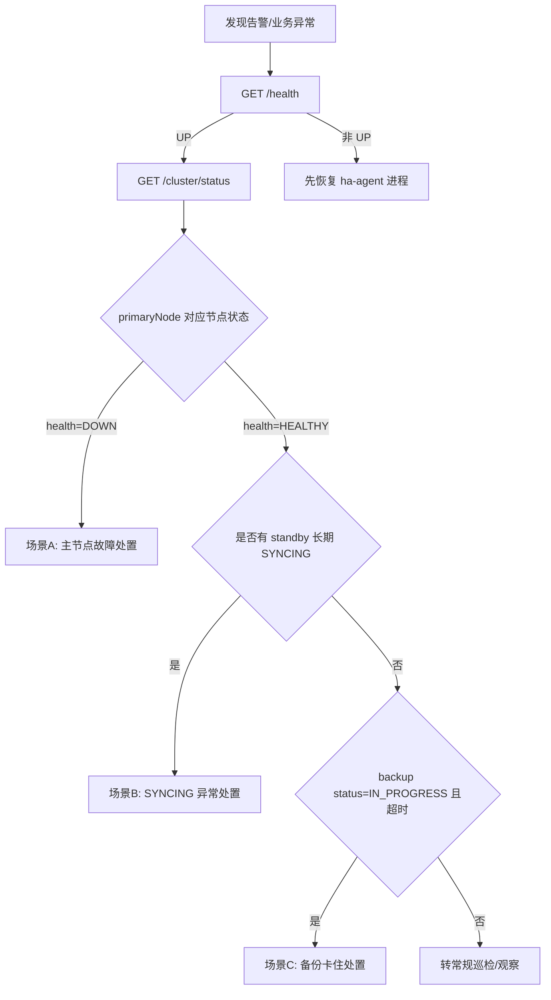
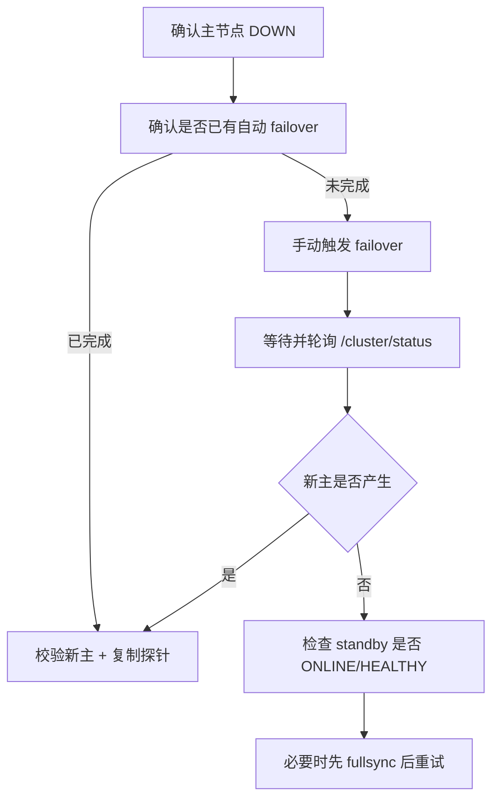
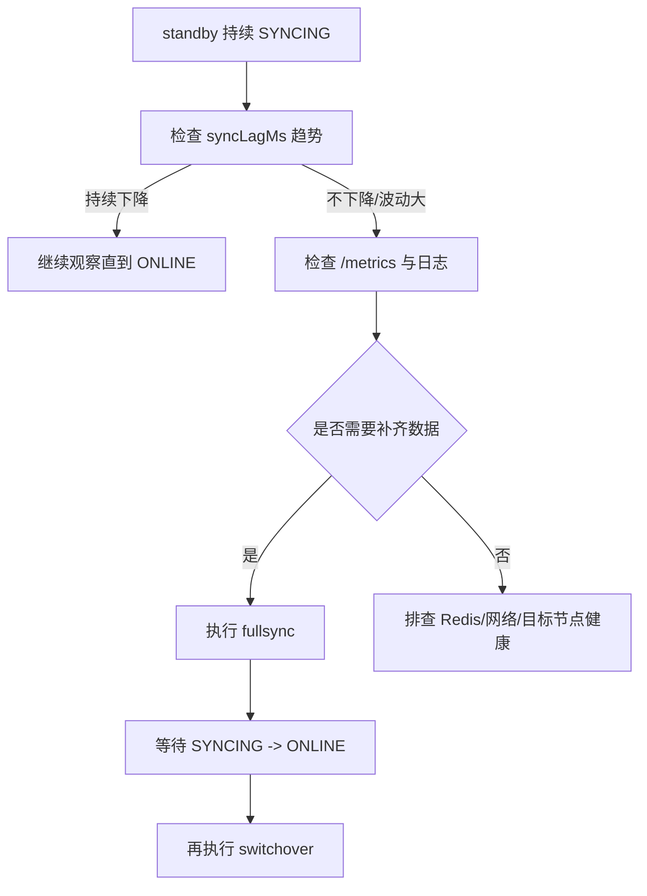
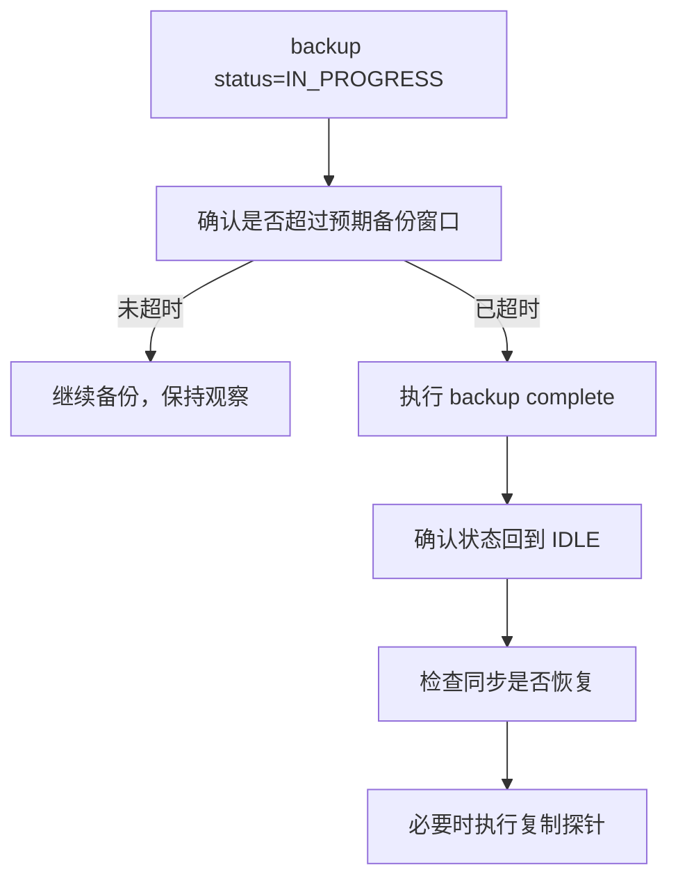
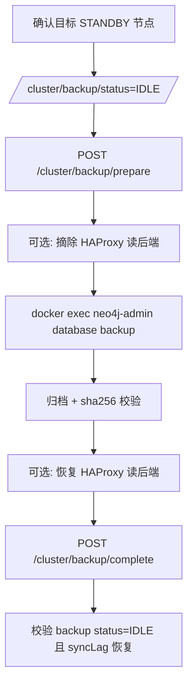
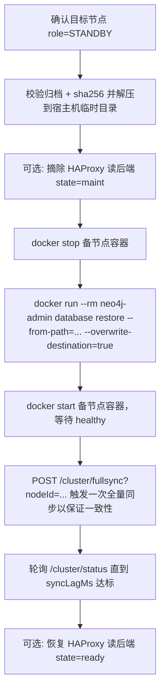
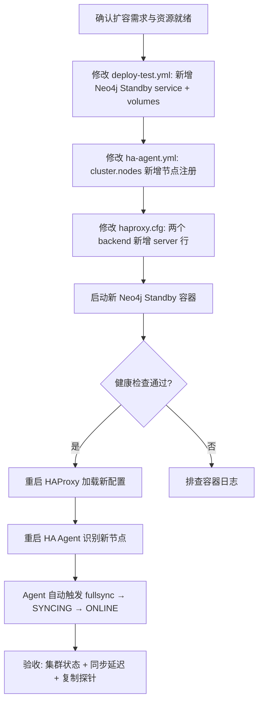

# HA Agent 集群运维操作手册

## 1. 适用范围

本文档用于说明当前 `ha-agent` 支持的：

- 集群管理操作（会改变集群状态）
- 状态监控操作（只读查询）

接口实现来源：`src/ha-agent/src/main/java/com/neo4j/ha/agent/http/AdminHttpServer.java`。

## 2. 基础信息

- 默认管理地址：`http://localhost:8080`
- 指标地址：`http://localhost:9090/metrics`
- 鉴权方式：`Authorization: Bearer <ADMIN_TOKEN>`（仅写操作要求）

### 2.0 基础设施版本要求

| 组件 | 最低版本 | 推荐版本 | 说明 |
|------|---------|---------|------|
| Neo4j Community Edition | 5.x (2026.2.3) | 2026.2.3 | 需要 APOC Core + Extended |
| Redis | **6.2** | **7.x** | `StreamMaintenanceTask` 使用 `XTRIM MINID` 命令（6.2 引入）；6.0.x 会导致 Stream 精细化清理失败（报 `ERR syntax error`），核心同步不受影响但 Stream 只能依赖 MAXLEN 兜底 |
| HAProxy | 2.8+ | 2.8+ | 需要 Runtime API（admin socket） |
| Java | 17+ | 17+ | HA Agent 运行时 |
| Docker Compose | v2+ | v2+ | 部署编排 |

**Redis 版本检查命令：**

```bash
redis-cli -h <REDIS_HOST> INFO server | grep redis_version
# 期望输出: redis_version:6.2.x 或更高
```

> ⚠️ 如果 Redis 版本低于 6.2，须在 `ha-agent.yml` 中设置 `stream.maintenanceInterval: ""` 禁用 `StreamMaintenanceTask`，否则日志会持续报 `ERR syntax error`。禁用后 Stream 完全依赖 XADD 时的 `MAXLEN` 裁剪（默认 100 万条），备节点长时间离线超过该窗口后需手动触发 `POST /cluster/fullsync`。

建议先配置环境变量：

```bash
export AGENT_URL="http://localhost:8080"
export ADMIN_TOKEN="<your-admin-token>"
```

---

## 2.1 业务方写 Cypher 的约束（CDC 同步前提）

> 📘 **完整客户端契约 source of truth**：[`./ha-client-contract.md`](./ha-client-contract.md)
> 包含完整的保留命名空间（5 系统属性 + 3 系统 label + 1 系统 reltype +
> 6 系统 trigger 名 + 6 类系统索引/约束）、强约束 S1/S2、推荐契约 R1、
> Driver 层 D1/D2/D3、规模约束 L1/L2 以及 BUG-083 引入的
> `ConstraintError(_elementId)` 重试要求。本节仅保留最小子集供运维侧速查。

HA Agent 在 primary 上安装 3 个 APOC trigger（`cdc-timestamp` / `cdc-capture-node-deletes` / `cdc-capture-rel-deletes`），自动给业务节点和关系**维护两个保留属性**：

| 保留属性 | 类型 | 谁写 | 用途 |
|---|---|---|---|
| `_updated_at` | `long`（毫秒时间戳） | trigger 自动 SET（CREATE / 任何属性变更时） | CDC keyset polling 的游标 |
| `_elementId` | `string` | trigger 自动 SET（CREATE 时）；sync-applier 在 standby 上从 source 拷贝 | 跨节点稳定身份；MERGE / DELETE 的查询键 |

> **重要：这两个名字以下划线开头是约定，不是 Neo4j 或 APOC 的特殊语法 —— 它们是普通属性。** 但 HA 同步链路对它们有强依赖。

### ✅ 业务方默认无需感知

最常见的业务写法都**不会**和 trigger 冲突，无需修改 Cypher：

```cypher
CREATE (n:Person {name: 'Alice', age: 30})
MATCH (n:Person {id: 1}) SET n.age = 31
MATCH (a:Person), (b:Order) WHERE a.id = $aid AND b.id = $bid
  MERGE (a)-[r:PLACED]->(b)
MATCH (n:Person {id: 1}) DETACH DELETE n
```

trigger 会在事务 commit 之前自动补上 / 维护 `_updated_at` 和 `_elementId`。

### ❌ 三类写法会破坏 CDC 同步，禁止使用

#### 1. 不要 `SET n = {...}` 整体覆盖属性

```cypher
-- 错误：会把 _elementId / _updated_at 一并清空
MATCH (n:Person {id: 1})
SET n = {name: 'Bob', age: 32}
```

**后果**：trigger 有补救逻辑（检测到 `_elementId` 被删后用 `elementId(n)` 重填），但 **`elementId(n)` 是当前数据库的 local id，和其他节点上同一逻辑节点的 `_elementId` 属性不再匹配**，sync-applier `MATCH (n {_elementId: ...})` 失效，节点退出同步链路（参见 BUG-052）。

**正确写法**：用增量更新

```cypher
MATCH (n:Person {id: 1})
SET n += {name: 'Bob', age: 32}
-- 或
SET n.name = 'Bob', n.age = 32
```

#### 2. 不要 `REMOVE n._elementId` / `REMOVE n._updated_at`

显式删除保留属性会触发上面同一个问题，且 `_updated_at` 被删后该节点会从 CDC 游标视野中消失，下次更新前不会被传播。

#### 3. 不要给业务节点打 `:_CDCDeleteEvent` label

`_CDCDeleteEvent` 是 CDC 的中转节点 label，trigger 会主动忽略它（防止递归）。任何带这个 label 的业务节点都不会被 CDC 捕获、不会被同步，并且会被 cleanup 任务定期 `DETACH DELETE`。

#### 4. 业务方自己安装的 APOC trigger 必须避开命名空间

HA Agent 占用 `cdc-timestamp` / `cdc-capture-node-deletes` / `cdc-capture-rel-deletes` 三个 trigger 名。业务自定义 trigger 应使用其他前缀（推荐 `app-*`），否则 agent 启动时会覆盖业务 trigger。

### Standby 节点的客户端读写约束

- **读**：经 HAProxy 读后端（17688 / `:bolt+routing` 形式）即可，无任何约束
- **写**：所有写**只允许**走 HAProxy 写后端（17687）。直连 standby 节点写入将永久不会被传播，且 standby 上没有 trigger，写入既不会出现在其他节点也不会被 CDC 捕获。该场景下 fencing token 会拒绝写入，但是绕过 HAProxy 直连 7687 的 driver **不会经过 fencing 检查**，运维必须从网络/账号策略上禁止业务直连 standby 写入

### 自检脚本（可选）

如怀疑历史数据违反了上述约束，可在任一节点执行：

```cypher
-- 业务节点中缺少 _elementId 的（应为 0）
MATCH (n) WHERE NOT n:_CDCDeleteEvent AND n._elementId IS NULL
RETURN labels(n) AS lbl, count(*) AS cnt;

-- 业务节点中 _elementId 与 local elementId 不一致的（standby 上正常会有，primary 上应为 0）
MATCH (n) WHERE NOT n:_CDCDeleteEvent AND n._elementId <> elementId(n)
RETURN labels(n) AS lbl, count(*) AS cnt;
```

primary 上第二条查询的结果 = "经历过 switchover 的节点数"，是正常现象，**不是错误**。

---

## 3. 集群管理操作（写操作，需要鉴权）

### 3.1 手动故障切换（Failover）

- 方法/路径：`POST /cluster/failover`
- 是否鉴权：是
- 说明：
  - 可传 `nodeId` 指定故障节点
  - 不传时默认以当前 `primaryNode` 为目标执行 failover 编排

示例：

```bash
# 默认以当前主节点为 failover 目标
curl -fsS -X POST "${AGENT_URL}/cluster/failover" \
  -H "Authorization: Bearer ${ADMIN_TOKEN}"

# 指定节点触发 failover
curl -fsS -X POST "${AGENT_URL}/cluster/failover?nodeId=node-01" \
  -H "Authorization: Bearer ${ADMIN_TOKEN}"
```

### 3.2 计划内主备切换（Switchover）

- 方法/路径：`POST /cluster/switchover`
- 是否鉴权：是
- 说明：
  - 建议传 `targetNodeId` 指定目标备节点
  - 若不传，服务端会走自动选择逻辑（返回 `targetNode=auto-select`）

示例：

```bash
curl -fsS -X POST "${AGENT_URL}/cluster/switchover?targetNodeId=node-02" \
  -H "Authorization: Bearer ${ADMIN_TOKEN}"
```

### 3.3 手动触发全量同步（Full Sync）

- 方法/路径：`POST /cluster/fullsync`
- 是否鉴权：是
- 说明：`nodeId` 必填，缺失会返回 `400`

示例：

```bash
curl -fsS -X POST "${AGENT_URL}/cluster/fullsync?nodeId=node-02" \
  -H "Authorization: Bearer ${ADMIN_TOKEN}"
```

### 3.4 备份准备（暂停同步）

- 方法/路径：`POST /cluster/backup/prepare`
- 是否鉴权：是
- 说明：进入备份准备/进行中状态，暂停同步写入，返回准备时间

示例：

```bash
curl -fsS -X POST "${AGENT_URL}/cluster/backup/prepare?nodeId=node-02" \
  -H "Authorization: Bearer ${ADMIN_TOKEN}"
```

### 3.5 备份完成（恢复同步）

- 方法/路径：`POST /cluster/backup/complete`
- 是否鉴权：是
- 说明：结束备份状态，恢复同步流程

示例：

```bash
curl -fsS -X POST "${AGENT_URL}/cluster/backup/complete" \
  -H "Authorization: Bearer ${ADMIN_TOKEN}"
```

---

## 4. 状态监控操作（读操作，无需鉴权）

### 4.1 Agent 存活状态

- 方法/路径：`GET /health`
- 说明：用于判断 `ha-agent` 进程是否存活（通常返回 `{"status":"UP"}`）

```bash
curl -fsS "${AGENT_URL}/health"
```

### 4.2 集群整体状态

- 方法/路径：`GET /cluster/status`
- 说明：返回当前主节点与全部节点运行状态，是最常用巡检接口
- 关键字段：
  - `primaryNode`：当前主节点 ID
  - `nodes[].role`：角色（PRIMARY/STANDBY 等）
  - `nodes[].health`：健康状态
  - `nodes[].serviceState`：服务状态（如 ONLINE/SYNCING）
  - `nodes[].syncLagMs`：同步延迟（毫秒）

```bash
curl -fsS "${AGENT_URL}/cluster/status" | python3 -m json.tool
curl -fsS "http://localhost:8080/cluster/status" | python3 -m json.tool
```

### 4.3 单节点详情

- 方法/路径：`GET /cluster/nodes/{id}`
- 说明：查看某个节点的详细状态；节点不存在返回 `404`

```bash
curl -fsS "${AGENT_URL}/cluster/nodes/node-01" | python3 -m json.tool
```

### 4.4 备份状态查询

- 方法/路径：`GET /cluster/backup/status`
- 说明：返回备份状态和最近备份时间（`never` 表示尚未成功备份）

```bash
curl -fsS "${AGENT_URL}/cluster/backup/status" | python3 -m json.tool
```

### 4.5 Prometheus 指标

- 方法/路径：`GET /metrics`（默认 `9090` 端口）
- 说明：用于监控系统采集，关键指标包括：
  - `neo4j_ha_sync_lag_ms`
  - `neo4j_ha_cdc_events_published_total`
  - `neo4j_ha_sync_events_applied_total`
  - `neo4j_ha_failover_total`
  - `neo4j_ha_failover_success_total`
  - `neo4j_ha_failover_failed_total`
  - `neo4j_ha_health_check_failures_total`
  - `neo4j_ha_backup_state`
  - `neo4j_ha_backup_last_success_timestamp`
  - `neo4j_ha_auto_fullsync_suppressed_total` —— BUG-039 速率限制抑制次数。短时间多次自增意味着该节点在抖动（up/down/up），考虑排查网络或 Neo4j GC；或运维确认后手动 `POST /cluster/fullsync?targetNodeId=...` 强制同步。
  - `neo4j_ha_auto_fullsync_failed_total` —— BUG-051 follow-up 引入。fullsync export 任务在 `OldPrimaryRecovery` executor 里抛异常的次数。**非零即告警**：意味着某备节点的自动全量同步失败、当前仍卡在 `SYNCING`。处置：(1) 看 `ha-agent` 日志定位异常根因；(2) 失败后速率限制时间戳已被自动清掉，下一次 health up 触发 recovery 时会自动重试；(3) 若想立即重试，调用 `POST /cluster/fullsync?targetNodeId=<node>`。

```bash
curl -fsS "http://localhost:9090/metrics"
```

### 4.6 主备数据一致性查看

本节用于**只读查看**主备节点是否大体一致。它不能替代 `neo4j-admin database check-consistency` 的本地 store 检查，也不能证明每个属性字节级完全相同；若出现差异，先保留现场，再运行 §10 诊断工具包。

#### 4.6.1 按启动方式设置检查目标

先根据实际启动方式选择一组变量：

```bash
# 方式 A：docker/init.sh、docker/init-3node.sh 或 docker/neo4j/test-compose.yml
export AGENT_URL="http://localhost:8080"
export METRICS_URL="http://localhost:9090"
export COMPOSE_FILE="docker/neo4j/test-compose.yml"
export NEO4J_CONTAINERS="neo4j-primary neo4j-standby-1 neo4j-standby-2"

# 方式 B：docker/neo4j/deploy-test.yml（2 节点部署模板）
export AGENT_URL="http://localhost:18888"
export METRICS_URL="http://localhost:19999"
export COMPOSE_FILE="docker/neo4j/deploy-test.yml"
export NEO4J_CONTAINERS="neo4j-primary neo4j-standby-1"

# 方式 C：非容器 / 自定义端口
# 手工把每个节点的 bolt 地址填入 NEO4J_BOLT_URIS，见 4.6.6。
```

加载账号密码：

```bash
set -a
source docker/.env
set +a
export NEO4J_USER="${NEO4J_USER:-neo4j}"
```

先确认 Agent 看到的角色和同步状态：

```bash
curl -fsS "${AGENT_URL}/cluster/status" | python3 -m json.tool
curl -fsS "${METRICS_URL}/metrics" \
  | rg "neo4j_ha_sync_lag_ms|neo4j_ha_sync_apply_errors_total|neo4j_ha_cdc_poll_errors_total"
```

继续执行后续检查前，建议满足：

- `primaryNode` 非空，且只有一个 `PRIMARY`
- 目标 standby `health=HEALTHY`
- 目标 standby `serviceState=ONLINE`
- `syncLagMs` 已稳定在可接受范围内

#### 4.6.2 节点 / 关系总量对比

```bash
for c in ${NEO4J_CONTAINERS}; do
  echo "== ${c} =="
  docker exec "${c}" cypher-shell \
    -a bolt://localhost:7687 \
    -u "${NEO4J_USER}" -p "${NEO4J_PASSWORD}" --format plain \
    "MATCH (n) WHERE NOT n:_CDCDeleteEvent
     WITH count(n) AS nodes
     OPTIONAL MATCH ()-[r]->()
     RETURN nodes, count(r) AS relationships"
done
```

期望：所有节点的 `nodes`、`relationships` 一致。若不一致，说明数据已经分叉或 standby 尚未追平。

#### 4.6.3 按 Label / Relationship Type 分布对比

```bash
for c in ${NEO4J_CONTAINERS}; do
  echo "== ${c}: labels =="
  docker exec "${c}" cypher-shell \
    -a bolt://localhost:7687 \
    -u "${NEO4J_USER}" -p "${NEO4J_PASSWORD}" --format plain \
    "MATCH (n) WHERE NOT n:_CDCDeleteEvent
     UNWIND labels(n) AS label
     RETURN label, count(*) AS cnt
     ORDER BY label"

  echo "== ${c}: relationship types =="
  docker exec "${c}" cypher-shell \
    -a bolt://localhost:7687 \
    -u "${NEO4J_USER}" -p "${NEO4J_PASSWORD}" --format plain \
    "MATCH ()-[r]->()
     RETURN type(r) AS relType, count(*) AS cnt
     ORDER BY relType"
done
```

期望：每个 label、每个关系类型的计数一致。总量一致但分布不一致时，通常是某类变更没有正确同步。

#### 4.6.4 CDC 保留字段和中转节点检查

```bash
for c in ${NEO4J_CONTAINERS}; do
  echo "== ${c}: cdc invariants =="
  docker exec "${c}" cypher-shell \
    -a bolt://localhost:7687 \
    -u "${NEO4J_USER}" -p "${NEO4J_PASSWORD}" --format plain \
    "MATCH (n) WHERE NOT n:_CDCDeleteEvent
     RETURN
       sum(CASE WHEN n._elementId IS NULL THEN 1 ELSE 0 END) AS missingElementId,
       sum(CASE WHEN n._updated_at IS NULL THEN 1 ELSE 0 END) AS missingUpdatedAt,
       max(n._updated_at) AS maxUpdatedAt"

  docker exec "${c}" cypher-shell \
    -a bolt://localhost:7687 \
    -u "${NEO4J_USER}" -p "${NEO4J_PASSWORD}" --format plain \
    "MATCH (e:_CDCDeleteEvent) RETURN count(e) AS deleteEventResidue"
done
```

判断口径：

- `missingElementId` 应为 `0`
- `missingUpdatedAt` 应为 `0`，除非明确存在历史导入且还未被触发器补齐的数据
- `deleteEventResidue` 长时间非 `0` 表示删除事件清理可能滞留
- `maxUpdatedAt` 可辅助判断哪个节点更新更靠后，但不要单独把它当成一致性结论

#### 4.6.4.1 修复 standby 上的 endpoint stub 节点

如果 standby 上出现 `missingUpdatedAt > 0`，不要只补 `_updated_at`。先判断这些节点是否是
关系同步先到达时创建的 endpoint stub：这类节点通常只有 label 和 `_elementId`，缺少
`_created_at` / `_updated_at` / `_labels` 以及业务属性。它们需要从 primary 按
`_elementId` 回填**完整属性**。

先定位 stub：

```bash
export PRIMARY=neo4j-primary
export STANDBY=neo4j-standby-1

docker exec "$STANDBY" cypher-shell \
  -a bolt://localhost:7687 \
  -u "$NEO4J_USER" -p "$NEO4J_PASSWORD" --format plain \
  "MATCH (n)
   WHERE NOT n:_CDCDeleteEvent
     AND n._elementId IS NOT NULL
     AND n._updated_at IS NULL
   RETURN n._elementId AS cdcElementId,
          labels(n) AS labels,
          keys(n) AS keys
   ORDER BY cdcElementId"
```

若 `keys` 只有 `["_elementId"]`，执行以下脚本从 primary 导出这些节点的完整属性，并在 standby
上按 `_elementId` 回填。脚本依赖宿主机有 `python3`，不会修改 primary。

```bash
export PRIMARY=neo4j-primary
export STANDBY=neo4j-standby-1

IDS=$(docker exec "$STANDBY" cypher-shell \
  -a bolt://localhost:7687 \
  -u "$NEO4J_USER" -p "$NEO4J_PASSWORD" --format plain \
  "MATCH (n)
   WHERE NOT n:_CDCDeleteEvent
     AND n._elementId IS NOT NULL
     AND n._updated_at IS NULL
     AND size(keys(n)) = 1
     AND all(k IN keys(n) WHERE k = '_elementId')
   RETURN n._elementId AS id
   ORDER BY id" \
  | awk 'NR>1 && $0!="null" {gsub(/^"|"$/, "", $0); gsub(/\\/,"\\\\"); gsub(/"/,"\\\""); printf "%s\"%s\"", sep, $0; sep=", "}')

if [ -z "$IDS" ]; then
  echo "No endpoint stubs found on $STANDBY"
  exit 0
fi

PRIMARY_EXPORT="$(mktemp)"
docker exec "$PRIMARY" cypher-shell \
  -a bolt://localhost:7687 \
  -u "$NEO4J_USER" -p "$NEO4J_PASSWORD" --format plain \
  "MATCH (n)
   WHERE n._elementId IN [$IDS]
   RETURN n._elementId AS id,
          apoc.convert.toJson(labels(n)) AS labelsJson,
          apoc.convert.toJson(properties(n)) AS propsJson
   ORDER BY id" > "$PRIMARY_EXPORT"

python3 - "$PRIMARY_EXPORT" "$STANDBY" "$NEO4J_USER" "$NEO4J_PASSWORD" <<'PY'
import csv
import json
import subprocess
import sys

export_path, standby, user, password = sys.argv[1:5]
with open(export_path, newline="") as f:
    rows = list(csv.reader(f))
if len(rows) <= 1:
    print("Primary returned no rows; aborting")
    sys.exit(1)

for row in rows[1:]:
    if len(row) != 3:
        continue
    eid, labels_json, props_json = row
    labels = json.loads(labels_json)
    props = json.loads(props_json)
    if not labels:
        print(f"skip {eid}: primary node has no labels")
        continue

    props_literal = json.dumps(props, ensure_ascii=False)
    cypher = f"""
    WITH apoc.convert.fromJsonMap($propsJson) AS props
    MATCH (n {{_elementId: $eid}})
    SET n = props
    SET n._elementId = $eid
    WITH n
    CALL apoc.create.addLabels(n, $labels) YIELD node
    RETURN node._elementId AS repaired
    """

    result = subprocess.run(
        [
            "docker", "exec", standby, "cypher-shell",
            "-a", "bolt://localhost:7687",
            "-u", user, "-p", password, "--format", "plain",
            "-P", f"eid => {json.dumps(eid)}",
            "-P", f"labels => {json.dumps(labels)}",
            "-P", f"propsJson => {json.dumps(props_literal)}",
            cypher,
        ],
        text=True,
        capture_output=True,
    )
    if result.returncode != 0:
        print(result.stderr, file=sys.stderr)
        sys.exit(result.returncode)
    print(result.stdout.strip())
PY

rm -f "$PRIMARY_EXPORT"
```

修复后立即复核：

```bash
for c in "$PRIMARY" "$STANDBY"; do
  echo "== ${c}: cdc invariants =="
  docker exec "${c}" cypher-shell \
    -a bolt://localhost:7687 \
    -u "${NEO4J_USER}" -p "${NEO4J_PASSWORD}" --format plain \
    "MATCH (n) WHERE NOT n:_CDCDeleteEvent
     RETURN
       sum(CASE WHEN n._elementId IS NULL THEN 1 ELSE 0 END) AS missingElementId,
       sum(CASE WHEN n._updated_at IS NULL THEN 1 ELSE 0 END) AS missingUpdatedAt,
       max(n._updated_at) AS maxUpdatedAt"

  docker exec "${c}" cypher-shell \
    -a bolt://localhost:7687 \
    -u "${NEO4J_USER}" -p "${NEO4J_PASSWORD}" --format plain \
    "MATCH (n)
     WHERE NOT n:_CDCDeleteEvent
       AND n._elementId IS NOT NULL
       AND n._updated_at IS NULL
     RETURN labels(n) AS labels, keys(n) AS keys, count(*) AS cnt"
done
```

修复目标：

- standby 上 `missingUpdatedAt = 0`
- `keys(n) = ["_elementId"]` 的业务节点数量为 `0`
- 总量、label 分布、relationship type 分布仍与 primary 一致

该脚本可以做成定时巡检任务，但建议默认只在发现 stub 时告警；自动修复应限制在
`keys(n)` 只有 `["_elementId"]` 的节点，避免误覆盖人工正在排查的属性级差异。

#### 4.6.5 复制探针（推荐验收动作）

在当前 primary 写入一个探针节点，然后在所有 standby 直连读取：

```bash
PROBE_ID="ha_consistency_$(date +%s)"

PRIMARY_CONTAINER="$(curl -fsS "${AGENT_URL}/cluster/status" \
  | python3 -c 'import json,sys,re
doc=json.load(sys.stdin)
primary=doc.get("primaryNode")
for n in doc.get("nodes", []):
    if n.get("id") == primary:
        uri=n.get("boltUri", "")
        m=re.match(r"bolt://([^:]+):\d+", uri)
        print(m.group(1) if m else "")
        break')"

docker exec "${PRIMARY_CONTAINER}" cypher-shell \
  -a bolt://localhost:7687 \
  -u "${NEO4J_USER}" -p "${NEO4J_PASSWORD}" \
  "MERGE (n:HAConsistencyProbe {id:'${PROBE_ID}'})
   SET n.ts=timestamp()
   RETURN n.id"

sleep 10

for c in ${NEO4J_CONTAINERS}; do
  echo "== ${c}: probe =="
  docker exec "${c}" cypher-shell \
    -a bolt://localhost:7687 \
    -u "${NEO4J_USER}" -p "${NEO4J_PASSWORD}" --format plain \
    "MATCH (n:HAConsistencyProbe {id:'${PROBE_ID}'}) RETURN count(n) AS seen"
done
```

所有节点 `seen=1` 表示当前增量链路可用。验证完成后可在 primary 清理探针：

```bash
docker exec "${PRIMARY_CONTAINER}" cypher-shell \
  -a bolt://localhost:7687 \
  -u "${NEO4J_USER}" -p "${NEO4J_PASSWORD}" \
  "MATCH (n:HAConsistencyProbe {id:'${PROBE_ID}'}) DETACH DELETE n"
```

#### 4.6.6 非容器 / 自定义端口检查模板

如果不是通过本仓库 Compose 启动，使用各节点 Bolt 地址直连执行同一组 Cypher：

```bash
export NEO4J_BOLT_URIS="bolt://node1:7687 bolt://node2:7687"

for uri in ${NEO4J_BOLT_URIS}; do
  echo "== ${uri} =="
  cypher-shell -a "${uri}" \
    -u "${NEO4J_USER}" -p "${NEO4J_PASSWORD}" --format plain \
    "MATCH (n) WHERE NOT n:_CDCDeleteEvent
     WITH count(n) AS nodes
     OPTIONAL MATCH ()-[r]->()
     RETURN nodes, count(r) AS relationships"
done
```

若需要属性级精确比对，不建议在生产高峰期全库导出。优先按业务主键、label 或时间窗口分批导出，再在节点间做 `sha256sum` / `diff`。大规模不一致排查直接运行：

```bash
scripts/diag/ha-diag-collect.sh
python3 scripts/diag/ha-diag-analyze.py /tmp/ha-diag-<UTC-ts>
```

---

## 5. 推荐巡检顺序

日常巡检建议按以下顺序执行：

1. `GET /health`：确认 Agent 进程可用
2. `GET /cluster/status`：确认主节点、各节点健康和同步状态
3. `GET /cluster/backup/status`：确认是否存在未结束备份
4. `GET /metrics`：检查同步延迟、failover 计数、错误计数是否异常
5. 需要验收或怀疑分叉时，按 §4.6 做主备数据一致性查看

如果需要执行操作，优先在 `cluster/status` 中确认目标 `STANDBY` 的 `serviceState=ONLINE` 后再触发 `switchover`。

---

## 6. 故障处置流程图与操作说明

本节给出三类常见运维故障场景的标准处置流程：

- 场景 A：主节点故障（PRIMARY DOWN）
- 场景 B：备节点长期 `SYNCING`，无法切换
- 场景 C：备份长时间未结束（`IN_PROGRESS`）

### 6.1 总体分诊流程图



### 6.2 场景 A：主节点故障处置（PRIMARY DOWN）

#### 处置流程图



#### 操作说明

1) 确认当前状态：

```bash
curl -fsS "${AGENT_URL}/cluster/status" | python3 -m json.tool
```

2) 手动触发 failover（若自动切换未完成）：

```bash
curl -fsS -X POST "${AGENT_URL}/cluster/failover" \
  -H "Authorization: Bearer ${ADMIN_TOKEN}"
```

3) 轮询观察是否选出新主：

```bash
watch -n 2 "curl -fsS ${AGENT_URL}/cluster/status | python3 -m json.tool"
```

4) 若长时间无法切换，优先检查：

- 是否存在 `health=HEALTHY` 且 `serviceState=ONLINE` 的 standby
- standby 是否需要先执行 `fullsync`（数据未追平无法提升）

示例（对指定备节点触发全量同步）：

```bash
curl -fsS -X POST "${AGENT_URL}/cluster/fullsync?nodeId=node-02" \
  -H "Authorization: Bearer ${ADMIN_TOKEN}"
```

### 6.3 场景 B：备节点长期 SYNCING，无法执行 switchover

#### 处置流程图



#### 操作说明

1) 连续观察节点 `serviceState` 和 `syncLagMs`：

```bash
watch -n 2 "curl -fsS ${AGENT_URL}/cluster/status | python3 -m json.tool"
```

2) 观察核心指标是否异常：

```bash
curl -fsS "http://localhost:9090/metrics" | rg "neo4j_ha_sync_lag_ms|neo4j_ha_sync_apply_errors_total|neo4j_ha_cdc_poll_errors_total"
```

3) 若 lag 长时间不收敛，触发目标 standby 全量同步：

```bash
curl -fsS -X POST "${AGENT_URL}/cluster/fullsync?nodeId=node-02" \
  -H "Authorization: Bearer ${ADMIN_TOKEN}"
```

4) 确认目标 standby 进入 `ONLINE` 后再切换：

```bash
curl -fsS -X POST "${AGENT_URL}/cluster/switchover?targetNodeId=node-02" \
  -H "Authorization: Bearer ${ADMIN_TOKEN}"
```

### 6.4 场景 C：备份状态长时间 IN_PROGRESS（备份卡住）

#### 处置流程图



#### 操作说明

1) 查询当前备份状态：

```bash
curl -fsS "${AGENT_URL}/cluster/backup/status" | python3 -m json.tool
```

2) 若确认外部备份已完成但状态仍未退出，手动完成备份：

```bash
curl -fsS -X POST "${AGENT_URL}/cluster/backup/complete" \
  -H "Authorization: Bearer ${ADMIN_TOKEN}"
```

3) 再次确认状态回到 `IDLE`，并检查 `syncLagMs` 是否恢复下降：

```bash
curl -fsS "${AGENT_URL}/cluster/backup/status" | python3 -m json.tool
curl -fsS "${AGENT_URL}/cluster/status" | python3 -m json.tool
```

### 6.5 处置后的验收标准

故障处置完成后，建议满足以下最小验收条件：

- `GET /health` 返回 `UP`
- `GET /cluster/status` 中存在且仅存在一个 `PRIMARY`
- 所有可用 standby 节点 `health=HEALTHY`
- 计划参与读流量的 standby 节点 `serviceState=ONLINE`
- `neo4j_ha_sync_lag_ms` 在可接受阈值内并稳定

---

## 7. 备节点停止数据同步并执行全量备份（标准操作）

本流程对指定**备节点**执行在线一致性全量备份，推荐方式是 `neo4j-admin database backup`（**不停 Neo4j**）。

端到端脚本：`scripts/backup/backup-standby.sh`。脚本内已经把下文所有步骤串起来，并具备失败/中断时的自恢复能力（自动 `backup/complete` + 恢复 HAProxy 读后端）。

### 7.1 操作流程图



### 7.2 前置条件

- `ha-agent` 健康：`GET /health` 返回 `UP`
- 目标节点 `role=STANDBY` 且建议 `health=HEALTHY`
- 目标 Neo4j 已启用备份端口（默认 `localhost:6362`，Neo4j 2026.x 默认开启）
- 宿主机 `BACKUP_ROOT` 所在卷容量充足
- 业务方已知会备份窗口（备份期间同步会被暂停）

### 7.3 推荐执行方式：使用 `backup-standby.sh`

最简用法：

```bash
ADMIN_TOKEN=xxx ./scripts/backup/backup-standby.sh
```

备份期间把该备节点从读流量摘掉（推荐生产使用）：

```bash
ADMIN_TOKEN=xxx \
DRAIN_READ_BACKEND=1 \
STANDBY_NODE_ID=node-02 \
STANDBY_CONTAINER=neo4j-standby-1 \
  ./scripts/backup/backup-standby.sh
```

关键环境变量：

| 变量 | 默认值 | 说明 |
|------|--------|------|
| `HA_AGENT_URL` | `http://localhost:8080` | HA Agent 管理地址 |
| `ADMIN_TOKEN` | —（必填） | 鉴权 token，可从 `docker/.env` 自动加载 |
| `STANDBY_NODE_ID` | `node-02` | HA Agent 中的集群节点 ID |
| `STANDBY_CONTAINER` | `neo4j-standby-1` | Docker 容器名 |
| `DATABASE_NAME` | `neo4j` | 目标数据库名 |
| `NEO4J_BACKUP_ADDRESS` | `localhost:6362` | `neo4j-admin backup --from-address` |
| `BACKUP_ROOT` | `/backup/neo4j` | 宿主机备份根目录 |
| `RETENTION_DAYS` | `7` | 保留天数 |
| `DRAIN_READ_BACKEND` | `0` | 设为 `1` 则备份期间置该节点为 `maint` |
| `HAPROXY_READ_BACKEND` | `neo4j_all` | 读 backend 名（需与 `haproxy.cfg` 一致） |
| `HAPROXY_SERVER_NAME` | 同 `STANDBY_CONTAINER` | 读 backend 中的 server 名 |

### 7.4 手动执行步骤（与脚本等价）

适用于脚本不可用或需要人工介入的场景。

#### 步骤 1：确认目标备节点

```bash
curl -fsS "${AGENT_URL}/cluster/status" | python3 -m json.tool
curl -fsS "${AGENT_URL}/cluster/backup/status" | python3 -m json.tool
```

确认目标 `role=STANDBY`，且 `backup status=IDLE`。

#### 步骤 2：暂停同步，进入备份窗口

```bash
curl -fsS -X POST "${AGENT_URL}/cluster/backup/prepare?nodeId=node-02" \
  -H "Authorization: Bearer ${ADMIN_TOKEN}" | python3 -m json.tool
```

#### 步骤 3（可选）：从 HAProxy 读后端摘除该节点

对每个 HAProxy admin socket 执行（示例节点 `neo4j-standby-1`）：

```
set server neo4j_all/neo4j-standby-1 state maint
```

#### 步骤 4：在备节点容器内执行 `neo4j-admin backup`

```bash
docker exec neo4j-standby-1 sh -c \
  'rm -rf /tmp/neo4j-backup && mkdir -p /tmp/neo4j-backup'

docker exec neo4j-standby-1 \
  neo4j-admin database backup neo4j \
    --from-address=localhost:6362 \
    --to-path=/tmp/neo4j-backup
```

#### 步骤 5：将备份产物拷出宿主机并校验

```bash
ts=$(date +%Y%m%d-%H%M%S)
out="/backup/neo4j/node-02-${ts}"
mkdir -p "${out}"

docker cp neo4j-standby-1:/tmp/neo4j-backup/. "${out}/"
docker exec neo4j-standby-1 rm -rf /tmp/neo4j-backup

tar -C "/backup/neo4j" -czf "${out}.tar.gz" "node-02-${ts}"
rm -rf "${out}"
( cd /backup/neo4j && sha256sum "node-02-${ts}.tar.gz" \
    > "node-02-${ts}.tar.gz.sha256" )
```

#### 步骤 6（若步骤 3 做过）：恢复读后端

```
set server neo4j_all/neo4j-standby-1 state ready
```

#### 步骤 7：恢复同步

```bash
curl -fsS -X POST "${AGENT_URL}/cluster/backup/complete" \
  -H "Authorization: Bearer ${ADMIN_TOKEN}" | python3 -m json.tool
```

#### 步骤 8：验收

```bash
curl -fsS "${AGENT_URL}/cluster/backup/status" | python3 -m json.tool
curl -fsS "${AGENT_URL}/cluster/status" | python3 -m json.tool
curl -fsS "http://localhost:9090/metrics" | rg "neo4j_ha_backup_state|neo4j_ha_sync_lag_ms"
```

验收要点：

- `backup status` 回到 `IDLE`
- standby 节点 `syncLagMs` 开始下降并趋稳
- 集群角色无异常漂移

### 7.5 异常处理

- **prepare 后备份失败：**
  脚本会在 `trap` 中自动执行 `backup/complete` 并恢复读后端。若手动执行失败，必须手动发起：
  ```bash
  curl -fsS -X POST "${AGENT_URL}/cluster/backup/complete" \
    -H "Authorization: Bearer ${ADMIN_TOKEN}"
  ```
- **`neo4j-admin backup` 报连接失败：**
  确认 `server.backup.enabled=true` 且备份端口（默认 `6362`）可用。
- **complete 后 `syncLagMs` 不恢复：**
  查 `ha-agent` 日志与 `neo4j_ha_sync_apply_errors_total`，必要时对该节点触发 `POST /cluster/fullsync?nodeId=...`。
- **备份期间主节点故障：**
  failover 优先，备份会被自动取消；待集群稳定后重新执行本流程。

### 7.6 与冷备份方式的对比

| 维度 | `neo4j-admin backup`（当前方案） | 停容器 + `tar` 冷拷（旧方案） |
|------|-------------------------------|-----------------------------|
| 是否停 Neo4j | 否 | 是 |
| 一致性保证 | 工具原生保证 | 依赖停库 |
| 备份期间该备节点可读 | 是（若未摘读） | 否 |
| 恢复流程 | `neo4j-admin database restore` | 手工还原目录 |
| 推荐 | 是 | 否（仅用于应急） |

## 8. 备节点恢复流程（`neo4j-admin database restore`）

本流程把 §7 产出的归档包（`*.tar.gz` + `*.sha256`）在**同一个备节点**上还原，并让 `ha-agent` 自动把数据追齐到与主节点一致。

端到端脚本：`scripts/backup/restore-standby.sh`。脚本串起了下文所有步骤，在失败或中断时会自动把容器重新拉起、并把 HAProxy 读后端恢复为 `ready`，避免集群被“摘错读流量后卡住”。

> 说明：`neo4j-admin database restore` 需要目标数据库处于**离线**状态，因此恢复过程会短暂停机该**备节点**（仅该一台）。主节点和另一台备节点不受影响。

### 8.1 操作流程图



### 8.2 前置条件

- `ha-agent` 健康：`GET /health` 返回 `UP`
- 目标节点 `role=STANDBY`（**不可**在 PRIMARY 上跑本脚本，以免覆盖主库数据）
- 归档文件存在且可选的 `<archive>.sha256` 校验通过
- 宿主机已挂载备节点数据目录（`STANDBY_DATA_HOST_DIR`，默认 `/opt/neo4j-node2/data`）
- 备份归档版本与目标 `NEO4J_IMAGE` 版本兼容（跨大版本请先在测试环境演练）

### 8.3 推荐执行方式：使用 `restore-standby.sh`

最简用法（恢复 `node-02`）：

```bash
ADMIN_TOKEN=xxx \
  ./scripts/backup/restore-standby.sh /backup/neo4j/node-02/2026-04-17/node-02-20260417-030000.tar.gz
```

完整参数示例（指定容器名 / 数据目录 / 镜像 / 保留 HAProxy 读后端不摘）：

```bash
ADMIN_TOKEN=xxx \
STANDBY_NODE_ID=node-02 \
STANDBY_CONTAINER=neo4j-standby-1 \
STANDBY_DATA_HOST_DIR=/opt/neo4j-node2/data \
NEO4J_IMAGE=neo4j:2026.02.3 \
DATABASE_NAME=neo4j \
DRAIN_READ_BACKEND=1 \
SYNC_WAIT_SECONDS=900 \
  ./scripts/backup/restore-standby.sh /backup/neo4j/node-02/2026-04-17/node-02-20260417-030000.tar.gz
```

关键环境变量：

| 变量 | 默认值 | 说明 |
|------|--------|------|
| `HA_AGENT_URL` | `http://localhost:8080` | HA Agent Admin API |
| `ADMIN_TOKEN` | 脚本会尝试从 `docker/.env` 读取 | 写接口鉴权 Token |
| `STANDBY_NODE_ID` | `node-02` | HA Agent 集群内节点 ID |
| `STANDBY_CONTAINER` | `neo4j-standby-1` | Docker 容器名 |
| `STANDBY_DATA_HOST_DIR` | `/opt/neo4j-node2/data` | 备节点在宿主机上的数据目录 |
| `NEO4J_IMAGE` | `neo4j:2026.02.3` | 跑 `neo4j-admin` 的临时容器镜像 |
| `DATABASE_NAME` | `neo4j` | 要恢复的数据库名 |
| `OVERWRITE_DESTINATION` | `true` | 是否覆盖现有数据目录 |
| `DRAIN_READ_BACKEND` | `1` | 恢复期间把该节点从 HAProxy 读后端摘除 |
| `SYNC_LAG_THRESHOLD_MS` | `5000` | `syncLagMs` 判定“追齐”阈值 |
| `SYNC_WAIT_SECONDS` | `600` | 等待追齐的最长时间 |

### 8.4 手动执行步骤（不使用脚本时）

> 下文命令均以 `node-02` 为目标备节点，容器名 `neo4j-standby-1`，数据目录 `/opt/neo4j-node2/data` 为例。

1. **前置检查**
   ```bash
   curl -fsS "${AGENT_URL}/health"
   curl -fsS "${AGENT_URL}/cluster/status" \
     | jq '.nodes[] | select(.id=="node-02") | {id,role,health,serviceState}'
   # 期望: role="STANDBY"
   ```

2. **校验归档（若存在 sha256 侧车）并解压**
   ```bash
   ARCHIVE=/backup/neo4j/node-02/2026-04-17/node-02-20260417-030000.tar.gz
   ( cd "$(dirname "$ARCHIVE")" && sha256sum -c "$(basename "$ARCHIVE").sha256" )

   TMP=$(mktemp -d -t neo4j-restore.XXXXXX)
   tar -xzf "$ARCHIVE" -C "$TMP"
   RESTORE_SRC=$(find "$TMP" -mindepth 1 -maxdepth 1 -type d | head -n1)
   echo "Extracted to: $RESTORE_SRC"
   ```

3. **（可选）把该节点从 HAProxy 读后端摘除**
   ```bash
   python3 - <<'PY'
   import socket
   for sock in ["/opt/haproxy-1/haproxy-1-socket/admin.sock",
                "/opt/haproxy-2/haproxy-2-socket/admin.sock"]:
       s=socket.socket(socket.AF_UNIX, socket.SOCK_STREAM); s.connect(sock)
       s.sendall(b"set server neo4j_all/neo4j-standby-1 state maint\n")
       print(s.recv(4096).decode()); s.close()
   PY
   ```

4. **停止备节点容器**
   ```bash
   docker stop neo4j-standby-1
   ```

5. **执行 restore（临时容器共享宿主机数据目录）**
   ```bash
   docker run --rm \
     -v /opt/neo4j-node2/data:/data \
     -v "$RESTORE_SRC":/restore:ro \
     --entrypoint neo4j-admin \
     neo4j:2026.02.3 \
     database restore neo4j \
       --from-path=/restore \
       --overwrite-destination=true
   ```

6. **拉起容器并等待健康**
   ```bash
   docker start neo4j-standby-1
   # 反复查直到 healthy
   docker inspect -f '{{.State.Health.Status}}' neo4j-standby-1
   ```

7. **触发一次全量同步，保证和主节点一致**
   ```bash
   curl -fsS -X POST "${AGENT_URL}/cluster/fullsync?nodeId=node-02" \
     -H "Authorization: Bearer ${ADMIN_TOKEN}"
   ```
   > 直接走增量同步可能会因为“磁盘数据被还原到备份时间点、但 Redis 内的同步位点仍指向更靠后的位置”而漏数据。这一步会强制从主节点做一次全量 + 增量追齐，是恢复后必须的一步。

8. **等待 `syncLagMs` 回到阈值内**
   ```bash
   watch -n 5 'curl -fsS "${AGENT_URL}/cluster/status" \
     | jq ".nodes[] | select(.id==\"node-02\") | {serviceState,syncLagMs}"'
   # 期望: serviceState=ONLINE, syncLagMs < 5000
   ```

9. **（可选）把该节点恢复到 HAProxy 读后端**
   ```bash
   python3 - <<'PY'
   import socket
   for sock in ["/opt/haproxy-1/haproxy-1-socket/admin.sock",
                "/opt/haproxy-2/haproxy-2-socket/admin.sock"]:
       s=socket.socket(socket.AF_UNIX, socket.SOCK_STREAM); s.connect(sock)
       s.sendall(b"set server neo4j_all/neo4j-standby-1 state ready\n")
       print(s.recv(4096).decode()); s.close()
   PY
   ```

10. **清理**
    ```bash
    rm -rf "$TMP"
    ```

### 8.5 验收标准

- `docker inspect neo4j-standby-1 -f '{{.State.Health.Status}}' == healthy`
- `GET /cluster/status` 中该节点：`role=STANDBY` / `health=HEALTHY` / `serviceState=ONLINE`
- `syncLagMs` < 配置的 `syncLagThresholdMs`（默认 5000ms），且数值稳定下降至稳态
- Prometheus：
  - `neo4j_ha_sync_lag_ms{node="node-02"}` 回到正常区间
  - `neo4j_ha_sync_apply_errors_total{node="node-02"}` 不再增长
  - `neo4j_ha_full_sync_total{node="node-02"}` 计数 +1（因为第 7 步主动触发了一次）
- （若摘了读流量）HAProxy Stats 页该 server 状态回到 `UP`

### 8.6 异常处理

- **脚本中断 / `neo4j-admin restore` 失败：**
  `trap` 会尝试把容器重新拉起并把 HAProxy 读后端恢复为 `ready`。此时该节点数据处于**被覆盖但未完成**状态，务必重新跑一次完整流程（或在停机窗口内重装该节点）。
- **容器迟迟不 healthy：**
  查 `docker logs neo4j-standby-1`，常见为 `store format` 不兼容（跨大版本恢复）、磁盘权限不对（`/data` uid/gid 不匹配）。
- **`/cluster/fullsync` 之后 `syncLagMs` 不下降：**
  看 `ha-agent` 日志 + `neo4j_ha_sync_apply_errors_total`；必要时重复一次 `POST /cluster/fullsync?nodeId=...`。
- **误对 PRIMARY 执行恢复：**
  脚本会在前置检查处 fail-fast（`role != STANDBY` 直接退出）；手动执行时请务必先 `GET /cluster/status` 确认角色。若要整体切回备份时刻，应走“先 switchover 把主切到另一台 → 再对原主执行 restore”的顺序。

### 8.7 灾难恢复（整集群丢数据）简要说明

当主节点与所有备节点都需要从备份恢复时：

1. 先在任意一台节点上按 §8.4 的方式恢复一份完整数据；
2. 启动该节点为**临时 PRIMARY**（通过 `ha-agent` 配置或 `cluster/failover` 路径）；
3. 其他节点仍按 §8 走备节点恢复流程，恢复后通过 `/cluster/fullsync` 追齐；
4. 待集群稳定后，如需切回原主，走标准 `POST /cluster/switchover?targetNodeId=...`。

> 本项目当前不提供一键“整集群恢复”脚本；生产灾备请按上面分步流程操作，并在测试环境完整演练一次。

---

## 9. Redis 数据丢失后的集群重建

**适用场景：** Redis 因磁盘损坏、误删 key、持久化策略失效等原因导致 `neo4j:ha:*` 数据全部或部分丢失，但 Neo4j 主备节点本身**未受损**。

### 9.1 问题本质

HA Agent 的集群权威状态（谁是主、当前 fencing token、CDC/Sync checkpoint）全部存在 Redis：

| Redis Key | 存储内容 | 丢失后的风险 |
|-----------|---------|------------|
| `neo4j:ha:node-registry` | 每个节点的 role / health / serviceState | **按 `ha-agent.yml` 回退 → 可能把陈旧节点误选为主** |
| `neo4j:ha:fencing-token` | 单调递增整数 | 回落到 0 → 旧主恢复后可能"绕过" fencing 发布 |
| `neo4j:ha:cdc-checkpoint:<node>` | CDC 轮询游标 | 从头扫描主库全部数据 |
| `neo4j:ha:sync-checkpoint:<node>` | Stream 消费游标 | 备节点触发全量同步 |
| `neo4j:cdc:neo4j:changes` (Stream) | 增量变更事件 | 同步断档，需全量修复 |

**最致命的是 `node-registry` 丢失：** `ClusterInitializer` 会按 `ha-agent.yml` 的 `role` 字段回退（该字段在 switchover 后**不会自动更新**）。如果直接启动 Agent，可能把 **数据陈旧的前 primary 再次选为 PRIMARY**，其陈旧数据会通过 CDC 覆盖掉真正的新主，**静默数据回滚**。

### 9.2 重建前必做：判定"最后的 master"

Redis 重建前，**必须先从 Neo4j 节点本身的数据判定最后的 master**，否则无法保证新启动的 Agent 选对主。

直接用提供的诊断脚本：

```bash
NEO4J_PASSWORD="${NEO4J_PASSWORD}" \
  bash scripts/deploy/detect-last-master.sh
```

脚本综合 **3 个独立信号**进行判定：

| 信号 | 数据源 | 含义 |
|------|-------|------|
| ① 最大 `_updated_at` | 每个 Neo4j 节点的所有 node/relationship | 数据新旧 — 最权威 |
| ② `_CDCDeleteEvent` 中转节点数量 | 每个 Neo4j 节点 | 只有 master 会产生（switchover 会清理旧主残留） |
| ③ `cdc-*` APOC Trigger 安装 | 每个 Neo4j 节点 | 只有 master 会装（switchover 会卸载旧主） |

**脚本退出码：**
- `0` — 能明确识别出唯一候选
- `1` — 无法识别（所有节点数据都空）
- `2` — 信号冲突，需人工介入

### 9.3 手工判定（脚本不可用时）

**Step 1 — 查询每个节点的最大时间戳：**

```bash
for host in neo4j-primary neo4j-standby-1 neo4j-standby-2; do
  echo "=== $host ==="
  docker exec "$host" cypher-shell -u neo4j -p "$NEO4J_PASSWORD" --format plain <<'EOF'
MATCH (n) WHERE n._updated_at IS NOT NULL
RETURN coalesce(max(n._updated_at), 0) AS max_node_ts;
MATCH ()-[r]->() WHERE r._updated_at IS NOT NULL
RETURN coalesce(max(r._updated_at), 0) AS max_rel_ts;
EOF
done
```

**Step 2 — 查询 CDC Trigger 安装情况（关键信号）：**

```bash
for host in neo4j-primary neo4j-standby-1 neo4j-standby-2; do
  echo "=== $host ==="
  docker exec "$host" cypher-shell -u neo4j -p "$NEO4J_PASSWORD" --format plain \
    <<< "CALL apoc.trigger.list() YIELD name WHERE name STARTS WITH 'cdc-' RETURN name"
done
```

**Step 3 — 查询 `_CDCDeleteEvent` 残留：**

```bash
for host in neo4j-primary neo4j-standby-1 neo4j-standby-2; do
  echo "=== $host ==="
  docker exec "$host" cypher-shell -u neo4j -p "$NEO4J_PASSWORD" --format plain \
    <<< "MATCH (e:_CDCDeleteEvent) RETURN count(e) AS n, coalesce(max(e.timestamp), 0) AS ts"
done
```

**判定规则（优先级从高到低）：**

1. **只有一个节点装了 `cdc-*` Trigger** → 该节点是最后的 master（**最强信号**）
2. **多个节点都装了 Trigger** → 取 `max_ts` 最大者为主，**人工到其它节点执行卸载**（见下面 9.5）
3. **没有任何节点有 Trigger，但某个节点有 `_CDCDeleteEvent` 残留** → 该节点是最后的 master
4. **完全没有区分信号，多节点 `max_ts` 相同** → 说明停机前集群已完全同步，**任选一个**即可（数据等价）
5. **`max_ts` 最大的节点没有 Trigger，而 Trigger 在其它节点** → **危险**！表明 switchover 中途异常，导出数据 diff 后再决定，或联系开发

### 9.4 Redis 重建 + Agent 启动流程

假设 Step 9.2 或 9.3 判定出最后的 master 是 `node-XX`（对应主机名 `neo4j-YYY`）：

```bash
# 1. 停止所有 HA Agent 实例
docker compose -f docker/neo4j/test-compose.yml stop ha-agent

# 2. 重建或清空 Redis（以 FLUSHDB 为例，生产环境请按你的 Redis 运维规范）
docker exec redis redis-cli FLUSHDB

# 3. 修改 ha-agent.yml：把 node-XX 的 role 显式改为 primary，其余改为 standby
#    (这一步是避免"按旧配置启动"误选主的根本防线)
vi config/agent/ha-agent.yml

# 4. 预写 fencing token（可选但推荐）：
#    取 _CDCDeleteEvent.timestamp 和 _updated_at 的毫秒数超过 10^12，直接用时间戳
#    不会与未来的 increment 冲突
docker exec redis redis-cli SET neo4j:ha:fencing-token $(date +%s%3N)

# 5. 启动 Agent
docker compose -f docker/neo4j/test-compose.yml up -d ha-agent

# 6. 观察日志，确认：
#    - "Primary: node-XX" 与你判定的最后 master 一致
#    - APOC Trigger 装在 node-XX
#    - 其它节点经 10~12s 进入 SYNCING → ONLINE
docker compose -f docker/neo4j/test-compose.yml logs -f ha-agent
```

### 9.5 清理多余的 Trigger 和中转节点（如 Step 3 判定 2）

如果检测到多个节点都有 `cdc-*` Trigger（switchover 曾中途失败），在 Agent 启动**之前**，到**非最后-master 的节点**执行：

```cypher
CALL apoc.trigger.drop('neo4j', 'cdc-timestamp');
CALL apoc.trigger.drop('neo4j', 'cdc-capture-node-deletes');
CALL apoc.trigger.drop('neo4j', 'cdc-capture-rel-deletes');
MATCH (e:_CDCDeleteEvent) WITH e LIMIT 10000 DETACH DELETE e RETURN count(*);
```

（Trigger drop 是幂等的，`_CDCDeleteEvent` 清理分批，避免大集合事务超限。）

### 9.6 验收

1. Agent 日志有 `Cluster initialized. Primary: node-XX`，与 Step 9.2/9.3 判定一致
2. `GET /cluster/status` 返回 `primaryNode` 正确，三节点 `health=HEALTHY`
3. 2 分钟内两个 standby 转为 `serviceState=ONLINE`
4. 在 primary 写一次探测节点，备节点能读到（参考 `ha-smoke-test-3node.sh` 的复制探测逻辑）
5. `neo4j_ha_sync_lag_ms` 指标在 10 秒内回落到毫秒级

### 9.7 未来改进方向

当前 `ClusterInitializer` 在 Redis registry 缺失时会**静默回退到 `ha-agent.yml`**。推荐未来迭代：

- **Level 1**: Agent 启动时查询每个 Neo4j 的 Trigger 安装情况作为 Primary 的自动判定依据
- **Level 2**: 检测到 Redis 空但配置中 `role` 字段可能陈旧时，**拒绝启动并要求显式传入 `--initial-primary=node-XX` 或环境变量**
- **Level 3**: 把 fencing token 同时写入每个 Neo4j 节点的元数据节点，启动时以节点元数据为准

这些改进在 `docs/nuclear-fusion/reviews/2026-04-17-neo4j-ha-code-review.md` 的"冷启动一致性"讨论里已作为 follow-up 记录。

---

## 10. 诊断工具包（collect + analyze）

当压测 / 生产遇到"数据不一致、不确定根因"时，优先运行诊断工具包一次性收集现场快照并自动产出根因分类：

```bash
# 1) 在跑着 compose 的 VM 上
scripts/diag/ha-diag-collect.sh            # 默认输出 /tmp/ha-diag-<UTC-ts>.tar.gz
# 可选：--out /path/to/out --stream <key> --env-file docker/.env

# 2) 任意一台有 python3 的机器
python3 scripts/diag/ha-diag-analyze.py /tmp/ha-diag-<UTC-ts>
# 或直接喂 tar.gz:
python3 scripts/diag/ha-diag-analyze.py /tmp/ha-diag-<UTC-ts>.tar.gz
# 终端输出 Markdown 报告，同时写入 <bundle>/findings.md
# 退出码：0 = 正常；1 = 存在 ERROR 级别 finding
```

收集的内容（无密码）：Redis 全部 HA/CDC 键、stream 全量 XRANGE（≤500k 条）、
各 consumer group 的 pending、Neo4j 每节点的 `timestamp()/indexes/triggers/labels/TestNode 分布`、
HAProxy `show servers state`、ha-agent 完整 `docker logs` + 预过滤的 `highlights.log`。

分析器识别的常见问题（每条对应过往 BUG ID，便于快速定位修复记录）：

- 某个 `fencingToken` 下的 stream 条数远低于中位数 → CDC 管道停滞（BUG-045）
- 多个节点都安装了全套 CDC triggers → 旧主 trigger 未卸载（BUG-046）
- 某 label 缺少 `_updated_at` range index → BUG-045 修复依赖缺失
- 节点之间 TestNode 计数差异 > 1% → 复制分叉
- HAProxy `neo4j_primary` 后端没有 / 有多个 READY server → BUG-032 / BUG-036
- 节点时钟漂移 > 500 ms → 可能影响 APOC `timestamp()` 排序
- Consumer group PEL > 0 → SyncApplier 未 ACK 堆积

详细说明与扩展方式见 `scripts/diag/README.md`。

## 11. 扩容备节点（Scale-out Standby）

本流程描述向现有集群新增一个 Standby 节点（如从 2 节点扩到 3 节点）的完整操作步骤。

### 11.1 操作流程图



### 11.2 前置条件

- `ha-agent` 健康：`GET /health` 返回 `UP`
- 已有集群处于稳态：所有节点 `health=HEALTHY`，主节点 `serviceState=ONLINE`
- 宿主机资源充足（磁盘、内存、CPU）
- 新节点端口不与已有服务冲突

### 11.3 需要修改的文件

扩容涉及 **3 个配置文件**，每个文件的改动互相独立但缺一不可：

| 文件 | 改动内容 | 不改的后果 |
|------|---------|-----------|
| `docker/neo4j/deploy-test.yml` | 新增 Neo4j Standby service + named volumes | 容器起不来 |
| `config/agent/ha-agent.yml` | `cluster.nodes` 新增节点条目 | Agent 不会对该节点做 CDC 同步、健康检查、Failover 候选 |
| `config/haproxy/haproxy.cfg` | `neo4j_primary` 和 `neo4j_all` 两个 backend 各加一行 server | HAProxy 不感知新节点，读流量不会分发，failover 也不会切过去 |

### 11.4 Step 1：修改 `deploy-test.yml`

在现有 Standby 节点后面追加新的 service 定义（端口依次偏移），并在 `volumes:` 段声明对应的 named volumes。

以新增 `neo4j-standby-2` 为例（假设已有 `neo4j-primary` + `neo4j-standby-1`）：

```yaml
  neo4j-standby-2:
    image: neo4j:5.26-community
    container_name: neo4j-standby-2
    restart: unless-stopped
    ports:
      - "7476:7474"   # HTTP UI (offset +2)
      - "7689:7687"   # Bolt (offset +2)
    environment:
      NEO4J_AUTH: neo4j/${NEO4J_PASSWORD}
      NEO4J_dbms_security_auth__max__failed__attempts: "0"
      NEO4J_server_memory_heap_initial__size: ${NEO4J_HEAP:-2G}
      NEO4J_server_memory_heap_max__size: ${NEO4J_HEAP:-2G}
      NEO4J_server_memory_pagecache_size: ${NEO4J_PAGECACHE:-1G}
      NEO4J_PLUGINS: '["apoc", "graph-data-science"]'
      NEO4J_dbms_security_procedures_unrestricted: "apoc.*,gds.*"
      NEO4J_dbms_security_procedures_allowlist: "apoc.*,gds.*"
      NEO4J_apoc_trigger_enabled: "true"
      NEO4J_apoc_trigger_refresh: "1000"
      NEO4J_apoc_export_file_enabled: "true"
      NEO4J_apoc_import_file_enabled: "true"
      NEO4J_db_tx__log_rotation_retention__policy: "7 days"
      TZ: ${TZ:-Asia/Singapore}
    volumes:
      - neo4j-standby-2-data:/data
      - neo4j-standby-2-logs:/logs
      - ../../import:/import:ro
      - ../../plugins:/plugins
    networks:
      - neo4j-ha
    healthcheck:
      test: ["CMD", "cypher-shell", "-u", "neo4j", "-p", "${NEO4J_PASSWORD}", "RETURN 1"]
      interval: 30s
      timeout: 10s
      retries: 5
```

`volumes:` 段追加：

```yaml
volumes:
  # ... 已有 volumes ...
  neo4j-standby-2-data:
  neo4j-standby-2-logs:
```

### 11.5 Step 2：修改 `config/agent/ha-agent.yml`

在 `cluster.nodes` 列表末尾追加新节点注册：

```yaml
cluster:
  nodes:
    # ... 已有节点 ...
    - id: "node-03"
      role: "standby"
      neo4j:
        uri: "bolt://neo4j-standby-2:7687"
        username: "neo4j"
        password: "${NEO4J_PASSWORD}"
        database: "neo4j"
```

`id` 须在集群内唯一，`uri` 中的主机名须与 Compose service 名一致（Docker DNS 自动解析）。

### 11.6 Step 3：修改 `config/haproxy/haproxy.cfg`

在 **两个 backend** 中各新增一行 server（初始状态 `disabled`，由 HA Agent 在数据同步完成后自动切为 `ready`）：

```
backend neo4j_primary
    # ... 已有 server ...
    server neo4j-standby-2 neo4j-standby-2:7687 check inter 2s fall 3 rise 2 backup disabled

backend neo4j_all
    # ... 已有 server ...
    server neo4j-standby-2 neo4j-standby-2:7687 check inter 2s fall 3 rise 2 disabled
```

### 11.7 Step 4：按顺序启动

```bash
COMPOSE_CMD="docker compose -f docker/neo4j/deploy-test.yml --env-file docker/.env"

# 4a. 先启动新的 Neo4j Standby 容器
$COMPOSE_CMD up -d neo4j-standby-2

# 4b. 等待健康检查通过（约 30~90s）
watch -n 5 "docker inspect -f '{{.State.Health.Status}}' neo4j-standby-2"

# 4c. 重启 HAProxy 加载新配置
$COMPOSE_CMD restart haproxy-1 haproxy-2

# 4d. 重启 HA Agent 读取新的 ha-agent.yml
$COMPOSE_CMD restart ha-agent
```

> **顺序要点**：Neo4j 先起 → HAProxy 重启 → Agent 重启。如果 Agent 先起而 Neo4j 未就绪，Agent 会标记该节点为 `health=DOWN`，虽然后续会自动恢复，但会产生不必要的告警。

### 11.8 Step 5：验收

1) 确认新节点被 Agent 识别并进入 `SYNCING`：

```bash
curl -fsS "${AGENT_URL}/cluster/status" | python3 -m json.tool
```

期望输出中新节点 `role=STANDBY`，`health=HEALTHY`，`serviceState` 从 `SYNCING` 逐步变为 `ONLINE`。

2) 观察同步延迟收敛：

```bash
watch -n 5 'curl -fsS "${AGENT_URL}/cluster/status" \
  | jq ".nodes[] | select(.id==\"node-03\") | {serviceState,syncLagMs}"'
```

3) Prometheus 指标验证：

```bash
curl -fsS "http://localhost:9090/metrics" | rg "neo4j_ha_sync_lag_ms|neo4j_ha_full_sync_total"
```

4) 复制探针（可选但推荐）：

```bash
# 在主节点写入测试数据
docker exec neo4j-primary cypher-shell -u neo4j -p "${NEO4J_PASSWORD}" \
  "CREATE (t:_ScaleTestNode {ts: timestamp()}) RETURN t._elementId AS eid"

# 等待 5~10s 后在新备节点验证
docker exec neo4j-standby-2 cypher-shell -u neo4j -p "${NEO4J_PASSWORD}" \
  "MATCH (t:_ScaleTestNode) RETURN count(t) AS cnt"

# 清理测试数据
docker exec neo4j-primary cypher-shell -u neo4j -p "${NEO4J_PASSWORD}" \
  "MATCH (t:_ScaleTestNode) DETACH DELETE t"
```

### 11.9 验收标准

- `GET /cluster/status` 中新节点：`role=STANDBY` / `health=HEALTHY` / `serviceState=ONLINE`
- `syncLagMs` < `syncLagThreshold`（默认 2000ms）且稳定
- HAProxy Stats 页（`http://<host>:8404/stats`）可见新 server 且状态正常
- 复制探针在新节点上能读到主节点写入的测试数据

### 11.10 缩容（移除备节点）

缩容是扩容的逆操作，按**反向顺序**执行：

1. 把目标节点从 HAProxy 读后端摘除（HA Agent 会在节点停机后自动执行，也可提前手动操作）
2. 停止目标 Neo4j 容器：`docker stop neo4j-standby-2`
3. 从 `ha-agent.yml` 移除该节点条目 → 重启 Agent
4. 从 `haproxy.cfg` 移除该 server 行 → 重启 HAProxy
5. 从 `deploy-test.yml` 移除 service 和 volumes 定义
6. 清理 named volumes：`docker volume rm <project>_neo4j-standby-2-data <project>_neo4j-standby-2-logs`

---

## Client relationship write contract（关系写入契约）

自 BUG-062 修复引入 `NakedRelationshipHealer` 起，客户端在写入关系时**强烈建议**显式写 `r.createdAt`。这是**推荐契约**，HA Agent 不会强制校验——但遵守与否会直接影响"APOC afterAsync 偶发丢任务时的自愈速度与开销"。

### 契约内容

任何新建关系时，附带 `createdAt` 属性，使用 `timestamp()` 或客户端时钟的毫秒 epoch：

```cypher
// 推荐：CREATE
CREATE (a)-[r:RELATED_TO {createdAt: timestamp()}]->(b)

// 推荐：MERGE（只在首次创建时设置，保证幂等）
MATCH (a), (b)
MERGE (a)-[r:RELATED_TO]->(b)
ON CREATE SET r.createdAt = timestamp()
```

### 为什么推荐

`NakedRelationshipHealer` 负责修复 APOC `cdc-rel-timestamp` 偶发丢失 stamp 的关系（见 `docs/nuclear-fusion/design/modules/ha-agent-design.md §BUG-062`）。它有两条扫描路径：

| 路径 | 触发条件 | 复杂度 | 典型规模 |
| --- | --- | --- | --- |
| **Fast path** | 客户端写了 `r.createdAt` | `r.createdAt` 范围索引 seek，只扫"上次 cursor 以后创建的 rel" | 每轮 ≤ 批大小（500），百万级 rel 下延迟 < 50ms |
| **Slow path** | 未写 `r.createdAt` | `r._elementId IS NULL` 范围索引扫描，按 `elementId(r)` 游标分批 | 每轮仍按批（500），但每次 agent 重启要把整个类型的索引空范围重扫一遍 |

两条路径都不是全图扫描（`IndexInstaller` 已经自动建了 `r.createdAt` 和 `r._elementId` 的 RANGE INDEX），即便客户端完全不配合、healer 也能工作；但 fast path 的 **cursor 推进** 让稳态扫描成本从 `O(total_rels_of_type)` 降到 `O(new_rels_since_last_scan)`，在关系量到千万级别时差异明显。

### 如何判断契约是否落地

ha-agent 日志里若出现：

```
NakedRelationshipHealer (slow-path) healed N 'RELATED_TO' rel(s); client is not writing r.createdAt — consider contract migration
```

说明对应类型的关系没有 `r.createdAt`。这不是 error，系统仍然收敛，只是 healer 走了更贵的路径。建议此时在客户端补上 `createdAt` 写入。

### 与 Neo4j GDS 的关系

`r.createdAt` 是客户端自定义业务属性，不受 Neo4j/APOC 保留；HA Agent 也不会以任何形式覆盖或擦除它（healer 只会在 `r._created_at IS NULL` 时用它去 fallback 填 `r._created_at`，详见 design doc BUG-062 的 cypher）。GDS 等图算法访问 `r.createdAt` 无额外约束。

## GDS write contract（GDS 写入契约 · 强约束）

**所有 GDS 算法的结果回写，必须使用 `.stream` + 客户端 Cypher `SET`，不得使用 `.write` / `.mutate-then-write` 变体。**

这是 **强约束**（违反则永久丢数据），不是 `r.createdAt` 那种推荐契约。

### 推荐写法

```cypher
// ✅ 正确：stream YIELD nodeId，然后 MATCH 重新绑定到 Cypher 事务
CALL gds.louvain.stream($graphName)
YIELD nodeId, communityId
MATCH (n) WHERE id(n) = nodeId
SET n.community = communityId;

// ✅ 同样适用于 pageRank / node2vec / fastRP / 任何 writeProperty 类算法
CALL gds.pageRank.stream($graphName)
YIELD nodeId, score
MATCH (n) WHERE id(n) = nodeId
SET n.pagerank = score;
```

**推荐：优先 `MATCH (n) WHERE id(n) = nodeId`**，语义最明确、最不受 Neo4j/GDS planner 变化影响。`WITH gds.util.asNode(nodeId) AS n` 虽然经修复后的 APOC trigger（BUG-063 FOREACH 修复）也能正常触发，但它是 GDS 内部 helper、语义依赖 GDS 版本，保守起见不推荐。

### 禁用写法

```cypher
// ❌ 错误：GDS 直接写库，走 GDS 批量 property store 路径
// 该路径不经过 Cypher 事务，APOC trigger 不可能 fire，属性永远留在 primary
CALL gds.louvain.write($graphName, {writeProperty: 'community'});
CALL gds.pageRank.write($graphName, {writeProperty: 'pagerank'});
```

### 为什么禁用 `.write`（BUG-063 根因剩余部分）

HA 同步链路依赖 APOC `cdc-timestamp` trigger（`phase:'before'`）在每个写事务里刷新 `_updated_at`。CDC 的 keyset 轮询条件是 `WHERE n._updated_at > $lastTs`——只有 `_updated_at` 变了才会被 CDC 捡起来进 Redis stream。

**历史背景（重要）**：BUG-063 最初表现为 GDS 写入完全无法同步到 standby。初步怀疑是 "GDS 绕过 APOC trigger"，但三次对照测试表明——**纯 Cypher `MATCH (n) ... SET n.x = 'A'`** 也不刷 `_updated_at`。真正的根因是 trigger body 用了链式 UNWIND，在 SET-only 事务（`$createdNodes` 为空时）整条 pipeline 被折叠成 0 行，`$assignedNodeProperties` 分支是死代码。这个 bug 在 FOREACH 重写 + `installWithRetry` 每次 drop+install 之后修好。详情见 `docs/nuclear-fusion/design/modules/ha-agent-design.md §BUG-063`。

**修复后剩下的真正强约束**——只针对 `.write` 这条 **真正** 绕过 Cypher 事务的路径：

`.write` 变体（`gds.louvain.write`、`gds.graph.writeNodeProperties`、`gds.graph.writeRelationship` 等）通过 Neo4j 内部的批量 property store API 直接写入存储层，这条路径**不经过 Cypher 事务**，因此**不触发 Neo4j 的 `TransactionEventListener`**（APOC trigger 挂的就是这个 listener），无论 `phase:'before'`、`'after'` 还是 `'afterAsync'` 都 fire 不了。

所以哪怕 trigger body 写得再完美，`.write` 这条路径也不 fire：

1. `community` / `pagerank` / ... 属性**被写入 primary**；
2. 节点的 `_updated_at` **不会被刷新**；
3. CDC 的下次轮询条件 `n._updated_at > $lastTs` **永远不满足这些节点**；
4. 算法结果属性**永远不会进入 Redis stream**；
5. standby 上**永远看不到**这些属性。

这个绕过**不是"偶发丢任务"**（像 BUG-062 那样 healer 能兜底），而是**整条复制路径被系统性跳过**。HA Agent 无法检测："primary 上这个节点的 community 属性是否已经同步到 standby" 没有任何数据库层的信号可查——

- 算法属性名是客户端任意命名的（`community` / `pagerank` / `louvain_v2` / ...），agent 不知道要扫描哪些；
- 即使枚举了所有"primary 有、stream 没发"的节点，agent 也不敢去 `SET n.community = <value>` 再发一次——value 是算法当场计算的，下次跑 louvain community id 可能重排，agent 回写可能把 standby 正确的值反而覆盖错；
- 代价还要加上一个持久化的 `(nodeId, propName) → lastSyncedHash` 映射，才能判断"是否已同步"。

所以**唯一正确的修复是在客户端端**：让 GDS 结果流经正常 Cypher 事务，trigger 自然触发，CDC 自然捕获，SyncApplier 自然复制。

### 性能代价

`.stream + SET` 比 `.write` 略慢：

- 结果要经过 driver 回到客户端再下到 Cypher（多一跳 RPC，但仍在集群内，通常 <10% 开销）；
- SET 走正常 tx，会产生 `_updated_at` 更新 + APOC trigger fire + CDC 捕获 + 复制到所有 standby —— 这正是我们**想要的开销**，没有它就不一致。

对绝大多数生产负载（批跑算法，每分钟/小时一次），这个代价完全可忽略。

### 如何审计业务代码是否合规

```bash
# 强制 — 搜 .write / writeNodeProperties / writeRelationship / writeProperty:
grep -rnE "gds\.[a-z.]+\.write\b" <your-app-code>/
grep -rnE "gds\.graph\.(writeNodeProperties|writeRelationship)\b" <your-app-code>/
grep -rnE "writeProperty:" <your-app-code>/

# 推荐 — 搜 gds.util.asNode / asRelationship 做风格审查（不是 bug, 但推荐换成 MATCH）
grep -rnE "gds\.util\.asNode\b" <your-app-code>/
grep -rnE "gds\.util\.asRelationship\b" <your-app-code>/
```

- `.write` 类命中点 → **必须**改成 `.stream + MATCH + SET`（强约束，违反则丢数据）；
- `gds.util.asNode` 类命中点 → **推荐**改成 `MATCH (n) WHERE id(n) = nodeId`（风格审查，二者功能等价但前者更显式、不依赖 GDS helper 的内部语义）。

### 类似受影响的 API（全部禁用）

只要是 **GDS 侧直写属性** 都属于本契约禁止范围：

- `gds.<algo>.write` — 所有算法的 write 变体
- `gds.graph.writeNodeProperties` — 从 GDS 内存图往 Neo4j 写属性
- `gds.graph.writeRelationship` — 写关系属性
- `gds.graph.relationshipProperty.stream` 结果如果再用 `gds.graph.relationships.write` 回写——同样禁用

**通用规则**：任何进入 Neo4j 存储层但不经过 Cypher `CREATE` / `MERGE` / `SET` 的写操作都会绕过 APOC trigger，都会导致 CDC 失明，都必须禁用。
